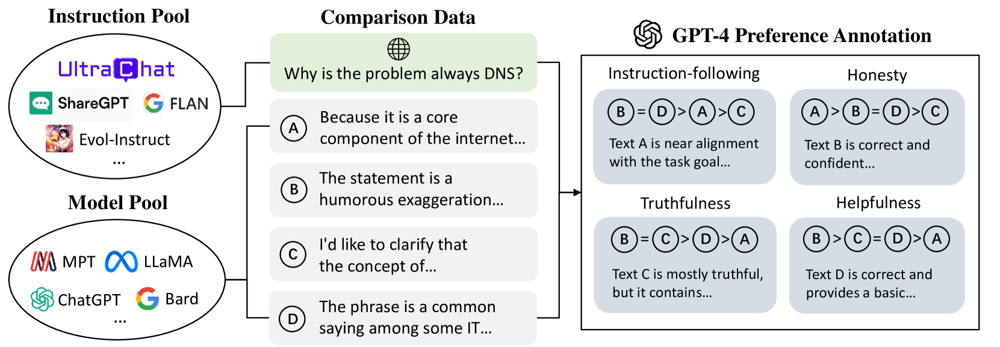
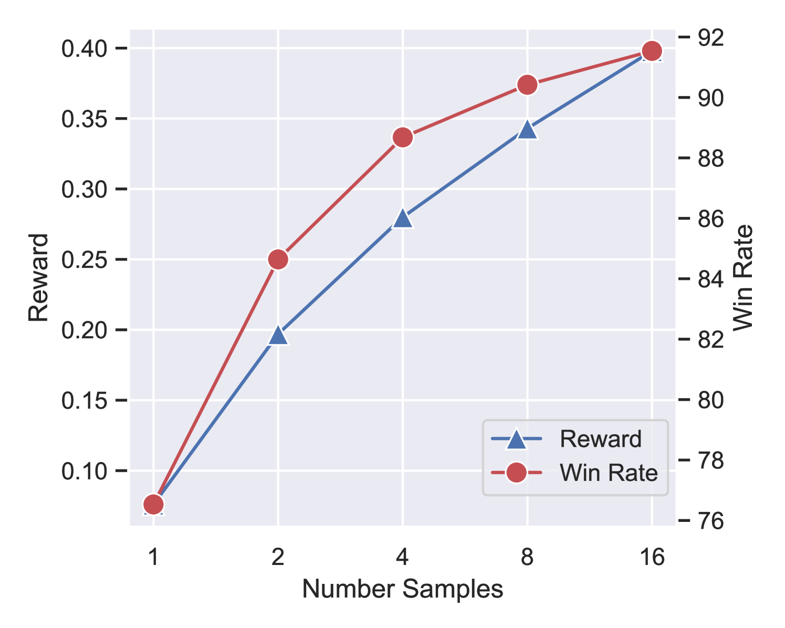

# UltraFeedback

## 📌 核心贡献

> 构建了大规模高质量 AI 反馈数据集 UltraFeedback，包含超过 100 万条 GPT-4 对 25 万组对话的细粒度反馈，验证了规模化 AI 反馈在训练开源对话模型中的有效性。

## 📖 摘要

Learning from human feedback has become a pivot technique in aligning large language models (LLMs) with human preferences. However, acquiring vast and premium human feedback is bottlenecked by time, labor, and human capability, resulting in small sizes or limited topics of current datasets. This further hinders feedback learning as well as alignment research within the open-source community. To address this issue, we explore how to go beyond human feedback and collect high-quality AI feedback automatically for a scalable alternative. Specifically, we identify scale and diversity as the key factors for feedback data to take effect. Accordingly, we first broaden instructions and responses in both amount and breadth to encompass a wider range of user-assistant interactions. Then, we meticulously apply a series of techniques to mitigate annotation biases for more reliable AI feedback. We finally present UltraFeedback, a large-scale, high-quality, and diversified AI feedback dataset, which contains over 1 million GPT-4 feedback for 250k user-assistant conversations from various aspects. Built upon UltraFeedback, we align a LLaMA-based model by best-of-n sampling and reinforcement learning, demonstrating its exceptional performance on chat benchmarks. Our work validates the effectiveness of scaled AI feedback data in constructing strong open-source chat language models, serving as a solid foundation for future feedback learning research. Our data and models are available at https://github.com/thunlp/UltraFeedback.

## 🔍 关键信息

| 字段 | 内容 |
|------|------|
| 机构 | Tsinghua University, East China Normal University, Tencent |
| 发表 | 2023-10-02 |
| 分类 | cs.CL, cs.AI, cs.LG |
| 链接 | [arXiv](https://arxiv.org/abs/2310.01377) |

## 📝 我的笔记

### 方法总览

### 动机与问题

人类反馈数据的采集受限于时间、人力和能力，导致现有数据集规模小、主题有限。核心问题：如何超越人类反馈，自动收集高质量 AI 反馈以实现可扩展的偏好学习？关键发现：**规模**和**多样性**是反馈数据发挥作用的两个核心因素。

### 核心方法

**三阶段流水线：**

**1. 指令收集**
- 从 6 个数据集汇集 63,967 条指令（TruthfulQA、FalseQA、Evol-Instruct、UltraChat、ShareGPT、FLAN）
- 覆盖 4 种能力：指令跟随、真实性、诚实性、有用性

**2. 响应采样**
- 使用 17 个不同能力级别的模型生成响应
- 随机添加"原则"到系统提示以增加行为多样性

**3. AI 反馈标注**
GPT-4 提供两种反馈：
- 标量分数（1-5）跨 4 个细粒度维度
- 文本评论 + 改进建议
- 4 项质量保证技术：任务分解、标准化评分标准、参考响应、思维链推理

**奖励模型（UltraRM）：**
基于 LLaMA2-13B，使用排序损失训练：
$$\mathcal{L} = -\log(\sigma(r_\theta(x, y_c) - r_\theta(x, y_r) - m(r)))$$
其中 $m(r)$ 是偏好分数之间的 margin。

### 关键结果

| 模型/方法 | AlpacaEval Win Rate | Evol-Instruct Win | 平均 Win Rate |
|-----------|--------------------|--------------------|--------------|
| UltraLM-13B (base) | — | — | 52.9% |
| UltraLM-13B-PPO | 86.3% | 57.8% | 69.7% |
| Best-of-2 | 84.6% | — | — |
| Best-of-16 | 91.5% | — | — |

| 指标 | UltraRM | 次优开源模型 | 提升 |
|------|---------|-------------|------|
| 偏好预测准确率 | 71.0% | 64.7% | +6.3% |
| GPT-4 与人类一致率 | 68.6% | — | 接近人类间一致率 |

### 总结

UltraFeedback 验证了规模化 AI 反馈可以有效替代人类反馈来训练偏好模型。关键设计包括多模型响应多样性、GPT-4 多维度评分、以及标注偏差缓解技术。该数据集已成为后续奖励模型研究的重要基础资源。

## 🔗 相关论文

**同方向：** [[Pick-a-Pic]], [[Skywork-Reward]]
