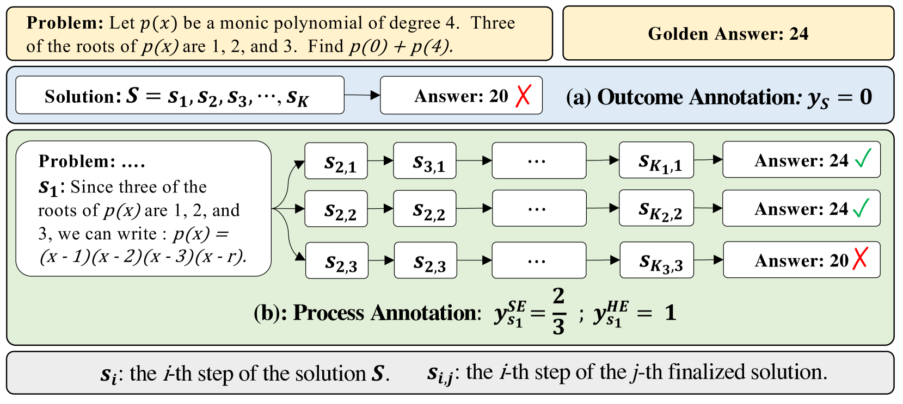
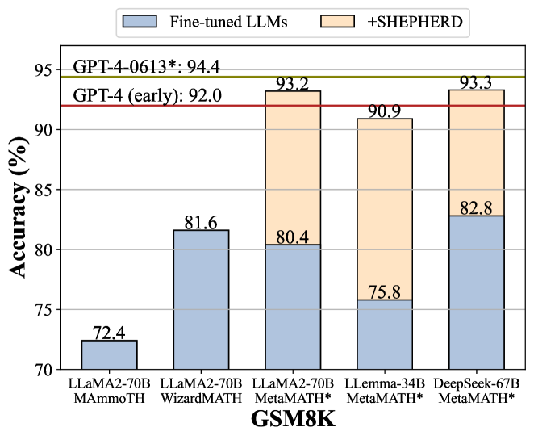
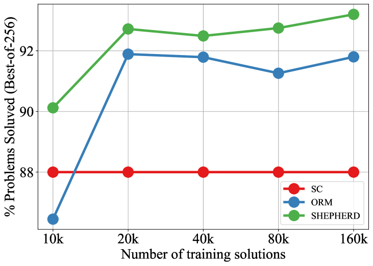

# Math-Shepherd

## 📌 核心贡献

> 提出基于蒙特卡洛估计的自动过程奖励标注方法，无需人工步骤级标注即可训练过程奖励模型（PRM），在数学推理验证和强化学习两个场景下均显著提升开源 LLM 性能。

## 📖 摘要

In this paper, we present an innovative process-oriented math process reward model called Math-Shepherd, which assigns a reward score to each step of math problem solutions. The training of Math-Shepherd is achieved using automatically constructed process-wise supervision data, breaking the bottleneck of heavy reliance on manual annotation in existing work. We explore the effectiveness of Math-Shepherd in two scenarios: 1) Verification: Math-Shepherd is utilized for reranking multiple outputs generated by Large Language Models (LLMs); 2) Reinforcement Learning: Math-Shepherd is employed to reinforce LLMs with step-by-step Proximal Policy Optimization (PPO). With Math-Shepherd, a series of open-source LLMs demonstrates exceptional performance. For instance, the step-by-step PPO with Math-Shepherd significantly improves the accuracy of Mistral-7B (77.9%→84.1% on GSM8K and 28.6%→33.0% on MATH). The accuracy can be further enhanced to 89.1% and 43.5% on GSM8K and MATH with the verification of Math-Shepherd, respectively. We believe that automatic process supervision holds significant potential for the future evolution of LLMs.

## 🔍 关键信息

| 字段 | 内容 |
|------|------|
| 机构 | Peking University, DeepSeek-AI, HKU, Tsinghua, Ohio State |
| 发表 | 2023-12-14 |
| 分类 | cs.AI, cs.CL, cs.LG |
| 链接 | [arXiv](https://arxiv.org/abs/2312.08935) |

## 📝 我的笔记

### 动机与问题定义

过程奖励模型（Process Reward Model, PRM）为数学推理的每一步提供细粒度反馈，相比仅关注最终答案的结果奖励模型（Outcome Reward Model, ORM）有显著优势。然而，PRM 的训练严重依赖人工步骤级标注（如 PRM800K 使用了大量人工标注），成本极高且难以规模化。

Math-Shepherd 的核心问题：**如何在不依赖人工标注的情况下，自动构建高质量的步骤级监督数据来训练 PRM？**

### 方法总览

核心思路受蒙特卡洛树搜索（MCTS）启发：**一个有潜力推导出正确最终结果的推理步骤，就可以被认为是好的推理步骤。**

#### 1. 自动过程标注（Automatic Process Annotation）

对于问题 $p$ 的一个推理过程中的第 $i$ 步 $s_i$，使用一个"completer"模型从 $s_i$ 出发生成 $N$ 条独立的后续推理路径：

$$\{(s_{i+1,j}, \ldots, s_{K_j,j}, a_j)\}_{j=1}^{N}$$

其中 $a_j$ 是第 $j$ 条路径最终得到的答案，$K_j$ 是该路径的总步数。

#### 2. 两种估计方式

**硬估计（Hard Estimation, HE）**：

$$y_{s_i}^{HE} = \begin{cases} 1 & \text{if } \exists a_j \in A \text{ s.t. } a_j = a^* \\ 0 & \text{otherwise} \end{cases}$$

只要存在任何一条路径能推导出正确答案 $a^*$，该步骤即标记为"好"。

**软估计（Soft Estimation, SE）**：

$$y_{s_i}^{SE} = \frac{\sum_{j=1}^{N} \mathbb{I}(a_j = a^*)}{N}$$

步骤质量用到达正确答案的路径比例来表示，提供了更细粒度的信号。

#### 3. PRM 训练

PRM 的训练损失函数：

$$\mathcal{L}_{PRM} = \sum_{i=1}^{K} \left[ y_{s_i} \cdot \log(r_{s_i}) + (1 - y_{s_i}) \cdot \log(1 - r_{s_i}) \right]$$

其中 $r_{s_i}$ 是模型对第 $i$ 步的 sigmoid 奖励分数。

作为对比，ORM 的训练损失仅基于整体解答的正确性：

$$\mathcal{L}_{ORM} = y_s \cdot \log(r_s) + (1 - y_s) \cdot \log(1 - r_s)$$

#### 4. 两种应用场景

**验证（Verification）**：给定问题 $p$ 的 $N$ 个候选解答，PRM 对每个解答的每一步打分，选取最高分解答作为最终答案。

**强化学习（Reinforcement Learning）**：使用 PRM 作为步骤级奖励信号进行 step-by-step PPO 训练，每完成一步推理即获得反馈，而非仅在完成整个解答后才获得奖励。

### 数据构建

- **数据来源**：GSM8K 约 170K 解答 + MATH 约 270K 解答，共 445K 样本
- **构建过程**：
  1. 在 MetaMATH 数据上微调 7B 和 13B 模型各一个 epoch
  2. 每个问题从每个模型采样 15 个解答
  3. 去除重复解答
  4. 使用 LLemma-7B（在 MetaMATH 上训练）作为 completer
  5. 每一步生成 $N=8$ 条续写路径
  6. 用硬估计或软估计标注每一步

### 关键结果

#### 验证性能（Best-of-N Reranking）

| 模型 | 方法 | GSM8K | MATH500 |
|------|------|-------|---------|
| LLaMA2-70B | Self-Consistency | - | - |
| LLaMA2-70B | ORM | - | - |
| LLaMA2-70B | Math-Shepherd | 93.2% | 44.5% |
| DeepSeek-67B | Math-Shepherd | 93.3% | 47.0% |
| LLemma-34B | Math-Shepherd | 90.9% | 46.0% |
| DeepSeek-67B | SC + Math-Shepherd | 92.5% | 48.1% |

#### 强化学习性能（Step-by-Step PPO）

| 模型 | 方法 | GSM8K | MATH |
|------|------|-------|------|
| Mistral-7B | Baseline (MetaMATH) | 77.9% | 28.6% |
| Mistral-7B | + RFT | 79.0% | 29.9% |
| Mistral-7B | + ORM-PPO | 81.8% | 31.3% |
| Mistral-7B | + Math-Shepherd PPO | **84.1%** | **33.0%** |
| LLaMA2-7B | Baseline | 66.6% | 19.2% |
| LLaMA2-7B | + Math-Shepherd PPO | **73.2%** | **21.6%** |

#### RL + 验证联合（最佳性能）

| 模型 | 方法 | GSM8K | MATH500 |
|------|------|-------|---------|
| Mistral-7B | Step PPO + SC | 87.4% | 42.3% |
| Mistral-7B | Step PPO + Math-Shepherd | **89.1%** | **43.5%** |

#### 自动标注方法对比

| 标注方法 | 标注准确率 | 损失 |
|----------|-----------|------|
| NLI-based (DeBERTa) | 61.3% | 5.43 |
| NLI-based (LLaMA2-13B) | 75.6% | 3.27 |
| Rule-based | 75.0% | 3.43 |
| Math-Shepherd (N=4) | **85.0%** | **2.05** |

### Ablation 分析

- **数据效率**：PRM 在仅 10K 训练样本下即比 ORM 高约 4%，展现了显著更高的数据效率和性能上限
- **Completer 能力**：更强的 completer（如 LLaMA2-70B）生成更高质量的标注数据；在增强数据（MetaMATH）上训练的模型作为 completer 效果更好
- **采样数量**：N=4 时标注准确率达 86%，N=8 为默认配置，N 过大可能引入误报
- **模型规模**：更大的 reward model（70B）在不同候选数量下更鲁棒；小模型（7B）在候选数增多时性能下降
- **OOD 泛化**：在匈牙利国家数学考试（33 题）上，Math-Shepherd 比 ORM 高出 9 分，展现了良好的分布外泛化能力

### 总结与评价

**核心价值：** Math-Shepherd 解决了 PRM 训练中最关键的瓶颈——人工标注成本。通过蒙特卡洛估计，以完全自动化的方式生成步骤级标注，且质量超越了基于 NLI 和规则的方法，甚至在某些设定下超越了人工标注的 PRM800K。

**方法优势：**
- 完全自动化，无需人工标注，可任意扩展数据规模
- 方法简洁优雅，核心思想（蒙特卡洛完成）直观易理解
- 同时支持验证和 RL 两种应用范式
- Step-by-step PPO 比传统 outcome-level PPO 提供更密集的奖励信号

**局限性：**
- Completion 过程计算成本较高（每步需 N 次续写）
- 自动标注存在噪声，尤其在步骤本身有错但恰好能推导出正确答案时
- 仅在数学推理任务上验证，是否能推广到代码、逻辑等其他推理任务有待探索

**历史意义：** 这篇工作是自动过程监督的开创性工作之一，为后续大量自动 PRM 训练方法（如基于 LLM-as-Judge 的标注、基于 MCTS 的标注等）奠定了基础，证明了"无需人工标注也能训练高质量 PRM"的可行性。

## 🔗 相关论文

**基于/改进自：** [[PRM800K]]

**同方向：** [[GenRM]], [[RM-R1]]
