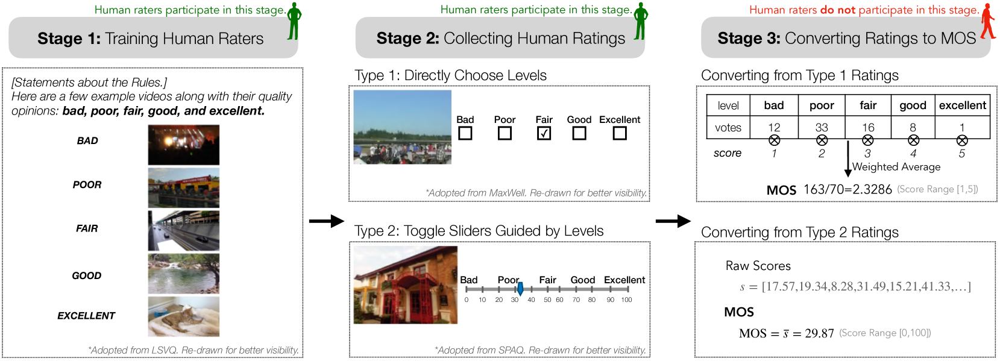
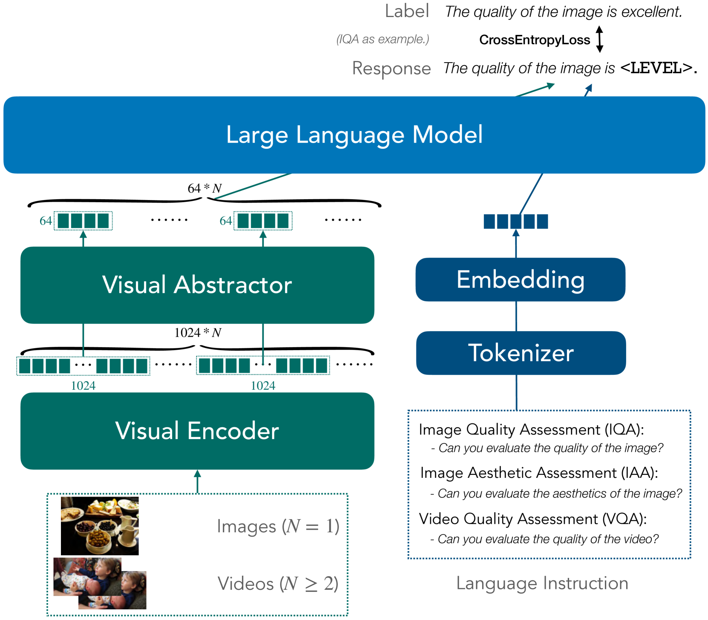
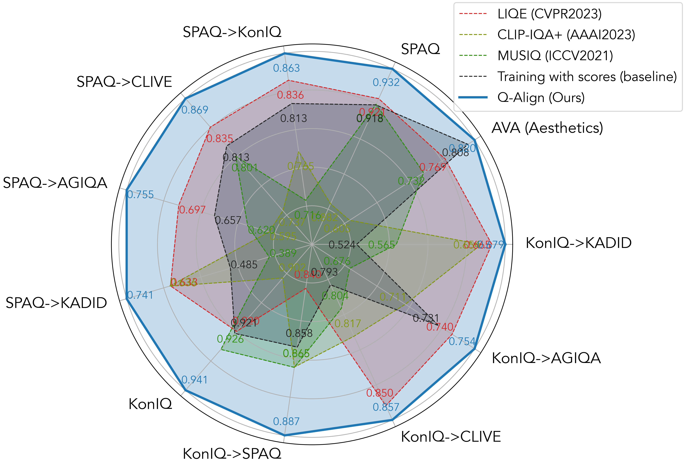

# Q-Align

## 📌 核心贡献

> 提出用离散文本定义的质量等级（而非连续分数）来训练大型多模态模型进行视觉评分，模拟人类评分流程，在图像质量评估（IQA）、图像美学评估（IAA）和视频质量评估（VQA）上取得 SOTA，并统一为单一模型 OneAlign。

## 📖 摘要

Scoring visual content is a common need in computer vision, with many methods developed to assess image quality, aesthetics, and video quality. However, existing approaches often struggle with out-of-distribution generalization and fail to unify across different scoring scenarios. In this work, we propose Q-Align, a method that teaches large multi-modal models (LMMs) for visual scoring by using discrete text-defined rating levels instead of scores, mimicking the human rating process. Specifically, during training, we convert ground-truth mean opinion scores (MOS) into discrete rating levels (excellent/good/fair/poor/bad) and fine-tune the LMM with these text-based supervision signals. During inference, we extract the probability distribution over these rating levels and compute a weighted average to produce the final score. Q-Align achieves state-of-the-art performance on image quality assessment (IQA), image aesthetic assessment (IAA), and video quality assessment (VQA) tasks, with notably superior cross-dataset generalization. We further introduce OneAlign, a unified model that combines IQA, IAA, and VQA into a single framework without performance compromise. Code and model weights are available at https://github.com/Q-Future/Q-Align.

## 🔍 关键信息

| 字段 | 内容 |
|------|------|
| 机构 | Nanyang Technological University, Shanghai Jiao Tong University, SenseTime Research |
| 发表 | 2023-12-28 |
| 分类 | cs.CV, cs.CL, cs.LG |
| 链接 | [arXiv](https://arxiv.org/abs/2312.17090) |

## 📝 我的笔记

### 方法总览

### 动机与问题定义

现有视觉质量评分方法存在两个核心问题：

1. **跨数据集泛化差**：在特定数据集上训练的模型难以泛化到分布外数据
2. **多任务统一难**：混合不同评分任务（IQA、IAA、VQA）的数据集训练时，性能会下降

作者观察到两个关键现象：

- **人类评分流程**：人类评分员并非直接给出分数，而是先学习离散等级定义（excellent/good/fair/poor/bad），然后选择等级，最终 MOS 由等级分布加权平均得到
- **LMM 的自然倾向**：测试 5 个 LMM 时，96-100% 的回答使用定性形容词而非数值，说明 LMM 天然更擅长处理离散等级

### 方法细节

#### 训练阶段：分数到等级的转换

将 MOS 分数通过等距区间划分转换为 5 个离散等级：

$$L(s) = l_i \quad \text{if} \quad m + \frac{i-1}{5}(M-m) < s \leq m + \frac{i}{5}(M-m)$$

其中 $\{l_i | i=1,...,5\} = \{\text{bad, poor, fair, good, excellent}\}$，$M$ 和 $m$ 分别为最高和最低分数。该转换与原始分数保持约 0.95 的线性相关性（PLCC）。

训练使用指令-回答对格式，例如：
- 用户：` Can you evaluate the quality of the image?`
- 助手：`The quality of the image is good.`

基于 mPLUG-Owl-2 模型微调，使用交叉熵损失，仅对助手回答部分计算损失。

#### 推理阶段：等级概率到分数

推理时对输出 logits 在 5 个等级 token 上做 close-set softmax：

$$p_{l_i} = \frac{e^{\mathcal{X}_{l_i}}}{\sum_{j=1}^{5} e^{\mathcal{X}_{l_j}}}$$

最终分数为概率加权平均，直接模拟 MOS 计算：

$$S_{\text{LMM}} = \sum_{i=1}^{5} i \times p_{l_i} = \sum_{i=1}^{5} \frac{i \times e^{\mathcal{X}_{l_i}}}{\sum_{j=1}^{5} e^{\mathcal{X}_{l_j}}}$$

#### 模型架构

基于 mPLUG-Owl-2 构建：
- 视觉编码器将图像转为 embedding
- **视觉抽象器（Visual Abstractor）** 将每张图的 token 从 1024 压缩到 64
- LLaMA-2 语言解码器（2048 上下文长度）
- 压缩后可同时输入多达 30 张图像，因此视频作为多帧图像序列输入即可统一 IQA/VQA

#### OneAlign：统一模型

将 IQA（KonIQ + SPAQ + KADID）、IAA（AVA）、VQA（LSVQ）数据集混合训练，通过不同的问题模板区分任务类型，得到统一模型 OneAlign。

### 关键实验结果

#### IQA 结果（SRCC）

| 方法 | KonIQ (in) | SPAQ (cross) | LIVE-C (cross) | AGIQA-3K (cross) | KADID (cross) |
|------|-----------|-------------|---------------|-----------------|-------------|
| MUSIQ | 0.929 | 0.863 | 0.830 | 0.630 | 0.556 |
| LIQE | 0.928 | 0.833 | 0.870 | 0.708 | 0.662 |
| **Q-Align** | **0.940** | **0.887** | **0.860** | **0.735** | **0.684** |

#### VQA 结果（SRCC）

| 方法 | LSVQ_test (in) | LSVQ_1080P (in) | KoNViD-1k (cross) | MaxWell (cross) |
|------|---------------|----------------|-------------------|----------------|
| FAST-VQA | 0.876 | 0.779 | 0.859 | 0.720 |
| **Q-Align (1fps)** | **0.883** | **0.797** | **0.865** | **0.780** |

#### IAA 结果（AVA 数据集）

| 方法 | SRCC | PLCC |
|------|------|------|
| LIQE | 0.776 | 0.763 |
| VILA | 0.774 | 0.774 |
| **Q-Align** | **0.822** | **0.817** |

#### OneAlign 统一模型（SRCC/PLCC）

| 任务 | KonIQ | SPAQ | KADID | AVA | LSVQ_test | KoNViD |
|------|-------|------|-------|-----|-----------|--------|
| 单任务专家 | .938/.945 | .931/.933 | .934/.935 | .822/.817 | .883/.882 | .865/.877 |
| **OneAlign** | **.941/.950** | **.932/.935** | **.941/.942** | **.823/.819** | **.886/.886** | **.876/.888** |

OneAlign 在所有任务上均持平或超过单任务专家模型，且跨数据集泛化进一步提升（AGIQA +6.8% SRCC）。

### Ablation 分析

#### 离散等级 vs 连续分数训练（SRCC）

| 训练方式 | KonIQ (in) | SPAQ (cross) | LIVE-C (cross) | KADID (cross) |
|---------|-----------|-------------|---------------|-------------|
| 分数回归 | 0.921 | 0.858 | 0.793 | 0.524 |
| **等级训练（Q-Align）** | **0.941** | **0.887** | **0.857** | **0.679** |
| 提升 | +2.2% | +3.4% | +8.1% | **+29.6%** |

核心发现：等级训练在跨数据集评估上平均提升约 10%，在合成失真数据集（KADID）上提升尤为显著（+29.6% ~ +52.8%）。

#### 训练效率

| 方法 | 最佳性能 | 第1轮性能 | 收敛轮数 |
|------|---------|---------|---------|
| NIMA | 0.870 | 0.650 | 15 |
| LIQE | 0.920 | 0.887 | 9 |
| **Q-Align** | **0.942** | **0.931** | **2** |

Q-Align 仅需 2 个 epoch（4xA100 约 9 分钟，成本 < $2）即可收敛，远快于基线方法。

### 总结性评价

Q-Align 的核心洞察非常直觉：既然人类评分员是通过离散等级来评分的，那么训练 LMM 时也应该用离散等级而非连续分数。这个简单的设计选择带来了显著的性能提升，尤其是在跨数据集泛化上。OneAlign 进一步证明了统一多个视觉评分任务的可行性，且不损失性能。该工作为后续基于 LMM 的视觉奖励模型（如 VisionReward）奠定了重要基础，展示了 LMM 作为视觉评分器的潜力。

## 🔗 相关论文

**同方向：** [[HPSv3]], [[VisionReward]], [[ImageReward]]
