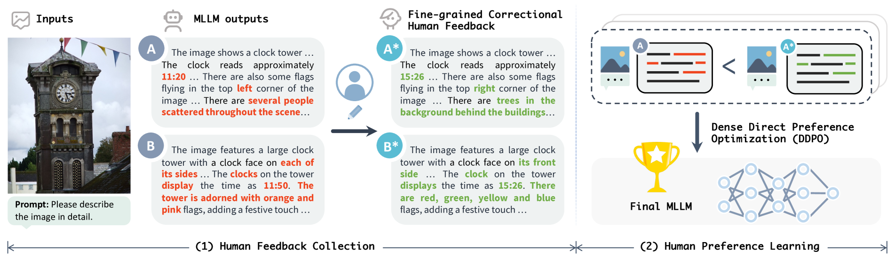
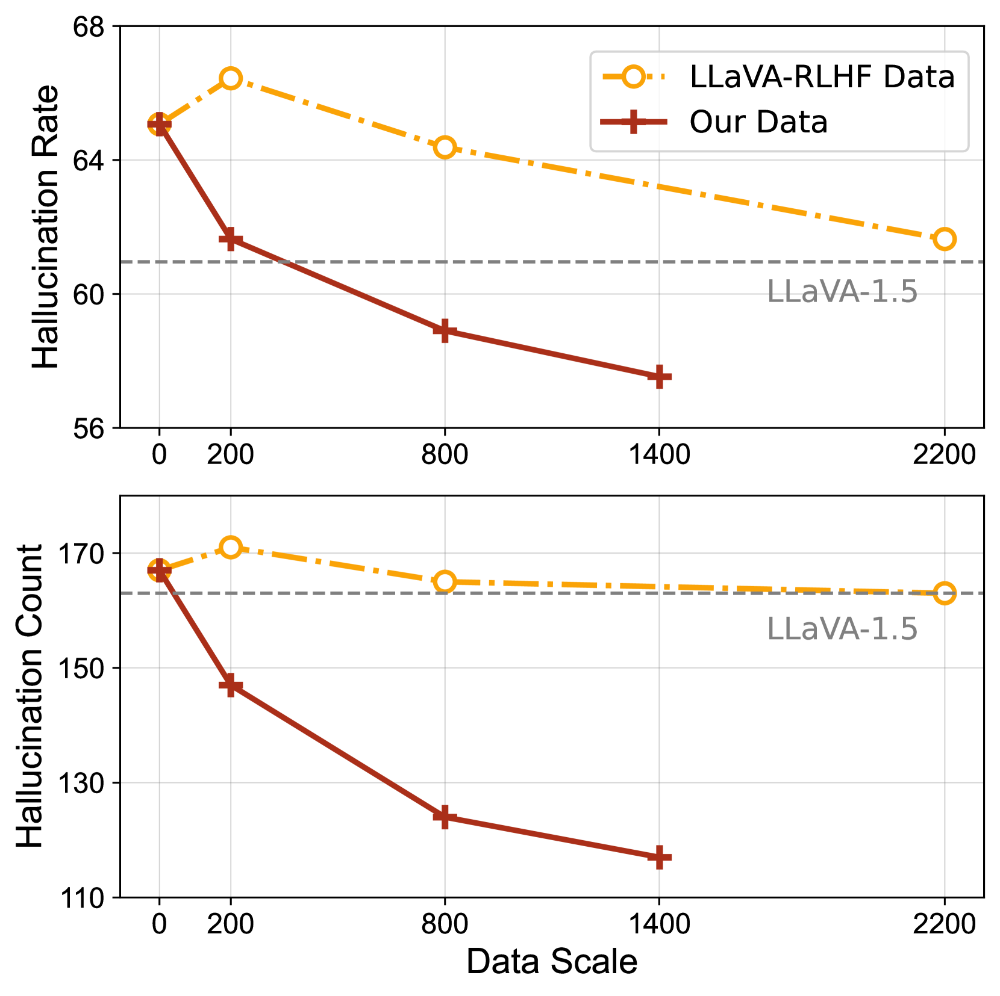

# RLHF-V

## 📌 核心贡献

> 提出 RLHF-V，通过收集段级别的人类纠正反馈（而非排序标签）进行密集直接偏好优化（DDPO），仅用 1.4k 标注样本即减少 34.8% 幻觉率，超越使用 10k 样本的 LLaVA-RLHF。

## 📖 摘要

Multimodal Large Language Models (MLLMs) have recently demonstrated impressive capabilities in multimodal understanding, reasoning, and interaction. However, existing MLLMs prevalently suffer from serious hallucination problems, generating text that is not factually grounded in associated images. The problem makes existing MLLMs untrustworthy and thus impractical in real-world (especially high-stakes) applications. To address the challenge, we present RLHF-V, which enhances MLLM trustworthiness via behavior alignment from fine-grained correctional human feedback. Specifically, RLHF-V collects human preference in the form of segment-level corrections on hallucinations, and performs dense direct preference optimization over the human feedback. Comprehensive experiments on five benchmarks in both automatic and human evaluation show that, RLHF-V can enable substantially more trustworthy MLLM behaviors with promising data and computation efficiency. Remarkably, using 1.4k annotated data samples, RLHF-V significantly reduces the hallucination rate of the base MLLM by 34.8%, outperforming the concurrent LLaVA-RLHF trained on 10k annotated data. The final model achieves state-of-the-art performance in trustworthiness among open-source MLLMs, and shows better robustness than GPT-4V in preventing hallucinations aroused from over-generalization. We open-source our code, model, and data at https://github.com/RLHF-V/RLHF-V.

## 🔍 关键信息

| 字段 | 内容 |
|------|------|
| 机构 | Tsinghua University, NUS |
| 发表 | 2023-12-01 |
| 分类 | cs.CL, cs.CV |
| 链接 | [arXiv](https://arxiv.org/abs/2312.00849) |

## 📝 我的笔记

### 方法总览

### 动机与问题

现有 MLLM 严重的幻觉问题使其在高风险场景不可信。传统 RLHF 使用排序标签存在三个问题：
1. 标注歧义——完整响应间的排序主观性强
2. 语言风格方差——模型可能学到与幻觉无关的风格偏好
3. 反馈粗粒度——无法精确定位幻觉所在

### 核心方法

**段级别纠正反馈：**
- 标注者直接纠正模型响应中的幻觉段落，而非对比排序
- 产生原始响应和纠正后最优响应的配对
- 每个配对包含精确的段级别偏好信号

**密集直接偏好优化（DDPO）：**

对响应段进行加权的偏好优化：

$$\log \pi(y|x) = \frac{1}{N}\left[\sum_{y_u} \log p(y_i|x, y_{<i}) + \gamma \sum_{y_c} \log p(y_i|x, y_{<i})\right]$$

其中 $y_u$ 是未改变的段，$y_c$ 是被纠正的段，$\gamma > 1$ 使纠正部分获得更强的偏好信号。

**视觉-语言失配缓解：**
- 在 VQAv2 上微调以提供准确的学习信号
- 移除图像裁剪增强，避免语义错位

### 关键结果

| 指标 | RLHF-V | LLaVA-RLHF | GPT-4V |
|------|--------|------------|--------|
| Object HalBench (response-level) ↓ | **12.2%** | 38.1% | 13.6% |
| MHumanEval All ↓ | 55.5% | — | 45.9% |
| VQAv2 testdev | **80.0** | — | 77.2* |
| 过度泛化鲁棒性 ↑ | **+1.7%** | +5.2% | +5.0% |

- 仅用 **1.4k** 标注样本减少 34.8% 总幻觉率，75.8% 常见物体幻觉
- 显著超越使用 10k 样本的 LLaVA-RLHF
- 在防止过度泛化幻觉方面比 GPT-4V 更鲁棒

**消融实验：**
- 原始 DPO 相比 DDPO 性能下降
- 单独 VQAv2 微调减少约 9% 幻觉
- 保留图像裁剪增强反而增加幻觉率

### 总结

RLHF-V 的核心洞察是：段级别纠正反馈比响应级别排序标签更高效且信息量更大。密集加权的偏好优化（DDPO）充分利用了这种细粒度信号。方法在数据效率上有突出优势——1.4k 样本即超越 10k 样本的竞争方法。被 CVPR 2024 接收。

## 🔗 相关论文

**基于/改进自：** [[LLaVA-RLHF]]

**同方向：** [[LLaVA-Critic]], [[RLAIF-V]]
