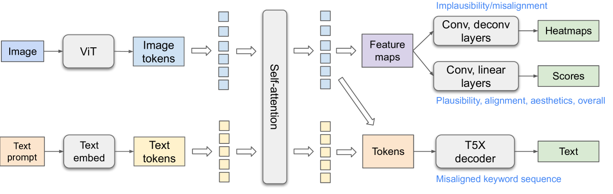
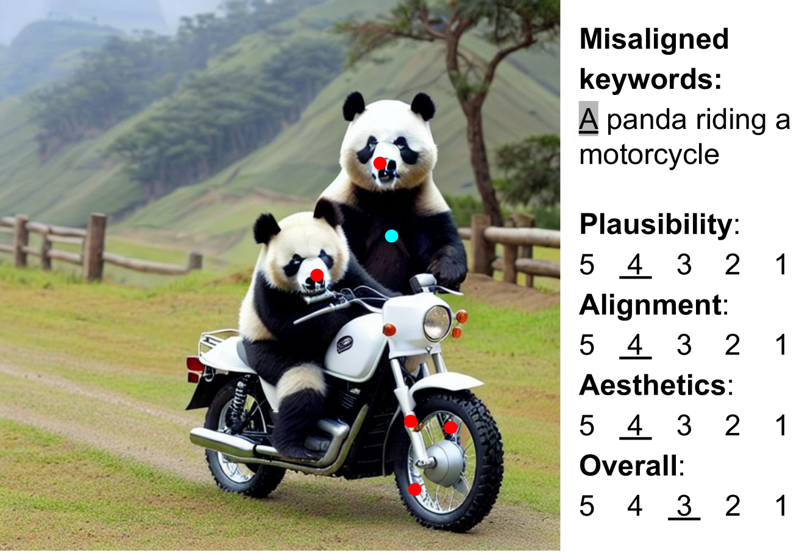
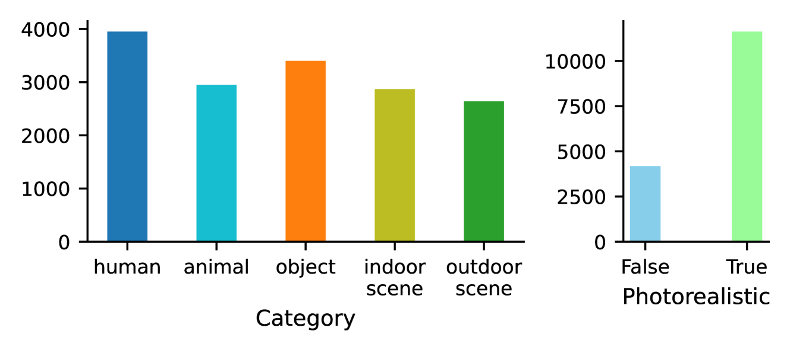

# RichHF

## 📌 核心贡献

> 提出超越单一标量评分的多维度富人类反馈框架：通过区域级标注（不合理/不对齐热力图）、文本关键词错位标注和细粒度多维评分，在 18K 张生成图像上收集丰富反馈数据（RichHF-18K），并训练多模态 Transformer（RAHF）自动预测这些反馈，用于数据筛选微调和区域修复来提升 T2I 生成质量。

## 📖 摘要

Recent Text-to-Image (T2I) generation models such as Stable Diffusion and Imagen have made significant progress in generating high-resolution images based on text descriptions. However, many generated images still suffer from issues such as artifacts/implausibility, misalignment with text descriptions, and low aesthetic quality. Inspired by the success of Reinforcement Learning with Human Feedback (RLHF) for large language models, prior works collected human-provided scores as feedback on generated images and trained a reward model to improve the T2I generation. In this paper, we enrich the feedback signal by (i) marking image regions that are implausible or misaligned with the text, and (ii) annotating which words in the text prompt are misrepresented or missing on the image. We collect such rich human feedback on 18K generated images (RichHF-18K) and train a multimodal transformer to predict the rich feedback automatically. We show that the predicted rich human feedback can be leveraged to improve image generation, for example, by selecting high-quality training data to finetune and improve the generative models, or by creating masks with predicted heatmaps to inpaint the problematic regions. Notably, the improvements generalize to models (Muse) beyond those used to generate the images on which human feedback data were collected (Stable Diffusion variants). The RichHF-18K data set will be released in our GitHub repository: https://github.com/google-research/google-research/tree/master/richhf_18k.

## 🔍 关键信息

| 字段 | 内容 |
|------|------|
| 机构 | Google Research |
| 发表 | 2023-12-15 |
| 分类 | cs.CV |
| 链接 | [arXiv](https://arxiv.org/abs/2312.10240) |

## 📝 我的笔记

### 方法总览

### 动机与问题定义

现有 T2I 生成模型的人类反馈方式（如 ImageReward、Pick-a-Pic）仅提供单一标量评分或偏好排序，无法定位图像中具体的问题区域和文本中未被正确表达的词汇。这限制了反馈信号对生成改进的指导能力。本文提出从三个维度收集更丰富的反馈：

1. **区域级标注**：标记图像中不合理（artifacts）和与文本不对齐（misalignment）的区域
2. **文本关键词标注**：标记 prompt 中被误表达或缺失的词汇
3. **细粒度评分**：对合理性、文本对齐度、美学质量和整体质量分别打分（5 分制）

### RichHF-18K 数据集

- **规模**：18K 张图像（16K 训练 / 1K 验证 / 1K 测试）
- **来源**：Pick-a-Pic 数据集中 Stable Diffusion 变体生成的图像
- **类别均衡**：使用 PaLI VQA 提取类别特征，确保 human/animal/object/indoor/outdoor 类别均衡
- **标注流程**：每张图像 3 名标注员
  - 评分：取平均
  - 关键词：多数投票
  - 区域点标注：转换为以 1/20 图像高度为半径的圆盘区域，再取平均生成热力图
- **标注一致性**：约 85% 样本的标注员最大评分差异 ≤ 0.25（标准化后）

### RAHF 模型架构

多模态 Transformer，包含三个核心组件：

**视觉编码器**：ViT-B/16（16x16 patch，12 层，12 头，768 维）

**文本编码器**：T5-Base（12 层，12 头，768 维）

**融合机制**：将图像 token 和文本 token 拼接后进行自注意力，实现双向信息传播

**三个预测头**：
1. **评分预测头**：4 层卷积 + 3 层全连接 → sigmoid 输出 4 个评分
2. **热力图预测头**：2 层卷积 + 4 层反卷积 → sigmoid 输出空间热力图
3. **文本错位解码器**：T5-Base 解码器（12 层）→ 输出修改后的 prompt，通过特殊后缀标记错位 token

**模型变体**：
- **Multi-head**：7 个独立预测头
- **Augmented prompt**（更优）：每种预测类型一个头，推理时在 prompt 前加任务描述

### 训练细节

- 损失函数：热力图像素级 MSE + 评分 MSE + 序列预测交叉熵（teacher forcing）的加权组合
- Batch size: 256，训练 20K 步
- 优化器：AdamW，学习率 0.015，线性 warmup 2000 步 + 倒数平方根衰减
- 硬件：64 Google Cloud TPU v3
- 预训练：在 WebLI 数据集上做自然图像描述任务
- 数据增强：随机裁剪、亮度/对比度/色调/饱和度变化、JPEG 噪声、灰度转换

### 关键实验结果

**评分预测性能**（Pearson / Spearman 相关系数）：

| 模型 | Plausibility | Aesthetics | Text-Alignment | Overall |
|------|-------------|-----------|----------------|---------|
| RAHF (Augmented) | 0.693 / 0.681 | 0.600 / 0.589 | 0.474 / 0.496 | 0.580 / 0.562 |
| ResNet-50 Baseline | 0.495 / 0.487 | 0.370 / 0.363 | 0.108 / 0.119 | 0.337 / 0.308 |

**热力图预测（不合理区域）**：

| 指标 | 数值 |
|------|------|
| MSE (全部) | 0.00920 |
| 相关系数 (非空) | 0.556 |
| AUC-Judd | 0.913 |

**文本错位预测**：

| 指标 | 数值 |
|------|------|
| MSE | 0.00304 |
| 相关系数 | 0.212 |
| 关键词 F1 | 43.9% |

**生成改进效果**（100 prompts 人工评估，微调 Muse vs 原始 Muse）：

| 评价 | 比例 |
|------|------|
| 显著更好 | 21.5% |
| 略好 | 30.3% |
| 相当 | 31.3% |

### 应用：区域修复

利用预测的不合理热力图生成掩码，对问题区域进行 inpainting，可以有效修复 artifacts 而不影响正常区域。

### Ablation 分析

- **Augmented prompt vs Multi-head**：Augmented prompt 在热力图预测上显著优于 Multi-head 变体。原因是任务描述加入 prompt 后，模型能为不同任务生成特定的特征表示，而 Multi-head 需要单一特征同时服务 7 个不同任务。
- **不对齐热力图**始终比不合理热力图预测差，归因于不对齐标注本身更噪声、更模糊。

### 总结性评价

RichHF 的核心贡献在于将 T2I 反馈从单一标量扩展到多维度空间化信号，这一思路具有重要意义。但文本对齐相关的预测（热力图和关键词）性能仍有较大提升空间（相关系数 0.212，F1 仅 43.9%），说明细粒度语义对齐的自动评估仍是开放问题。数据集规模（18K）相对较小，模型泛化能力（从 SD 到 Muse）的验证也较为有限。整体来看，这是一项有价值的探索性工作，为后续 VisionReward 等多维度奖励模型研究奠定了基础。

## 🔗 相关论文

**基于/改进自：** [[ImageReward]]

**同方向：** [[Pick-a-Pic]], [[VisionReward]]
