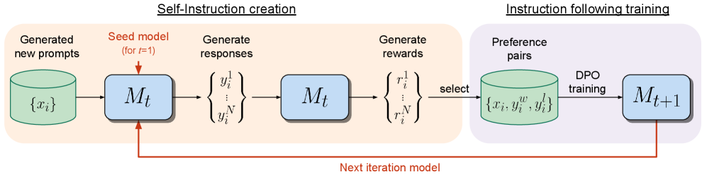
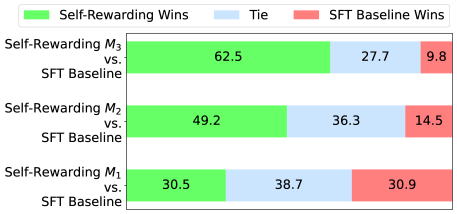
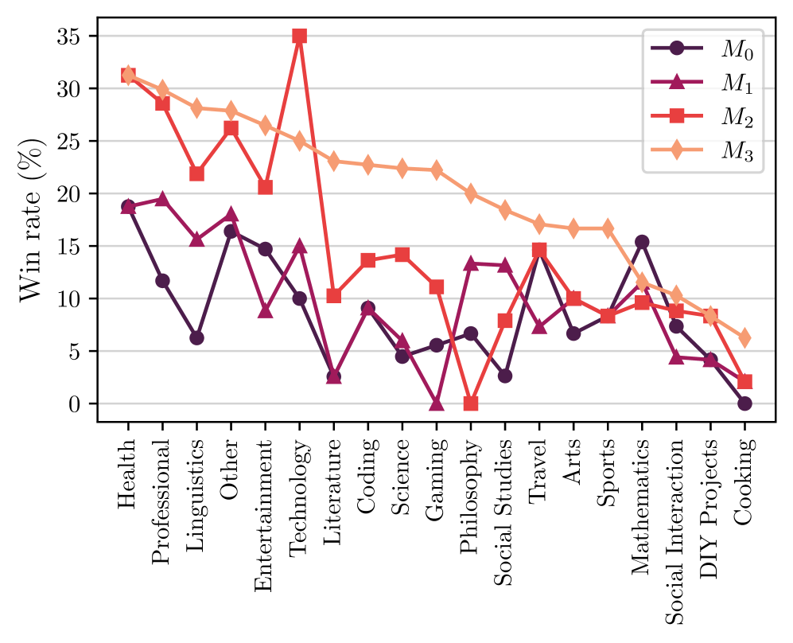

# Self-Rewarding

## 📌 核心贡献

> 提出自奖励语言模型框架：让语言模型通过 LLM-as-a-Judge 机制为自身生成的回复打分作为奖励信号，再通过迭代 DPO 训练同时提升指令跟随能力和奖励建模能力，消除了对独立冻结奖励模型的依赖。

## 📖 摘要

We posit that to achieve superhuman agents, future models require superhuman feedback in order to provide an adequate training signal. Current approaches commonly train reward models from human preferences, which may then be bottlenecked by human performance level, and secondly these separate frozen reward models cannot then learn to improve during LLM training. In this work, we study Self-Rewarding Language Models, where the language model itself is used via LLM-as-a-Judge prompting to provide its own rewards during training. We show that during Iterative DPO training that not only does instruction following ability improve, but also the ability to provide high-quality rewards to itself. Fine-tuning Llama 2 70B on three iterations of our approach yields a model that outperforms many existing systems on the AlpacaEval 2.0 leaderboard, including Claude 2, Gemini Pro, and GPT-4 0613. While there is much left still to explore, this work opens the door to the possibility of models that can continually improve in both axes.

## 🔍 关键信息

| 字段 | 内容 |
|------|------|
| 机构 | Meta AI |
| 发表 | 2024-01-18 |
| 分类 | cs.CL, cs.AI |
| 链接 | [arXiv](https://arxiv.org/abs/2401.10020) |

## 📝 我的笔记

### 方法总览

### 动机与问题定义

当前 RLHF 范式存在两个核心瓶颈：

1. **人类反馈的天花板**：奖励模型从人类偏好中训练，其能力上限受限于人类水平，无法产生"超人类"的训练信号
2. **冻结奖励模型的局限**：传统方法中奖励模型在 LLM 训练过程中保持冻结，无法随 LLM 能力提升而共同进化

本文的核心思路是：让语言模型自己充当奖励模型，通过迭代训练同时提升两种能力——指令跟随能力和奖励生成能力。

### 方法细节

#### 1. 初始化

- **IFT 种子数据**：来自 Open Assistant 的 3,200 条人工标注的 (instruction, response) 对
- **EFT 种子数据**：1,630 条训练 + 541 条验证的排序评估样本，用于初始化 LLM-as-a-Judge 能力

#### 2. 模型训练序列

$$M_0 \xrightarrow{\text{SFT on IFT+EFT}} M_1 \xrightarrow{\text{DPO on AIFT}(M_1)} M_2 \xrightarrow{\text{DPO on AIFT}(M_2)} M_3$$

- $M_0$：基础 Llama 2 70B
- $M_1$：在 IFT+EFT 种子数据上做 SFT
- $M_2$：在 $M_1$ 自生成的 AI 反馈训练数据 AIFT($M_1$) 上做 DPO
- $M_3$：在 $M_2$ 自生成的 AIFT($M_2$) 上做 DPO

#### 3. 自指令创建流程（每轮迭代）

**步骤一：生成新指令**——使用固定的 Llama 2-Chat 70B，通过 8-shot 提示（6 条来自 IFT，2 条来自模型生成）按 Self-Instruct 方法生成新 prompt（T=0.6, p=0.9）

**步骤二：生成候选回复**——当前模型对每个 prompt 采样生成 N=4 个多样回复（T=0.7, p=0.9）

**步骤三：自我评估**——模型通过 LLM-as-a-Judge 提示对候选回复打分，每个回复评估 3 次取平均

#### 4. LLM-as-a-Judge 评分体系

采用 5 分累加制评分（Additive Scoring）：

| 分数 | 标准 |
|------|------|
| 1 分 | 回复与问题相关，包含一些相关信息 |
| 2 分 | 涵盖问题的主要方面，但不够完整 |
| 3 分 | 回答了基本要素，对用户有用 |
| 4 分 | 从 AI 助手视角清晰回答，组织良好且全面 |
| 5 分 | 完美贴合用户需求，展现专家级知识，高质量写作 |

评估时要求先输出不超过 100 词的 chain-of-thought 推理，再给出最终分数。

#### 5. 偏好对构建

从 N=4 个候选回复中选取最高分和最低分构成偏好对（chosen/rejected），丢弃分数相同的对。

- AIFT($M_1$) 产生 3,964 个偏好对
- AIFT($M_2$) 产生 6,942 个偏好对

#### 6. 训练超参数

| 参数 | SFT | DPO |
|------|-----|-----|
| 学习率 | 5.5e-6 → 1.1e-6 (cosine) | 1e-6 → 1e-7 (cosine) |
| Batch size | 16 | 16 |
| Dropout | 0.1 | 0.1 |
| $\beta$ | - | 0.1 |

每 200 步保存 checkpoint，用 Claude 2 评估器在 253 条验证集上做 early stopping。

### 关键实验结果

#### AlpacaEval 2.0 排行榜（vs GPT-4 Turbo 胜率）

| 模型 | 胜率 |
|------|------|
| $M_1$（迭代 1） | 9.94% |
| $M_2$（迭代 2） | 15.38% |
| $M_3$（迭代 3） | 20.44% |
| Claude 2 | 17.19% |
| Gemini Pro | 16.85% |
| GPT-4 0613 | 15.76% |

$M_3$ 在 AlpacaEval 2.0 上超越了 Claude 2、Gemini Pro 和 GPT-4 0613。

#### MT-Bench 结果（0-10 分）

| 模型 | 总分 | 数学/代码/推理 | 人文/抽取/STEM/角色扮演/写作 |
|------|------|----------------|------------------------------|
| SFT Baseline | 6.85 | 3.93 | 8.60 |
| $M_1$ | 6.78 | 3.83 | 8.55 |
| $M_2$ | 7.01 | 4.05 | 8.79 |
| $M_3$ | 7.25 | 4.17 | 9.10 |

#### 奖励建模能力（与人类偏好的一致性）

| 指标 | SFT Baseline | $M_1$ | $M_2$ | $M_3$ |
|------|--------------|-------|-------|-------|
| Pairwise accuracy | 65.1% | 78.7% | 80.4% | 81.7% |
| Spearman 相关 | 0.253 | 0.279 | 0.331 | 0.349 |
| Kendall $\tau$ | 0.233 | 0.253 | 0.315 | 0.324 |

关键发现：**奖励建模能力随迭代同步提升**，验证了"自奖励"机制的核心假设。

### 分类别分析

- **显著提升**：写作、角色扮演、信息抽取、STEM
- **提升有限**：数学和逻辑推理
- 解读：该方法更擅长优化知识运用能力，而非知识获取能力

### Ablation 分析

#### EFT 种子数据的重要性

没有 EFT 数据初始化时，模型倾向于给出 4/5 的集中评分，导致偏好信号多样性不足——AIFT($M_1'$) 仅收集到 541 个偏好对（vs 有 EFT 时的 3,964 个），性能大幅落后。

#### 累加式评分 vs 多选式评分

| 评分方式 | Pairwise Accuracy | Exact Match |
|----------|-------------------|-------------|
| 累加式（本文） | 65.1% | 10.1% |
| 多选式 | 26.6% | 1.1% |

累加式评分显著优于多选式。

#### DPO vs SFT 增强

仅用高分（5分）样本做 SFT 增强（11,254 条）的胜率为 29% vs 30%（无提升），而 DPO 偏好训练持续带来增益。结论：偏好对比纯正样本更有效。

### 总结性评价

本文的核心洞见在于：语言模型的指令跟随能力和奖励建模能力可以在同一个模型中协同进化。通过让模型"自我评估、自我改进"，打破了传统 RLHF 中冻结奖励模型的瓶颈。

**优势：**
- 理念简洁优雅，无需额外的奖励模型
- 两种能力的协同提升有实验验证
- 在 AlpacaEval 2.0 上取得了强竞争力的结果

**局限：**
- 仅验证了 3 次迭代，扩展性未知
- 生成长度与质量的关联需要更深入分析（$M_1$=1092 tokens, $M_2$=1552, $M_3$=2552，存在长度膨胀）
- 数学推理等需要新知识的任务提升有限
- NLP 基准（ARC、HellaSwag 等）略有下降，存在"对齐税"
- 安全性评估缺失

## 🔗 相关论文

**基于/改进自：** [[DPO]], [[InstructGPT]]

**同方向：** [[LLM-as-Judge-Survey]]
