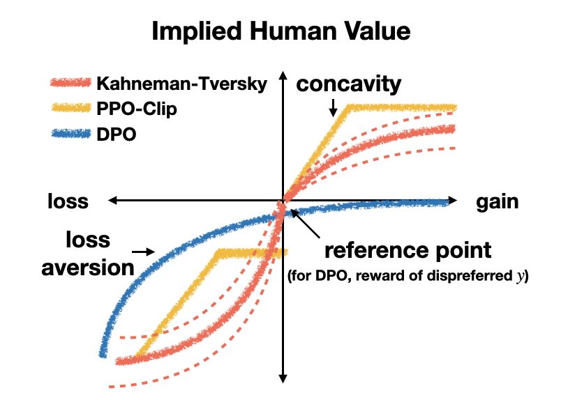
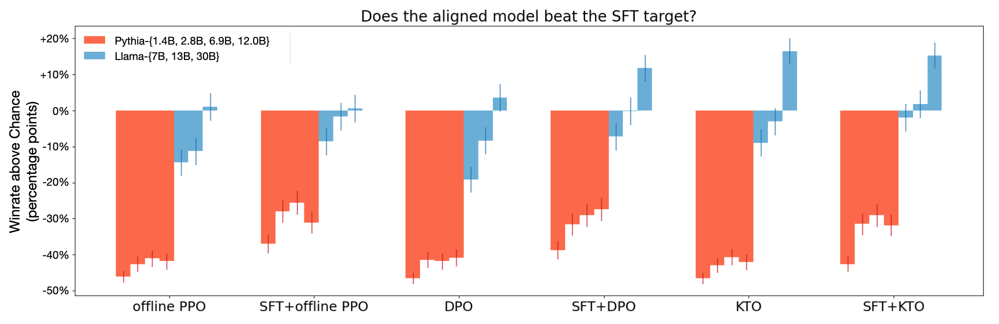
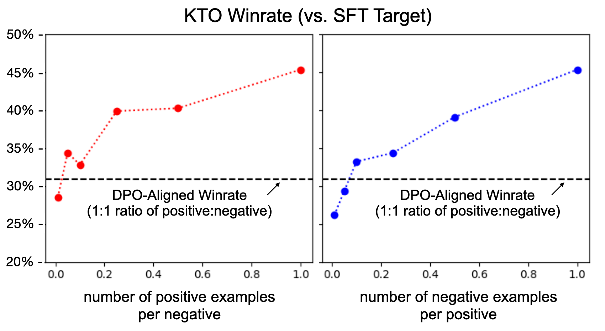

# KTO

## 📌 核心贡献

> 基于 Kahneman-Tversky 前景理论，提出仅需二元（好/坏）反馈信号即可对齐 LLM 的损失函数 KTO，无需成对偏好数据，在 1B-30B 规模上匹配或超越 DPO 的性能。

## 📖 摘要

Kahneman & Tversky's prospect theory tells us that humans perceive random variables in a biased but well-defined manner; for example, humans are famously loss-averse. We show that objectives for aligning LLMs with human feedback implicitly incorporate many of these biases -- the success of these objectives (e.g., DPO) over cross-entropy minimization can partly be ascribed to them belonging to a family of loss functions called human-aware losses (HALOs). However, the utility functions these methods attribute to humans still differ from those in prospect theory literature. Using a Kahneman-Tversky model of human utility, we propose a HALO that directly maximizes the utility of generations instead of maximizing the log-likelihood of preferences, as current methods do. We call this approach KTO, and it matches or exceeds the performance of preference-based methods at scales from 1B to 30B, despite only learning from a binary signal of whether an output is desirable.

## 🔍 关键信息

| 字段 | 内容 |
|------|------|
| 机构 | Stanford University, Contextual AI |
| 发表 | 2024-02-02 |
| 分类 | cs.LG, cs.AI |
| 链接 | [arXiv](https://arxiv.org/abs/2402.01306) |

## 📝 我的笔记

### 方法总览

### 动机与问题定义

现有 LLM 对齐方法（如 DPO）依赖成对偏好数据（$y_w \succ y_l$），但实际中收集二元反馈（"这个回答好/不好"）比成对偏好更容易、成本更低。本文从行为经济学的前景理论出发，揭示了两个关键洞察：

1. **HALO 假说**：DPO、PPO-Clip 等成功的对齐目标函数隐含地属于一类称为 Human-Aware Losses (HALOs) 的损失函数族，它们内在地编码了人类的认知偏差（如损失厌恶）。
2. **直接效用最大化**：与其最大化偏好对的对数似然（如 DPO），不如直接最大化基于 Kahneman-Tversky 效用模型的生成效用。

### 方法细节

#### 1. Human-Aware Losses (HALOs) 框架

HALO 定义：存在一个值函数 $v$ 和标签 $a_{x,y} \in \{-1, +1\}$，使得损失可以写成：

$$f(\pi_\theta, \pi_{\text{ref}}) = \mathbb{E}\left[a_{x,y} \cdot v\left(r_\theta(x,y) - \mathbb{E}_Q[r_\theta(x,y')]\right)\right] + C_{\mathcal{D}}$$

其中 $r_\theta(x,y) = \log \frac{\pi_\theta(y|x)}{\pi_{\text{ref}}(y|x)}$ 是隐含奖励。

论文证明了 DPO 和 PPO-Clip 属于 HALO，而 CSFT 和 SLiC 不属于。

#### 2. Kahneman-Tversky 价值函数

前景理论的价值函数：

$$v(z; \lambda, \alpha, z_0) = \begin{cases} (z - z_0)^\alpha & \text{if } z \geq z_0 \\ -\lambda(z_0 - z)^\alpha & \text{if } z < z_0 \end{cases}$$

其中 $\alpha = 0.88$（边际递减敏感度），$\lambda = 2.25$（损失厌恶系数，人对损失的敏感度约为收益的 2.25 倍）。

#### 3. KTO 损失函数

KTO 使用 logistic 函数近似 Kahneman-Tversky 价值函数：

$$\mathcal{L}_{\text{KTO}} = \mathbb{E}\left[\lambda_y - v(x,y)\right]$$

其中：

$$v(x,y) = \begin{cases} \lambda_D \cdot \sigma\left(\beta(r_\theta(x,y) - z_0)\right) & \text{if } y \text{ is desirable} \\ \lambda_U \cdot \sigma\left(\beta(z_0 - r_\theta(x,y))\right) & \text{if } y \text{ is undesirable} \end{cases}$$

参考点 $z_0$ 通过 microbatch 内的错配对估计 KL 散度：

$$\hat{z}_0 = \max\left(0, \frac{1}{m} \sum_j \log \frac{\pi_\theta(y_j|x_i)}{\pi_{\text{ref}}(y_j|x_i)}\right)$$

其中 $j = (i+1) \bmod m$，使用错配的 $(x_i, y_j)$ 对。

#### 4. 与 DPO 的关键区别

| 维度 | DPO | KTO |
|------|-----|-----|
| 数据格式 | 成对偏好 $(y_w, y_l)$ | 二元标签（好/坏） |
| 优化目标 | 最大化偏好对数似然 | 最大化人类效用 |
| 参考点 | 对比两个特定输出 | 基于所有输出的 KL 散度 |
| 价值函数 | log-sigmoid | logistic 近似 Kahneman-Tversky |
| 理论基础 | Bradley-Terry 偏好模型 | 前景理论 |

#### 5. 理论性质

**Proposition 4.1**：当隐含奖励 $r_\theta(x,y) \to \pm\infty$ 时，KTO 的梯度趋于零。这意味着难以学习的噪声样本会被有效忽略，提供了对标签噪声的鲁棒性。

**Theorem 4.3**：在存在矛盾偏好时，DPO 可能选择少数派偏好，而 KTO（$\lambda_D = \lambda_U$）确定性地选择多数派偏好——KTO 在处理偏好不可传递性时具有更好的最坏情况表现。

### 关键结果

#### UltraFeedback 基准测试（Zephyr-SFT 基座）

| 任务 | SFT | DPO | KTO |
|------|-----|-----|-----|
| MMLU | 57.2 | 58.2 | 58.6 |
| GSM8K | 39.0 | 40.0 | **53.5** |
| HumanEval | 30.1 | 30.1 | 30.9 |
| BBH | 46.3 | 44.1 | **52.6** |

KTO 在 GSM8K 上比 DPO 高出 **13.5 个百分点**，在 BBH 上高出 **8.5 个百分点**。

#### 单输出设置（Mistral-7B，OpenAssistant）

| 方法 | 对 SFT 目标的胜率 |
|------|-------------------|
| Mistral-7B（未对齐） | 0.525 ± 0.037 |
| + DPO | 0.600 ± 0.037 |
| + KTO（所有 y） | 0.652 ± 0.036 |
| + KTO（单 y/x） | 0.631 ± 0.036 |
| Mistral-Instruct | 0.621 ± 0.031 |

即使每个 prompt 仅保留一个输出（数据量减少 72%），KTO 仍然优于 DPO。

### Ablation 分析

#### 设计组件消融

| 变体 | MMLU | GSM8K | HumanEval | BBH |
|------|------|-------|-----------|-----|
| KTO（基线 $\beta=0.1$） | 58.6 | **53.5** | 30.9 | **52.6** |
| KTO（无 $z_0$） | 58.5 | 49.5 | 30.7 | 49.0 |
| KTO（仅凹函数，log $\sigma$） | 58.3 | 42.5 | 30.6 | 43.2 |
| KTO（风险中性） | 57.3 | 42.0 | 28.8 | 6.1 |

- 移除参考点 $z_0$ 导致 GSM8K 下降 4.0，BBH 下降 3.6。
- 使用风险中性设置导致 BBH 灾难性崩溃至 6.1。

#### 超参数推荐

| 组件 | 设置 | 说明 |
|------|------|------|
| 学习率 | 5e-6 | 比 DPO 高 2-10 倍 |
| $\beta$（风险厌恶） | 0.01-0.10（有 SFT）；0.10-1.00（无 SFT） | 控制价值饱和程度 |
| $\lambda_D, \lambda_U$ | 默认 1.0 | 需满足 $\lambda_D \cdot n_D / \lambda_U \cdot n_U \in [1, 3/2]$ |

### 总结与评价

KTO 是一项非常优雅的工作，从前景理论出发为 LLM 对齐提供了全新的理论视角：

1. **实用价值**：将数据需求从成对偏好降低为二元反馈，大幅降低了数据收集成本。
2. **理论深度**：HALO 框架统一解释了为何 DPO、PPO-Clip 等方法有效，而 CSFT、SLiC 效果较差。
3. **鲁棒性**：对噪声标签和偏好矛盾具有理论保证的鲁棒性。
4. **局限性**：损失厌恶系数 $\lambda$ 的最优设置依赖任务特性（通用 vs 安全关键），需要针对性调节。

## 🔗 相关论文

**基于/改进自：** [[DPO]]

**同方向：** [[SimPO]], [[InstructGPT]]
