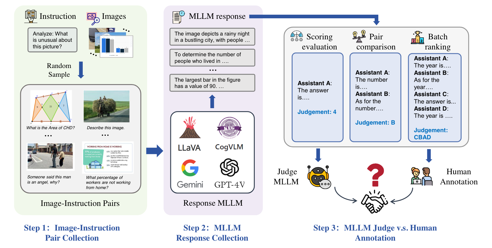
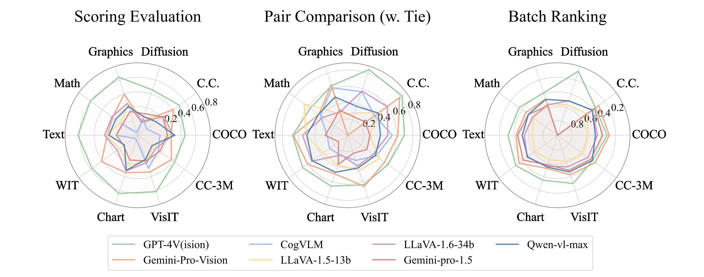

# MLLM-as-a-Judge

## 📌 核心贡献

> 提出首个系统性评估多模态大语言模型作为评判者能力的基准，涵盖评分（Scoring）、成对比较（Pair Comparison）和批量排序（Batch Ranking）三种评估范式，揭示了 MLLM 评判中的多种偏差问题。

## 📖 摘要

Multimodal Large Language Models (MLLMs) have gained significant attention recently, showing remarkable potential in artificial general intelligence. However, assessing the utility of MLLMs presents considerable challenges, primarily due to the absence of multimodal benchmarks that align with human preferences. Drawing inspiration from the concept of LLM-as-a-Judge within LLMs, this paper introduces a novel benchmark, termed MLLM-as-a-Judge, to assess the ability of MLLMs in assisting judges across diverse modalities, encompassing three distinct tasks: Scoring Evaluation, Pair Comparison, and Batch Ranking. Our study reveals that, while MLLMs demonstrate remarkable human-like discernment in Pair Comparison, there is a significant divergence from human preferences in Scoring Evaluation and Batch Ranking. Furthermore, a closer examination reveals persistent challenges in the judgment capacities of LLMs, including diverse biases, hallucinatory responses, and inconsistencies in judgment, even in advanced models such as GPT-4V. These findings emphasize the pressing need for enhancements and further research efforts to be undertaken before regarding MLLMs as fully reliable evaluators.

## 🔍 关键信息

| 字段 | 内容 |
|------|------|
| 机构 | Huazhong University of Science and Technology, Lehigh University |
| 发表 | 2024-02-07 (ICML 2024 Oral) |
| 分类 | cs.CL, cs.AI, cs.CV |
| 链接 | [arXiv](https://arxiv.org/abs/2402.04788) |

## 📝 我的笔记

### 方法总览

### 动机与问题定义

现有 MLLM 评估主要依赖人工标注或专门构建的基准测试（如 VQA 准确率），缺乏对 MLLM 作为通用评判者（Judge）能力的系统性评估。受 LLM-as-a-Judge 在纯文本领域成功应用的启发，本文首次将这一概念扩展到多模态场景，提出了一套全面的评估框架。

### 三种评估范式

1. **Scoring Evaluation（评分）**：MLLM 对给定图像-文本对的质量进行 1-5 分的评分，使用 Pearson 相关系数衡量与人类评分的一致性
2. **Pair Comparison（成对比较）**：MLLM 比较两个候选回答的优劣（可选是否允许平局），使用准确率、F1 和 Recall 衡量
3. **Batch Ranking（批量排序）**：MLLM 对多个候选回答进行排序，使用 Normalized Levenshtein Distance 衡量排序一致性

### 基准数据集

覆盖 14 个多样化数据集，涵盖图像描述、图表推理、数学推理、文本阅读、Web UI 指令跟随、AI 生成图像评估、多语言转录等任务：
- 评分样本：6,189 个
- 成对比较样本：8,203 个
- 批量排序样本：4,635 个

### 关键实验结果

#### Scoring Evaluation（Pearson 相似度）

| 模型 | 平均相似度 |
|------|-----------|
| GPT-4V | 0.454 |
| Gemini | 0.262 |
| LLaVA-1.5 | 0.247 |

#### Pair Comparison（准确率）

| 模型 | 含平局 | 不含平局 |
|------|--------|---------|
| GPT-4V | 0.696 | 0.804 |

#### 与人类一致率（GPT-4V）

| 评估范式 | 一致率 |
|---------|--------|
| Pair Comparison | ~79.3% |
| Scoring Evaluation | ~70% |
| Batch Ranking | ~69% |

### 偏差分析

本文系统性地揭示了 MLLM 评判中的四类偏差：

1. **位置偏差（Position Bias）**：LLaVA 在 88.2% 的情况下复制了样本的呈现顺序；引入多个示例后降至 53.3%
2. **长度偏差（Length Bias）**：GPT-4V 和 Gemini 均倾向于给更长的回答更高分数，语义扩展可带来 0.6-0.75 分的提升
3. **高分偏差（High-Score Bias）**：模型普遍给出约 4 分的评分，很少给 1-2 分，导致评分区分度不足
4. **自我中心偏差（Egocentric Bias）**：GPT-4V 对自身生成的回答有轻微偏好

### 总结性评价

本文是 MLLM-as-a-Judge 方向的奠基性工作（ICML 2024 Oral），系统性地定义了三种评判范式并构建了大规模基准。核心发现是 MLLM 在成对比较上表现接近人类，但在评分和排序上存在显著差距。偏差分析部分为后续改进（如 MR. Judge、MT-RL-Judge）提供了明确的研究方向。该基准已成为评估 MLLM 评判能力的标准参考。

## 🔗 相关论文

**同方向：** [[LLM-as-Judge-Survey]], [[LLaVA-Critic]], [[J1]]
