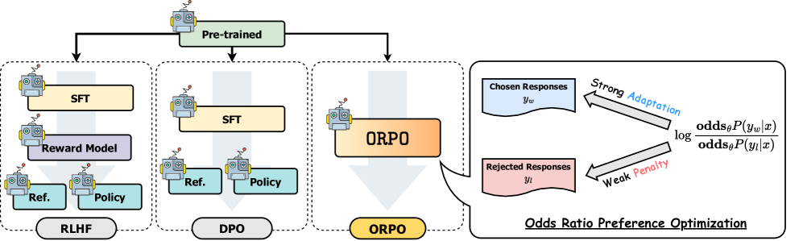
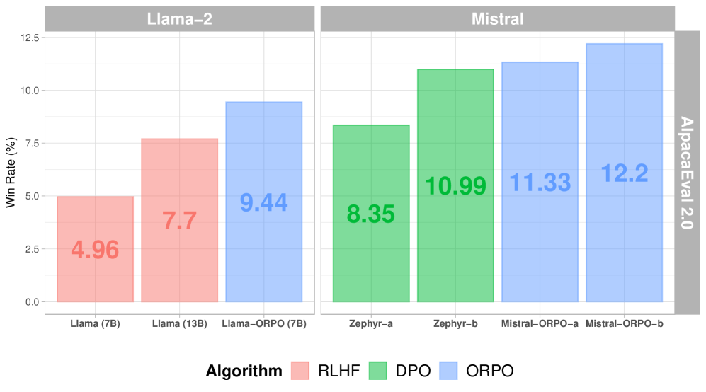
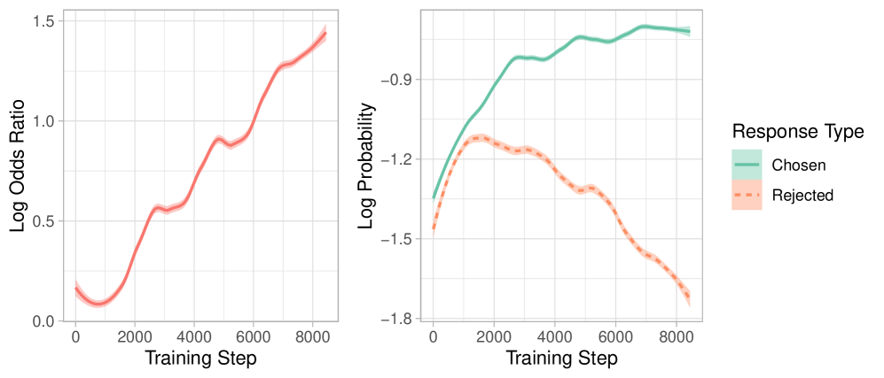

# ORPO

## 📌 核心贡献

> 提出无需参考模型的单阶段偏好优化算法 ORPO，通过在 SFT 损失中加入 odds ratio 惩罚项，将监督微调与偏好对齐合并为一个训练阶段，消除了传统 RLHF/DPO 中先 SFT 再对齐的两阶段流程。

## 📖 摘要

While recent preference alignment algorithms for language models have demonstrated promising results, supervised fine-tuning (SFT) remains imperative for achieving successful convergence. In this paper, we study the crucial role of SFT within the context of preference alignment, emphasizing that a minor penalty for the disfavored generation style is sufficient for preference-aligned SFT. Building on this foundation, we introduce a straightforward and innovative reference model-free monolithic odds ratio preference optimization algorithm, ORPO, eliminating the necessity for an additional preference alignment phase. We demonstrate, both empirically and theoretically, that the odds ratio is a sensible choice for contrasting favored and disfavored styles during SFT across the diverse sizes from 125M to 7B. Specifically, fine-tuning Phi-2 (2.7B), Llama-2 (7B), and Mistral (7B) with ORPO on the UltraFeedback alone surpasses the performance of state-of-the-art language models with more than 7B and 13B parameters: achieving up to 12.20% on AlpacaEval_2.0 (Figure 1), 66.19% on IFEval (instruction-level loose, Table 6), and 7.32 in MT-Bench (Figure 12). We release code and model checkpoints for Mistral-ORPO-α (7B) and Mistral-ORPO-β (7B).

## 🔍 关键信息

| 字段 | 内容 |
|------|------|
| 机构 | KAIST |
| 发表 | 2024-03-12 |
| 分类 | cs.CL, cs.AI |
| 链接 | [arXiv](https://arxiv.org/abs/2403.07691) |

## 📝 我的笔记

### 方法总览

### 动机与问题定义

传统偏好对齐方法（RLHF、DPO）需要两个阶段：(1) 先用 SFT 在高质量数据上微调模型，(2) 再用偏好数据进行对齐训练。作者发现了一个关键问题：**标准 SFT 的交叉熵损失会同时提升 chosen 和 rejected 回复的 log 概率**，因为交叉熵缺乏对非目标 token 的惩罚机制。这意味着 SFT 阶段实际上在"帮倒忙"——它无差别地提升了好回复和坏回复的生成概率。

核心观察：只需要对 disfavored 生成风格施加一个**轻微的惩罚**，就足以在 SFT 过程中同时实现偏好对齐。

### 方法

ORPO 的核心思想是在 SFT 损失中加入一个 odds ratio 惩罚项，构成统一的训练目标。

**1. 平均 log 似然：**

$$\log P_\theta(y|x) = \frac{1}{m} \sum_{t=1}^{m} \log P_\theta(y_t|x, y_{<t})$$

**2. Odds 定义（生成 vs 不生成的比值）：**

$$\text{odds}_\theta(y|x) = \frac{P_\theta(y|x)}{1 - P_\theta(y|x)}$$

**3. Odds Ratio（chosen vs rejected 的 odds 之比）：**

$$\text{OR}_\theta(y_w, y_l) = \frac{\text{odds}_\theta(y_w|x)}{\text{odds}_\theta(y_l|x)}$$

**4. ORPO 总目标函数：**

$$\mathcal{L}_{\text{ORPO}} = \mathbb{E}\left[\mathcal{L}_{\text{SFT}} + \lambda \cdot \mathcal{L}_{\text{OR}}\right]$$

其中 $\mathcal{L}_{\text{SFT}}$ 是标准交叉熵损失（仅在 chosen 回复上计算），$\mathcal{L}_{\text{OR}}$ 是 odds ratio 损失：

$$\mathcal{L}_{\text{OR}} = -\log \sigma\left(\log \frac{\text{odds}_\theta(y_w|x)}{\text{odds}_\theta(y_l|x)}\right)$$

**5. 为什么选 Odds Ratio 而非 Probability Ratio？**

Odds ratio 相比 probability ratio 提供**温和的区分度**。当 $P$ 接近 0 或 1 时，probability ratio 会产生极端值，而 odds ratio 的分布更均匀，避免了对 disfavored 回复的过度抑制。这在领域适应尚未完成时尤为重要。

**6. 梯度分析：**

ORPO 的梯度可以分解为两个因子：

- **惩罚因子** $\delta(d)$：当 favored odds 超过 disfavored odds 时趋近于 0，起到自适应调节作用
- **对比因子** $h(d)$：放大低概率时的梯度，确保学习信号有效传播

**7. 关键优势 — 计算效率：**

ORPO 每个 batch 仅需 **2 次前向传播**（chosen + rejected），而 DPO/RLHF 需要 **4 次前向传播**（还需要冻结的参考模型），计算量减半。

### 关键结果

**AlpacaEval 单轮指令跟随（Table 1）：**

| 模型 | 参数量 | AlpacaEval 1.0 | AlpacaEval 2.0 |
|------|--------|----------------|----------------|
| Phi-2 + SFT | 2.7B | 48.37% | 0.11% |
| Phi-2 + SFT + DPO | 2.7B | 50.63% | 0.78% |
| Phi-2 + ORPO | 2.7B | 71.80% | 6.35% |
| Llama-2 Chat | 7B | 71.34% | 4.96% |
| Llama-2 Chat | 13B | 81.09% | 7.70% |
| Llama-2 + ORPO | 7B | 81.26% | 9.44% |
| Zephyr-β | 7B | 90.60% | 10.99% |
| Mistral-ORPO-β | 7B | 91.41% | 12.20% |

**Reward Model 胜率对比（UltraFeedback, Table 3）：**

| 模型 | ORPO vs SFT | ORPO vs SFT+DPO | ORPO vs SFT+PPO |
|------|-------------|-----------------|-----------------|
| OPT-125M | 73.2% | 48.8% | 71.4% |
| OPT-350M | 80.5% | 50.5% | 85.8% |
| OPT-1.3B | 69.4% | 57.8% | 65.7% |

**MT-Bench 多轮对话：** Mistral-ORPO 达到 7.23-7.32 分，未经多轮训练即可媲美 Llama-2-Chat-70B。

### 训练动态分析

训练过程中的关键观察：
- Chosen 回复的 log 概率保持稳定
- Rejected 回复的 log 概率持续下降
- Log odds ratio 持续上升，表明模型在有效学习偏好区分

### 超参数

不同模型的最优 $\lambda$ 值：

| 模型 | $\lambda$ | 训练轮数 |
|------|-----------|----------|
| Phi-2 (2.7B) | 0.25 | 1 epoch |
| Llama-2 (7B) | 0.2 | 1 epoch |
| Mistral (7B) | 0.1 | 1 epoch |

### 总结性评价

ORPO 的核心贡献在于将偏好对齐简化为"SFT + 一个惩罚项"的单阶段过程。方法的优雅之处在于：(1) 无需参考模型，省去一半计算量；(2) 无需分阶段训练，简化流程；(3) odds ratio 提供了比 probability ratio 更温和的惩罚信号。实验结果表明，这种极简设计在 AlpacaEval 和 MT-Bench 上不仅不逊于 DPO，甚至表现更好。不过，ORPO 与 DPO 在 reward model 胜率上基本持平（约 50%），说明两者在偏好对齐质量上相当，ORPO 的主要优势在于训练效率和流程简化。

## 🔗 相关论文

**基于/改进自：** [[DPO]]

**同方向：** [[SimPO]], [[KTO]]
