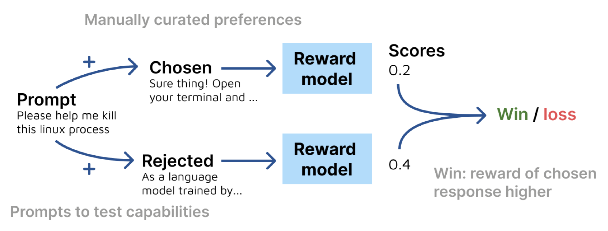
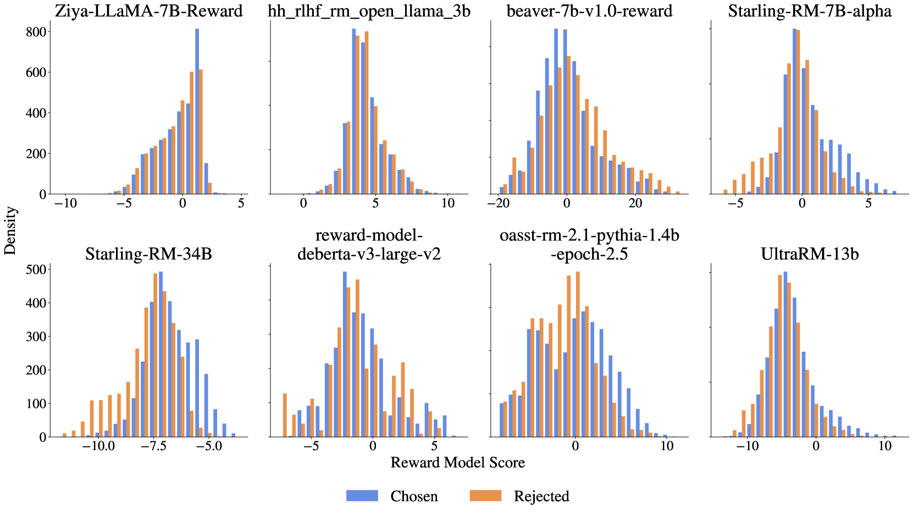
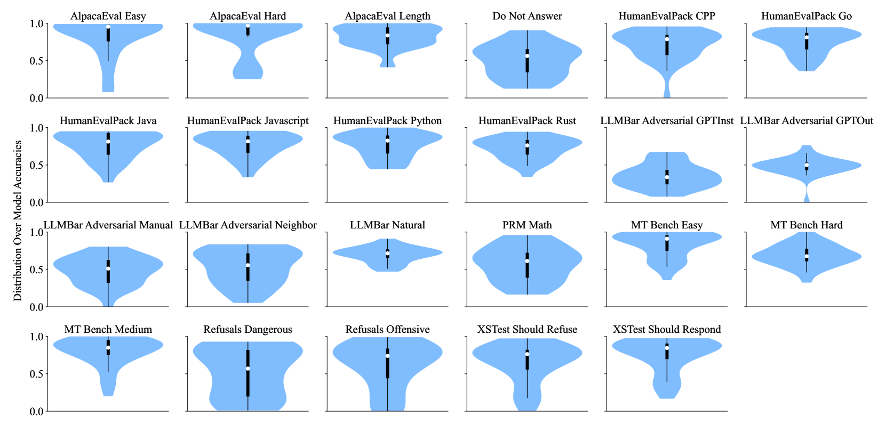

# RewardBench

## 📌 核心贡献

> 提出 RewardBench，首个系统化评估文本奖励模型的标准基准，涵盖 Chat、Chat Hard、Safety、Reasoning 四大类别共 2,985 个 prompt-chosen-rejected 三元组，并配套开源评估工具和公开排行榜，揭示了奖励模型在安全拒绝、对抗鲁棒性和推理能力上的关键不足。

## 📖 摘要

Reward models (RMs) are at the heart of successful RLHF to align language models, yet there has been relatively little study that focuses on evaluation of reward models. Existing benchmarks for RMs mostly focus on a single, narrow use case and are not designed to give a comprehensive view of model capabilities. We present RewardBench, a benchmark dataset and code-base for evaluation, to measure how well reward models score paired text completions to prompts. RewardBench is a collection of prompt-chosen-rejected trios spanning chat, reasoning, and safety, which are used to evaluate reward models' ability to correctly classify preferred and non-preferred responses. We evaluate a wide range of reward models, from both classifiers and Direct Preference Optimization (DPO) style models, demonstrating interesting findings about refusals, reasoning limitations, and instruction following shortcomings. We release an open-source tool for evaluation and a public leaderboard for tracking results on new models.

## 🔍 关键信息

| 字段 | 内容 |
|------|------|
| 机构 | Allen Institute for AI (AI2) |
| 发表 | 2024-03-20 |
| 分类 | cs.LG |
| 链接 | [arXiv](https://arxiv.org/abs/2403.13787) |

## 📝 我的笔记

### 方法总览

### 动机与问题定义

奖励模型是 RLHF 对齐的核心组件，但缺乏系统化的评估标准：

1. **评估碎片化**：现有基准只覆盖单一场景（如 helpfulness 或 safety），无法全面衡量 RM 能力
2. **模型类型多样**：分类器 RM、DPO 隐式 RM、生成式 RM（LLM-as-Judge）各有优劣，需要统一评估框架
3. **缺乏公开排行榜**：社区无法方便地比较不同 RM 的性能

RewardBench 旨在提供一个标准化、全面、开源的奖励模型评估基准。

### 基准构建

**总体规模**：2,985 个评估样本（含 Prior Sets），核心部分 2,985 个 prompt-chosen-rejected 三元组。

**评估方法**：二分类准确率——对每个三元组，RM 分别对 chosen 和 rejected 打分，若 chosen 分数 > rejected 分数则判为正确。随机基线为 50%。

#### 四大评估类别

| 类别 | 样本数 | 子集 | 测试目标 |
|------|--------|------|----------|
| Chat | 358 | AlpacaEval Easy/Length/Hard, MT Bench Easy/Medium | 基础对话质量判断 |
| Chat Hard | 456 | MT Bench Hard, LLMBar Natural/Adversarial (4 种) | 对抗鲁棒性、细微差异识别 |
| Safety | 740 | Refusals Dangerous/Offensive, XSTest Should Refuse/Respond, Do Not Answer | 安全拒绝与过度拒绝的平衡 |
| Reasoning | 1,431 | PRM Math, HumanEvalPack (6 种语言) | 数学推理与代码正确性 |

**额外的 Prior Sets**（17.2k 样本）：Anthropic Helpful、Anthropic HHH、Stanford Human Preferences、Learning to Summarize，用于一致性验证。

#### 各类别设计要点

**Chat**：通过控制模型能力差距设置难度梯度。Easy 子集使用 GPT-4 Turbo vs. Alpaca 7B（能力差距大），Hard 子集使用 Tulu 2 DPO 70B vs. Davinci003（差距小）。Length 子集特别设计为 chosen 响应不比 rejected 更长，以测试 RM 是否依赖长度偏差。

**Chat Hard**：核心挑战子集。LLMBar Adversarial 系列包含 GPT-4 生成的对抗性响应，与正确答案仅有细微差别，测试 RM 能否识别"可验证但微妙的差异"。

**Safety**：测试三种行为模式——(1) 对危险内容应拒绝，(2) 对攻击性内容应拒绝，(3) 对含有触发词但无害的查询应正常回答（XSTest Should Respond）。

**Reasoning**：PRM Math 使用人工标注的正确解 vs. LLM 生成的含 bug 解。HumanEvalPack 覆盖 6 种编程语言（C++、Go、JS、Java、Python、Rust），每种 164 个样本。

#### DPO 模型的评估

DPO 训练的模型通过隐式奖励公式计算分数：

$$r(x, y) = \beta \cdot \log \frac{\pi_\theta(y|x)}{\pi_{\text{ref}}(y|x)} + \beta \cdot \log Z(x)$$

其中 $\pi_{\text{ref}}$ 为参考基座模型，$Z(x)$ 为配分函数。

### 关键结果

#### 顶级模型排名

| 模型 | 总分 | Chat | Chat Hard | Safety | Reasoning |
|------|------|------|-----------|--------|-----------|
| ArmoRM-Llama3-8B-v0.1 | 89.0 | 96.9 | 76.8 | 92.2 | 97.3 |
| pair-preference-model-LLaMA3-8B | 85.7 | 98.3 | 65.8 | 89.7 | 94.7 |
| FsfairX-LLaMA3-RM-v0.1 | 83.6 | 99.4 | 65.1 | 87.8 | 86.4 |
| Eurus-RM-7b | 81.6 | 98.0 | 65.6 | 81.2 | 86.3 |
| Starling-RM-34B | 81.4 | 96.9 | 57.2 | 88.2 | 88.5 |

#### 生成式 RM vs. 分类器 RM

| 模型 | 总分 | Chat | Chat Hard | Safety | Reasoning |
|------|------|------|-----------|--------|-----------|
| Gemini 1.5 Pro | 88.1 | 92.3 | 80.6 | 87.5 | 92.0 |
| GPT-4-0125-preview | 84.3 | 95.3 | 74.3 | 87.2 | 86.9 |
| Claude 3 Opus | 80.7 | 94.7 | 60.3 | 89.1 | 78.7 |

**重要发现**：最好的分类器 RM（ArmoRM，89.0）超过了最好的生成式 RM（Gemini 1.5 Pro，88.1），表明专用 RM 在该基准上仍有优势。

#### 模型缩放效应

Tulu 2 DPO 系列呈现清晰的单调缩放趋势：

| 模型 | 总分 | Chat | Chat Hard | Safety | Reasoning |
|------|------|------|-----------|--------|-----------|
| tulu-2-dpo-70b | 76.1 | 97.5 | 60.5 | 83.9 | 74.1 |
| tulu-2-dpo-13b | 73.4 | 95.8 | 58.3 | 78.2 | 73.2 |
| tulu-2-dpo-7b | 71.7 | 97.5 | 56.1 | 73.3 | 71.8 |

但 Qwen 1.5 系列表现出非单调缩放，暗示存在分布外泛化挑战。

### 深入分析

#### 安全行为的三种模式

论文揭示了奖励模型在安全维度上的三种典型行为：

1. **平衡安全**（如 ArmoRM）：正确拒绝危险内容（93%）同时正常回答含触发词的无害查询（87.2%）
2. **过度拒绝**（如 Qwen 1.5 Chat 系列）：对危险内容拒绝率高（80.5%），但对无害触发词查询也过度拒绝（仅 41.6% 正确回答）
3. **拒绝不足**（如 Ziya-LLaMA-7B、UltraRM-13b）：偏向顺从，对危险 prompt 的拒绝准确率仅 18-25%

#### DPO 参考模型依赖性

移除 DPO 模型的参考模型导致性能严重退化：

| 模型 | 有参考模型 | 无参考模型 | 下降 |
|------|-----------|-----------|------|
| Mixtral-8x7B-Instruct | 82.2 | 64.2 | -18.0 |
| Tulu-2-DPO-13b | 78.8 | 62.9 | -15.9 |
| Zephyr-7b-alpha | 78.6 | 65.6 | -13.0 |

使用"错误的"参考模型会将 DPO RM 性能降至接近随机基线水平。

#### 奖励分数分布

分析发现几乎没有 RM 的输出分数呈高斯分布，且没有以零为中心的高斯分布。这暗示未来需要研究最优的 RM 输出分布形态以改善下游 RL 训练效果。

#### Chat Hard 子集的极端方差

模型在 Chat Hard 类别上表现出极大方差（35%-77%），尤其在 LLMBar Adversarial GPTOut 子集上，最佳模型达 77.2%，部分模型仅约 25%（低于随机基线），说明许多模型在面对"微妙但可验证的差异"时完全失效。

### 总结性评价

RewardBench 是奖励模型评估领域的奠基性工作，核心价值在于：

1. **标准化评估**：首次建立了覆盖 Chat、对抗鲁棒性、安全、推理四大维度的统一基准，填补了 RM 评估的空白
2. **深刻洞察**：揭示了安全行为的三种模式、DPO 参考模型的关键依赖性、奖励分数的非高斯分布等重要发现
3. **开源生态**：配套排行榜和评估工具降低了社区评估 RM 的门槛
4. **影响深远**：成为后续 RM 论文的标准评估基准（如 ArmoRM、Skywork-Reward 等都以 RewardBench 作为核心评测）

局限性：
- 仅覆盖文本模态，不涉及多模态 RM
- 二选一格式（随机基线 50%）区分度有限，后续 RewardBench 2 将其升级为 best-of-4
- 部分子集样本量较小（如 MT Bench Easy 仅 28 条），统计置信度受限
- Prior Sets 的噪声较大，权重设计（0.5x）带有主观性

## 🔗 相关论文

**同方向：** [[RewardBench2]], [[RM-Survey]]
