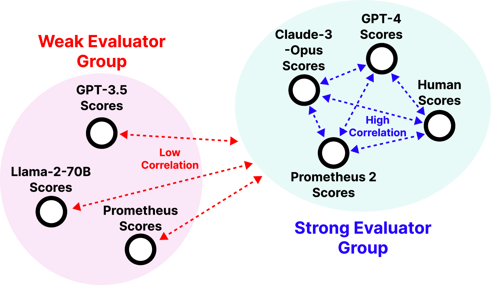
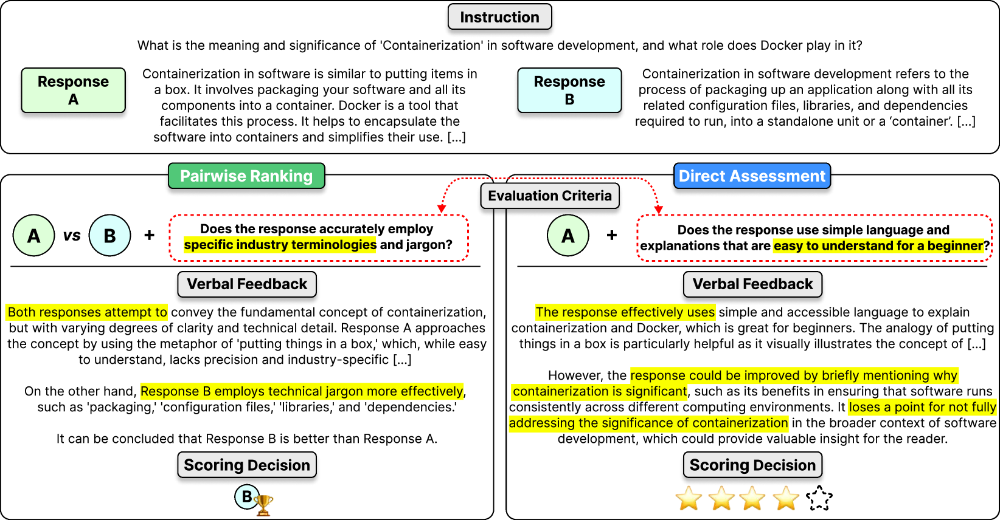
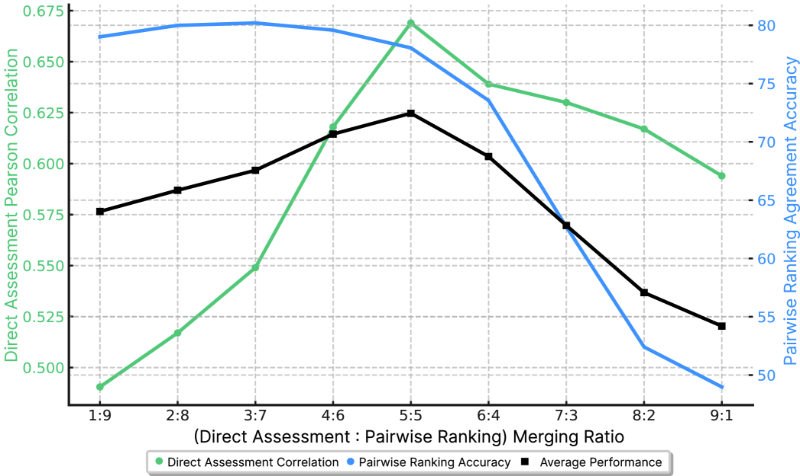

# Prometheus-2

## 📌 核心贡献

> 提出 Prometheus 2，通过权重合并策略统一直接评分和成对排序两种评估格式，在开源评估模型中实现了与人类和 GPT-4 判断最高的一致性。

## 📖 摘要

Proprietary LMs such as GPT-4 are often employed to assess the quality of responses from various LMs. However, concerns including transparency, controllability, and affordability strongly motivate the development of open-source evaluator LMs. On the other hand, existing open evaluator LMs exhibit critical shortcomings: 1) they issue scores that significantly diverge from those of humans and proprietary LM judges, 2) they lack the flexibility to perform both direct assessment and pairwise ranking, two of the most prevalent forms of assessment. Additionally, they do not possess the ability to evaluate based on custom evaluation criteria, limiting their applicability to diverse assessment scenarios. To address these issues, we introduce Prometheus 2, a more powerful evaluator LM than its predecessor that closely mirrors human and GPT-4 judgements. Moreover, it is capable of processing both direct assessment and pairwise ranking formats grouped with a user-defined evaluation criteria. On four direct assessment benchmarks and four pairwise ranking benchmarks, Prometheus 2 scores the highest correlation and agreement with humans and proprietary LM judges among all tested open evaluator LMs.

## 🔍 关键信息

| 字段 | 内容 |
|------|------|
| 机构 | KAIST |
| 发表 | 2024-05-02 |
| 分类 | cs.CL |
| 链接 | [arXiv](https://arxiv.org/abs/2405.01535) |

## 📝 我的笔记

### 方法总览

### 动机与问题定义

现有开源评估模型存在三个核心问题：(1) 与人类和 GPT-4 判断存在显著偏差；(2) 无法同时支持直接评分（Direct Assessment）和成对排序（Pairwise Ranking）两种评估格式；(3) 不支持自定义评估标准。Prometheus 2 旨在解决这些问题，构建统一的开源评估模型。

### 方法细节

**双格式训练数据：**
- **Feedback Collection**：100K 直接评分样本（指令+回复→1-5 分）
- **Preference Collection**：200K 成对排序样本，含自定义评估标准

**权重合并策略（DARE-Linear Merging）：**

分别在两种格式上训练独立的评估模型，然后通过 DARE-Linear 合并：

$$\theta_{\text{final}} = \alpha \times \theta_d + (1-\alpha) \times \theta_p$$

其中 $\theta_d$ 为直接评分模型参数，$\theta_p$ 为成对排序模型参数。实验发现 $\alpha=0.3$ 时效果最优。

**关键发现：** 权重合并优于联合训练（joint training），说明两种评估格式之间存在正向迁移，而非简单的集成效应。

### 关键结果

**直接评分（Pearson 相关系数）：**

| 模型 | Vicuna | MT Bench | FLASK | Feedback Bench |
|------|--------|----------|-------|----------------|
| Prometheus-2-8x7B | 0.685 | 0.665 | 0.659 | 0.555 |
| Prometheus-13B | ~0.48 | ~0.46 | ~0.45 | ~0.35 |
| GPT-4 | 0.700 | 0.690 | 0.682 | 0.578 |

**成对排序（准确率）：**

| 模型 | HHH Alignment | MT Bench | Auto-J |
|------|--------------|----------|--------|
| Prometheus-2-8x7B | 85.52% | 71.96% | 79.98% |
| Auto-J-13B | 75.80% | 63.52% | 69.82% |

**格式一致性：** Prometheus-2-8x7B 在格式切换时仅有 4.07% 的性能下降，而 Auto-J 下降 28.96%。

### 总结评价

Prometheus 2 的核心贡献在于发现权重合并可以有效统一不同评估格式，避免了多任务训练中的冲突。模型在开源评估器中取得最佳表现，并将与 GPT-4 的差距缩小一半。自定义评估标准的支持使其具有很强的实用性。

## 🔗 相关论文

**同方向：** [[J1]], [[Auto-J]], [[FLAMe]]
