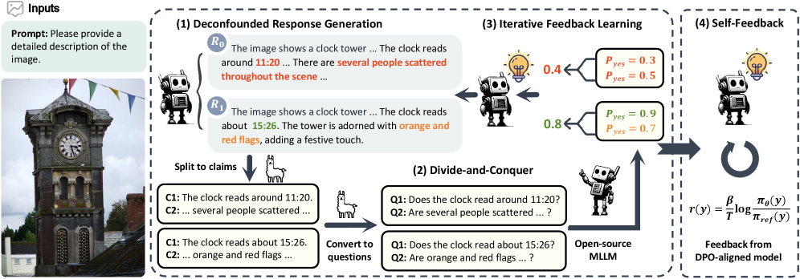
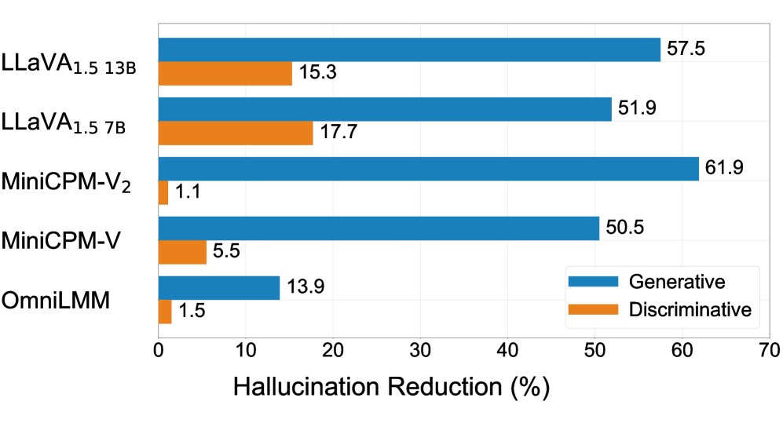

# RLAIF-V

## 📌 核心贡献

> 提出完全基于开源多模态大模型的 AI 反馈框架 RLAIF-V，通过去混淆响应生成、分治反馈标注和迭代偏好学习，实现超越 GPT-4V 的可信度，无需依赖闭源模型。

## 📖 摘要

Traditional feedback learning for hallucination reduction relies on labor-intensive manual labeling or expensive proprietary models. This leaves the community without foundational knowledge about how to build high-quality feedback with open-source MLLMs. In this work, we introduce RLAIF-V, a novel framework that aligns MLLMs in a fully open-source paradigm. RLAIF-V maximally explores open-source MLLMs from two perspectives, including high-quality feedback data generation for preference learning and self-feedback guidance for inference-time scaling. Extensive experiments on six benchmarks in both automatic and human evaluation show that RLAIF-V substantially enhances the trustworthiness of models at both preference learning and inference time. RLAIF-V 7B reduces object hallucination by 80.7% and overall hallucination by 33.7%. Remarkably, RLAIF-V 12B further reveals the self-alignment potential of open-source MLLMs, where the model can learn from feedback of itself to achieve super GPT-4V trustworthiness.

## 🔍 关键信息

| 字段 | 内容 |
|------|------|
| 机构 | Tsinghua University, NUS |
| 发表 | 2024-05-27 |
| 分类 | cs.CL |
| 链接 | [arXiv](https://arxiv.org/abs/2405.17220) |

## 📝 我的笔记

### 方法总览

### 动机与问题

传统的多模态幻觉减少方法依赖人工标注或闭源模型（如 GPT-4V）提供反馈。RLAIF-V 旨在探索完全开源的 MLLM 反馈范式，从偏好学习和推理时扩展两个角度提升模型可信度。

### 核心方法

**1. 去混淆响应生成（Deconfounded Response Generation）**
- 使用相同输入和参数，仅改变随机种子进行采样解码，生成多个候选响应 $\{y_1, y_2, \ldots, y_n\}$
- 消除文本风格等混淆因素，暴露响应间真实的可信度差异

**2. 分治反馈标注（Divide-and-Conquer Feedback）**
- **Divide**：将响应分解为原子声明（atomic claims）
- **Conquer**：将声明转为极性问题，由开源 MLLM 回答，生成置信度分数 $(p_{yes}, p_{no})$
- **Combine**：最终得分 $S = -n_{rej}$，其中 $n_{rej}$ 为 $p_{no} > p_{yes}$ 的声明数量

**3. 迭代偏好学习**
- 使用 DPO 进行多轮迭代训练
- 每轮用更新后的模型重新生成响应和反馈，解决分布偏移问题

**4. 自反馈推理扩展**
- 将 DPO 训练后的模型作为奖励函数
- 使用长度归一化的奖励公式：$r(y) = \frac{\beta}{T} \log \frac{\pi_\theta(y)}{\pi_{ref}(y)}$
- 采用 Best-of-N 选择策略

### 关键结果

| 模型 | Object HalBench ↓ | MHumanEval 总体 ↓ | 相对改善 |
|------|-------------------|-------------------|----------|
| RLAIF-V 7B | 10.5% | — | 物体幻觉 -80.7% |
| RLAIF-V 12B (self) | — | — | 超越 GPT-4V |
| 去混淆 vs 非去混淆 | 10.1% vs 25.7% | — | — |
| 分治反馈人类一致率 | — | — | 96.7% vs 66.7% |

### 总结

RLAIF-V 证明了开源 MLLM 可以通过精心设计的反馈框架实现自我对齐，无需依赖闭源模型。去混淆策略和分治标注是高质量反馈的关键，迭代训练有效解决了分布偏移问题。

## 🔗 相关论文

**基于/改进自：** [[RLAIF]]

**同方向：** [[LLaVA-Critic]], [[ConstitutionalAI]]
