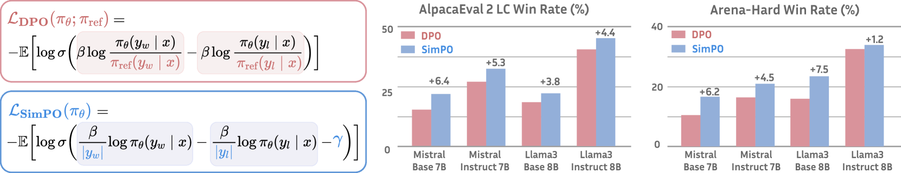
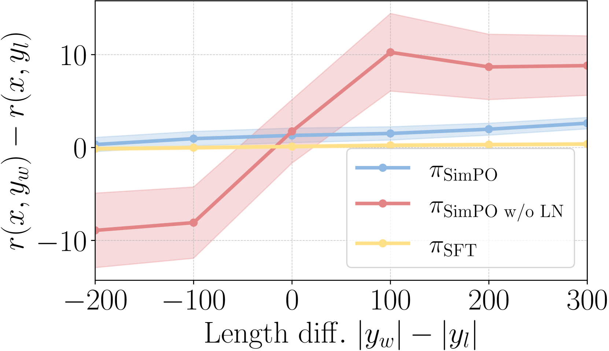
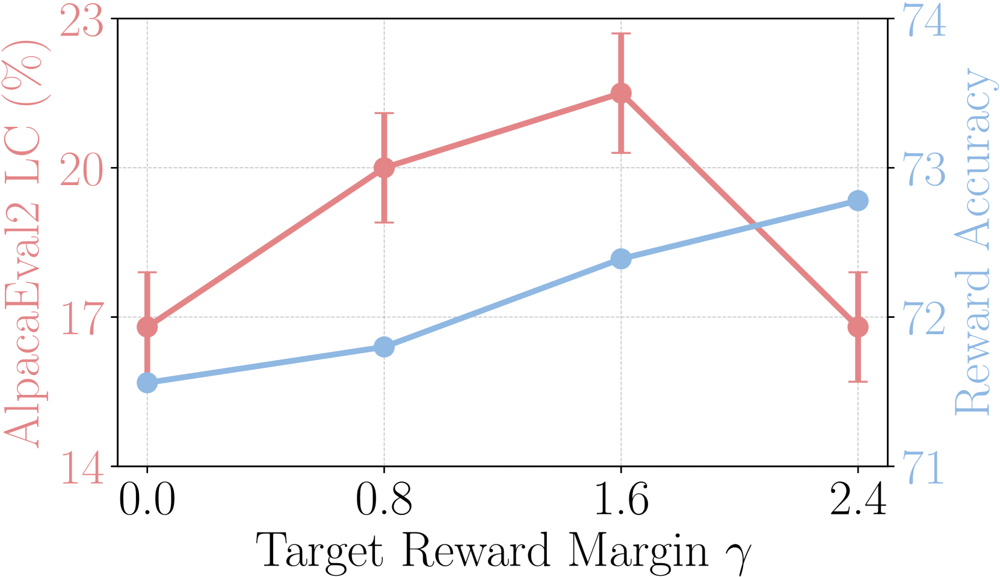
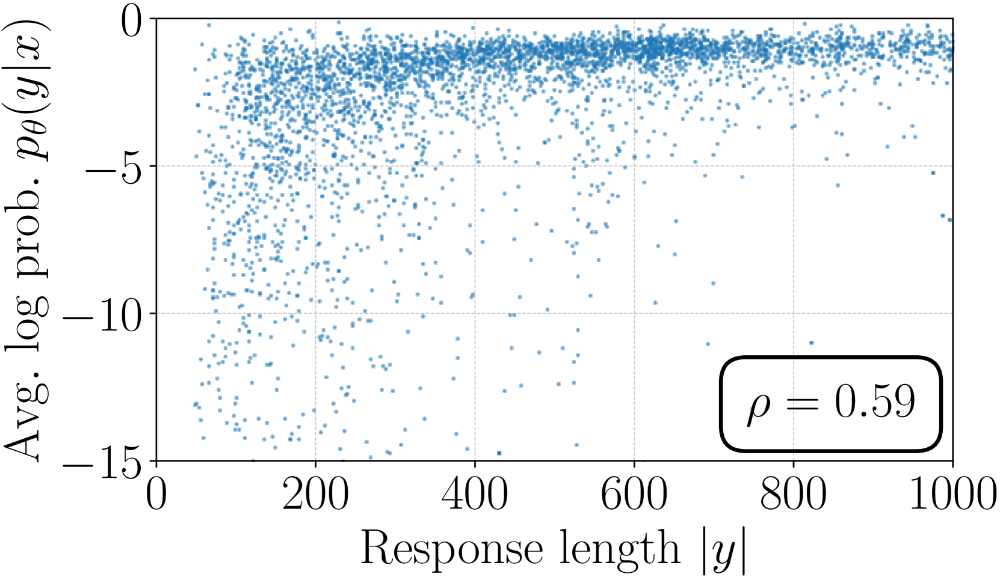

# SimPO

## 📌 核心贡献

> 提出以序列平均对数概率作为无参考模型的隐式奖励，结合目标奖励间距项，实现比 DPO 更简单、更高效且性能更优的偏好优化算法。

## 📖 摘要

Direct Preference Optimization (DPO) is a widely used offline preference optimization algorithm that reparameterizes reward functions in reinforcement learning from human feedback (RLHF) to enhance simplicity and training stability. In this work, we propose SimPO, a simpler yet more effective approach. The effectiveness of SimPO is attributed to a key design: using the average log probability of a sequence as the implicit reward. This reward formulation better aligns with model generation and eliminates the need for a reference model, making it more compute and memory efficient. Additionally, we introduce a target reward margin to the Bradley-Terry objective to encourage a larger margin between the winning and losing responses, further improving the algorithm's performance. We compare SimPO to DPO and its latest variants across various state-of-the-art training setups, including both base and instruction-tuned models such as Mistral, Llama 3, and Gemma 2. We evaluate on extensive chat-based evaluation benchmarks, including AlpacaEval 2, MT-Bench, and Arena-Hard. Our results demonstrate that SimPO consistently and significantly outperforms existing approaches without substantially increasing response length. Specifically, SimPO outperforms DPO by up to 6.4 points on AlpacaEval 2 and by up to 7.5 points on Arena-Hard. Our top-performing model, built on Gemma-2-9B-it, achieves a 72.4% length-controlled win rate on AlpacaEval 2, a 59.1% win rate on Arena-Hard, and ranks 1st on Chatbot Arena among <10B models with real user votes.

## 🔍 关键信息

| 字段 | 内容 |
|------|------|
| 机构 | University of Virginia, Princeton University |
| 发表 | 2024-05-23 |
| 分类 | cs.CL, cs.LG |
| 链接 | [arXiv](https://arxiv.org/abs/2405.14734) |

## 📝 我的笔记

### 方法总览

### 动机与问题定义

DPO 的隐式奖励使用策略模型与参考模型的对数概率比：

$$r_{\text{DPO}}(x, y) = \beta \log \frac{\pi_\theta(y|x)}{\pi_{\text{ref}}(y|x)}$$

这存在两个关键问题：

1. **计算开销**：训练时需要同时维护参考模型，增加显存和计算成本
2. **训练-推理不一致**：DPO 的奖励排序 $r(x, y_w) > r(x, y_l)$ 不一定意味着生成时的似然排序 $p_\theta(y_w|x) > p_\theta(y_l|x)$。实验表明，仅约 50% 的训练样本同时满足奖励排序和似然排序

### 方法

SimPO 的核心思想是用**序列平均对数概率**直接作为隐式奖励，消除对参考模型的依赖。

#### 1. 平均对数概率奖励

$$r_{\text{SimPO}}(x, y) = \frac{\beta}{|y|} \log \pi_\theta(y|x) = \frac{\beta}{|y|} \sum_{i=1}^{|y|} \log \pi_\theta(y_i | x, y_{<i})$$

这一指标与 beam search 和多选任务中的排序指标完全一致，确保了训练目标与推理行为的对齐。

#### 2. 长度归一化

除以序列长度 $|y|$ 消除了长度偏差。未归一化的对数概率总和天然偏向更长的序列。实验验证：

| 方法 | 平均对数似然与长度的 Spearman 相关系数 |
|------|------|
| SimPO w/o LN | ρ = 0.82（严重长度利用） |
| DPO | ρ = 0.59（隐式归一化） |
| SimPO | ρ = 0.34（最小相关性） |

#### 3. 目标奖励间距 (γ)

在 Bradley-Terry 目标中引入间距项 γ，强制 winning 和 losing 响应之间保持最小奖励差距：

$$p(y_w \succ y_l | x) = \sigma(r(x, y_w) - r(x, y_l) - \gamma)$$

最优范围为 γ ∈ [0.5, 1.5]。

#### 4. 完整 SimPO 目标函数

$$\mathcal{L}_{\text{SimPO}}(\pi_\theta) = -\mathbb{E}_{(x, y_w, y_l) \sim \mathcal{D}} \left[ \log \sigma \left( \frac{\beta}{|y_w|} \log \pi_\theta(y_w|x) - \frac{\beta}{|y_l|} \log \pi_\theta(y_l|x) - \gamma \right) \right]$$

关键超参数：β ∈ [2.0, 2.5]，γ ∈ [0.5, 1.5]。

### DPO vs SimPO 对比

### 关键实验结果

#### 主要结果

| 模型设置 | 方法 | AlpacaEval 2 LC | Arena-Hard WR | MT-Bench |
|------|------|------|------|------|
| Mistral-7B-Base | DPO | 15.1% | 10.4% | 5.9 |
| Mistral-7B-Base | **SimPO** | **21.5%** | **16.6%** | **6.0** |
| Llama-3-8B-Instruct | DPO | 40.3% | 37.9% | 7.0 |
| Llama-3-8B-Instruct | **SimPO** | **44.7%** | **40.5%** | **7.0** |

最佳模型 Gemma-2-9B-it-SimPO 达到：
- AlpacaEval 2 长度控制胜率 72.4%
- Arena-Hard 胜率 59.1%
- Chatbot Arena <10B 模型排名第 1

SimPO 相比 DPO 的最大提升：AlpacaEval 2 +6.4 分，Arena-Hard +7.5 分。

#### Ablation 分析

| 配置 | AlpacaEval 2 LC | Arena-Hard WR |
|------|------|------|
| DPO Baseline | 15.1% | 10.4% |
| SimPO（完整） | **21.5%** | **16.6%** |
| w/o 长度归一化 | 11.9% | 9.4% |
| γ = 0（无间距项） | 16.8% | 11.7% |

- 去除长度归一化：AlpacaEval 2 下降 9.6 分
- 去除间距项 γ：AlpacaEval 2 下降 4.7 分
- 两个组件均为关键设计

### 效率优势

SimPO 无需参考模型，相比 DPO：
- 训练时间减少约 20%
- GPU 显存减少约 10%

### 总结与评价

SimPO 是一个设计极为精巧的工作。核心洞察在于：DPO 的隐式奖励（策略/参考模型对数概率比）与实际推理时使用的排序指标（平均对数概率）存在根本性的不一致。SimPO 通过直接使用平均对数概率作为奖励，同时引入长度归一化和目标间距两个简单而有效的设计，在不增加任何计算开销的前提下实现了显著的性能提升。这一工作也揭示了 DPO 中训练目标与推理行为脱节的深层问题。

## 🔗 相关论文

**基于/改进自：** [[DPO]]

**同方向：** [[InstructGPT]], [[RM-Survey]]
