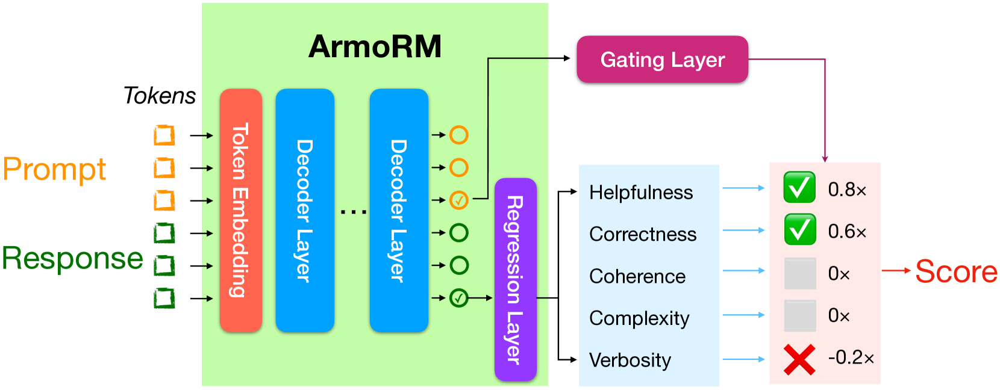

# ArmoRM

## 📌 核心贡献

> 提出多目标奖励建模 + MoE 门控的两阶段框架，将奖励模型的偏好判断分解为可解释的多维度评分（如诚实性、安全性、冗余度等），以 Llama-3 8B 为基座在 RewardBench 上达到 SOTA，超越 GPT-4 judge 方法并接近 Nemotron-4 340B。

## 📖 摘要

Reinforcement learning from human feedback (RLHF) has emerged as the primary method for aligning large language models (LLMs) with human preferences. The RLHF process typically starts by training a reward model (RM) using human preference data. Conventional RMs are trained on pairwise responses to the same user request, with relative ratings indicating which response humans prefer. The trained RM serves as a proxy for human preferences. However, due to the black-box nature of RMs, their outputs lack interpretability, as humans cannot intuitively understand why an RM thinks a response is good or not. As RMs act as human preference proxies, we believe they should be human-interpretable to ensure that their internal decision processes are consistent with human preferences and to prevent reward hacking in LLM alignment. To build RMs with interpretable preferences, we propose a two-stage approach: i) train an Absolute-Rating Multi-Objective Reward Model (ArmoRM) with multi-dimensional absolute-rating data, each dimension corresponding to a human-interpretable objective (e.g., honesty, verbosity, safety); ii) employ a Mixture-of-Experts (MoE) strategy with a gating network that automatically selects the most suitable reward objectives based on the context. We efficiently trained an ArmoRM with Llama-3 8B and a gating network consisting of a shallow MLP on top of the ArmoRM. Our trained model, ArmoRM-Llama3-8B, obtains state-of-the-art performance on RewardBench, a benchmark evaluating RMs for language modeling. Notably, the performance of our model surpasses the LLM-as-a-judge method with GPT-4 judges by a margin, and approaches the performance of the much larger Nemotron-4 340B reward model.

## 🔍 关键信息

| 字段 | 内容 |
|------|------|
| 机构 | RLHFlow (UIUC, CMU, UW-Madison, HKUST) |
| 发表 | 2024-06-18 |
| 分类 | cs.LG, cs.CL |
| 链接 | [arXiv](https://arxiv.org/abs/2406.12845) |

## 📝 我的笔记

### 方法总览

ArmoRM 采用两阶段训练策略，将传统黑箱奖励模型分解为可解释的多维度评分体系：

### 动机与问题定义

传统 RM 将人类偏好压缩为单一标量分数，存在以下问题：
- **不可解释**：无法理解 RM 为什么认为某个回答好
- **冗余偏差（verbosity bias）**：RM 倾向于给更长的回答更高分，导致 LLM 对齐后产生不必要的冗长输出
- **奖励黑客（reward hacking）**：不透明的 RM 容易被 LLM 利用漏洞获取高分

ArmoRM 通过将偏好分解为多个可解释维度（如诚实性、安全性、冗余度等），使人类可以审查 RM 的内部决策过程是否与人类偏好一致。

### 方法细节

#### 第一阶段：多目标奖励建模（Multi-Objective Reward Modeling）

使用 Llama-3 8B 作为 backbone（冻结参数），在其之上训练一个线性回归层，预测 $k$ 维绝对评分向量。

**回归损失：**

$$\min_{W} \| W^T f_\theta(x \oplus y) - r \|_2^2$$

其中 $W$ 为回归矩阵，$f_\theta$ 为 LLM backbone 的隐藏表示，$r$ 为 $k$ 维评分向量。

训练数据来自 8 个数据集，共涵盖 **19 个评分维度**，约 60 万样本：

| 数据集 | 维度数 | 评分维度 |
|--------|--------|----------|
| HelpSteer | 5 | helpfulness, correctness, coherence, complexity, verbosity |
| UltraFeedback | 5 | instruction-following, honesty, truthfulness, helpfulness, readability |
| BeaverTails | 1 | safety |
| CodeUltraFeedback | 5 | code instruction-following, readability, explanation, correctness, helpfulness |
| Prometheus | 1 | overall |
| Capybara | 1 | overall |
| Math-Preference | 1 | overall |

关键设计：对于缺失标签的维度，仅对可用维度计算损失。回归层使用 Scikit-learn 在 CPU 上训练（非常高效）。

#### 第二阶段：MoE 门控网络（Mixture-of-Experts Gating）

**冗余度校正（Verbosity Adjustment）：**

在聚合多维奖励之前，先消除各维度与回答长度的相关性：

$$r'_i \leftarrow r_i - \lambda_i \cdot r_{\text{verbose}}$$

其中 $\lambda_i$ 通过 Spearman 相关系数校准，确保校正后的各维度与回答长度零相关。

**门控网络设计：**

使用浅层 3 层 MLP（隐藏层 1024 维）作为门控网络 $g_\phi$，输入为 prompt 的隐藏表示，输出为各维度的加权系数：

$$R = g_\phi(f_\theta(x))^T \cdot r'$$

门控网络根据上下文自动选择合适的奖励维度权重——例如编程问题会提高代码相关维度的权重，安全相关问题会提高安全维度的权重。

**训练方式：**

使用 Bradley-Terry 偏好损失训练门控网络（backbone 和回归层均冻结）：
- 10 个偏好数据集，约 97.5 万对
- 训练步数：10,000 步
- batch size：1024
- 学习率：0.001
- 硬件：单张 NVIDIA A6000 GPU

### 关键实验结果

#### RewardBench 主实验

| 方法 | 基座模型 | 参数量 | Overall |
|------|----------|--------|---------|
| **ArmoRM + MoE** | **Llama-3 8B** | **8B** | **89.0** |
| HelpSteer2 RM | Nemotron-4 340B | 340B | 89.3 |
| GPT-4 Turbo (judge) | — | — | 84.2 |
| Bradley-Terry baseline | Llama-3 8B | 8B | 83.6 |

关键发现：
- 以 8B 参数量达到接近 340B 模型的性能（89.0 vs 89.3）
- 大幅超越 GPT-4 Turbo judge 方法（89.0 vs 84.2）
- 相比同等基座的 Bradley-Terry baseline 提升显著（89.0 vs 83.6）

#### 与单一标量 RM 的对比

ArmoRM 的多目标分解相比传统单标量 RM 的优势：
1. **可解释性**：可以审查各维度的评分，理解 RM 的判断依据
2. **冗余偏差校正**：通过显式建模 verbosity 维度并进行校正，有效抑制冗余偏差
3. **上下文自适应**：MoE 门控根据 prompt 类型动态调整维度权重
4. **防止奖励黑客**：透明的多维度评分使得利用漏洞更困难

### Ablation 分析

- 冗余度校正（verbosity adjustment）对抑制输出长度膨胀至关重要
- MoE 门控相比固定权重聚合带来显著提升
- 多数据集混合训练优于单一数据集

### 总结性评价

ArmoRM 的核心思想——将黑箱 RM 分解为多个可解释维度——简洁而有效。两阶段训练策略设计巧妙：第一阶段利用绝对评分数据训练多维度回归（甚至在 CPU 上即可完成），第二阶段仅训练轻量门控网络。整体训练成本极低（单张 A6000），但性能接近 340B 量级模型。冗余度校正机制是一个实用的工程贡献，直接解决了 RM 中常见的 verbosity bias 问题。该工作为后续可解释奖励建模和多维度人类偏好对齐奠定了基础。

## 🔗 相关论文

**基于/改进自：** [[InstructGPT]]（传统 RLHF RM 范式）

**同方向：** [[RM-Survey]]
