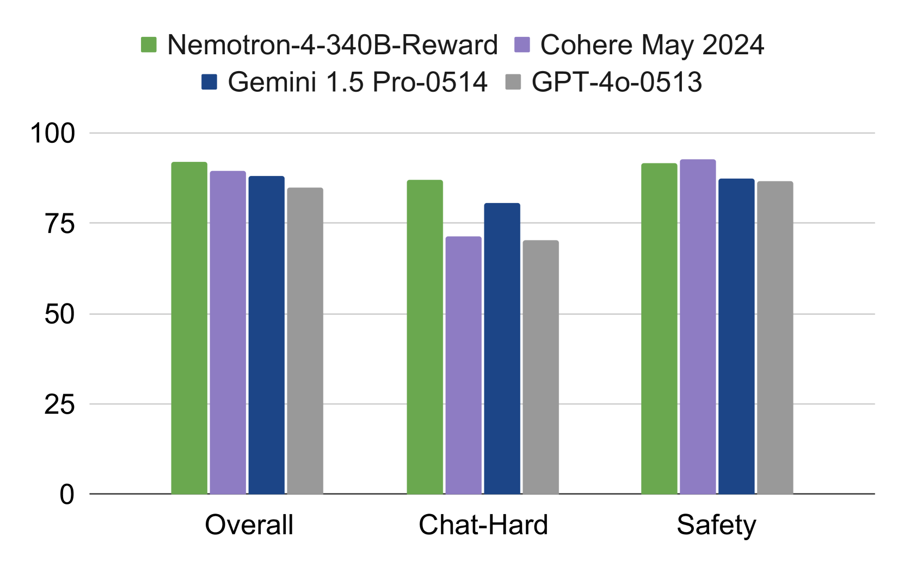
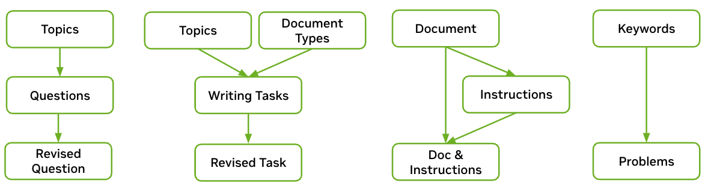
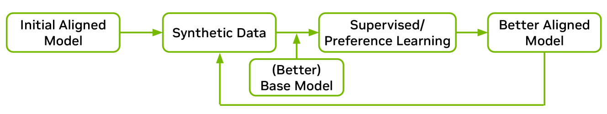

# Nemotron-4

## 📌 核心贡献

> 提出 Nemotron-4-340B 模型家族，其中 Nemotron-4-340B-Reward 采用多属性回归方式训练，在 RewardBench 上取得当时第一名（92.0%），并展示了利用奖励模型驱动合成数据生成的闭环 pipeline，实现了超过 98% 对齐数据由合成生成的范式。

## 📖 摘要

We release the Nemotron-4 340B model family, including Nemotron-4-340B-Base, Nemotron-4-340B-Instruct, and Nemotron-4-340B-Reward. Our models are open access under the NVIDIA Open Model License Agreement, a permissive model license that allows distribution, modification, and use of the models and its outputs. These models perform competitively to open access models on a wide range of evaluation benchmarks, and were sized to fit on a single DGX H100 with 8 GPUs when deployed in FP8 precision. We believe that the community can benefit from these models in various research studies and commercial applications, especially for generating synthetic data to train smaller language models. Notably, over 98% of data used in our model alignment process is synthetically generated, showcasing the effectiveness of these models in generating synthetic data. To further support open research and facilitate model development, we are also open-sourcing the synthetic data generation pipeline used in our model alignment process.

## 🔍 关键信息

| 字段 | 内容 |
|------|------|
| 机构 | NVIDIA |
| 发表 | 2024-06-17 |
| 分类 | cs.CL, cs.AI, cs.LG |
| 链接 | [arXiv](https://arxiv.org/abs/2406.11704) |

## 📝 我的笔记

本笔记聚焦于 Nemotron-4-340B-Reward 奖励模型及其在合成数据 pipeline 中的应用。

### 方法总览

### 动机与问题定义

传统 LLM 对齐依赖大量人工标注的偏好数据，成本高昂且难以规模化。Nemotron-4 的核心思路是：

1. 训练一个高质量的奖励模型（Nemotron-4-340B-Reward）
2. 用该奖励模型替代人工标注，驱动合成偏好数据的生成
3. 用合成数据完成后续模型的对齐训练

最终实现了**超过 98% 的对齐数据由合成方式生成**，大幅降低人工标注依赖。

### Nemotron-4-340B-Reward 架构

- **基座模型**：Nemotron-4-340B-Base（340B 参数的 decoder-only 模型）
- **架构改造**：移除最终的 softmax 层，替换为一个线性回归头（regression head），将最后一层 hidden states 映射到 5 维向量
- **5 维属性**：Helpfulness（有用性）、Correctness（正确性）、Coherence（连贯性）、Complexity（复杂度）、Verbosity（冗余度）
- **最终奖励**：5 个属性的加权和

### HelpSteer2 数据集

| 字段 | 内容 |
|------|------|
| 数据量 | 10,000 条人工标注样本 |
| 标注维度 | 5 维属性评分（Helpfulness, Correctness, Coherence, Complexity, Verbosity） |
| 来源 | 延续 HelpSteer 的标注方法论 |
| 开源 | 已在 Hugging Face 公开 |

### 多属性回归训练

与主流的 pairwise ranking（如 Bradley-Terry 模型）不同，Nemotron-4-340B-Reward 采用**多属性回归**（multi-attribute regression）方式训练：

- **输入**：一条 prompt + response 对
- **输出**：5 个属性的连续分数
- **优势**：相比 pairwise ranking，回归方式能更好地区分真正的有用性与长度偏差（length bias）等伪相关信号
- **最终奖励计算**：5 个属性分数的加权求和

### RewardBench 结果

Nemotron-4-340B-Reward 在发布时取得 RewardBench 排行榜第一名：

| 类别 | 准确率 |
|------|--------|
| Chat | 95.8% |
| Chat Hard | 87.1% |
| Safety | 91.5% |
| Reasoning | 93.7% |
| **Overall** | **92.0%** |

对比其他模型：
- GPT-4o-0513: 84.7%
- Gemini 1.5 Pro: 88.1%

### 合成数据生成 Pipeline

奖励模型在合成数据 pipeline 中扮演三重角色：

1. **质量过滤（Quality Filtering）**：评估生成对话的质量，低于阈值的样本被剔除
2. **偏好排序（Preference Ranking）**：采用 "Reward-Model-as-Judge" 方式，对 response pair 进行打分，高分为 chosen、低分为 rejected，生成偏好数据
3. **数据筛选（Data Curation）**：在无 ground truth 的场景下，仅保留 chosen response 质量足够高的样本

关键发现：**Reward-Model-as-Judge 的准确率高于 LLM-as-Judge**，尤其在 Chat Hard 类别上（0.87 vs 0.54），说明专门训练的奖励模型在偏好判断上优于通用 LLM。

### 迭代式弱到强对齐（Iterative Weak-to-Strong Alignment）

整个 pipeline 是一个迭代增强的过程：

1. **初始化**：用 Mixtral-8x7B-Instruct 生成初始合成数据
2. **对齐训练**：用合成数据训练中间版本的基座模型（340B-Interm-1-Base 等）
3. **质量评估**：Nemotron-4-340B-Reward 对生成的 response 进行质量评估
4. **数据迭代**：改进后的中间模型生成更高质量的 response，进入下一轮迭代
5. **教师-学生动态**：更强的对齐模型生成更好的数据 -> 更好的数据训练更强的基座模型 -> 循环增强

这一闭环流程的核心洞见是：奖励模型作为"质量锚"，确保每一轮迭代中数据质量持续提升，最终实现了从弱模型（Mixtral-8x7B）到强模型（Nemotron-4-340B-Instruct）的跃迁。

### 关键结论与思考

- **多属性回归 vs Pairwise Ranking**：论文认为回归方式更能捕捉细粒度的有用性差异，避免 length bias 等伪信号。这一设计后来被多个后续工作借鉴。
- **RM-as-Judge 优于 LLM-as-Judge**：专门训练的奖励模型在偏好判断任务上比通用 LLM 更准确，特别是在困难样本（Chat Hard）上优势明显。
- **合成数据闭环**：98% 以上数据合成生成的成功实践，证明了高质量奖励模型可以大幅降低人工标注需求。
- **规模效应**：340B 参数的奖励模型体现了规模对判别能力的重要性——更大的模型能更好地区分微妙的质量差异。
- **局限性**：论文缺少系统的 ablation 研究，如不同属性权重的影响、不同规模奖励模型的对比等，这些留待后续工作探索。

## 🔗 相关论文

**基于/改进自：** [[InstructGPT]]

**同方向：** [[RM-Survey]]
