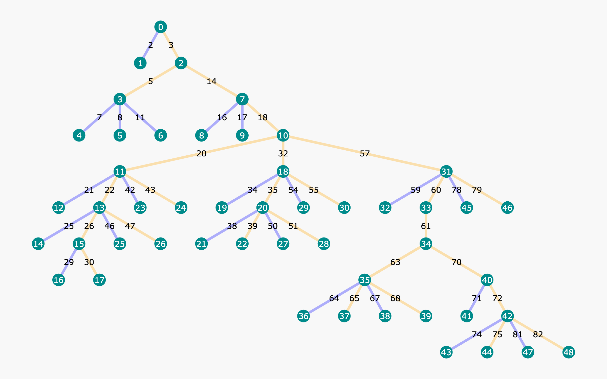
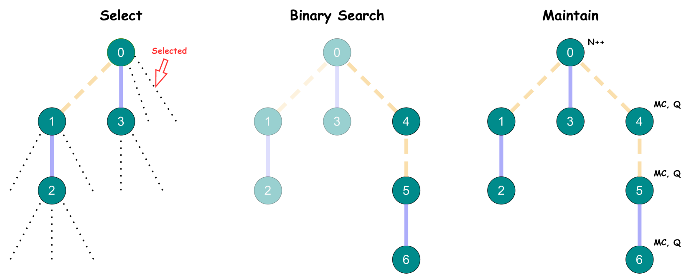
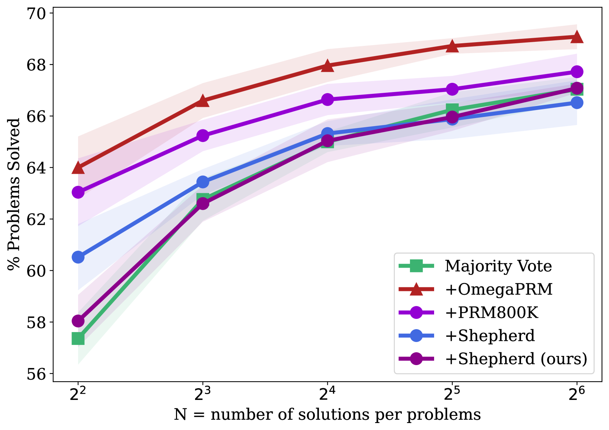

# OmegaPRM

## 📌 核心贡献

> 提出基于蒙特卡洛树搜索（MCTS）的分治算法 OmegaPRM，通过二分搜索高效定位推理链中首个错误步骤，实现全自动过程监督数据收集，效率较暴力蒙特卡洛方法提升 75 倍，在 MATH 和 GSM8K 上显著提升 LLM 数学推理能力。

## 📖 摘要

Complex multi-step reasoning tasks, such as solving mathematical problems or generating code, remain a significant hurdle for even the most advanced large language models (LLMs). Verifying LLM outputs with an Outcome Reward Model (ORM) is a standard inference-time technique aimed at enhancing the reasoning performance of LLMs. However, this still proves insufficient for reasoning tasks with a lengthy or multi-hop reasoning chain, where the intermediate outcomes are neither properly rewarded nor penalized. Process supervision addresses this limitation by assigning intermediate rewards during the reasoning process. To date, the methods used to collect process supervision data have relied on either human annotation or per-step Monte Carlo estimation, both prohibitively expensive to scale, thus hindering the broad application of this technique. In response to this challenge, we propose a novel divide-and-conquer style Monte Carlo Tree Search (MCTS) algorithm named OmegaPRM for the efficient collection of high-quality process supervision data. This algorithm swiftly identifies the first error in the Chain of Thought (CoT) with binary search and balances the positive and negative examples, thereby ensuring both efficiency and quality. As a result, we are able to collect over 1.5 million process supervision annotations to train Process Reward Models (PRMs). This fully automated process supervision alongside the weighted self-consistency algorithm is able to enhance LLMs' math reasoning performances. We improved the success rates of the instruction-tuned Gemini Pro model from 51% to 69.4% on MATH500 and from 86.4% to 93.6% on GSM8K. Similarly, we boosted the success rates of Gemma2 27B from 42.3% to 58.2% on MATH500 and from 74.0% to 92.2% on GSM8K. The entire process operates without any human intervention or supervision, making our method both financially and computationally scalable.

## 🔍 关键信息

| 字段 | 内容 |
|------|------|
| 机构 | Google DeepMind |
| 发表 | 2024-06-05 |
| 分类 | cs.CL, cs.LG |
| 链接 | [arXiv](https://arxiv.org/abs/2406.06592) |

## 📝 我的笔记

### 动机与问题定义

过程奖励模型（PRM）通过对推理链中每一步提供中间奖励信号，能有效提升 LLM 在数学推理等复杂任务上的表现。然而，现有的过程监督数据收集方法存在严重的效率瓶颈：

- **人工标注**（如 [[PRM800K]]）：成本高昂，难以规模化
- **逐步蒙特卡洛估计**（如 [[Math-Shepherd]]）：对解答中每一步都需要 $k$ 次 rollout，总计算量为 $O(k \cdot M)$（$M$ 为步骤数），效率低下

核心问题：如何在无人工干预的情况下，高效、大规模地收集高质量过程监督数据？

### 方法总览

OmegaPRM 的核心思想是将蒙特卡洛树搜索（MCTS）与二分搜索结合，实现分治式的过程监督数据收集。

#### 1. 二分搜索定位首个错误

传统方法对每一步都做蒙特卡洛估计，复杂度为 $O(k \cdot M)$。OmegaPRM 通过二分搜索将复杂度降至 $O(k \cdot \log M)$：

- 将解答在中点 $m$ 处分割
- 对前缀 $x_{1:m}$ 进行 $k$ 次 rollout，统计正确完成数 $c_m$
- 若 $c_m > 0$（前缀仍可能正确），则错误在后半段
- 若 $c_m = 0$（前缀已经无法导出正确答案），则错误在前半段
- 迭代直到定位到单步精度

#### 2. MCTS 树结构

每个节点 $s$ 包含：
- 问题 $q$ 和前缀解答 $x_{1:t}$
- 历史 rollout 集合 $\{(s, r_i)\}$
- 统计量：访问次数 $N(s)$、蒙特卡洛估计值 $MC(s)$、状态-rollout 价值函数 $Q(s, r)$

#### 3. Rollout 选择策略

关键的 $Q$ 值计算公式：

$$Q(s, r) = \alpha^{1 - MC(s)} \cdot \beta^{\text{len}(r)/L}$$

其中 $\alpha, \beta \in (0, 1]$，$L > 0$ 为超参数。该公式的设计意图：
- $\alpha^{1-MC(s)}$：优先选择 $MC(s)$ 高（本应正确）但实际产生了错误答案的 rollout，这些"出乎意料的错误"最有价值
- $\beta^{\text{len}(r)/L}$：偏好较短的 rollout，提高搜索效率

节点选择使用 PUCT 变体：

$$(\hat{s}, \hat{r}) = \arg\max \left[ Q(s, r) + U(s) \right]$$

$$U(s) = c_{\text{puct}} \cdot \frac{\sqrt{\sum_i N(s_i)}}{1 + N(s)}$$

#### 4. 算法流程

1. **Select**：从候选池中选择满足 $0 < MC(s) < 1$ 的 rollout
2. **Binary Search**：对选中 rollout 执行二分搜索，定位首个错误
3. **Maintain**：更新 $N(s)$、$MC(s)$、$Q(s, r)$ 等统计量
4. **重复**：直到达到搜索上限或候选池耗尽

### PRM 训练

#### 训练目标对比

论文评估了三种训练目标：

**Pointwise 软标签（最优）：**

$$\mathcal{L}_{\text{pointwise}} = \sum \left[ \hat{y}_i \log(y_i) + (1 - \hat{y}_i) \log(1 - y_i) \right]$$

其中 $\hat{y} = MC(s)$（连续标签），$y = \text{PRM}(s, a)$。

**Pointwise 硬标签：** $\hat{y} = \mathbf{1}[MC(s) > 0]$（二值化）

**Pairwise 损失：** 基于 Bradley-Terry 模型的偏好排序

#### 步骤划分策略

与基于换行符的规则划分不同，OmegaPRM 将解答中"任意连续 token 序列"视为合法步骤，通过二分搜索自然产生约 16 段的划分，步长分布与规则方法相似但更灵活。

### 关键结果

#### 数据生成配置

- 数据集：MATH 训练集（12K 问题）
- 搜索上限：每个问题 100 次迭代
- 每次蒙特卡洛估计：$k = 8$ 次 rollout
- 超参数：$\alpha = 0.5$，$\beta = 0.9$，$L = 500$，$c_{\text{puct}} = 0.125$
- 最终生成 150 万条过程监督标注

#### 效率提升

相同计算预算下，OmegaPRM 生成 **1500 万** 条数据点，而暴力蒙特卡洛方法仅产出 **20 万** 条，效率提升约 **75 倍**。最终下采样至 150 万条用于训练。

#### 主要性能对比

| 模型 | 数据集 | 基线 | + OmegaPRM PRM |
|------|--------|------|----------------|
| Gemini Pro | MATH500 | 51.0% | 69.4% |
| Gemini Pro | GSM8K | 86.4% | 93.6% |
| Gemma2 27B | MATH500 | 42.3% | 58.2% |
| Gemma2 27B | GSM8K | 74.0% | 92.2% |

关键发现：其他 PRM 的性能随采样数增加逐渐收敛至多数投票基线，而 OmegaPRM 训练的 PRM 持续保持显著优势。

#### PRM 训练目标消融

| 训练方式 | PRM 准确率 |
|----------|-----------|
| Soft Label（软标签） | 70.1% |
| Hard Label（硬标签） | 63.3% |
| Pairwise（配对） | 64.2% |

软标签显著优于硬标签和配对方式，说明连续的蒙特卡洛估计值比二值化标签包含更丰富的监督信号。

### 总结与评价

**优点：**
- 75 倍效率提升是显著的工程贡献，使大规模 PRM 数据收集变得可行
- 二分搜索 + MCTS 的结合很优雅，既高效又能平衡正负样本
- 全自动流程，无需人工标注，可扩展性强
- 软标签训练目标的发现对 PRM 训练有指导意义

**局限：**
- 需要问题的标准答案（golden answer），限制了在开放域任务上的应用
- 自动标注不可避免地引入假正例和假负例噪声
- 仅在数学推理任务上验证，对代码生成等其他推理任务的泛化性待验证

## 🔗 相关论文

**基于/改进自：** [[PRM800K]], [[Math-Shepherd]]

**同方向：** [[PRM800K]], [[Math-Shepherd]]
