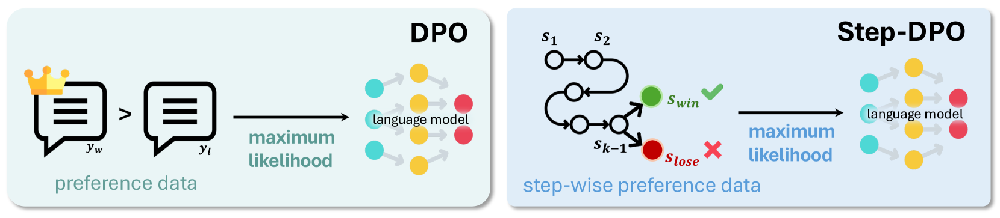
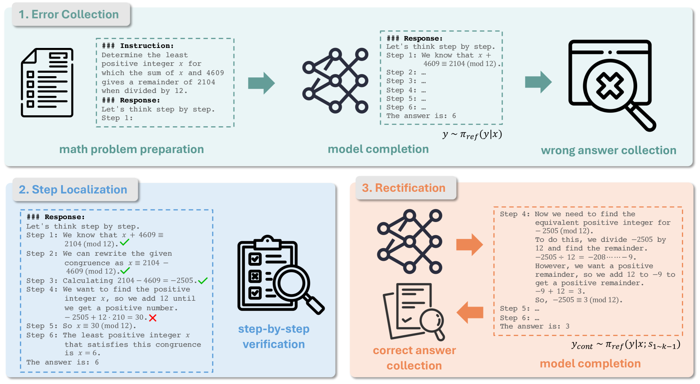
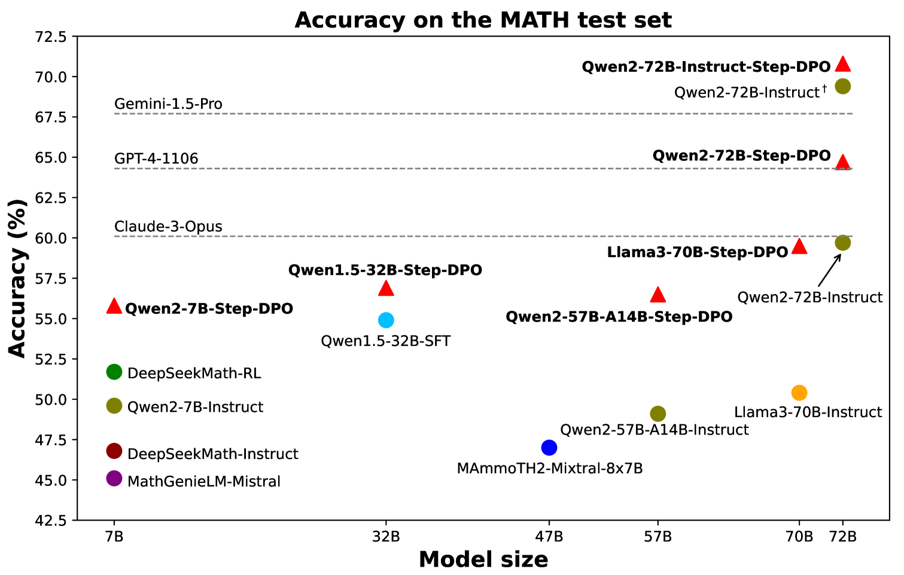

# Step-DPO

## 📌 核心贡献

> 提出 Step-DPO，将偏好优化从整体回复级别细化到单个推理步骤级别，仅用 10K 步骤级偏好对即可将 Qwen2-72B-Instruct 在 MATH 上提升至 70.8%，超越 GPT-4-1106。

## 📖 摘要

Mathematical reasoning presents a significant challenge for Large Language Models (LLMs) due to the extensive and precise chain of reasoning required for accuracy. Existing approaches either depend on pre-built datasets or require substantial computational resources to generate supervision signals. In this work, we introduce Step-DPO, which applies preference optimization to individual reasoning steps rather than complete answers. We also develop a data construction pipeline that can be applied to any existing dataset without the need for extra annotation from humans or GPT-4. We find that as few as 10K step-wise preference pairs suffice for gains, and that self-generated data is more effective than data generated by humans or GPT-4. The method achieves 70.8% and 94.0% on the test sets of MATH and GSM8K, respectively, outperforming GPT-4-1106, Claude-3-Opus, and Gemini-1.5-Pro when applied to Qwen2-72B-Instruct.

## 🔍 关键信息

| 字段 | 内容 |
|------|------|
| 机构 | CUHK |
| 发表 | 2024-06-26 |
| 分类 | cs.LG, cs.AI, cs.CL |
| 链接 | [arXiv](https://arxiv.org/abs/2406.18629) |

## 📝 我的笔记

### 方法总览

### 动机与问题定义

数学推理需要长链条、精确的逐步推导，标准 DPO 对整个回答进行偏好优化，无法精确定位错误步骤。Step-DPO 将优化粒度细化到单步，让模型在第一个出错步骤处学习正确和错误的区别。

### 方法细节

**步骤级偏好优化：**

与标准 DPO 比较完整回复 $p(y_{win}|x)$ vs $p(y_{lose}|x)$ 不同，Step-DPO 聚焦于第一个错误步骤，优化：

$$p(s_{win}|x; s_1 \ldots s_{k-1}) \quad \text{vs} \quad p(s_{lose}|x; s_1 \ldots s_{k-1})$$

损失函数与 DPO 结构相同（sigmoid 偏好损失），但应用于步骤级别，由参数 $\beta$ 控制与参考模型的偏离程度。

**数据构建流程（3 阶段）：**

1. **错误收集**：用 CoT 提示生成模型输出，选择最终答案错误的样本
2. **步骤定位**：通过验证识别第一个出错的推理步骤
3. **修正生成**：从正确前缀步骤开始采样多个续写，选择成功轨迹作为偏好步骤

**关键发现：** 自生成的同分布数据（in-distribution）优于人类/GPT-4 修正的数据，因为与参考模型的概率分布更匹配。

### 关键结果

**MATH & GSM8K 性能：**

| 模型 | 规模 | MATH (%) | GSM8K (%) |
|------|------|----------|-----------|
| Qwen2-72B-Instruct | 72B | 69.4 | 92.4 |
| + Step-DPO | 72B | **70.8 (+1.4)** | **94.0 (+1.6)** |
| GPT-4-1106 | — | 64.3 | 91.4 |
| Claude-3-Opus | — | 60.1 | 95.0 |

**DPO vs Step-DPO（5K 数据）：**

| 模型 | DPO | Step-DPO |
|------|-----|----------|
| Qwen2-7B | 55.0% | 55.8% |
| Qwen2-72B | 62.5% | 64.1% |

**同分布 vs 异分布数据：**

| 数据来源 | MATH (%) |
|---------|----------|
| GPT-4 修正（异分布） | 55.1% |
| 自生成（同分布） | **55.8%** |

### 总结评价

Step-DPO 的设计非常直觉：数学推理中错误往往源于某个特定步骤，对整个回答做偏好优化是粗粒度的。步骤级优化更精准，且所需数据量极少（10K 即可见效）。自生成数据优于 GPT-4 修正数据这一发现也很重要，说明参考模型的分布一致性比数据质量更关键。

## 🔗 相关论文

**同方向：** [[PRM800K]], [[DPO]], [[Math-Shepherd]]
