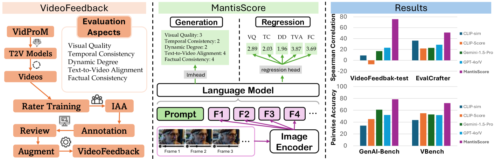
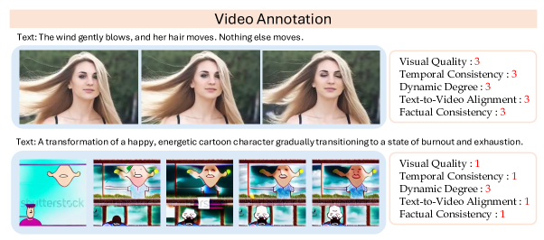

# VideoScore

## 📌 核心贡献

> 构建首个大规模多维度视频生成人工标注数据集 VideoFeedback（37.6K 视频，覆盖 11 个生成模型），并在此基础上训练 VideoScore 评估模型，在视频偏好预测上 Spearman 相关性达 77.1，超越此前最佳指标约 50 个点。

## 📖 摘要

The development of text-to-video (T2V) generation models has been hindered by the lack of reliable automatic evaluation metrics. We introduce VideoFeedback, a large-scale dataset containing human-provided multi-aspect scores over 37.6K synthesized videos from 11 existing video generative models, with ratings across five fine-grained dimensions: Visual Quality, Temporal Consistency, Dynamic Degree, Text-to-Video Alignment, and Factual Consistency. We train VideoScore based on this dataset, achieving a Spearman correlation of 77.1 on VideoFeedback-test, beating the prior best metrics by about 50 points. VideoScore enables two key applications: tracking video generation model progress and simulating human feedback for RLHF video generation optimization.

## 🔍 关键信息

| 字段 | 内容 |
|------|------|
| 机构 | University of Waterloo |
| 发表 | 2024-06-21 |
| 分类 | cs.CV, cs.AI |
| 链接 | [arXiv](https://arxiv.org/abs/2406.15252) |

## 📝 我的笔记

### 方法总览

### 核心问题/动机

视频生成评估面临三大瓶颈：
1. **分布级指标局限**：FVD、IS 等无法评估单个视频输出
2. **维度覆盖不全**：多数指标仅关注视觉质量或文本对齐，忽略运动流畅性和事实一致性
3. **人类相关性差**：现有指标与人类偏好的相关性极低

### 方法

#### VideoFeedback 数据集构建

**视频来源**：
- 从 VidProM 筛选 31,600 个唯一 prompt（5-100 词，过滤 NSFW）
- 11 个 T2V 模型生成：Pika, Text2Video-Zero, VideoCrafter2, ModelScope, LaVie, AnimateDiff, LVDM, Hotshot-XL, ZeroScope, Fast-SVD, SORA-Clip
- 总计 33.6K 生成视频 + 4K 真实视频（DiDeMo, Panda70M）

**标注流程**：
- 20 名专家标注者，每人标注 1K-2K 视频
- 三分制（1=Bad, 2=Average, 3=Good），优质视频后标为 4=Perfect

**五个评估维度**：

| 维度 | 评估内容 |
|------|----------|
| Visual Quality | 清晰度、分辨率、亮度、色彩 |
| Temporal Consistency | 跨帧的物体/人物一致性 |
| Dynamic Degree | 动态变化程度 |
| Text-to-Video Alignment | Prompt 与视频的语义对应 |
| Factual Consistency | 与常识和物理规律的一致性 |

#### VideoScore 模型

**基座选择**：Mantis-Idefics2-8B（支持 128 帧，原始分辨率输入）

**两种评分方式**：
1. **生成式评分**：模型输出固定格式文本（如 "visual quality: 3"），正则提取
2. **回归式评分**（最终采用）：线性层替代语言头，输出 5 个 logits，MSE loss 训练

**训练配置**：学习率 1e-5，单 epoch，8×A100 (80G)，约 6 小时

### 关键结果

#### VideoFeedback-test 性能（Spearman ρ）

| 维度 | VideoScore (gen) | VideoScore (reg) | GPT-4o（最佳基线） |
|------|-----------------|-----------------|-------------------|
| Visual Quality | 86.2 | 84.7 | 35.2 |
| Temporal Consistency | 80.3 | 81.5 | 29.5 |
| Dynamic Degree | 77.6 | 68.4 | 38.0 |
| Text-to-Video Alignment | 59.4 | 59.5 | 26.6 |
| Factual Consistency | 82.1 | 84.6 | 32.4 |
| **平均** | **77.1** | **75.7** | **23.0** |

超越此前最佳方法（GPT-4o prompting）约 **54 个点**。

#### 跨 benchmark 泛化

| Benchmark | VideoScore (reg) | 最佳基线 | 提升 |
|-----------|-----------------|----------|------|
| GenAI-Bench | 78.5% | 67.1% (Gemini) | +11.4 |
| EvalCrafter (TA) | 59.5 | 40.7 (GPT-4o) | +18.8 |
| VBench 平均 | 73.0% | 64.8% | +8.2 |

#### Best-of-K 采样

Best-of-5 选择可显著提升生成模型质量，例如 HotShot-XL 平均分从 46.83 提升至 69.52。

### Ablation

| 基座模型 | 平均性能 |
|---------|---------|
| VideoLLaVA-7B | 42.7% |
| Idefics2-8B | 47.5% |
| Mantis-Idefics2-8B (gen) | 55.6% |
| Mantis-Idefics2-8B (reg) | **69.6%** |

回归式评分全面优于生成式，Mantis 多图/视频基座的选择至关重要。

### 总结

VideoScore 通过在大规模人工标注数据上微调多模态模型，实现了视频质量自动评估的重大突破。回归式评分比生成式更稳定可靠。该工作的核心价值在于 VideoFeedback 数据集本身——覆盖 11 个模型、37.6K 视频、五维度标注的规模在当时是前所未有的。但 4 分制评分粒度较粗，且数据来自 pre-Sora 时代模型，对现代高质量视频的区分力有限（VideoAlign 的 benchmark 中 VideoScore 仅 41.8%）。

## 🔗 相关论文

**同方向：** [[VisionReward]], [[VideoAlign]], [[LiFT]]
