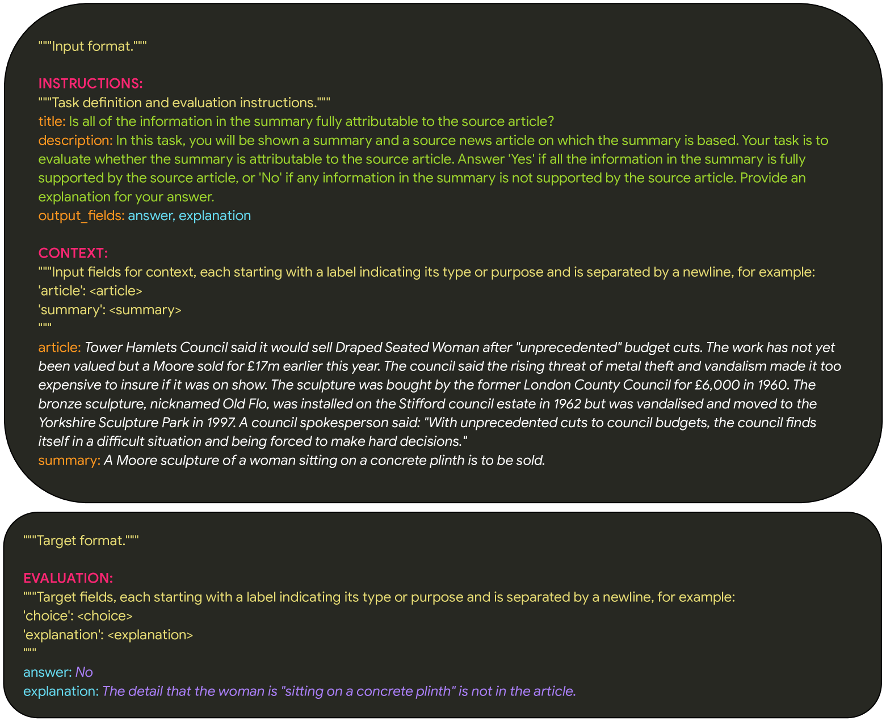
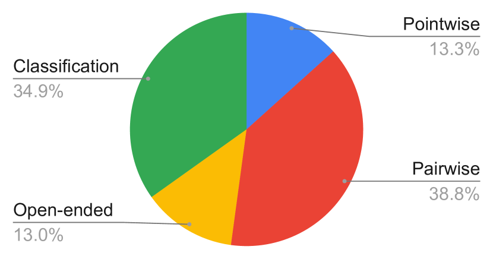
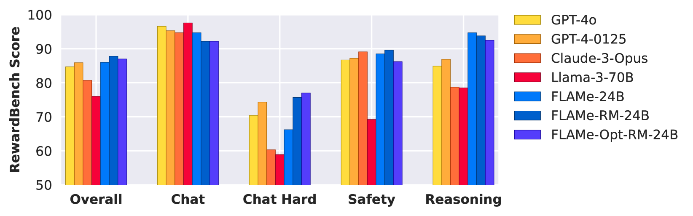

# FLAMe

## 📌 核心贡献

> 提出 FLAMe，首个基于 100+ 质量评估任务、5M+ 人类判断训练的基础自动评估模型，在 12 个评测基准中的 8 个上超越 GPT-4 等商用 LLM-as-Judge 模型，同时显著降低评估偏差。

## 📖 摘要

As large language models (LLMs) are increasingly used for evaluating the quality of generated text, there is a growing need for reliable and scalable autoraters. We introduce FLAMe, a family of Foundational Large Autorater Models, trained on a comprehensive collection of over 100 quality assessment tasks comprising 5M+ human judgments. FLAMe significantly improves generalization to a wide variety of held-out tasks, outperforming LLMs as judges such as GPT-4 and Claude-3 on many benchmarks. In particular, on RewardBench, FLAMe-RM-24B achieves an accuracy of 87.8%, surpassing GPT-4-0125 (85.9%) and GPT-4o (84.7%). On 8 out of 12 autorater evaluation benchmarks, FLAMe variants outperform all popular proprietary LLM-as-a-Judge models. FLAMe also demonstrates significantly lower bias compared to these models, as measured on the CoBBLEr autorater bias benchmark. We additionally present FLAMe-Opt-RM, an optimized reward model variant that achieves competitive performance using approximately 25 times fewer training datapoints compared to FLAMe, demonstrating efficient task-specific adaptation.

## 🔍 关键信息

| 字段 | 内容 |
|------|------|
| 机构 | Google DeepMind |
| 发表 | 2024-07-15 |
| 分类 | cs.CL, cs.AI, cs.LG |
| 链接 | [arXiv](https://arxiv.org/abs/2407.10817) |

## 📝 我的笔记

### 方法总览

### 动机与问题定义

LLM-as-Judge 已成为评估 LLM 输出质量的主流方法，但现有方案存在三个核心问题：

1. **商用模型受限**：GPT-4 等模型无法开放获取，且存在不透明性
2. **数据偏差风险**：使用模型生成数据训练评估器会放大偏差，且可能违反使用条款
3. **标准化缺失**：公开的人类评估数据分散且缺乏统一格式

FLAMe 的核心思路是：收集大规模、多样化的公开人类判断数据，训练通用的基础评估模型。

### 训练数据

- **102 个训练任务**，5.3M+ 人类标注判断
- **53 个留出评测任务**
- 全部来自公开许可的数据集（HuggingFace Datasets、TensorFlow Datasets、GitHub）
- 仅使用人类标注（排除 GPT-4 生成数据）

覆盖的 LLM 能力维度：

| 能力维度 | 代表数据集 |
|---------|-----------|
| 通用回复质量 | SummFeedback, LMSYS Arena, HelpSteer, WebGPT, SHP |
| 事实性/归因 | XSum, QAGS, WikiBio, FRANK, FactScore |
| 数学推理 | PRM800K |
| 代码 | Code Contests, CommitPack, COFFEE |
| 安全性 | HH RLHF, BeaverTails |
| 指令遵循 | LIMA, TULU-2 |

每个数据集需要 3-4 小时的标准化处理，包括文献调研、字段提取、任务定义撰写和格式转换。

### 统一格式设计

所有任务转化为统一的 text-to-text 格式，包含三个模块：

- **INSTRUCTIONS**：任务定义和评估指南
- **CONTEXT**：输入字段值
- **EVALUATION**：期望的人类判断目标

这种 T5 风格的统一格式使得不同异构任务之间能够有效迁移学习。

### 模型架构与训练

**基座模型**：PaLM-2-24B（经 Flan 集合指令微调）

三个模型变体：

| 变体 | 训练步数 | 特点 |
|------|---------|------|
| FLAMe | 30K 步 | 通用多任务训练，样本量比例混合（上限 $2^{16}$/任务） |
| FLAMe-RM | 50 步微调 | 在 FLAMe 基础上，用 HelpSteer+PRM800K+CommitPack+HH-RLHF 微调 |
| FLAMe-Opt-RM | 5K 步 | Tail-patch 消融策略，仅用 ~1/25 数据达到竞争力 |

### Tail-Patch 微调策略（FLAMe-Opt-RM）

一种高效的混合权重优化方法：

1. 选择部分训练的 checkpoint
2. 分别在每个单独任务上微调 3K 步
3. 按对 RewardBench 各类别的贡献将任务评级为：有帮助(+2)、部分有帮助(+1)、无影响(0)、有害(-1)
4. 组织为 bundle：通用型、类别特异型、其他
5. 分配固定权重：General=100K, Category-specific=30K, Others=3K

### 关键结果

#### RewardBench 结果

| 模型 | Overall | Chat | Chat Hard | Safety | Reasoning |
|------|---------|------|-----------|--------|-----------|
| FLAMe-24B | 86.0% | 94.7% | 66.2% | 88.5% | 94.7% |
| FLAMe-RM-24B | **87.8%** | 92.2% | 75.7% | 89.6% | 93.8% |
| FLAMe-Opt-RM-24B | 87.0% | 92.2% | 77.0% | 86.2% | 92.5% |
| GPT-4-0125 | 85.9% | 95.3% | 74.3% | 87.2% | 86.9% |
| GPT-4o | 84.7% | 96.6% | 70.4% | 86.7% | 84.9% |
| Gemini-1.5-Pro | 88.1% | 92.3% | 80.6% | 87.5% | 92.0% |

FLAMe-RM-24B 是 RewardBench 排行榜上使用开放许可数据的最佳生成式模型（截至 2024-07-15）。

#### LLM-AggreFact 事实性评估

| 模型 | Overall | LLM-FactVerify | Wiki-FactVerify | Summarization | Long-form QA |
|------|---------|----------------|-----------------|---------------|-------------|
| FLAMe-24B | **81.1%** | 82.3% | 77.7% | 85.3% | 72.7% |
| GPT-4-0125 | 80.6% | 79.6% | 71.6% | 85.3% | 77.3% |
| GPT-4o | 80.2% | 79.6% | 71.6% | 85.0% | 76.0% |

#### 偏差分析（CoBBLEr 基准）

| 模型 | 平均偏差 | 顺序偏差 | 同情偏差 | 长度偏差 |
|------|---------|---------|---------|---------|
| FLAMe-24B | **0.13** | 0.08 | 0.09 | 0.03 |
| GPT-4 | 0.31 | 0.23 | 0.79 | 0.06 |
| ChatGPT | 0.45 | - | - | - |

FLAMe 的评估偏差显著低于商用模型，尤其在顺序偏差和同情偏差上表现突出。

#### 代码生成 Best-of-N 重排序（HumanEval）

| 代码模型 | 无重排 | FLAMe-24B | Oracle |
|---------|--------|-----------|--------|
| CodeGen-16B | 21.2% | **31.1%** | 46.9% |
| davinci-002 | 17.6% | **22.6%** | 63.4% |
| InCoder-6B | 14.6% | **22.0%** | 29.3% |

FLAMe 将 CodeGen-16B 的 pass@1 从 21.2% 提升到 31.1%，弥补了 46% 的 Oracle 差距。

### 关键发现与总结

1. **大规模多任务训练有效**：在 100+ 人类评估任务上的多任务训练显著提升了对未见任务的泛化能力
2. **开放数据可以击败商用模型**：仅使用公开人类判断数据，FLAMe 在 12 个基准中的 8 个上超越 GPT-4 等商用模型
3. **高效微调**：FLAMe-RM 仅需 50 步微调即可在 RewardBench 上提升 1.8 个百分点
4. **数据效率**：FLAMe-Opt-RM 用 1/25 的训练数据达到竞争力性能，展示了 tail-patch 策略的有效性
5. **低偏差**：FLAMe 的评估偏差（0.13）仅为 GPT-4（0.31）的 42%
6. **对 LLM-as-Judge 范式的推动**：证明了构建开放、可复现的基础评估模型的可行性，为社区提供了重要的基线

## 🔗 相关论文

**同方向：** [[LLM-as-Judge-Survey]], [[RM-Survey]]
