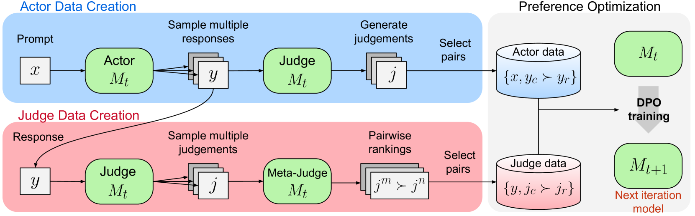
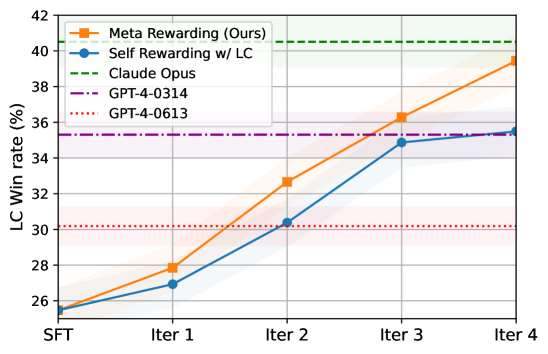

# Meta-Rewarding

## 📌 核心贡献

> 引入 Meta-Rewarding 步骤，让模型不仅评判自身回复，还评判自身的评判质量（元评判），从而突破自我奖励机制的迭代训练饱和问题，将 Llama-3-8B-Instruct 在 AlpacaEval 2 上从 22.9% 提升至 39.4%。

## 📖 摘要

Large Language Models (LLMs) are rapidly surpassing human knowledge in many domains. While improving these models traditionally relies on costly human data, recent self-rewarding mechanisms have shown that LLMs can improve by judging their own responses instead of relying on human labelers. However, existing methods have primarily focused on improving model responses rather than judgment capabilities, resulting in rapid saturation during iterative training. To address this issue, we introduce a novel Meta-Rewarding step to the self-improvement process, where the model judges its own judgements and uses that feedback to refine its judgment skills. Surprisingly, this unsupervised approach improves the model's ability to judge and follow instructions, as demonstrated by a win rate improvement of Llama-3-8B-Instruct from 22.9% to 39.4% on AlpacaEval 2, and 20.6% to 29.1% on Arena-Hard.

## 🔍 关键信息

| 字段 | 内容 |
|------|------|
| 机构 | Meta |
| 发表 | 2024-07-28 |
| 分类 | cs.CL, cs.AI |
| 链接 | [arXiv](https://arxiv.org/abs/2407.19594) |

## 📝 我的笔记

### 方法总览

### 动机与问题定义

Self-Rewarding 等自我改进方法主要提升模型回复质量，但判断能力（judge capability）未能同步提升，导致迭代训练快速饱和。Meta-Rewarding 通过引入"元评判"角色，让模型评判自身的评判质量，从而同时改进判断和生成能力。

### 方法细节

**三角色框架（单模型承担）：**
- **Actor**：对每个 prompt 生成 $K=7$ 个回复变体
- **Judge**：对每个回复生成 $N=11$ 个判断，使用 5 分制评分
- **Meta-Judge**：比较判断对，为 Judge 本身创建偏好训练数据

**长度控制机制：** 选择"最高质量层中最短的回复"而非纯粹最高分回复，使用参数 $\rho \in [0,1]$ 平衡分数与长度。

**训练方法：** 对 actor 偏好对和 judge 偏好对同时使用 DPO 训练。Meta-Judge 评估使用 Elo 评分，通过双 prompt 评估和加权评分（$\omega_1, \omega_2$）缓解位置偏差。

### 关键结果

| 基准 | 种子模型 | 迭代4 | 提升 |
|------|---------|------|------|
| AlpacaEval 2 (LC) | 22.92% | 39.44% | +16.52% |
| Arena-Hard | 20.6% | 29.1% | +8.5% |

**Judge 质量提升：**

| 指标 | 迭代1 | 迭代4 |
|------|------|------|
| GPT-4 Chosen Pairs 一致率 | 47.20% | 59.54% |
| Self-Chosen Pairs 一致率 | 66.99% | 79.33% |

相比 Self-Rewarding 基线，judge 一致率提升 +12.34%。

### 总结评价

Meta-Rewarding 的核心洞察非常优雅：现有自我改进方法只改进"回答"，不改进"评判"，而评判能力的饱和限制了整体提升。通过引入元评判，模型在无监督条件下同时改进了指令遵循和评判质量。这为 LLM 自我改进提供了新的递归改进维度。

## 🔗 相关论文

**同方向：** [[Self-Rewarding]], [[J1]]
