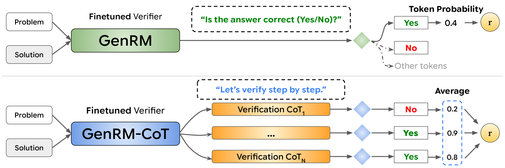
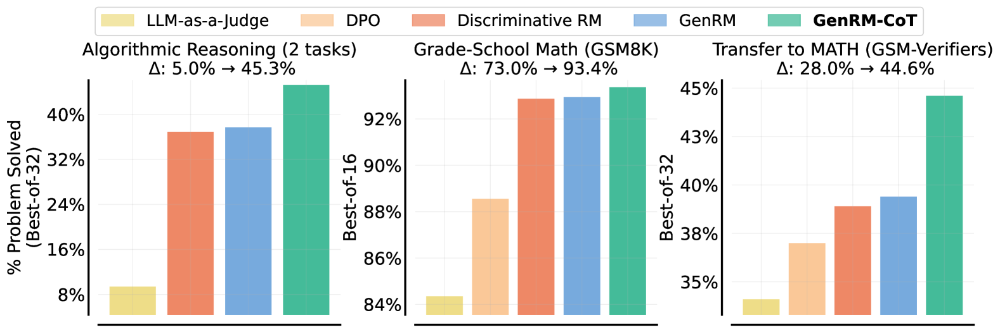
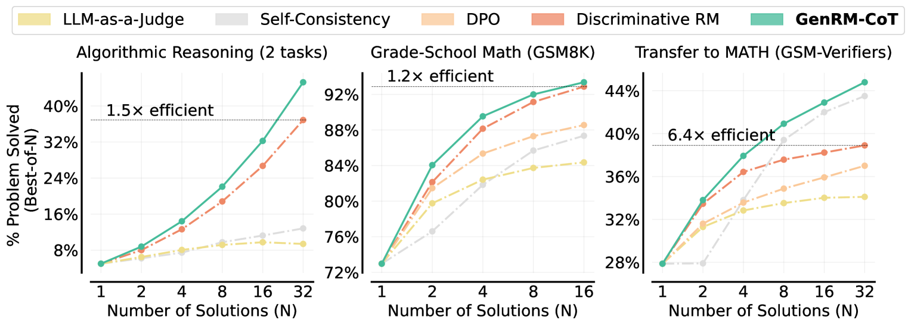

# GenRM

## 📌 核心贡献

> 提出将奖励模型/验证器训练从判别式分类转变为基于 next-token prediction 的生成式方法（GenRM），通过链式思维推理和多数投票机制，在数学推理任务上显著超越判别式奖励模型，尤其在 OOD 泛化场景表现突出。

## 📖 摘要

Verifiers or reward models are often used to enhance the reasoning performance of large language models (LLMs). A common approach is the Best-of-N method, where N candidate solutions generated by the LLM are ranked by a verifier, and the best one is selected. While LLM-based verifiers are typically trained as discriminative classifiers to score solutions, they do not utilize the text generation capabilities of pretrained LLMs. To overcome this limitation, we instead propose training verifiers using the ubiquitous next-token prediction objective, jointly on verification and solution generation. Compared to standard verifiers, such generative verifiers (GenRM) can benefit from several advantages of LLMs: they integrate seamlessly with instruction tuning, enable chain-of-thought reasoning, and can utilize additional test-time compute via majority voting for better verification. We demonstrate that GenRM outperforms discriminative, DPO verifiers, and LLM-as-a-Judge, resulting in large performance gains with Best-of-N, namely 5% → 45.3% on algorithmic tasks and 73% → 93.4% on GSM8K. In easy-to-hard generalization settings, we observe improvements of 28% → 44.6% on MATH, and 37.9% → 53.5% on MMLU abstract algebra. Furthermore, we find that training GenRM with synthetic verification rationales is sufficient to pick out subtle errors on math problems. Finally, we demonstrate that GenRM scales favorably with model size and test-time compute.

## 🔍 关键信息

| 字段 | 内容 |
|------|------|
| 机构 | Google DeepMind |
| 发表 | 2024-08-27 |
| 分类 | cs.LG |
| 链接 | [arXiv](https://arxiv.org/abs/2408.15240) |

## 📝 我的笔记

### 动机与问题定义

传统的验证器（reward model）通常以判别式分类方式训练，即在 LLM 输出层加一个标量分类头，预测解答的正确性。这种方式存在两个核心问题：

1. **未利用生成能力**：判别式 RM 仅利用 LLM 的表征能力，完全抛弃了预训练获得的文本生成能力
2. **OOD 泛化差**：判别式 RM 在分布外任务上表现显著下降，缺乏推理泛化能力

GenRM 的核心思路：将验证任务重新构造为 next-token prediction 问题，让 LLM 以生成方式进行验证，从而可以利用 CoT 推理来提升验证质量。

### 方法总览

#### 1. Direct Verifier (GenRM)

将验证构造为一个 Yes/No 问答任务：

$$r_{\text{Direct}}(x, y) = p_\theta(\text{Yes} \mid x, y, I)$$

其中 $I$ = "Is the answer correct (Yes/No)?"。模型输出 "Yes" 的概率即为验证分数。

#### 2. 统一生成-验证训练

关键创新之一是将验证和解答生成统一到同一个 SFT 目标中：

$$\mathcal{L}_{\text{GenRM}}(\theta, \mathcal{D}_{\text{verify}}) = \mathcal{L}_{\text{SFT}}(\theta, \mathcal{D}_{\text{verify}}) + \lambda \cdot \mathcal{L}_{\text{SFT}}(\theta, \mathcal{D}_{\text{correct}})$$

其中 $\lambda$ 控制生成任务的权重。实验表明，联合训练对验证和生成都有正向提升（正迁移效应）。

#### 3. Chain-of-Thought Verifier (GenRM-CoT)

最强变体，在给出 Yes/No 判断前先生成推理过程：

$$r_{\text{CoT}}(x, y) = p_\theta(\text{Yes} \mid x, y, I_{\text{CoT}}, v_{\text{CoT}}, I)$$

其中 $v_{\text{CoT}}$ 是模型生成的验证推理链（prompt: "Let's verify step by step"）。

进一步支持**多数投票**以利用更多 test-time compute：

$$r_{\text{MajV}@K}(x, y) = \frac{1}{K} \sum_{i=1}^{K} p_\theta(\text{Yes} \mid x, y, I_{\text{CoT}}, v_{\text{CoT}}^{(i)}, I)$$

#### 合成验证 Rationale 的生成

- 使用 Gemini 1.0 Pro 生成 reference-guided 验证 rationale
- 训练时提供参考答案（特权信息），测试时不使用
- 通过过滤确保 rationale 与最终验证判断一致

### 关键结果

#### Best-of-N 性能对比

| 任务 | Disc-RM | DPO | LLM-Judge | GenRM | GenRM-CoT |
|------|---------|-----|-----------|-------|-----------|
| 算法任务 (Best-of-32) | ~5% | - | - | - | 45.3% |
| GSM8K (Best-of-32) | 73% | - | - | - | 93.4% |
| MATH500 (Easy-to-Hard) | 28% | - | - | - | 44.6% |
| MMLU Abstract Algebra | 37.9% | - | - | - | 53.5% |

#### Easy-to-Hard 泛化（MMLU 数学子集）

| 任务 | Base | Disc-RM | GenRM-CoT | 提升 |
|------|------|---------|-----------|------|
| Elementary Math | 80.1% | 90.6% | 91.1% | +0.5% |
| High School Math | 52.2% | 74.8% | 76.1% | +1.3% |
| College Math | 47.6% | 53.0% | 56.1% | +3.1% |
| Abstract Algebra | 37.9% | 50.0% | 53.5% | +3.5% |

**关键发现**：任务难度越高（越 OOD），GenRM-CoT 相对优势越大。

### 采样效率与缩放

- **采样效率**：GenRM-CoT 用 Best-of-5 即可匹配 Disc-RM 的 Best-of-32 性能（6.4x 效率提升）
- **模型缩放**：在 2B、7B、9B 三个尺度上，GenRM-CoT 均优于判别式方法
- **推理时计算**：多数投票（K=32）带来持续提升，GenRM-CoT 可以有效利用额外 test-time compute
- **加权自洽性**：GenRM-CoT 结合 self-consistency 后仅需 2.5x 更少的候选解

### Ablation 分析

- **统一训练的增益**：在正确解答上做 SFT（$\lambda > 0$）对验证性能有正向促进，体现了生成与验证之间的正迁移
- **合成 Rationale 质量**：reference-guided 生成比无引导生成提升约 4%（91.7% vs 87.8% on GSM8K）
- **合成 Rationale 数量**：每个解答的 rationale 数量增加时性能提升，约 8 条后趋于饱和
- **过多生成数据的负面效应**：$\lambda$ 过大会降低验证性能，需要合适的平衡

### 总结与评价

**优势：**
- 将 RM 训练统一到 next-token prediction 框架中，优雅且实用
- CoT 推理让验证器具备了"解释为什么错"的能力，而不仅仅是给分
- Test-time compute scaling 为验证器提供了类似 self-consistency 的扩展路径
- OOD 泛化能力显著优于判别式方法

**局限：**
- 实验仅限于数学/算法推理任务，尚未验证在对齐、代码等领域的效果
- 合成 rationale 依赖较强的教师模型（Gemini 1.0 Pro）
- 多数投票增加推理成本

**影响：** 这篇工作为后续 thinking reward model（如 [[J1]]、[[Self-Rewarding]]）铺平了道路，证明了 RM 可以像 LLM 一样通过 CoT 推理来提升判断质量，是 reward modeling 从判别范式走向生成范式的关键工作。

## 🔗 相关论文

**同方向：** [[RewardDance]], [[J1]], [[Self-Rewarding]]
