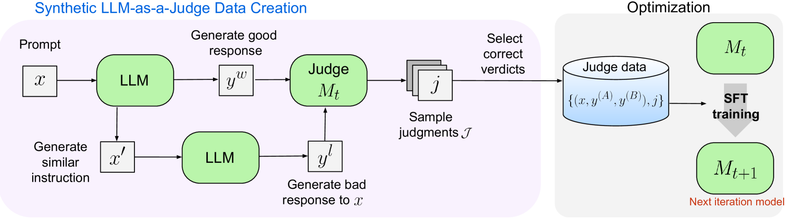

# Self-Taught-Evaluators

## 📌 核心贡献

> 提出无需人类标注的迭代自我改进方案，仅用合成数据训练 LLM-as-a-Judge，将 Llama3-70B-Instruct 在 RewardBench 上从 75.4 提升到 88.3，匹配最优有标注奖励模型。

## 📖 摘要

Model-based evaluation is at the heart of successful model development -- as a reward model for training, and as a replacement for human evaluation. To train such evaluators, the standard approach is to collect a large amount of human preference judgments over model responses, which is costly and the data becomes stale as models improve. In this work, we present an approach that aims to improve evaluators without human annotations, using synthetic training data only. Starting from unlabeled instructions, our iterative self-improvement scheme generates contrasting model outputs and trains an LLM-as-a-Judge to produce reasoning traces and final judgments, repeating this training at each new iteration using the improved predictions. Without any labeled preference data, our Self-Taught Evaluator can improve a strong LLM (Llama3-70B-Instruct) from 75.4 to 88.3 (88.7 with majority vote) on RewardBench. This outperforms commonly used LLM judges such as GPT-4 and matches the performance of the top-performing reward models trained with labeled examples.

## 🔍 关键信息

| 字段 | 内容 |
|------|------|
| 机构 | Meta |
| 发表 | 2024-08-05 |
| 分类 | cs.CL, cs.AI |
| 链接 | [arXiv](https://arxiv.org/abs/2408.02666) |

## 📝 我的笔记

### 方法总览

### 动机与问题定义

训练评估模型通常需要大量人类偏好标注，成本高且数据会随模型进步而过时。本文提出完全无需人类标注的自我改进方案，仅用合成数据即可训练出强大的评估器。

### 方法细节

**合成偏好对生成：**

核心创新在于对比样本的构造方式：(1) 对原始指令生成一个语义不同的修改指令；(2) 对修改指令生成高质量回复，该回复对原始指令自然成为低质量回复。这比直接采样负例更可靠。

**迭代训练流程：**
1. 对每个样本采样 $N=15$ 个判断，通过拒绝采样保留正确判断
2. 仅对判断生成部分计算损失（非完整回复）
3. 重复 5 轮迭代，每轮从种子模型重新初始化

**训练细节：**
- 基座模型：Llama3-70B-Instruct
- 精度：bfloat16，8 路张量并行
- 学习率：1.0e-06

### 关键结果

| 基准 | 种子模型 | 迭代5 | +多数投票 |
|------|---------|-------|---------|
| RewardBench | 75.4 | 88.3 | 88.7 |
| MT-Bench | 77.8 | 78.9 | 79.5 |
| HelpSteer2 Avg | 65.5 | 71.0 | — |

**RewardBench 分类细节（迭代5）：**

| Chat | Chat Hard | Safety | Reasoning |
|------|-----------|--------|-----------|
| 96.6 | 84.2 | 91.5 | 81.0 |

### 总结评价

这项工作展示了无监督评估器训练的巨大潜力。关键在于巧妙的合成偏好对构造方法——通过修改指令而非直接采样负例来生成对比样本。5 轮迭代即可匹配最优有标注模型，且超越 GPT-4 作为评估器的表现。该方法为降低人类标注依赖提供了有效路径。

## 🔗 相关论文

**同方向：** [[Self-Rewarding]], [[GenRM]]
