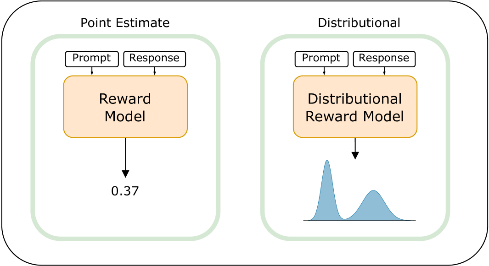
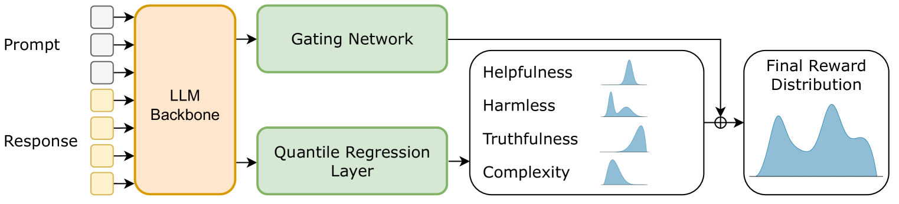

# QRM

## 📌 核心贡献

> 提出分位数奖励模型（QRM），通过分位数回归学习奖励分布而非点估计，能更好地捕捉人类偏好多样性，并支持风险感知强化学习以减少极端负面响应。

## 📖 摘要

Reinforcement learning from human feedback (RLHF) has become a key method for aligning large language models (LLMs) with human preferences through the use of reward models. However, traditional reward models typically generate point estimates, which oversimplify the diversity and complexity of human values and preferences. In this paper, we introduce Quantile Reward Models (QRMs), a novel approach to reward modeling that learns a distribution over rewards instead of a single scalar value. Our method uses quantile regression to estimate a full, potentially multimodal distribution over preferences, providing a more powerful and nuanced representation of preferences. This distributional approach can better capture the diversity of human values, addresses label noise, and accommodates conflicting preferences by modeling them as distinct modes in the distribution. Our experimental results show that QRM outperforms comparable traditional point-estimate models on RewardBench. Furthermore, we demonstrate that the additional information provided by the distributional estimates can be utilized in downstream applications, such as risk-aware reinforcement learning, resulting in LLM policies that generate fewer extremely negative responses.

## 🔍 关键信息

| 字段 | 内容 |
|------|------|
| 机构 | Independent |
| 发表 | 2024-09-16 |
| 分类 | cs.LG, cs.AI, cs.CL |
| 链接 | [arXiv](https://arxiv.org/abs/2409.10164) |

## 📝 我的笔记

### 方法总览

### 动机与问题

传统奖励模型输出单一标量值，过度简化了人类偏好的多样性和复杂性。面对以下挑战：
- 标注噪声：不同标注者对同一对比可能给出相反偏好
- 偏好冲突：同一输入可能存在多个合理但相互矛盾的偏好
- 风险控制：点估计无法区分"平均好"和"稳定好"

### 核心方法

**两阶段架构（基于冻结 LLaMA-3 8B）：**

**阶段一：分位数回归**
- 19 个属性（helpfulness、harmlessness 等）各训练独立的线性分位数回归模型
- 估计 $K=19$ 个均匀分布的分位数（0.05 到 0.95）
- 使用非对称损失函数进行训练，L1 正则化系数 0.003
- 每个属性 60,000 个数据点

**阶段二：门控网络**
- 3 层 MLP + softmax 输出
- 使用 Bradley-Terry 损失在偏好数据上训练
- 将混合分布的期望值作为奖励信号
- AdamW 优化器，学习率 0.0003，batch size 1024，3 epochs

**风险感知 RLHF：**

使用凹效用函数强调惩罚低质量响应：

$$\text{Utility} = \mathbb{E}_{r \sim \mathcal{P}}[-e^{-\lambda r}]$$

其中 $\lambda$ 控制对低奖励区域的重视程度。

### 关键结果

| 模型 | RewardBench 总分 | Chat | Chat Hard | Safety | Reasoning |
|------|-----------------|------|-----------|--------|-----------|
| QRM (LLaMA-3 8B) | **91.2** | 97.2 | 78.5 | 91.1 | 98.0 |
| ArmoRM | 90.8 | — | — | — | — |
| Bradley-Terry baseline | 83.6 | — | — | — | — |
| Nemotron-4 340B | 92.2 | — | — | — | — |

风险感知策略在左尾分位数（$\tau=0.05\text{-}0.25$）上显著优于风险中性基线，即极端差响应更少，同时保持可比的期望奖励性能。

### 总结

QRM 用分布替代点估计来建模奖励，在 RewardBench 上以 8B 参数量达到接近 340B 模型的性能。分布式估计的额外信息可用于风险感知 RL，是奖励建模的一个有前景方向。

## 🔗 相关论文

**基于/改进自：** [[ArmoRM]]

**同方向：** [[Skywork-Reward]]
