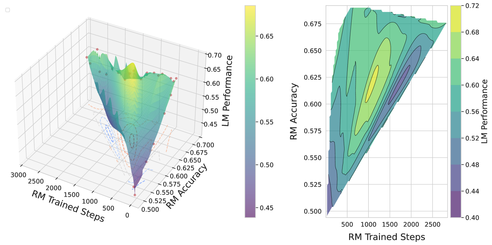
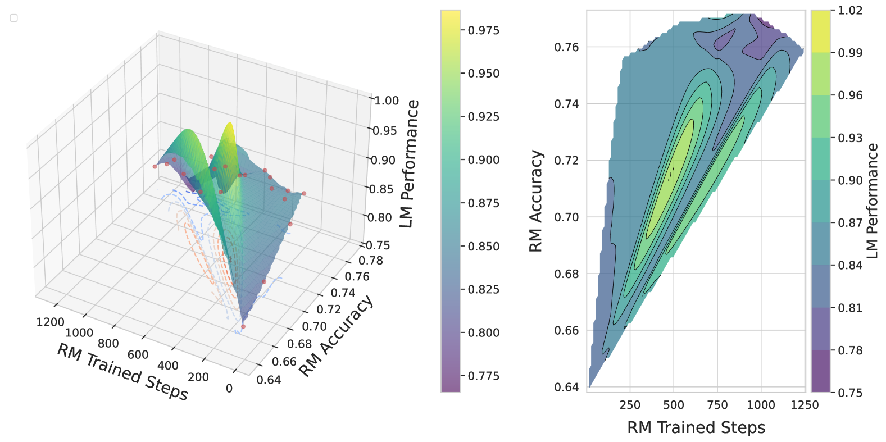
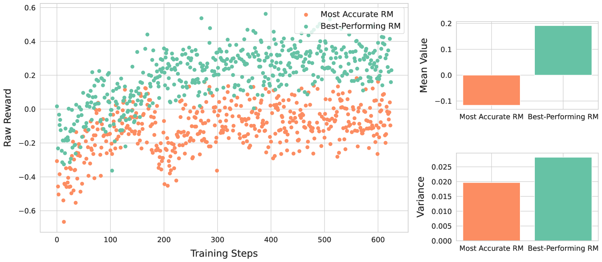

# AccuracyParadox

## 📌 核心贡献

> 揭示 RLHF 中的「准确率悖论」：更高准确率的奖励模型并不总是产出更好的语言模型，中等准确率的 RM 反而在下游任务中表现最优，挑战了「RM 越强越好」的传统假设。

## 📖 摘要

Reinforcement Learning from Human Feedback (RLHF) relies on reward models to approximate human preferences, with the assumption that more accurate reward models lead to better-aligned language models. This paper challenges this assumption by investigating whether improved reward model accuracy consistently translates to better language model performance. Using the QA-FEEDBACK dataset and Longformer-based reward models, we evaluate three key metrics--relevance, factuality, and completeness--and uncover a surprising paradox: language models trained with moderately accurate reward models outperform those guided by highly accurate ones. Through analysis of reward variance and KL divergence patterns, we identify that highly accurate reward models may produce overly concentrated reward distributions, reducing the exploration needed for effective policy learning, while moderate reward models provide sufficient guidance while maintaining beneficial diversity in reward signals.

## 🔍 关键信息

| 字段 | 内容 |
|------|------|
| 机构 | Eastern Institute of Technology, Ningbo & HKPolyU & Saarland University |
| 发表 | 2024-10-09 |
| 分类 | cs.CL, cs.AI |
| 链接 | [arXiv](https://arxiv.org/abs/2410.06554) |

## 📝 我的笔记

### 方法总览

### 核心问题/动机

RLHF 中一个被广泛接受但从未被严格验证的假设：**奖励模型越准确，训练出的语言模型就越好**。本文用实验系统性地质疑了这一假设。

### 实验设置

| 设置项 | 内容 |
|--------|------|
| 数据集 | QA-FEEDBACK（源自 ASQA），3853/500/948 (train/val/test) |
| 语言模型 | T5-small, T5-base, T5-large |
| 奖励模型 | Longformer-base-4096 |
| 评估维度 | Relevance, Factuality, Completeness |
| 训练方法 | SFT + PPO |
| 评估方式 | 独立高准确率评估模型 |

RM 准确率范围：

| 维度 | 准确率范围 | 评估 RM 准确率 |
|------|-----------|---------------|
| Relevance | 0.49 - 0.69 | 69.6% |
| Factuality | 0.64 - 0.77 | 77.8% |
| Completeness | 0.44 - 0.70 | 70.9% |

### 核心发现

**准确率悖论**：在所有三个评估维度和所有模型规模上，**中等准确率的 RM 训出的 LM 性能最优**，高准确率 RM 反而导致性能下降。

#### 机制分析

论文通过 reward variance 和 KL divergence 分析给出了解释：

1. **Reward 方差过低**：高准确率 RM 的 reward 分布过于集中（方差小），导致不同 response 之间的 reward 信号区分度不足
2. **探索不充分**：集中的 reward 分布抑制了 policy 的探索，模型过早收敛到次优解
3. **KL divergence 过快收敛**：高准确率 RM 下，policy 与 reference model 的 KL divergence 快速增大，触发 KL penalty 过早终止训练

中等准确率 RM 的优势在于：提供**足够的指导方向**同时保留**有益的 reward 多样性**，允许 policy 在更大空间中探索。

### 局限性

- 实验限于 QA-FEEDBACK 单一数据集和 Longformer RM
- T5 系列模型规模较小（最大 T5-large）
- 未在更大规模 LLM（如 7B+）上验证
- 三个评估维度均为文本质量指标，未涉及安全/有害性等维度

### 总结

这篇论文的发现对 reward model 研究有重要启示：

1. **RM 的评估指标需要重新思考**——单纯追求 accuracy 不够，应关注下游 LM 的实际表现
2. **Reward shaping 很重要**——RM 不仅要「判断对」，还要提供合适粒度的 reward 信号
3. **与 reward hacking 的关系**——高准确率 RM 可能更容易被 exploit，因为其 reward landscape 更 sharp，梯度信号更明确
4. **对视觉 RM 的启示**——在图像/视频生成 RLHF 中，可能同样存在类似悖论，RM 的「恰到好处」比「越准越好」更关键

## 🔗 相关论文

**基于/改进自：** --

**同方向（reward model 分析）：** [[RaR]]
