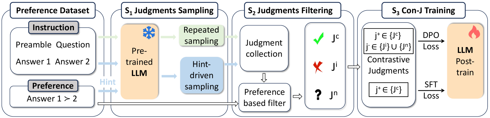

# Con-J

## 📌 核心贡献

> 提出 Con-J 框架，利用 LLM 自身生成能力构造对比判断对（contrastive judgment pairs），通过 DPO 训练生成式 judge，在保持与标量奖励模型可比性能的同时，实现自然可解释性和对数据集偏差的鲁棒性。

## 📖 摘要

Learning from preference feedback is a common practice for aligning large language models (LLMs) with human value. Conventionally, preference data is learned and encoded into a scalar reward model that connects a value head with an LLM to produce a scalar score as preference or reward. However, scalar models lack interpretability and are known to be susceptible to biases in datasets. This paper investigates leveraging the generation capability of LLMs to address both limitations in one shot. Specifically, we prompt the pre-trained LLM to generate positive and negative judgments, both supported with rationales in natural language form. The self-generated contrastive judgment pairs are used to train the generative judge with Direct Preference Optimization (DPO). This proposal of training the generative Judge using self-generated Contrastive judgments (Con-J) ensures natural interpretability due to the generated rationales together with the judgments, as well as high robustness against bias without the need for an additional reward head. Experimental results show that the performance of Con-J is comparable to the scalar reward model trained on the same collection of preference data, and demonstrate its superior interpretability and robustness in encoding human preferences.

## 🔍 关键信息

| 字段 | 内容 |
|------|------|
| 机构 | Tsinghua University, Baichuan AI, University of Copenhagen |
| 发表 | 2024-10-01 |
| 分类 | cs.CL, cs.AI, cs.LG |
| 链接 | [arXiv](https://arxiv.org/abs/2410.03742) |

## 📝 我的笔记

### 动机与问题定义

标量奖励模型（Scalar Reward Model）将 LLM 的输出通过一个 value head 映射为单一标量分数，存在两个核心缺陷：

1. **缺乏可解释性**：标量分数无法解释偏好判断的理由
2. **对数据偏差敏感**：容易受到格式偏差（format bias）和冗长偏差（verbosity bias）的影响

Con-J 的核心思路：利用 LLM 自身的生成能力，直接生成带有自然语言理由（rationale）的判断，而非输出标量分数。通过自举（self-bootstrapping）方式从偏好数据中构造对比判断对，再用 DPO 训练。

### 方法总览

Con-J 包含三个核心步骤：

**Step 1：判断采样（Judgment Sampling）**

给定问题 $q$ 和一对候选回答 $(a_1, a_2)$，构造 preamble $p$，然后用两种策略生成多样化判断：

- **Repeated Sampling**：对同一 prompt 使用不同随机种子采样 8 次，得到多个判断
- **Hint-driven Sampling**：在 prompt 中显式暗示哪个回答更好（正确/错误暗示各一半），迫使模型生成多样化判断

**Step 2：判断过滤（Judgment Filtering）**

利用真实偏好标签将生成的判断分类：

- **正判断** $j^+$：偏好预测与真实标签一致
- **负判断** $j^-$：偏好预测错误或模糊

构造对比对：$\{(j^+, j^-)\}$

**Step 3：DPO + SFT 联合训练**

DPO 损失：

$$\ell^{DPO} = -\sum_{(p, j^+, j^-)} \log \sigma \left[ \eta \log \frac{\pi(j^+|p)}{\pi_0(j^+|p)} - \eta \log \frac{\pi(j^-|p)}{\pi_0(j^-|p)} \right]$$

SFT 损失（在正判断上监督微调）：

$$\ell^{SFT} = -\sum_{(p, j^+)} \log \pi(j^+|p)$$

最终损失：

$$\ell^{final} = \ell^{DPO} + \alpha \cdot \ell^{SFT}, \quad \alpha = 10^{-6}$$

### Rationale 的偏差鲁棒性理论分析

Con-J 将判断分解为 rationale $j_r$ 和二元预测 $j_y$，偏差鲁棒性的理论动机如下：

$$P_\theta(j_y|p) = \sum_{j_r} P_\theta(j_y|j_r, p) \cdot P_\theta(j_r|p)$$

包含 rationale 的生成过程将偏差分散到 rationale 和预测两个组件中，降低了偏差对最终预测的直接影响。这类似于在判断前强制模型"先思考再回答"的 chain-of-thought 机制。

### 训练细节

| 配置 | 值 |
|------|------|
| 基座模型 | Qwen2-7B-Instruct |
| 学习率 | 9e-6（cosine schedule, 3% warmup） |
| 最大序列长度 | 4,096 |
| Batch size | 24（Con-J）/ 128（Scalar Model） |
| 精度 | BF16/TF32 mixed precision |
| 优化 | DeepSpeed ZeRO Stage 3 |
| 采样参数 | top-p=0.9, top-k=20, temp=1.0, rep_penalty=1.2 |
| 推理 | VLLM, top-p=1.0, temp=0.0 |

### 关键实验结果

**商业数据集判断准确率：**

| 模型 | Creation | Math | Code |
|------|----------|------|------|
| GPT-4o | 55.6 | 74.8 | 68.1 |
| Scalar Model (pointwise) | 69.4 | 84.8 | 69.4 |
| Scalar Model (pairwise) | 69.2 | 84.6 | 69.6 |
| **Con-J** | **72.4** | **85.0** | **70.1** |

Con-J 在所有任务上超越标量奖励模型和 GPT-4o。

**公开基准测试：**

| 模型 | Infinity-Pref | UltraFeedback | PKU-SafeRLHF | RewardBench |
|------|---------------|---------------|--------------|-------------|
| Llama3.1-8B | 59.0 | 62.9 | 66.4 | 80.7 |
| Qwen2-7B | 59.0 | 64.5 | 67.2 | 91.3 |
| Auto-J | 69.0 | 63.9 | 66.9 | 93.0 |
| GPT-4o | 75.0 | 72.2 | 69.6 | 95.3 |
| **Con-J** | **81.0** | **73.0** | **68.4** | 91.3 |

Con-J 在 Infinity-Preference 和 UltraFeedback 上超越 GPT-4o，在 7B 参数量级模型中 RewardBench 排名第一。

### Ablation 分析

| 变体 | Creation | Math | Code |
|------|----------|------|------|
| Con-J untrained | 53.6 | 63.4 | 61.7 |
| Con-J w/o Hint | 61.3 | 77.4 | 68.2 |
| Con-J w/o DPO（仅 SFT） | 54.6 | 64.2 | 63.5 |
| **Con-J (Full)** | **72.4** | **85.0** | **70.1** |

关键发现：

- **DPO 训练至关重要**：去掉 DPO 后 Creation 任务性能从 72.4 降至 54.6（降幅约 25%），仅 SFT 完全不够
- **Hint-driven 采样不可缺少**：去掉后 Creation 从 72.4 降至 61.3，因为缺少多样化的负样本

### 偏差鲁棒性

Con-J 在格式偏差（format bias）和冗长偏差（verbosity bias）注入测试中均优于标量模型：

- 标量模型在对抗集上性能大幅下降
- Con-J 通过 rationale 生成提供了正则化效果
- 去除 rationale 的 Con-J 在对抗测试上性能下降 15-25%，证实 rationale 是鲁棒性的关键来源

### 总结性评价

Con-J 的核心创新在于将 generative judge 的训练问题转化为一个自举式的对比学习问题：

1. **自举构造训练数据**：不依赖外部模型（如 GPT-4），完全从偏好数据自举生成对比判断对
2. **Rationale 带来双重优势**：既提供可解释性，又通过偏差分散机制增强鲁棒性
3. **DPO 训练的巧妙应用**：将"好判断 vs 坏判断"的对比转化为 DPO 的偏好对格式

与 [[GenRM]] 相比，Con-J 更强调 rationale 的鲁棒性作用和自举数据构造；与 [[J1]] 等后续工作相比，Con-J 是较早探索生成式 judge + DPO 训练范式的工作之一。局限性在于 rationale 与最终预测的一致性仍有提升空间。

## 🔗 相关论文

**基于/改进自：** [[GenRM]], [[DPO]]

**同方向：** [[J1]], [[Self-Rewarding]]
