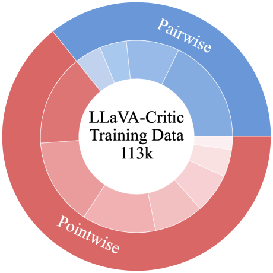
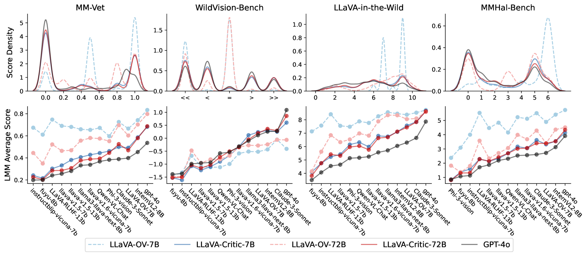
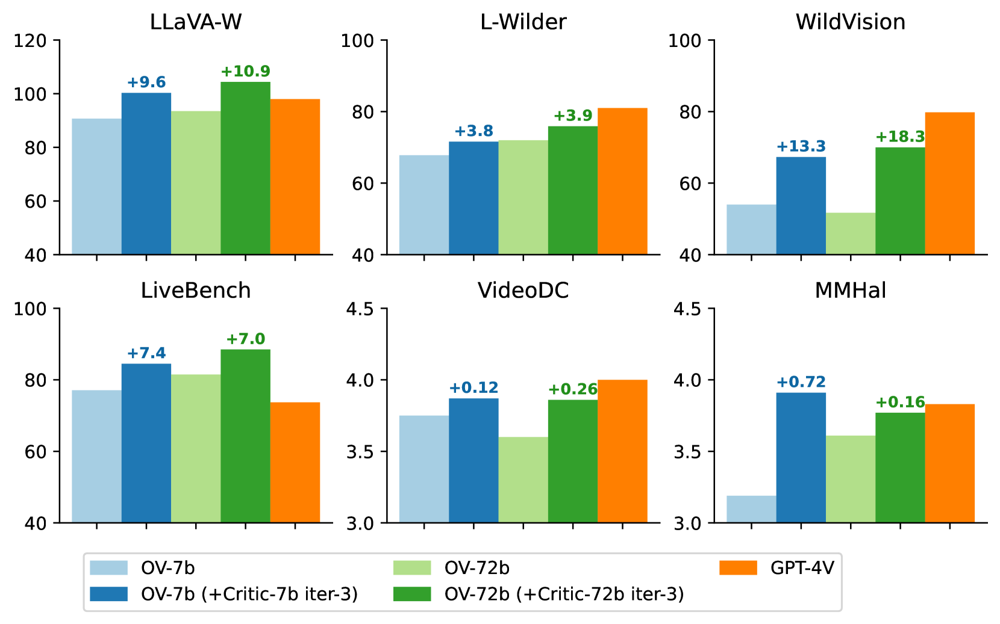

# LLaVA-Critic

## 📌 核心贡献

> 提出首个开源的通用多模态评估模型 LLaVA-Critic，通过构造高质量的评估指令数据训练 VLM 作为评判者（LMM-as-a-Judge），在多个评估基准上达到接近甚至超越 GPT-4V/4o 的评判能力，并可作为 reward model 为偏好学习提供奖励信号。

## 📖 摘要

We introduce LLaVA-Critic, the first open-source large multimodal model (LMM) designed as a generalist evaluator to assess performance across a wide range of multimodal tasks. LLaVA-Critic is trained using a high-quality critic instruction-following dataset that incorporates diverse evaluation criteria and scenarios. Our experiments demonstrate the model's effectiveness in two key areas: (1) LMM-as-a-Judge, where LLaVA-Critic provides reliable evaluation scores, performing on par with or surpassing GPT models on multiple evaluation benchmarks; and (2) Preference Learning, where it generates reward signals for preference learning, enhancing model alignment capabilities. This work underscores the potential of open-source LMMs in self-critique and evaluation, setting the stage for future research into scalable, superhuman alignment feedback mechanisms for LMMs.

## 🔍 关键信息

| 字段 | 内容 |
|------|------|
| 机构 | ByteDance / University of Maryland |
| 发表 | 2024-10-03 |
| 分类 | cs.CV, cs.CL |
| 链接 | [arXiv](https://arxiv.org/abs/2410.02712) |

## 📝 我的笔记

### 动机与问题定义

现有多模态模型（LMM）的评估高度依赖 GPT-4V/4o 等闭源模型作为 judge，存在成本高、不可复现、不可定制等问题。本文提出将开源 VLM 训练为通用评估器，使其具备 self-critique 能力，同时可作为 reward model 替代昂贵的 API 调用。

### 方法

#### 评估数据构造

训练数据共 113k 样本（46k 图像），分为两类：

**Pointwise 评分数据（72,782 样本）：**
- 18,915 个 question-image 对，每个配多个模型回复
- 回复来源：VLFeedback（12 个 LMM 的输出）+ GPT-4o 生成
- 评估 prompt 来自 7 个基准：LLaVA-in-the-Wild, LLaVA-Wilder, Image Detailed Captioning, MMHal-Bench, MMVet, WildVision-Bench, RefoMB
- 评分范围 0-100，涵盖准确性、完整性、标准对齐度等维度

**Pairwise 排序数据（40,100 样本）：**
- VLFeedback：20k 对（分数差 > 0.6）+ 5k 平局对
- LLaVA-RLHF：9.4k 对（人类偏好标注）
- RLHF-V：5.7k 对（人工修正）
- 设计了 30 个手工编写的 prompt 模板

**数据来源：** 8 个多模态指令微调数据集，涵盖视觉对话、推理、OCR、医学影像、具身决策等场景。

#### 训练细节

- 基础模型：LLaVA-OneVision（7B / 72B）
- 微调 1 个 epoch，学习率 2e-6，batch size 32
- 损失函数：标准交叉熵，同时作用于评判结果和理由文本
- 两个版本：LLaVA-Critic（完整 113k）和 LLaVA-Critic v0.5（53k 子集）

#### 作为 Reward Model 的偏好学习流程

三步流程：

1. **回复生成：** 基础模型 $\pi_0$ 对每个指令生成 $K=5$ 个候选回复
2. **Pairwise 评分：** 对 $K$ 个回复构造所有 $K \times (K-1)$ 个有序对，LLaVA-Critic 对每对给出相对分数 $a_{ij}$
3. **奖励聚合：** 计算每个回复的综合奖励：

$$r_i = \sum_{k \neq i} a_{ki} - \sum_{l \neq i} a_{il}$$

选择最高分和最低分的回复作为偏好对 $(y^+, y^-)$ 用于 DPO 训练。

**迭代式 DPO：** 更新后的模型作为下一轮的 checkpoint，共进行 $M=3$ 轮迭代。

### 关键实验结果

#### In-Domain Pointwise 评分（Pearson 相关性）

| 模型 | 平均 Pearson |
|------|-------------|
| LLaVA-OV-7B（基线） | 0.364 |
| LLaVA-Critic-7B | 0.732 |
| LLaVA-OV-72B（基线） | 0.634 |
| LLaVA-Critic-72B | 0.754 |

#### In-Domain Pairwise 排序

| 模型 | 准确率（含平局） | 准确率（不含平局） | Kendall's $\tau$ |
|------|-----------------|-------------------|-----------------|
| GPT-4o | 0.617 | 0.734 | 0.819 |
| GPT-4V | 0.620 | 0.733 | 0.787 |
| LLaVA-Critic-72B | 0.605 | 0.736 | 0.779 |
| LLaVA-Critic-7B | 0.596 | 0.722 | 0.763 |

LLaVA-Critic-72B 在不含平局的 pairwise 准确率上超过了 GPT-4o 和 GPT-4V。

#### MLLM-as-a-Judge 基准（Out-of-Domain）

| 模型 | Pointwise Score | Pair（含平局） | Pair（不含平局） |
|------|----------------|---------------|-----------------|
| GPT-4V* | 0.490 | 0.636 | 0.773 |
| GPT-4o | 0.439 | 0.577 | 0.736 |
| LLaVA-Critic-72B | 0.393 | 0.578 | 0.715 |
| LLaVA-Critic-7B | 0.314 | 0.556 | 0.689 |

#### 偏好学习结果（3 轮迭代 DPO）

| 基准 | LLaVA-RLHF RM | LLaVA-Critic-7B |
|------|---------------|-----------------|
| LLaVA-in-the-Wild | 97.5 | 100.3 |
| LLaVA-Wilder | 70.3 | 71.6 |
| WildVision-Bench | 64.1 | 67.3 |
| Video DC | 3.84 | 3.87 |
| MMHal-Bench | 4.01 | 3.91 |

LLaVA-Critic-7B 在 5/6 个基准上超越 LLaVA-RLHF reward model，且完全免费（替代了约 $690 的 GPT-4o API 调用成本）。

### 总结性评价

- **开创性定位：** 首个将开源 VLM 训练为通用多模态评估器的工作，填补了 LMM-as-a-Judge 领域的开源空白
- **数据工程为核心：** 方法本身并不复杂（SFT），核心贡献在于精心构造的 113k 评估数据集，覆盖 pointwise 和 pairwise 两种范式
- **实用价值高：** 作为 reward model 可以零成本替代 GPT-4o API，对后续 RLHF/DPO 流程有直接实用价值
- **局限性：** Out-of-domain 泛化能力仍与 GPT-4V 有差距；pointwise 评分的 Pearson 相关性在 OOD 场景下降明显
- **作为后续工作的基线：** 被 UnifiedReward 等工作作为重要基线对比

## 🔗 相关论文

**基于/改进自：** [[LLaVA-OneVision]]

**同方向：** [[UnifiedReward]], [[VisionReward]], [[LLM-as-Judge-Survey]]
