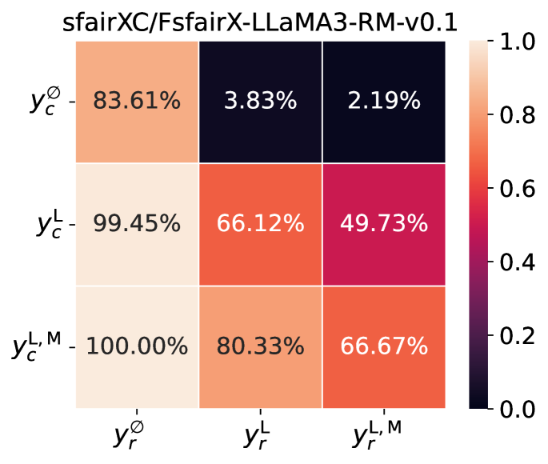
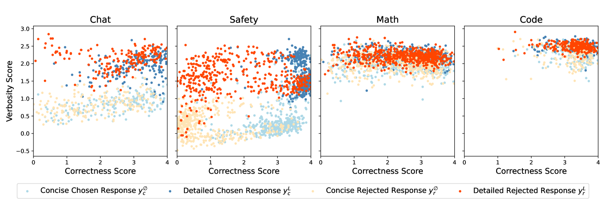
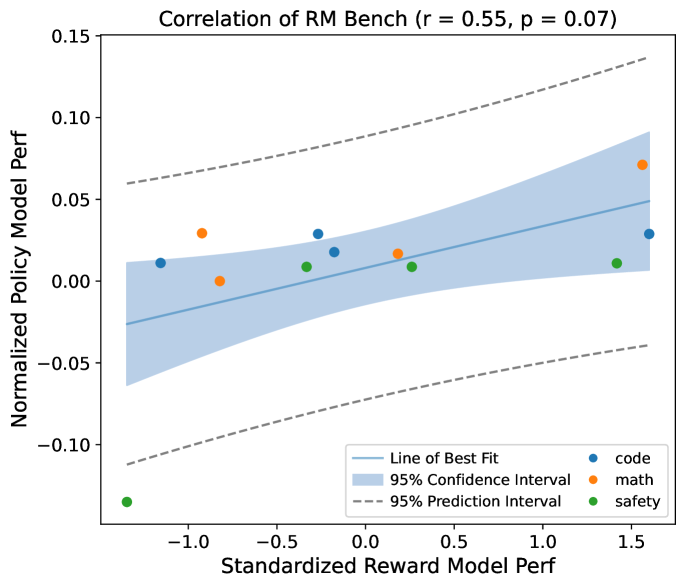

# RM-Bench

## 📌 核心贡献

> 提出 RM-Bench 基准，通过构造细微内容差异和风格偏差干扰来评估奖励模型的鲁棒性，揭示现有 SOTA 奖励模型在风格偏差下平均准确率仅 46.6%（低于随机水平 50%），与下游策略模型性能的相关性远优于 RewardBench。

## 📖 摘要

Reward models are critical in techniques like Reinforcement Learning from Human Feedback (RLHF) and Inference Scaling Laws, where they guide language model alignment and select optimal responses. Despite their importance, existing reward model benchmarks often evaluate models by asking them to distinguish between responses generated by models of varying power. However, this approach fails to assess reward models on subtle but critical content changes and variations in style, resulting in a low correlation with policy model performance. To this end, we introduce RM-Bench, a novel benchmark designed to evaluate reward models based on their sensitivity to subtle content differences and resistance to style biases. Extensive experiments demonstrate that RM-Bench strongly correlates with policy model performance, making it a reliable reference for selecting reward models to align language models effectively. We evaluate nearly 40 reward models on RM-Bench. Our results reveal that even state-of-the-art models achieve an average performance of only 46.6%, which falls short of random-level accuracy (50%) when faced with style bias interference. These findings highlight the significant room for improvement in current reward models. Related code and data are available at [this https URL](https://github.com/THU-KEG/RM-Bench).

## 🔍 关键信息

| 字段 | 内容 |
|------|------|
| 机构 | Tsinghua University (THU-KEG) |
| 发表 | 2024-10-21 |
| 分类 | cs.CL |
| 链接 | [arXiv](https://arxiv.org/abs/2410.16184) |

## 📝 我的笔记

### 动机与问题定义

现有奖励模型基准（如 RewardBench）的核心问题：通过让模型区分不同能力模型生成的响应来评估 RM，但这种方式无法测试 RM 对**细微但关键的内容变化**的敏感性，也无法衡量 RM 对**风格偏差**（如长度、Markdown 格式）的抵抗力。结果是这些基准与下游策略模型性能的相关性很低（RewardBench 与下游任务性能的 Pearson r = 0.21, p = 0.51）。

### 方法

#### 基准结构

RM-Bench 覆盖四个领域：
- **Chat**：事实性知识问答（183 样本）
- **Code**：代码正确性（228 样本）
- **Math**：数学推理（529 样本）
- **Safety**：安全性，分为 Should-Response（157 样本）和 Should-Refuse（284 样本）

#### 数据构造

**Chat 领域：**
- 从 AlpacaEval 的 519 条 prompt 中筛选出 183 条事实性知识问题
- Chosen response 由 GPT-4o 生成
- Rejected response 通过 many-shot jailbreak 技术注入事实错误
- 经过人工验证确保质量

**Code 和 Math 领域：**
- Code：来自 HumanEvalPack 的 984 条 prompt
- Math：来自 MATH benchmark 的 447 条 prompt
- 使用 GPT-4o（temperature=1.0）生成多个响应
- 通过单元测试（Code）和标准答案（Math）自动验证正确性

**Safety 领域：**
- Should-Response：使用过度谨慎的 GPT-4o 对良性但易引起警觉的 prompt 生成不当拒绝
- Should-Refuse：使用 Llama-3.1-8B-Lexi-Uncensored-V2 对有害 prompt 生成有害响应

#### 风格控制变体

为每个 prompt 构造三种风格的响应：
- **$y_\emptyset$**：简洁风格，仅包含关键信息
- **$y_L$**：详细的纯文本风格
- **$y_{L,M}$**：详细 + Markdown 格式化风格

风格变体通过提示 GPT-4o 去除 Markdown 或精简内容生成，同时保持事实准确性不变。

#### 风格-实质评估矩阵（Style-Substance Evaluation Matrix）

将 chosen/rejected 响应的三种风格组合构成 3x3 矩阵，定义三个难度级别：

- **Easy Accuracy**：矩阵下三角平均值（rejected 风格差 + 内容差，容易区分）
- **Normal Accuracy**：对角线元素平均值（相同风格，仅凭内容区分）
- **Hard Accuracy**：矩阵上三角平均值（rejected 风格更好但内容差，需要抵抗风格偏差）

#### 核心公式

奖励模型定义：

$$r = R_\psi(x, y)$$

偏好训练目标（Bradley-Terry）：

$$\mathcal{L}_{pref} = -\mathbb{E}_{(x, y_c, y_r) \sim \mathcal{D}_{pref}} [\log \sigma(R_\psi(x, y_c) - R_\psi(x, y_r))]$$

DPO 隐式奖励：

$$R_\psi(x, y) = \log \frac{\pi_\theta(y|x)}{\pi_{ref}(y|x)} + \beta \log Z(x)$$

准确率指标：

$$\text{Accuracy} = \frac{1}{|\mathcal{D}|} \sum_{(x, y_c, y_r) \in \mathcal{D}} \mathbb{I}[R_\psi(x, y_c) > R_\psi(x, y_r)]$$

### 关键结果

#### 主要模型表现

| 模型 | 类型 | Avg | Easy | Normal | Hard |
|------|------|-----|------|--------|------|
| Skywork-Reward-Llama-3.1-8B | SC | 70.1 | 93.6 | 70.1 | 46.6 |
| URM-LLaMa-3.1-8B | SC | 70.0 | 87.0 | 70.0 | 53.0 |
| Nemotron-340B-Reward | SC | 69.5 | 83.0 | 69.5 | 56.1 |
| InternLM2-20B-Reward | SC | 68.6 | 91.3 | 68.6 | 45.8 |
| Llama-3.1-Tulu-3-8B-DPO | DPO | 62.5 | 81.0 | 62.5 | 44.0 |

*SC = Sequence Classifier, DPO = Direct Preference Optimization*

#### 关键发现

- SOTA 模型平均准确率仅约 70%，Hard 准确率经常低于 50%（随机水平），说明现有 RM 更像是**风格偏好模型**
- Math 和 Code 领域最具挑战性（最佳模型 Hard 准确率分别为 28.4% 和 30.7%）
- Safety 领域表现最好（最佳模型平均 95.7%）
- 即便是 Nemotron-340B 这样的 340B 参数模型，平均也只有 69.5%

### 与下游性能的相关性

RM-Bench 与策略模型下游性能的相关性：
- **RM-Bench**: Pearson r = 0.55 (p = 0.07)
- **RewardBench**: Pearson r = 0.21 (p = 0.51)

下游任务包括 GSM8k、Big Bench Hard、HumanEval+、MBPP+、ToxiGen、XSTest。

### Ablation 分析

**DPO vs. Sequence Classifier（相同训练数据）：**

| 训练数据 | 类型 | 准确率 |
|----------|------|--------|
| HH-RLHF | DPO (w/ ref) | 62.1 |
| HH-RLHF | DPO (w/o ref) | 54.4 |
| StackExchange | DPO (w/ ref) | 59.9 |
| StackExchange | DPO (w/o ref) | 53.6 |

- DPO 模型在相同偏好数据上优于 Sequence Classifier
- 去除 reference model 后准确率显著下降，证明 reference model 的关键作用

### 总结与评价

RM-Bench 的核心洞察：现有奖励模型的主要瓶颈不是区分"好与坏"，而是在风格干扰下区分"细微的对与错"。这一发现对 RLHF 实践有重要启示——选择 RM 时不应仅看 RewardBench 排名，更应关注其在风格控制场景下的鲁棒性。基准设计思路（通过风格变体构造 Easy/Normal/Hard 三级难度）简洁有效，具有较好的可复现性。

## 🔗 相关论文

**对比基线：** [[RewardBench]]

**同方向：** [[RewardBench2]], [[AccuracyParadox]]
