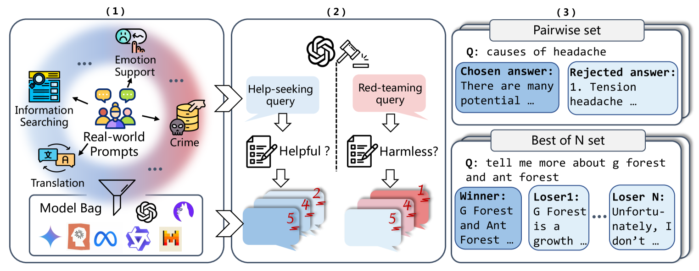
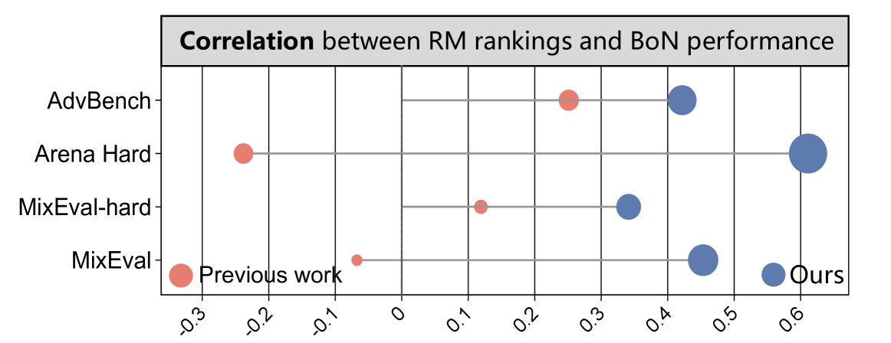
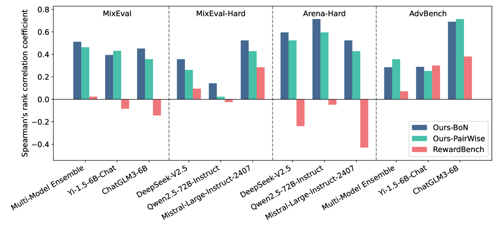

# RMB

## 📌 核心贡献

> 提出覆盖 49 个真实场景的奖励模型综合基准 RMB，首次结合 Pairwise 与 Best-of-N 两种评估范式，揭示了当前 SOTA 奖励模型在泛化性上的显著缺陷，并验证了 BoN 评估与下游对齐性能的正相关性优于传统 Pairwise 评估。

## 📖 摘要

Reward models (RMs) guide the alignment of large language models (LLMs), steering them toward behaviors preferred by humans. Evaluating RMs is the key to better aligning LLMs. However, the current evaluation of RMs may not directly correspond to their alignment performance due to the limited distribution of evaluation data and evaluation methods that are not closely related to alignment objectives. To address these limitations, we propose RMB, a comprehensive RM benchmark that covers over 49 real-world scenarios and includes both pairwise and Best-of-N (BoN) evaluations to better reflect the effectiveness of RMs in guiding alignment optimization. We demonstrate a positive correlation between our benchmark and the downstream alignment task performance.

## 🔍 关键信息

| 字段 | 内容 |
|------|------|
| 机构 | Fudan University & UNC Chapel Hill & Pengcheng Laboratory |
| 发表 | 2024-10-13 |
| 分类 | cs.CL |
| 链接 | [arXiv](https://arxiv.org/abs/2410.09893) |

## 📝 我的笔记

### 方法总览

### 核心问题/动机

现有奖励模型评估存在三个关键局限：

1. **评估数据分布受限**：现有基准（如 RewardBench）依赖有限的数据分布，无法覆盖真实场景的多样性
2. **评估方法单一**：仅使用 Pairwise 准确率，与下游对齐目标（如 Best-of-N 采样、RLHF）关联较弱
3. **相关性不明**：基准评估结果与实际对齐性能之间缺乏验证过的正相关关系

论文围绕三个研究问题展开：
- RQ1：RM 能否泛化到多样化场景？
- RQ2：除 Pairwise 外是否存在更好的评估范式？
- RQ3：基准结果是否与下游对齐性能相关？

### 基准构建方法

#### 场景设计（49 个细粒度场景）

基于社会学理论（情境主义、社会建构主义），认识到人类偏好在不同情境下有不同侧重：

- **Helpfulness（37 个场景，12 个任务类别）**：Chat、Brainstorming、Classification、Closed QA、Open QA、Generation、Summarization、Translation、Rewrite、Reasoning、Role Playing、Code
- **Harmlessness（12 个场景）**：Nonviolent Crime、Specialized Advice、Sex-related、Privacy、Intellectual Property 等

#### Prompt 收集

- 来源：WildChat 真实对话语料库
- Helpfulness：2,134 条求助 prompt
- Harmlessness：1,021 条红队 prompt
- 预处理：仅英文、长度约束、语义去重、三方交叉验证分类、基于 Vicuna-7B 的难度过滤

#### 响应生成

选择 **14 个 LLM** 覆盖全能力谱：GPT-4o-mini、Claude-3.5-Sonnet、Gemini-1.5-pro、Qwen2-72B、Llama-2/3 系列、Mistral 等，温度 0.2。

#### 两阶段标注

- **Stage 1（特征提取）**：GPT-4-turbo 为每个 query 生成 5 个基于 helpfulness/harmlessness 定义的关键特征
- **Stage 2（评分）**：基于关键特征满足程度对响应打 1-5 分
- 偏好对构建：仅在分差 < 2.5 时配对（保证难度）
- 总计 **18,000+ 高质量偏好对**

#### 人工一致性验证

| 数据集 | Helpfulness 一致率 | Harmlessness 一致率 |
|--------|-------------------|---------------------|
| RMB | 75.4% | 78.0% |
| RewardBench | 74.8% | 89.1% |
| 人类标注者间 | 70% | 86% |

### 评估协议

#### Pairwise 评估

$$\text{Pairwise Accuracy} = \frac{1}{N} \sum_{i} g(x_i^{\text{chosen}}, x_i^{\text{rejected}})$$

其中 $g(x_1, x_2) = 1$ 当模型正确排序 $x_1 > x_2$。

#### Best-of-N 评估（本文核心创新）

$$\text{BoN Accuracy} = \frac{1}{M} \sum_{i} \prod_{j} g(x_i^{\text{winner}}, x_{ij}^{\text{loser}})$$

- 数据结构：(query, winner, loser 列表) 三元组
- Winner 需高于 >=2 个其他响应
- 成功条件：正确地将 winner 排在**所有** loser 之上
- 比 Pairwise 更具挑战性（平均性能下降 17.5%）

### 关键结果

#### 排行榜（Top 模型）

| 模型 | Overall | BoN Helpfulness | Pairwise Helpfulness |
|------|---------|-----------------|----------------------|
| GPT-4o (Generative) | 0.738 | 0.639 | 0.815 |
| Qwen2-72B (Generative) | 0.723 | - | - |
| Claude-3.5-Sonnet (Generative) | 0.706 | - | - |
| Starling-RM-34B (Discriminative) | 0.712 | - | - |

#### 核心发现

**F1：生成式模型占优**：顶级生成式 RM 超越 SOTA 判别式 RM。

**F2：Helpfulness-Harmlessness 权衡**：Top-10 模型在两个维度上的 Spearman 相关系数为 -0.57，即一个维度强则另一个弱。

**F3：BoN 优于 Pairwise**：
- BoN 分数标准差更高（更好的区分度）
- BoN 与下游对齐性能相关性更强
- 是更具挑战性的评估方式

**F4：细粒度任务分析**：
- 顶级 RM 在 Helpfulness 场景上表现一致，但 Harmlessness 场景上方差很大
- 特别薄弱：Privacy 和 Intellectual Property 场景
- Sex-related 场景表现呈双峰分布（>70% 或 <50%）

### 下游对齐验证

使用 Best-of-N 采样（m=5）验证，在 MixEval、Arena-Hard、AdvBench 三个外部基准上：

| 基准 | RMB BoN 相关性 | RMB Pairwise 相关性 | RewardBench 相关性 |
|------|----------------|---------------------|-------------------|
| 整体趋势 | 正相关（最强） | 正相关（较弱） | 弱/负相关 |

RMB 的 BoN 评估在所有下游基准上都展现出正相关，而 RewardBench 的 Pairwise 评估则出现负相关，说明其评估结果与实际对齐效果脱节。

### 其他分析

- **多数投票无效**：在 70B 模型上测试 10 次投票，置信度加权指标未见提升，可能原因是过滤掉了仅大模型能区分的偏好对
- **复杂评判标准有害**：详细的 helpfulness 标准反而降低分数，可能因主观性增加
- **CoT 推理效果有限**：对 8B 模型有适度提升，对更大模型收益微弱
- **模型能力与 RM 性能相关**：生成式 RM 性能与底层模型能力的相关系数为 0.64

### 总结性评价

RMB 是一个设计周全的奖励模型评估基准，其核心贡献在于：(1) 引入 BoN 评估范式，弥补了 Pairwise 评估的不足；(2) 覆盖 49 个真实场景，提供细粒度的泛化性诊断。最重要的发现是 BoN 评估与下游对齐性能的正相关性显著强于 Pairwise，为 RM 评估方法论提供了新方向。局限在于未使用完整 PPO 训练验证，仅用 BoN 采样近似。

## 🔗 相关论文

**对比基线：** [[RewardBench]]

**同方向：** [[RewardBench2]], [[RM-Bench]], [[AccuracyParadox]]
