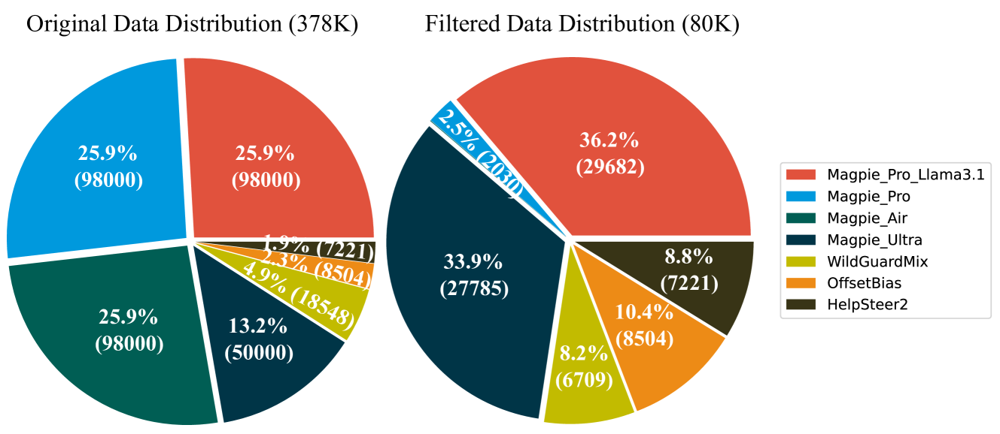
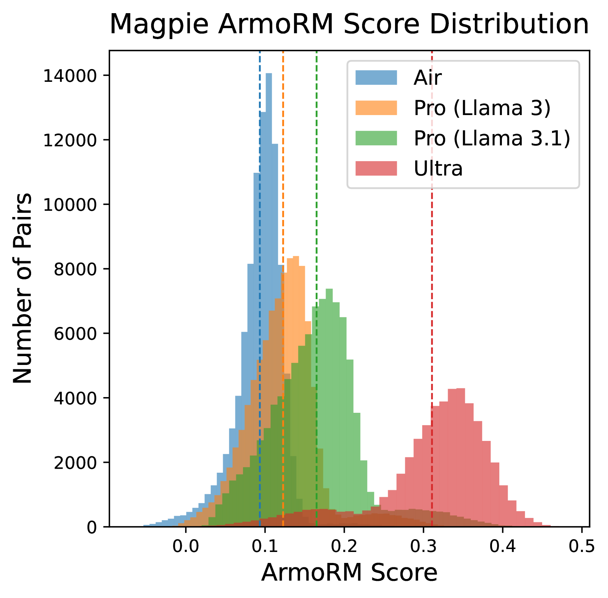

# Skywork-Reward

## 📌 核心贡献

> 提出一套以数据为中心的奖励模型训练方法论（bag of tricks），仅用 80K 高质量偏好数据即在 RewardBench 排行榜取得第一名（93.8 分），证明了小而精的数据策略优于大规模数据堆叠。

## 📖 摘要

In this report, we introduce a collection of methods to enhance reward modeling for LLMs, focusing specifically on data-centric techniques. We propose effective data selection and filtering strategies for curating high-quality open-source preference datasets, culminating in the Skywork-Reward data collection, which contains only 80K preference pairs -- significantly smaller than existing datasets. Using this curated dataset, we developed the Skywork-Reward model series -- Skywork-Reward-Gemma-27B and Skywork-Reward-Llama-3.1-8B -- with the former currently holding the top position on the RewardBench leaderboard. Notably, our techniques and datasets have directly enhanced the performance of many top-ranked models on RewardBench, highlighting the practical impact of our contributions in real-world preference learning applications.

## 🔍 关键信息

| 字段 | 内容 |
|------|------|
| 机构 | Skywork AI, Kunlun Inc. |
| 发表 | 2024-10-24 |
| 分类 | cs.AI, cs.CL |
| 链接 | [arXiv](https://arxiv.org/abs/2410.18451) |

## 📝 我的笔记

### 方法总览

### 核心问题/动机

当前开源奖励模型训练普遍依赖大规模偏好数据集（数十万甚至百万级），但数据质量参差不齐。Skywork-Reward 的核心假设是：**小而精的数据比大而杂的数据更有效**。作者通过系统性的数据筛选和过滤策略，仅用 80K 偏好对就超越了使用 700K 数据训练的模型。

### 数据策略（Data Curation）

#### 数据集混合

最终的 80K 数据集由 7 个公开数据集混合而成（共 81,973 对）：

| 数据集 | 数量 | 用途 |
|--------|------|------|
| HelpSteer2 | 7,221 | 多属性标注（helpfulness, correctness, coherence 等） |
| OffsetBias | 8,504 | 对抗响应长度偏见等伪信号 |
| WildGuardMix | 6,709 | 安全性偏好（区分有害/无害 prompt 的合规/拒绝响应） |
| Magpie Ultra | ~5,000 | 合成数据（Llama 3.1 405B 生成） |
| Magpie Pro (Llama 3.1) | ~20,000 | 合成数据（Llama 3.1 70B 生成） |
| Magpie Pro (Llama 3) | ~15,000 | 合成数据（Llama 3 70B 生成） |
| Magpie Air | ~19,500 | 合成数据（Llama 3 8B 生成） |

#### Magpie 数据筛选策略

**分数调整机制**：使用 ArmoRM 对所有 Magpie 数据打分后，根据生成模型的能力进行手动分布对齐：

- Air 子集（Llama 3 8B 生成）：分数减 0.1
- Pro Llama 3 子集（Llama 3 70B 生成）：分数减 0.05
- 优先级排序：Pro (Llama 3.1-70B) > Pro (Llama 3-70B) > Air (Llama 3-8B)

**基于任务的采样**：

- 数学和编程类：取 top 30%
- 其他类别：取 top 10%
- 结果：数学占选中数据的 49.81%（29,657 对），编程占 13.76%

#### WildGuardMix 过滤策略

两阶段过滤：

1. 排除非对抗性样本（早期模型版本已经能正确处理的）
2. 仅保留被先前版本 RM 正确分类的对抗性样本

偏好标注逻辑：

- 有害 prompt：拒绝响应优于合规响应
- 良性 prompt：合规响应优于拒绝响应

### 训练方法

#### 训练配置

| 配置项 | 值 |
|--------|-----|
| 基座模型 | Meta-Llama-3.1-8B-Instruct / Gemma-2-27B-it |
| Batch size | 128（全局） |
| 优化器 | AdamW（weight decay = 1e-3） |
| 学习率 | 2e-6（8B）/ 1e-6（27B） |
| 调度 | Cosine |
| 训练轮数 | 2 |
| 架构修改 | 将最终层替换为随机初始化的 reward head |

#### 损失函数

主要使用标准 Bradley-Terry 排序损失：

$$\mathcal{L}_{\text{ranking}} = -\log(\sigma(r_\theta(x, y_c) - r_\theta(x, y_r)))$$

其中 $\sigma$ 是 sigmoid 函数，$r_\theta$ 输出标量奖励，$y_c$ 是 chosen 响应，$y_r$ 是 rejected 响应。

作者测试了多种替代损失函数（Focal Loss、Hinge Loss、Margin MSE、Cross-Entropy、带温度的 BT 等），但发现**标准 BT 损失在所有类别上一致表现最好**。

### 关键结果

#### RewardBench 性能

| 模型 | Avg | Chat | Chat Hard | Safety | Reasoning |
|------|-----|------|-----------|--------|-----------|
| **Skywork-Reward-Gemma-2-27B** | **93.8** | 95.8 | **91.4** | 92.0 | 96.1 |
| **Skywork-Reward-Llama-3.1-8B** | 92.5 | 95.8 | 87.3 | 90.6 | 96.2 |
| SFR-LLaMa-3.1-70B-Judge-I | 92.7 | - | - | - | - |
| Nemotron-4-340B-Reward | 92.2 | - | - | - | - |
| ArmoRM-Llama3-8B | 90.8 | - | - | - | - |

#### 数据效率对比

| 数据规模 | 模型 (8B) | Avg |
|----------|-----------|-----|
| Preference 700K | Llama-3.1-8B | 86.9 |
| Preference 378K | Llama-3.1-8B | 91.8 |
| **Skywork 80K** | **Llama-3.1-8B** | **92.5** |

80K 数据的效果大幅超越 700K 数据，验证了"小而精"策略的有效性。

### 损失函数消融

| 损失函数 | Avg | Chat | Chat Hard | Safety | Reasoning |
|----------|-----|------|-----------|--------|-----------|
| **Bradley-Terry** | **93.8** | **95.8** | 91.4 | 92.0 | 96.1 |
| Focal | 93.6 | 94.3 | 91.8 | 92.0 | 96.5 |
| BT + Temperature | 93.7 | 94.3 | 91.7 | 92.7 | 96.3 |
| Tempered Log | 92.9 | 96.4 | 87.4 | 91.8 | 96.2 |
| Hinge | 93.3 | 94.1 | 90.2 | 92.6 | 96.3 |
| Focal + Penalty | 93.4 | 93.9 | 91.5 | 92.0 | 96.5 |
| Margin MSE | 92.3 | 90.2 | 89.0 | 93.3 | 96.7 |
| Cross-Entropy | 87.6 | 74.9 | 87.3 | 94.0 | 94.5 |

标准 BT 损失在平均分上最优，Focal 和带温度 BT 接近但不超过。Cross-Entropy 表现最差。

### 去污染分析

作者发现训练数据中存在与 RewardBench 的 n-gram 重叠（contamination），进行了去污染实验：

| 模型 | 去污染后 Avg | 变化 |
|------|-------------|------|
| Gemma-2-27B | 94.3 | +0.5 |
| Llama-3.1-8B | 93.1 | +0.6 |

反直觉的发现：**去除污染数据后性能反而提升**，说明这些"污染"样本的偏好标签可能与 RewardBench 的评估标准不一致，移除它们反而减少了噪声。

### 总结性评价

Skywork-Reward 是一篇非常实用的技术报告，其核心贡献在于证明了数据质量远比数据数量重要。几个关键 takeaway：

1. **数据策略 > 模型/损失函数创新**：仅 80K 精选数据就超越了 700K 数据训练的模型，且标准 BT 损失胜过各种花式变体
2. **分数校准很重要**：对不同质量来源的合成数据进行分数偏移对齐是一个简单但有效的技巧
3. **任务采样不均衡是有益的**：数学和代码占比远超其他类别（~64%），说明 STEM 类偏好对 RM 的 reasoning 能力至关重要
4. **去污染实验值得关注**：污染不一定导致虚高分数，反而可能引入噪声，这为 benchmark 评估的可靠性提供了新视角

## 🔗 相关论文

**同方向：** [[RM-Survey]], [[RewardBench2]]
