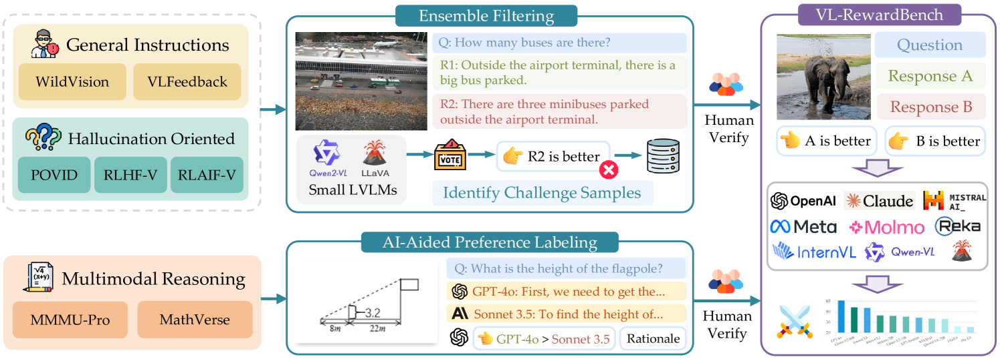
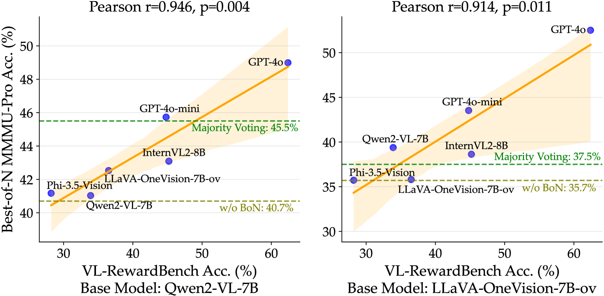
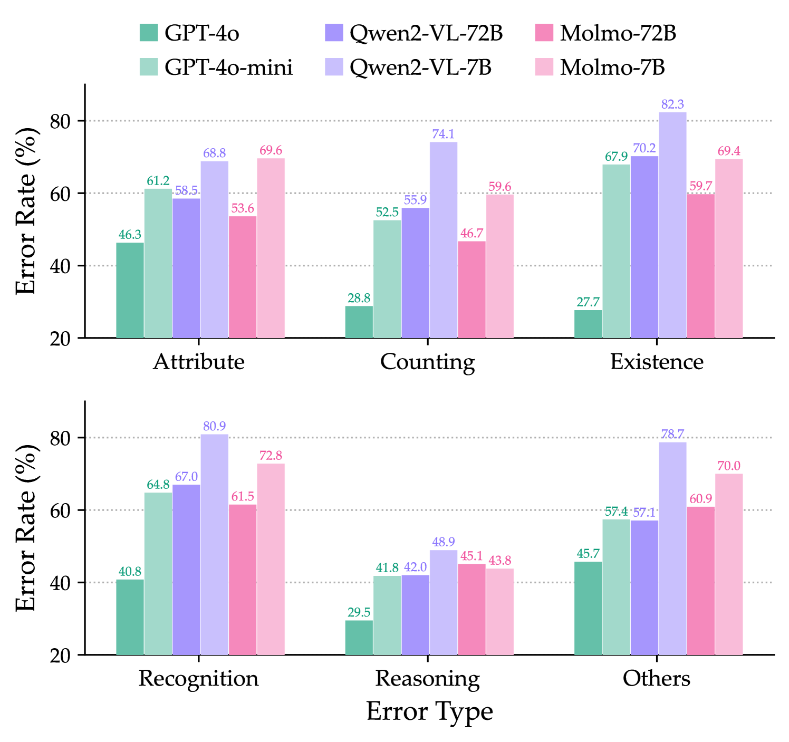

# VL-RewardBench

## 📌 核心贡献

> 提出首个系统性评估视觉语言生成式奖励模型（VL-GenRM）的挑战性基准，包含 1,250 个精心筛选的偏好对，覆盖通用多模态、幻觉检测和复杂推理三大类任务，揭示了当前模型在基础视觉感知而非推理上的核心瓶颈。

## 📖 摘要

Vision-language generative reward models (VL-GenRMs) play a critical role in aligning multimodal AI systems. They serve dual functions in this context: they provide training signals to guide the learning of vision-language models and act as evaluators to assess the quality of generated outputs. Despite their importance, current assessment methods for VL-GenRMs rely on general-purpose benchmarks that do not adequately capture their reward-specific capabilities. To address this gap, we introduce VL-RewardBench, a comprehensive benchmark specifically designed to evaluate the reward judgment capabilities of these models. VL-RewardBench spans three key domains: general multimodal queries, visual hallucination detection, and complex reasoning tasks, comprising 1,250 curated examples. Through extensive evaluation of 16 leading models, including both open-source and proprietary systems, we uncover several critical findings: (1) even the best-performing model, GPT-4o, achieves only 65.4% accuracy, revealing substantial room for improvement; (2) open-source models consistently underperform compared to proprietary systems across all categories; (3) models primarily struggle with basic visual perception rather than complex reasoning; (4) inference-time scaling benefits vary significantly based on model capacity; and (5) training dedicated critic models substantially improves judgment accuracy by up to 14.7% for smaller models. Our benchmark provides a valuable resource for advancing the development and evaluation of VL-GenRMs.

## 🔍 关键信息

| 字段 | 内容 |
|------|------|
| 机构 | HKU, SCUT, SJTU, PKU, UW, Allen AI |
| 发表 | 2024-11-26 |
| 分类 | cs.CV, cs.CL |
| 链接 | [arXiv](https://arxiv.org/abs/2411.17451) |

## 📝 我的笔记

### 方法总览

### 动机与问题定义

视觉语言生成式奖励模型（VL-GenRM）在多模态 AI 对齐中承担两项关键功能：(1) 提供训练信号指导 VLM 学习，(2) 作为评估器评判生成输出质量。然而，当前评估方法依赖通用基准，无法充分捕捉奖励模型特有的判断能力。VL-RewardBench 旨在填补这一空白，提供一个专门评估 VL-GenRM 偏好判断能力的挑战性基准。

### 基准构建

VL-RewardBench 包含 **1,250 个偏好对**，覆盖三大领域：

| 领域 | 数量 | 占比 | 数据来源 |
|------|------|------|----------|
| 通用多模态指令 | 183 | 14.7% | VLFeedback, WildVision |
| 幻觉导向查询 | 749 | 59.9% | POVID, RLAIF-V, RLHF-V |
| 多模态推理 | 318 | 25.4% | MMMU-Pro, MathVerse |

#### 策略一：集成过滤（通用 + 幻觉任务）

1. 使用 4 个 7B 小模型（LLaVA-1.5, LLaVA-1.6, LLaVA-OneVision-7B-si, Qwen2-VL-7B）评估偏好对
2. 每对进行 3 次评估，随机化响应位置
3. 筛选所有模型均一致判断错误的"共同集"（3,785 候选）
4. 三阶段人工验证缩减至 932 个高质量偏好对：标签准确性检查 -> 质量/歧义过滤 -> 错误类型分类（每样本约 65 秒）

#### 策略二：AI 辅助标注（推理任务）

1. 商业模型（GPT-4o, GPT-4o-mini, Claude 3.5 Sonnet）生成响应
2. 长度控制配对，阈值 $\tau = 0.1$：

$$\frac{|l_1 - l_2|}{\min(l_1, l_2)} < \tau$$

3. GPT-4o 生成带理由的草稿标签
4. 三位作者验证，最终得到 318 个推理任务偏好对

#### 错误类型分布

| 错误类型 | 数量 | 占比 |
|----------|------|------|
| 存在性错误 | 531 | 59.3% |
| 识别错误 | 184 | 20.6% |
| 视觉属性错误 | 69 | 7.7% |
| 计数错误 | 60 | 6.7% |
| 其他错误 | 51 | 5.7% |

### 评估协议

- 每个偏好对进行 $K=5$ 次独立评估
- 随机化响应顺序以缓解位置偏差
- 多数投票确定最终偏好
- 固定解码参数：temperature=0.2, top\_p=0.2
- 主要指标：Overall Accuracy 和 Macro Average Accuracy（跨类别均值，应对类别不平衡）

### 关键结果

#### 主要性能（Table 2）

**商业模型：**

| 模型 | General | Hallucination | Reasoning | Overall | Macro Avg |
|------|---------|---------------|-----------|---------|-----------|
| GPT-4o | 49.1% | 67.6% | 70.5% | 65.8% | 62.4% |
| Gemini-1.5-Pro | 50.8% | 72.5% | 64.2% | 67.2% | 62.5% |
| Claude-3.5-Sonnet | 43.4% | 55.0% | 62.3% | 55.3% | 53.6% |

**开源模型：**

| 模型 | General | Hallucination | Reasoning | Overall | Macro Avg |
|------|---------|---------------|-----------|---------|-----------|
| Llama-3.2-90B | 42.6% | 57.3% | 61.7% | 56.2% | 53.9% |
| Qwen2-VL-72B | 38.1% | 32.8% | 58.0% | 39.5% | 43.0% |
| Qwen2-VL-7B | - | - | - | 28.3% | - |

#### 错误率分析

- **感知瓶颈**：存在性任务中 GPT-4o-mini 错误率 67.9%，Qwen2-VL-7B 在识别任务上错误率 80.9%
- **推理任务**：平均错误率 41.8%，显著低于感知任务
- **模型缩放**：Qwen2-VL 从 7B 到 72B，计数错误降低 18.2 个百分点

#### 推理时缩放

- GPT-4o：macro accuracy 从 60.3% (K=1) 提升至 62.7% (K=7)
- GPT-4o-mini：不同 K 值下变化极小
- Qwen2-VL-72B 和 Molmo-72B：K 增大反而下降 1.7-2.6 个百分点
- 结论：推理时缩放仅对大容量模型有效

#### Critic 训练效果

| 模型 | 基准 | Pointwise Critic | Pairwise Critic |
|------|------|------------------|-----------------|
| LLaVA-OneVision | 38.2% | 52.9% (+14.7%) | 47.4% (+9.2%) |

- Pointwise critic 在幻觉检测上优于 pairwise（+9.1%）
- Pairwise critic 在推理任务上表现更好（60.0%）

#### 下游任务相关性

VL-RewardBench 准确率与 Best-of-N 采样下游改进高度相关：
- Qwen2-VL-7B：Pearson $r = 0.946$
- LLaVA-OneVision-7B-ov：$r = 0.914$
- GPT-4o 作为选择器可将 LLaVA-OneVision 在 MMMU-Pro 上从 35.7% 提升至 52.5%（N=8）

### 总结性评价

VL-RewardBench 作为首个专门评估 VL 奖励模型的基准，有几个突出贡献：(1) 通过集成过滤策略确保样本的挑战性，避免了简单样本占主导的问题；(2) 揭示了模型在视觉感知而非推理上的核心瓶颈，为改进方向提供了明确指引；(3) 与下游 Best-of-N 任务的高相关性（r > 0.9）验证了基准的实用价值。不足之处在于幻觉类样本占比偏高（59.9%），通用和推理类样本相对较少，可能影响评估的全面性。

## 🔗 相关论文

**基于/改进自：** [[LLaVA-Critic]]

**同方向：** [[RewardBench2]], [[MMRB2]], [[UnifiedReward]]
