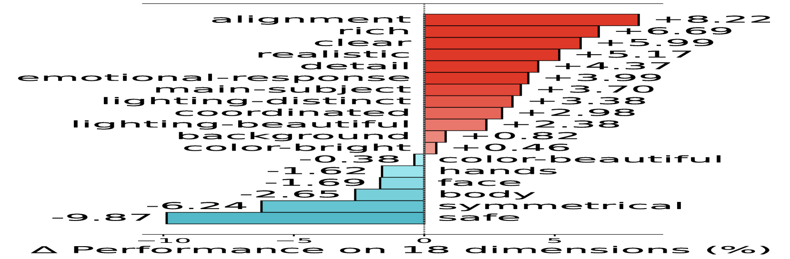
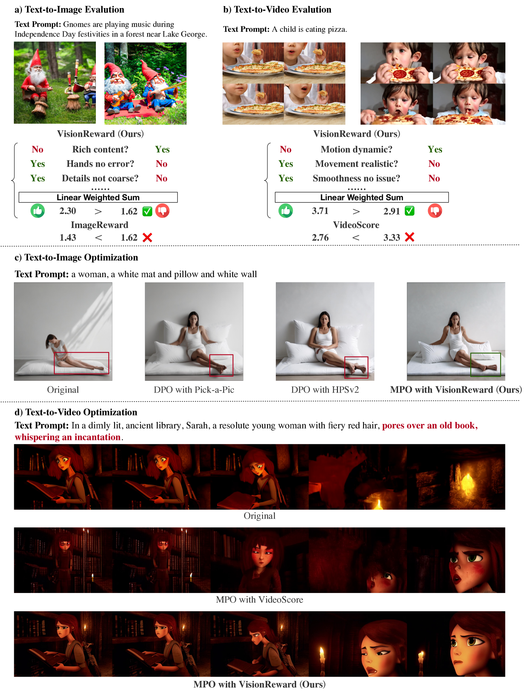
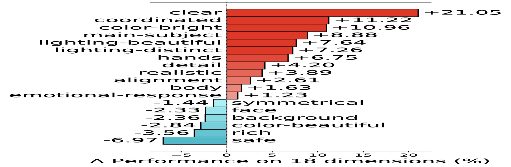

# VisionReward

## 📌 核心贡献

> 提出层次化多维度视觉偏好评估框架，将人类偏好分解为细粒度二值问题，通过可解释的线性加权学习偏好得分，并设计多维度偏好优化（MPO）策略确保 DPO 训练中各维度同步提升；在视频偏好预测上超越 VideoScore 17.2%。

## 📖 摘要

We present a framework for learning visual preferences in image and video generation. We employ a hierarchical visual assessment framework to capture fine-grained human preferences and utilize linear weighting for interpretable preference learning. VisionReward decomposes human preferences into multiple dimensions (5 for images, 9 for videos), each containing sub-dimensions (18 for images, 20 for videos), and creates 61-64 binary questions per modality. Through logistic regression on binary question outputs, VisionReward achieves transparent and interpretable preference scoring. We further propose Multi-dimensional Preference Optimization (MPO) to ensure consistent improvement across all dimensions during DPO training. VisionReward outperforms VideoScore by 17.2% in preference prediction accuracy and achieves 31.6% higher win rates for text-to-video models.

## 🔍 关键信息

| 字段 | 内容 |
|------|------|
| 机构 | Tsinghua University (THUDM) |
| 发表 | 2024-12-30 |
| 分类 | cs.CV |
| 链接 | [arXiv](https://arxiv.org/abs/2412.21059) |

## 📝 我的笔记

### 方法总览

### 核心问题/动机

现有视觉生成奖励模型存在两大问题：
1. **黑箱不可解释**：当前 RM 进行复杂偏好权衡但缺乏透明度，可能引入意外偏差
2. **视频评估不足**：图像 RM 基于帧级别评估，忽略视频的时序依赖；VideoScore 虽尝试视频评估，但偏好预测精度不够

### 方法

#### 阶段一：细粒度视觉评估

将人类偏好层次化分解：
- **图像**：5 个维度 → 18 个子维度 → 61 个二值问题
- **视频**：9 个维度 → 20 个子维度 → 64 个二值问题

每个问题从渐进式选项转化为 yes/no 二值问答。在 CogVLM2（图像）/ CogVLM2-Video（视频）上微调，使用平衡的正负样本。

训练配置：batch size 64，学习率 1e-6（图像）/ 4e-6（视频），1500 步。

#### 阶段二：可解释偏好学习

使用逻辑回归在二值问题输出上学习线性权重：

$$R = \sum_{i=1}^{N} w_i \cdot \mathbb{1}[A_i = \text{"yes"}]$$

其中 $w_i$ 是学习到的线性权重，$A_i$ 是二值问题回答。支持维度级别的子得分：

$$R(\text{dim}_k) = \sum_{i \in \text{dim}_k} w_i \cdot \mathbb{1}[A_i = \text{"yes"}]$$

学习目标：

$$\mathcal{L}(W) = -\mathbb{E}\left[y \cdot \log(\sigma(\Delta X \cdot W^T)) + (1-y) \cdot \log(1 - \sigma(\Delta X \cdot W^T))\right]$$

通过迭代权重掩码（Algorithm 1）确保所有权重为正相关。

#### 阶段三：多维度偏好优化（MPO）

MPO 的核心约束：偏好对选择要求一个样本在**所有维度**上同时优于另一个（dominating），而非仅整体偏好更高。这避免了优化某一维度时牺牲其他维度。

### 关键结果

#### 偏好预测精度

| 方法 | HPDv2 (τ) | MonetBench-Image (τ) | MonetBench-Video (τ) |
|------|-----------|----------------------|----------------------|
| ImageReward | 74.0 | 56.5 | 58.4 |
| HPSv2 | 83.3 | 55.6 | 62.5 |
| VideoScore | 76.8 | 52.5 | 54.9 |
| **VisionReward** | **81.7** | **59.5** | **72.1** |

#### MPO 策略有效性（CogVideoX-5B）

| 方法 | Alignment | Quality | Dynamic | Physics | Preservation | Overall |
|------|-----------|---------|---------|---------|--------------|---------|
| Original | 1.733 | 0.660 | 0.053 | 0.344 | 0.653 | 4.303 |
| DPO | 1.697 | 0.680 | 0.034 | 0.356 | 0.741 | 4.515 |
| **DPO w/ MPO** | **1.766** | **0.688** | **0.042** | **0.356** | **0.721** | **4.573** |

MPO 相比普通 DPO 提升 +27.4%，将更多偏好对转化为 dominating pairs（+31.8%）。

### Ablation

- **问题规模**：偏好预测精度随问题数量增加显著提升
- **训练集大小**：4K 样本后精度趋于稳定（200→4K：77.6→81.3）
- **MPO 粒度**：维度级别定义最优（dimension > sub-dimension > question level）

### 总结

VisionReward 的核心优势在于**可解释性**：通过线性加权将黑箱评分分解为可追溯的多维度贡献。MPO 策略有效避免了 DPO 训练中的维度间 trade-off 问题。但线性假设可能限制了对复杂偏好交互的建模能力。

## 🔗 相关论文

**基于/改进自：** [[ImageReward]]

**同方向：** [[VideoScore]], [[VideoAlign]], [[RewardDance]]
