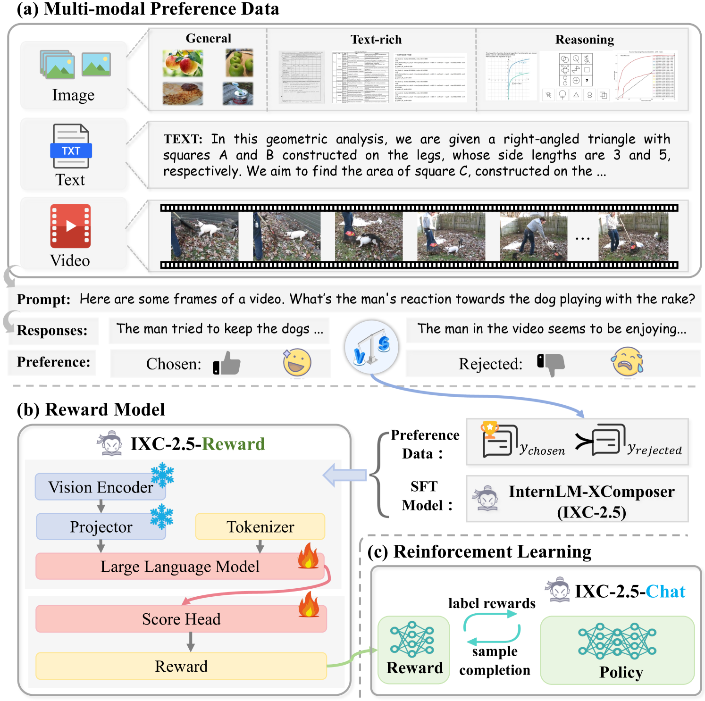
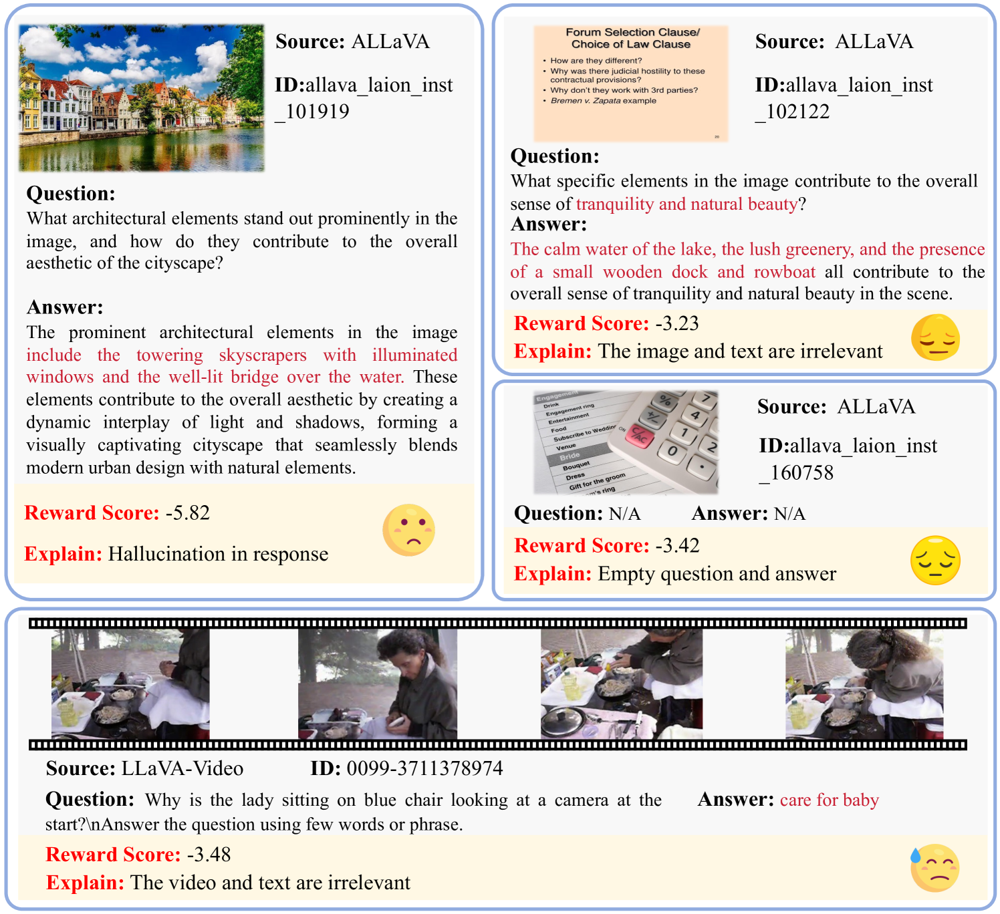
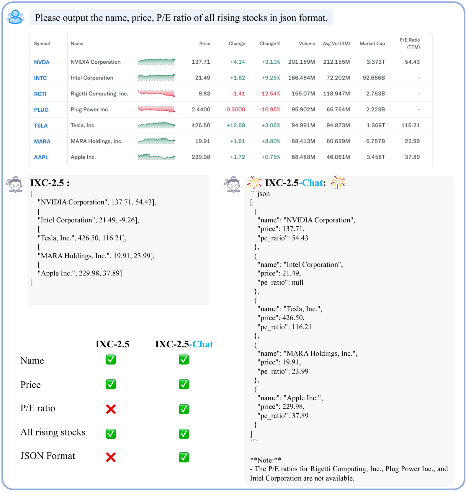

# IXC-2.5-Reward

## 📌 核心贡献

> 提出 IXC-2.5-Reward，一个基于 InternLM-XComposer2.5 的通用多模态奖励模型（ACL 2025），通过构建覆盖文本、图像、视频的高质量多模态偏好数据集，在 VL-RewardBench 上以 70.0% 超越 GPT-4o（62.4%）和 Gemini-1.5-Pro（62.5%），并展示了 RL 训练、test-time scaling 和数据清洗三大应用场景。

## 📖 摘要

Despite the promising performance of Large Vision Language Models (LVLMs) in visual understanding, they occasionally generate incorrect outputs. While reward models (RMs) with reinforcement learning or test-time scaling offer the potential for improving generation quality, a critical gap remains: publicly available multi-modal RMs for LVLMs are scarce, and the implementation details of proprietary models are often unclear. We bridge this gap with InternLM-XComposer2.5-Reward (IXC-2.5-Reward), a simple yet effective multi-modal reward model that aligns LVLMs with human preferences. To ensure the robustness and versatility of IXC-2.5-Reward, we set up a high-quality multi-modal preference corpus spanning text, image, and video inputs across diverse domains, such as instruction following, general understanding, text-rich documents, mathematical reasoning, and video understanding. IXC-2.5-Reward achieves excellent results on the latest multi-modal reward model benchmark and shows competitive performance on text-only reward model benchmarks. We further demonstrate three key applications of IXC-2.5-Reward: (1) Providing a supervisory signal for RL training. We integrate IXC-2.5-Reward with Proximal Policy Optimization (PPO) yields IXC-2.5-Chat, which shows consistent improvements in instruction following and multi-modal open-ended dialogue; (2) Selecting the best response from candidate responses for test-time scaling; and (3) Filtering outlier or noisy samples from existing image and video instruction tuning training data. To ensure reproducibility and facilitate further research, we have open-sourced all model weights and training recipes.

## 🔍 关键信息

| 字段 | 内容 |
|------|------|
| 机构 | Shanghai AI Laboratory |
| 发表 | 2025-01-21 (ACL 2025) |
| 分类 | cs.CV, cs.CL |
| 链接 | [arXiv](https://arxiv.org/abs/2501.12368) |

## 📝 我的笔记

### 方法总览

### 核心问题/动机

公开可用的多模态奖励模型极其稀缺，且商业模型（如 GPT-4o 作为 judge）的实现细节不透明。现有 RM 大多局限于纯文本或单一视觉模态，缺乏一个**同时支持 text + image + video 的通用 RM**。论文旨在填补这一空白，提供一个简单而有效的开源方案。

### 方法

#### 1. 模型架构

基于 InternLM-XComposer2.5（IXC-2.5），进行以下改造：
- **冻结**视觉编码器和 MLP 投影层（保留预训练权重）
- **训练** LLM 部分 + 新增的 score head $f$
- Score head 将所有 token 的平均隐状态特征映射为**标量奖励值** $r(x, y)$

#### 2. 训练损失

采用 Bradley-Terry 偏好损失：

$$\mathcal{L}_{RM} = -\mathbb{E}\left[\log \sigma\left(r(x, y_w) - r(x, y_l)\right)\right]$$

其中 $y_w$ 为 chosen response，$y_l$ 为 rejected response，$\sigma$ 为 sigmoid 函数。

#### 3. 多模态偏好数据集

构建覆盖多领域的偏好数据，分为已有数据集和新采集数据：

**已有数据集：**

| 模态 | 数据集 |
|------|--------|
| Text | UltraFeedback, Tulu-3-IF, safety datasets |
| Image | WildVision-Battle, LLaVA-Critic, VL-Feedback |
| Video | TrafficQA, FunQA, MiraData |

**新采集数据：**

| 类型 | 内容 |
|------|------|
| 图像-通用 | 通用指令跟随 |
| 图像-文本密集 | 文档、图表理解 |
| 图像-推理 | 几何、数学推理 |
| 视频-通用 | 多领域视频理解 |

Rejected response 生成策略：SFT 模型生成多个输出，通用和文本密集数据用 GPT-4o pairwise 评估选择较差回答，数学/指令跟随数据用验证函数与 ground truth 对比。

#### 4. 长度约束

论文发现 LLM-as-judge 的**长度偏差问题**在多模态 RM 中同样严重。移除长度约束后 benchmark 分数提升（WildVision 74.6% -> 76.2%），但生成长度显著增加（274 -> 361 tokens），为用户体验选择保留约束。

#### 5. 三大应用场景

**应用 1：PPO 强化学习训练**

以 IXC-2.5-Reward 作为奖励信号，采用 PPO 训练 IXC-2.5-Chat：
- 优势估计：$A_t = \delta_t + \gamma \beta A_{t+1}$
- 策略梯度：$\min\left(\frac{\pi_\theta}{\pi_{ref}} A, \text{clip}\left(\frac{\pi_\theta}{\pi_{ref}}, 1-\epsilon, 1+\epsilon\right) A\right)$
- 超参数：$\gamma=0.99$, $\beta=0.95$, $\epsilon=0.2$

**应用 2：Test-Time Scaling (Best-of-N)**

生成 N 个候选回答（不同 seed），用 RM 打分选最优。Best-of-4 即可在几乎不增加长度（274 -> 283 tokens）的情况下将 WildVision 从 74.6% 提升至 77.7%。

**应用 3：数据清洗**

用 RM 分数检测训练数据中的异常样本（幻觉、空答案、内容不匹配），低分样本高度关联低质量数据。

### 关键结果

#### VL-RewardBench（多模态 RM 基准）

| 模型 | 参数量 | Macro Acc | Overall |
|------|--------|-----------|---------|
| GPT-4o | — | 62.4% | — |
| Gemini-1.5-Pro | — | 62.5% | — |
| **IXC-2.5-Reward** | **7B** | **70.0%** | **65.8%** |

#### Reward-Bench（纯文本 RM 基准）

| 模型 | Average |
|------|---------|
| INF-ORM-Llama3.1-70B | 95.1% |
| **IXC-2.5-Reward (7B)** | **88.6%** |

以 7B 参数量在纯文本基准上取得具有竞争力的表现。

#### RM-Bench

| 模型 | Average (Easy/Normal/Hard) |
|------|---------------------------|
| **IXC-2.5-Reward** | **68.8%** |

#### PPO 训练后的 IXC-2.5-Chat 效果

| 指标 | IXC-2.5-Chat (PPO) | 之前 SOTA |
|------|---------------------|-----------|
| WildVision | 74.6% | 67.3% |
| MIA | 84.0% | 80.7% |
| MM-MT | 5.70 | 5.45 |

#### Test-Time Scaling (Best-of-N)

| 方法 | Avg Tokens | WildVision |
|------|-----------|------------|
| IXC-2.5-Chat | 274 | 74.6% |
| Best-of-4 | 283 | 77.7% |

Best-of-N 的增益来自质量而非长度，验证了 RM 评分的有效性。

### Ablation: 长度约束的影响

| 设置 | Avg Tokens | WildVision |
|------|-----------|------------|
| 有长度约束 | 274 | 74.6% |
| 无长度约束 | 361 | 76.2% |

移除约束提升 benchmark 分数但导致过长输出，说明 benchmark 分数与用户体验间存在 trade-off。

### 总结

IXC-2.5-Reward 以简洁的设计（冻结视觉编码器 + 训练 LLM + score head）和精心构建的多模态偏好数据集，实现了 7B 参数量下超越 GPT-4o 和 Gemini-1.5-Pro 的 RM 性能。论文的核心价值在于：(1) 证明了开源多模态 RM 可以超越闭源模型；(2) 展示了 RM 在 PPO 训练、test-time scaling 和数据清洗三个场景的实用性；(3) 揭示了长度偏差在多模态 RM 中的重要性。作为开源工作，完整公开了权重和训练配方，具有很好的可复现性。

## 🔗 相关论文

**基于/改进自：** [[InternLM-XComposer2.5]]

**同方向：** [[UnifiedReward]], [[LLaVA-Critic]]
