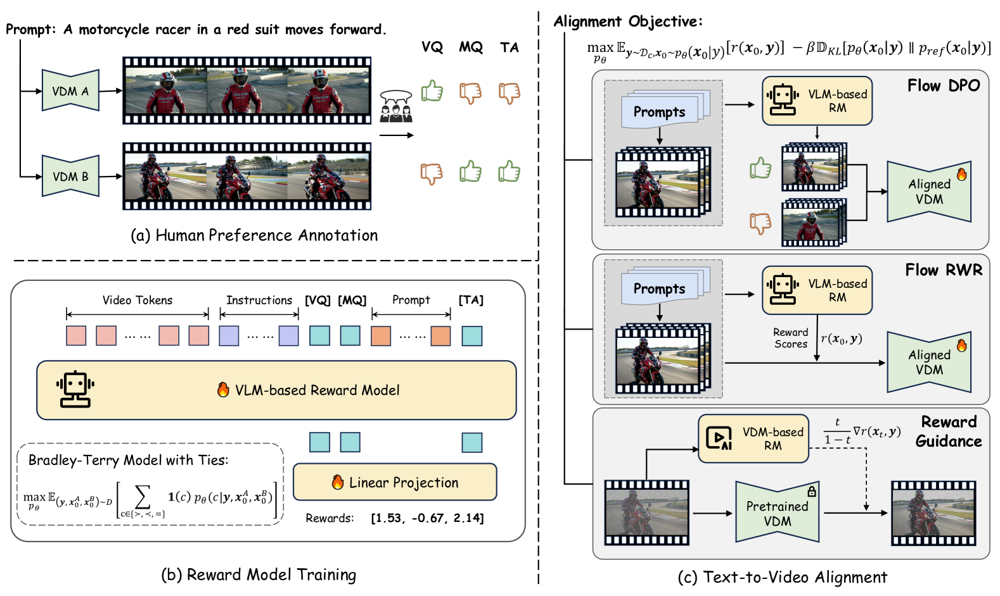
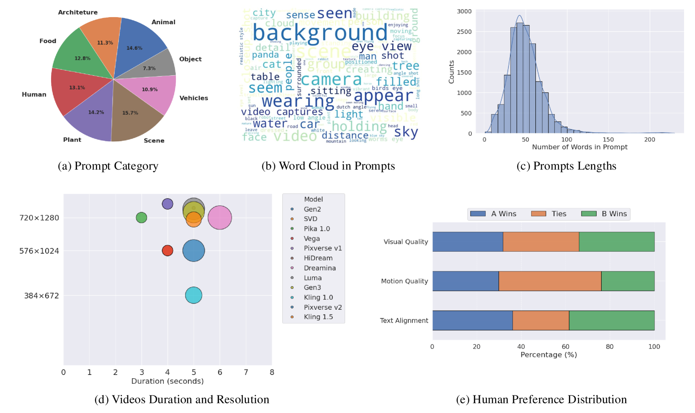
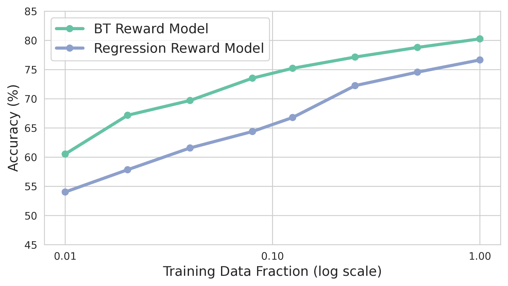

# VideoAlign

## 📌 核心贡献

> 构建完整的视频生成人类反馈对齐流水线：182K 现代 T2V 模型偏好标注数据集 + 基于 Bradley-Terry-with-Ties 的多维度视频奖励模型 VideoReward + 三种 Flow-based 对齐算法（Flow-DPO/Flow-RWR/Flow-NRG），发现 Flow-DPO 使用常数 β 显著优于理论推导的时序依赖 β_t 调度。

## 📖 摘要

Video generation has achieved significant advances through rectified flow techniques, but issues like unsmooth motion and misalignment between videos and prompts persist. We develop a systematic pipeline incorporating human feedback: (1) a large-scale preference dataset with 182K annotated triplets from 12 representative text-to-video models, rated across visual quality, motion quality, and text alignment; (2) VideoReward, a multi-dimensional reward model based on Qwen2-VL-2B with Bradley-Terry-with-Ties formulation and context-aware token positioning; (3) three complementary alignment algorithms—Flow-DPO and Flow-RWR for training-time optimization, and Flow-NRG for inference-time guidance. Flow-DPO with constant KL regularization demonstrates superior performance compared to both Flow-RWR and supervised fine-tuning methods.

## 🔍 关键信息

| 字段 | 内容 |
|------|------|
| 机构 | Kuaishou Technology |
| 发表 | 2025-01-23 |
| 分类 | cs.CV, cs.AI, cs.GR, cs.LG |
| 链接 | [arXiv](https://arxiv.org/abs/2501.13918) |

## 📝 我的笔记

### 方法总览

### 核心问题/动机

1. **数据过时**：现有偏好数据集收集自 pre-Sora 时代的低分辨率短视频模型，与现代高保真视频生成能力严重不匹配
2. **奖励模型泛化差**：VideoScore 等在旧数据上训练的 RM 对现代模型的区分力极低（benchmark 上仅 41.8%）
3. **Flow 模型对齐空白**：将 RLHF 从扩散模型适配到 Rectified Flow 模型引入新的技术问题

### 方法

#### A. 偏好数据集构建

- **规模**：182K 标注三元组，来自 12 个 T2V 模型生成的 108K 视频，基于 16K 精选 prompt
- **三维度标注**：
  - Visual Quality (VQ)：空间保真度和伪影评估
  - Motion Quality (MQ)：时序连贯性和运动流畅度
  - Text Alignment (TA)：与输入 prompt 的语义一致性
- 每个三元组标注 pairwise 偏好（A 胜 / 平局 / B 胜）+ 个体 1-5 Likert 打分

#### B. VideoReward 奖励模型

**基座**：Qwen2-VL-2B（轻量级 VLM）

**三个设计创新**：

**1. Bradley-Terry with Ties (BTT)**

标准 BT 模型仅建模二元胜负，BTT 引入平局概率：

$$P_\theta(\text{tie} \mid x_A, x_B) = \frac{(\theta^2 - 1) \cdot e^{r_A} \cdot e^{r_B}}{(e^{r_A} + \theta \cdot e^{r_B})(\theta \cdot e^{r_A} + e^{r_B})}$$

参数 $\theta = 5.0$ 控制平局倾向。BTT 将平局样本聚集在 $\Delta r \approx 0$ 附近，同时保持明确胜负样本的大间距。

**2. Context-Aware Token Positioning**

- `[VQ]`, `[MQ]` token 放置在视频之后、prompt 之前——仅关注视觉内容
- `[TA]` token 放置在完整 prompt 之后——允许全模态上下文

消除 "context leakage"：同一视频搭配不同 prompt 时不会得到不同的视觉质量分。

**3. BT 优于回归**

Bradley-Terry 范式在所有数据量下一致优于 pointwise MSE 回归，因为 pairwise 标注更有效捕获细微相对差异。

#### C. 三种对齐算法

统一 RL 目标：

$$\max_{p_\theta} \mathbb{E}[r(x_0, y)] - \beta \cdot D_{\text{KL}}[p_\theta(x_0|y) \| p_{\text{ref}}(x_0|y)]$$

**Flow-DPO（训练时，主推）**：

$$\mathcal{L}_{\text{FD}} = -\mathbb{E}\left[\log \sigma\left(-\frac{\beta}{2}\left(\|v^w - v_\theta(x_t^w, t)\|^2 - \|v^w - v_{\text{ref}}(x_t^w, t)\|^2 - (\|v^l - v_\theta(x_t^l, t)\|^2 - \|v^l - v_{\text{ref}}(x_t^l, t)\|^2)\right)\right)\right]$$

**关键发现**：理论推导的时序依赖 $\beta_t = \beta(1-t)^2$ 导致模型在高噪声层过度优化，引发 reward hacking。**使用常数 β 显著优于 β_t 调度**，与 DDPM 中去除 loss 加权可提升样本质量的发现一致。

**Flow-RWR（训练时）**：奖励加权回归，按 $\exp(r)$ 加权 velocity loss。

**Flow-NRG（推理时，无需训练）**：

$$\tilde{v}_t(x_t|y) = v_t(x_t|y) - w \cdot \frac{t}{1-t} \cdot \nabla r(x_t, y)$$

类似 classifier guidance，在推理时将轨迹引向高奖励区域，支持用户自定义维度权重。

### 关键结果

#### 奖励模型评估（VideoGen-RewardBench）

| 方法 | Overall Acc (w/ Ties) | VQ Acc | MQ Acc | TA Acc |
|------|----------------------|--------|--------|--------|
| Random | 41.86% | 47.42% | 59.07% | 37.25% |
| VideoScore | 41.80% | 47.41% | 59.05% | 37.24% |
| LiFT | 39.08% | 47.53% | 59.04% | 33.79% |
| VisionReward | 56.77% | 47.43% | 59.03% | 46.56% |
| **VideoReward** | **61.26%** | **59.68%** | **66.03%** | **53.80%** |

#### 多维度对齐结果（VQ:MQ:TA = 1:1:1）

| 方法 | VQ Win Rate | MQ Win Rate | TA Win Rate | VBench Quality |
|------|------------|------------|------------|----------------|
| Pretrained | 50.0% | 50.0% | 50.0% | 83.19 |
| SFT | 51.28% | 65.21% | 52.84% | 82.31 |
| Flow-RWR | 51.55% | 63.9% | 53.43% | 82.27 |
| Flow-DPO (β_t) | 87.78% | 82.36% | 51.02% | 80.90 |
| **Flow-DPO (const β)** | **93.42%** | **69.08%** | **75.43%** | **83.41** |

#### 文本对齐专项（TA Focus）

| 方法 | TA Win (VideoGen-Eval) | TA Win (TA-Hard) |
|------|----------------------|------------------|
| Pretrained | 50.00% | 50.00% |
| Flow-DPO (β_t) | 63.67% | 71.83% |
| **Flow-DPO (const β)** | **69.09%** | **84.51%** |

### Ablation

- **BT vs 回归**：BT 在所有数据量下一致优于回归，且差距随数据量增大
- **BTT 处理平局**：标准 BT 对平局样本赋予过大 Δr，BTT 有效聚集在零附近
- **Context-aware token**：消除 context leakage，稳定视觉/运动评估
- **常数 β vs β_t**：常数 β 全面优于时序调度，避免 reward hacking（β_t 下 TA-Hard 从 50% 降到 28%）

### 总结

这是一个非常完整的视频生成对齐 pipeline。核心技术贡献有三：(1) BTT 对平局的优雅处理，(2) context-aware token positioning 消除 context leakage，(3) 常数 β 优于理论 β_t 的实证发现。Flow-NRG 的推理时引导特别实用——用户可在推理时自定义 VQ/MQ/TA 权重比例，无需重新训练。

## 🔗 相关论文

**基于/改进自：** [[VideoScore]]

**同方向：** [[VisionReward]], [[LiFT]], [[RewardDance]]
