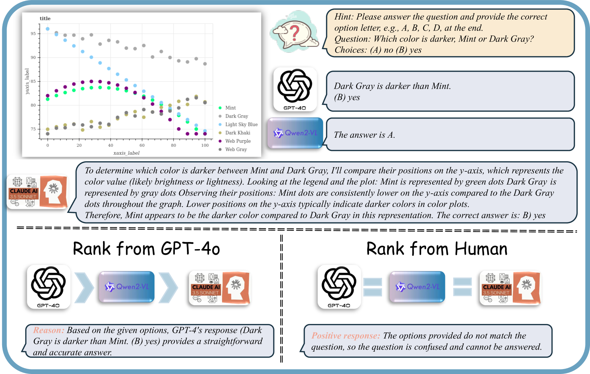
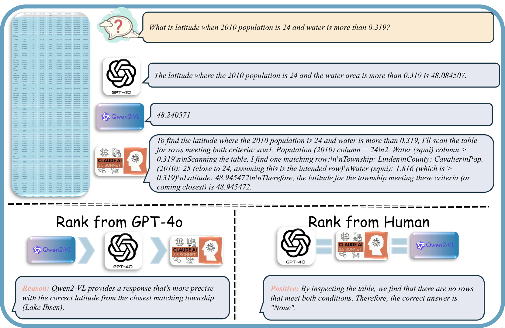
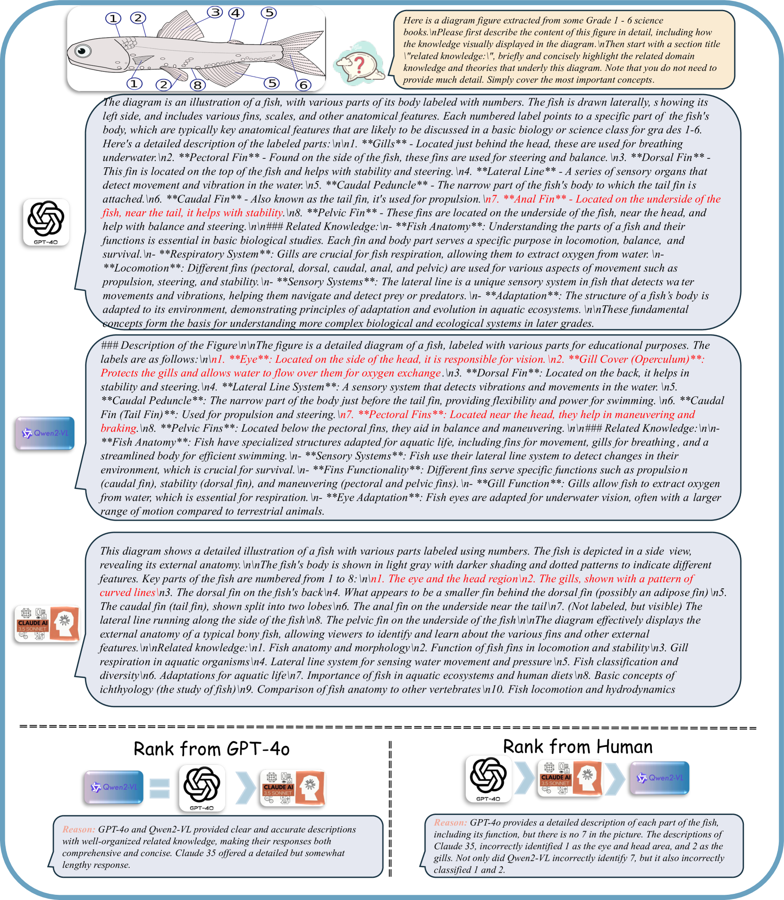

# MM-RLHF

## 📌 核心贡献

> 构建包含 120K 细粒度人类标注偏好对的多模态对齐数据集 MM-RLHF，并提出 Critique-Based Reward Model 和 Dynamic Reward Scaling（MM-DPO），在 10 个维度 27 个基准上显著提升 MLLM 的对话能力（+19.5%）和安全性（+60%）。

## 📖 摘要

Despite notable advancements in Multimodal Large Language Models (MLLMs), most state-of-the-art models have not undergone thorough alignment with human preferences. This gap exists because current alignment research has primarily achieved progress in specific areas (e.g., hallucination reduction), while the broader question of whether aligning models with human preferences can systematically enhance MLLM capability remains largely unexplored. To this end, we introduce MM-RLHF, a dataset containing 120k fine-grained, human-annotated preference comparison pairs. This dataset represents a substantial advancement over existing resources, offering superior size, diversity, annotation granularity, and quality. Notably, we introduce a Critique-Based Reward Model, which generates critiques of model outputs before assigning scores, offering enhanced interpretability and more informative feedback compared to traditional scalar reward mechanisms. Additionally, we propose Dynamic Reward Scaling, a method that adjusts the loss weight of each sample according to the reward signal, thereby optimizing the use of high-quality comparison pairs.

## 🔍 关键信息

| 字段 | 内容 |
|------|------|
| 机构 | KuaiShou / CASIA |
| 发表 | 2025-02-14 |
| 分类 | cs.CL, cs.CV |
| 链接 | [arXiv](https://arxiv.org/abs/2502.10391) |

## 📝 我的笔记

### 方法总览

### 动机与问题定义

现有 MLLM 大多停留在 SFT 阶段，缺乏系统的人类偏好对齐。已有对齐工作仅关注特定领域（如减少幻觉），未能全面提升模型能力。核心问题：人类偏好对齐能否系统性地增强 MLLM 的综合能力？

### 方法细节

**MM-RLHF 数据集构建：**
1. **数据收集**：从多源收集 1000 万多模态指令样本
2. **数据筛选**：通过 CLIP 聚类和重采样，提取 30K 代表性样本
3. **回复生成**：使用 Claude 3.5-Sonnet、Qwen2-VL-72B 等 SOTA 模型生成回复
4. **人类标注**：50+ 标注者历时 2 个月，对回复进行评分、排序和文本解释

标注维度：**Helpfulness**（有用性）、**Faithfulness**（忠实性）、**Ethical Considerations**（伦理）

数据集统计：Image-Long 9,575 + Image-Short 12,063 + MCQ 2,125 + Safety 1,999 + Video 4,235 = 总计 29,997

**Critique-Based Reward Model：**

传统奖励模型输出标量值，缺乏可解释性。Critique-Based RM 包含两个组件：

1. **Critique Head（$h_l$）**：生成评语 $c$，训练损失：

$$\ell_{\text{Critique}}(\theta) = \mathbb{E}_{x,y,c} \left[ -\sum_{t=1}^{|c|} \log \pi_\theta(c_t | c_{<t}, \mathbf{x}, y) \right]$$

2. **Scoring Head（$h_r$）**：基于评语生成标量奖励，使用 teacher-forcing：

$$\ell_{\text{Score}}(\theta) = \mathbb{E}_{x,y_w,y_l} \left[ -\log \sigma\left(r(\mathbf{x}, y_w, c_w) - r(\mathbf{x}, y_l, c_l)\right) \right]$$

联合训练：$\ell_{\text{Total}} = \ell_{\text{Critique}} + \ell_{\text{Score}}$

**MM-DPO（Dynamic Reward Scaling）：**

在标准 DPO 基础上引入动态 $\beta$ 缩放：

$$\beta(\delta) = \beta_{\text{ori}} \left(1 + w(1 - e^{-k\delta})\right)$$

其中 $\delta = r(y_w) - r(y_l)$ 为奖励边际。高置信度样本（大 $\delta$）获得更大的更新权重。

### 关键结果

**MM-RLHF-Reward-7B** 在奖励模型基准上取得 SOTA，超越多个 72B 规模模型。

**对齐效果（LLaVA-ov-7B）：**
- 对话能力平均提升 >10%，WildsVision 胜率增加 50%+
- 不安全行为减少 50%+
- 幻觉、数学推理、多图像理解等维度均有显著改善

### 总结评价

MM-RLHF 是目前最大规模的多模态人类偏好对齐数据集和方法框架。Critique-Based RM 提供了可解释的奖励信号，Dynamic Reward Scaling 的实例级 $\beta$ 调整在多模态场景下表现稳定。实验验证了人类偏好对齐可以全面提升 MLLM 能力，而非仅改善特定维度。

## 🔗 相关论文

**同方向：** [[LLaVA-RLHF]], [[UnifiedReward]]
