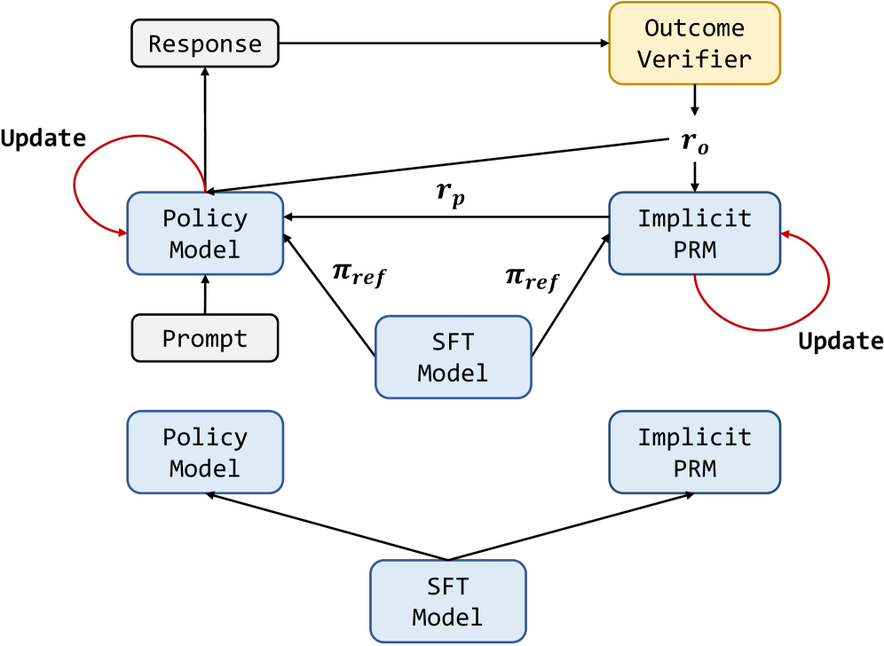
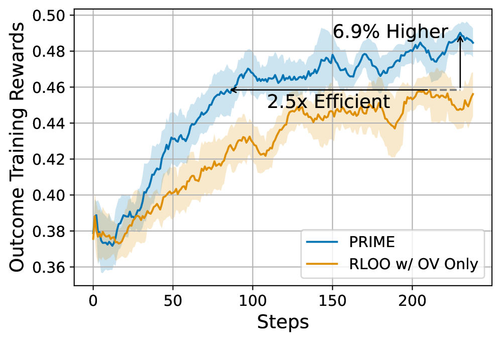
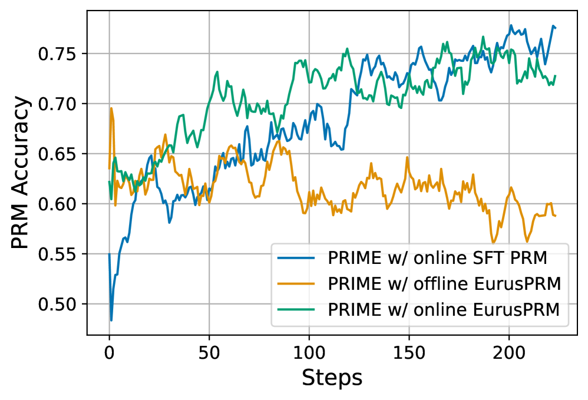

# PRIME

## 📌 核心贡献

> 提出 PRIME 方法，通过隐式过程奖励（Implicit Process Rewards）实现无需专用过程奖励模型（PRM）训练和步骤级标注的在线过程强化学习，仅用结果标签即可提供密集的过程级奖励信号，在数学和代码推理任务上取得显著提升。

## 📖 摘要

Dense process rewards have proven a more effective alternative to sparse outcome-level rewards in inference-time scaling of large language models, particularly in complex multi-step reasoning tasks. While dense rewards offer benefits for RL of LLMs through fine-grained rewards addressing outcome reward limitations, this potential remains largely unrealized due to challenges in training process reward models online with expensive process labels, making them vulnerable to reward hacking. PRIME (Process Reinforcement through IMplicit rEwards) enables online PRM updates using policy rollouts and outcome labels through implicit process rewards, combining with various advantage functions while eliminating dedicated reward model training. Results on competitive math and coding show 15.1% average improvement across reasoning benchmarks from Qwen2.5-Math-7B-Base, with Eurus-2-7B-PRIME surpassing Qwen2.5-Math-7B-Instruct on seven benchmarks using 10% of training data.

## 🔍 关键信息

| 字段 | 内容 |
|------|------|
| 机构 | Tsinghua University, Shanghai AI Lab, UIUC, Peking University, SJTU, CUHK |
| 发表 | 2025-02-03 |
| 分类 | cs.LG, cs.AI, cs.CL |
| 链接 | [arXiv](https://arxiv.org/abs/2502.01456) |

## 📝 我的笔记

### 方法总览

### 动机与问题定义

过程奖励模型（PRM）能为 LLM 推理提供密集的步骤级奖励信号，但现有方法面临三个核心挑战：

1. **奖励定义困难（C1）**：推理步骤的中间正确性缺乏明确定义，步骤级标注成本极高
2. **可扩展性差（C2）**：在线更新 PRM 需要大量精细标注，泛化能力受限
3. **训练开销大（C3）**：训练专用奖励模型需要额外的数据覆盖和开发成本

PRIME 的核心洞察：**利用隐式过程奖励，仅通过结果级标签训练 Implicit PRM，完全绕过步骤级标注需求**，同时支持在线更新以防止 reward hacking。

### 方法细节

#### 隐式过程奖励（Implicit Process Reward）

PRIME 的核心公式——token 级隐式奖励定义为奖励模型与参考模型的对数概率比：

$$r_\phi(y_t) := \beta \log \frac{\pi_\phi(y_t | y_{<t})}{\pi_{\text{ref}}(y_t | y_{<t})}$$

其中 $\pi_\phi$ 是 Implicit PRM，$\pi_{\text{ref}}$ 是参考模型（可以是 SFT 模型或策略模型自身）。这一公式源自 DPO 中隐式奖励的推导，将 token 级别的概率差异作为过程奖励信号。

#### 优势估计（Advantage Estimation）

最终优势由过程奖励回报和结果奖励回报两部分组成：

- **过程奖励回报**：步骤级隐式奖励的折扣累加，使用 leave-one-out 基线降低方差
- **结果奖励回报**：leave-one-out 归一化的最终结果奖励
- **最终优势** = 过程奖励回报 + 结果奖励回报

#### 策略更新

使用 PPO 的 clipped surrogate loss 进行策略更新，防止过大的策略偏移。

#### 算法流程（Algorithm 1）

1. 从基础/SFT 模型初始化策略、Implicit PRM 和参考模型
2. 对每个 prompt 采样 K 个响应
3. 通过结果验证器按准确率范围筛选 prompt（在线 prompt 过滤）
4. 计算隐式过程奖励
5. 使用交叉熵损失和结果标签在线更新 Implicit PRM
6. 计算 token 级优势（结合过程奖励和结果奖励）
7. 使用 PPO loss 更新策略
8. 重复 N 次迭代

### 关键设计选择

- **在线 PRM 更新**：防止分布偏移导致的 reward hacking，离线 PRM 的分类准确率会从 ~95% 降至 ~50%
- **SFT 模型初始化**：从 SFT 模型初始化 Implicit PRM 反而优于专门训练的 PRM，因为同模型初始化天然缓解分布偏移
- **Leave-one-out 基线**：跨 K 个样本降低优势估计方差

### 关键实验结果

#### 主实验（基于 Qwen2.5-Math-7B-Base）

| Benchmark | Eurus-2-7B-PRIME | RLOO w/ OV | SFT Baseline |
|-----------|------------------|-----------|--------------|
| AIME 2024 | 26.7% | 20.0% | - |
| AMC | 57.8% | 50.6% | - |
| MATH-500 | 79.2% | 78.2% | - |
| MinervaMath | 38.6% | 39.3% | - |
| OlympiadBench | 42.1% | 40.3% | - |
| LeetCode | 33.3% | 31.1% | - |
| LiveCodeBench | 28.6% | 27.5% | - |
| **Average** | **43.9%** | **41.0%** | - |

核心数据：
- 相对 SFT 基线 **15.1% 平均提升**
- 在 AIME 和 AMC 上提升超过 **20%**
- 仅用 **10% 训练数据** 即超越 Qwen2.5-Math-7B-Instruct

#### 效率分析

| 组件 | PRIME (s) | RLOO (s) |
|------|-----------|---------|
| Rollout | 281.7 | 282.4 |
| Policy Update | 156.6 | 157.9 |
| PRM Update | 150.9 | 0 |
| Others | 91.1 | 90.4 |
| **Total** | **680.3** | **530.7** |

PRIME 每步多 24% 时间开销，但仅需 40% 的步数达到同等效果，综合 **2 倍加速**。

#### 算法兼容性

PRIME 可与多种策略梯度方法结合：

| 算法 | 无 PRIME | 有 PRIME | 提升 |
|------|---------|---------|------|
| RLOO | - | - | +4.1% |
| REINFORCE | - | - | +1.8% |
| GRPO | - | - | +1.7% |
| PPO | - | - | +3.6% |

### Ablation 分析

1. **在线 vs 离线 PRM**：离线 PRM 由于分布偏移导致准确率急剧下降，在线更新保持稳定
2. **PRM 初始化**：SFT 模型初始化 > 专门训练的 PRM，说明同分布初始化更重要
3. **Value Model 对比**：PRIME 的隐式过程奖励（37.8%）优于专用 Value Model（35.8%），说明奖励信号比价值估计更适合优势计算
4. **扩展实验**：延长至 800 步仍持续提升 3.7%；增加每 prompt 的 rollout 数至 16 提升 4.4%

### 总结性评价

PRIME 是过程奖励领域的一个优雅解决方案。它巧妙地利用 DPO 中隐式奖励的思想，将过程奖励的获取从"需要昂贵步骤级标注训练专用 PRM"简化为"利用结果标签在线更新共享模型"，同时从根本上解决了离线 PRM 的分布偏移问题。方法简洁但效果显著，兼容多种 RL 算法，且在效率上反而更优（因为样本效率的提升远超额外计算开销）。

## 🔗 相关论文

**基于/改进自：** [[PRM800K]]

**同方向：** [[Math-Shepherd]], [[DPO]]
