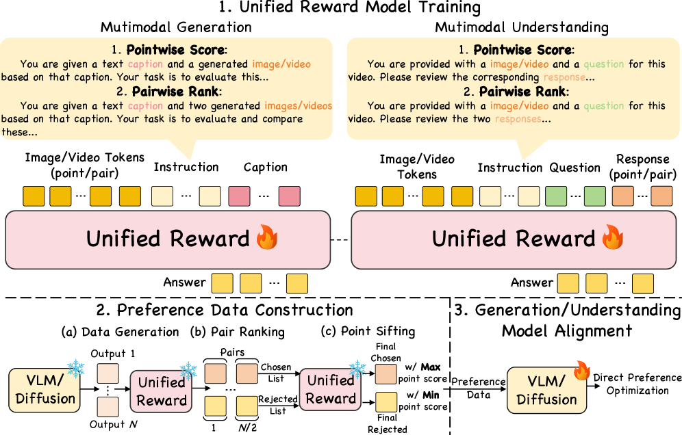
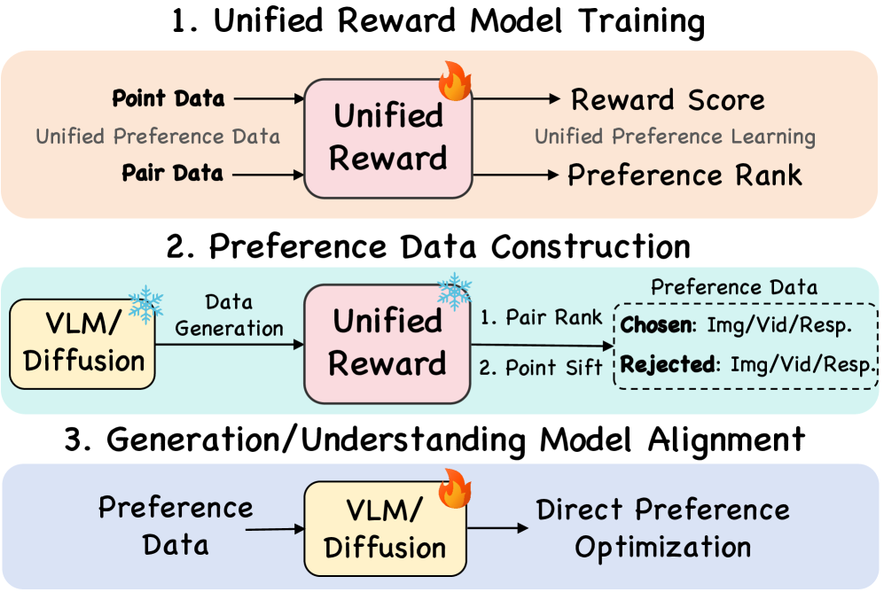
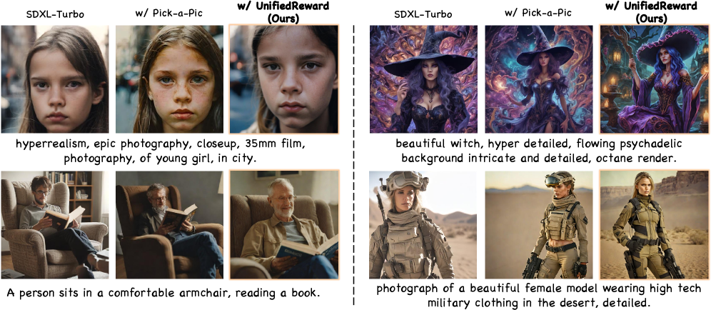

# UnifiedReward

## 📌 核心贡献

> 提出首个统一的多模态奖励模型 UnifiedReward，同时支持图像/视频的理解与生成评估，并通过 pairwise ranking + pointwise scoring 双模式以及两阶段过滤策略自动构建高质量偏好数据，用于 DPO 对齐视觉模型。

## 📖 摘要

Reward models play a pivotal role in aligning vision models with human preferences. However, existing reward models typically focus on a single domain--either multimodal understanding or visual generation--limiting their ability to provide a holistic assessment. To bridge this gap, we propose UnifiedReward, the first unified reward model for multimodal understanding and generation assessment. UnifiedReward supports both pairwise ranking and pointwise scoring to align vision models with human preferences. To achieve this, we first construct a large-scale human preference dataset encompassing both image and video tasks for multimodal understanding and generation. We then develop a two-stage filtering strategy using UnifiedReward to automatically generate high-quality preference data for Direct Preference Optimization. Experiments demonstrate that jointly learning to assess diverse visual tasks yields substantial mutual benefits, leading to significant improvements across multiple benchmarks for both multimodal understanding and generation alignment.

## 🔍 关键信息

| 字段 | 内容 |
|------|------|
| 机构 | Fudan University & Shanghai AI Lab |
| 发表 | 2025-03-07 |
| 分类 | cs.CV |
| 链接 | [arXiv](https://arxiv.org/abs/2503.05236) |

## 📝 我的笔记

### 方法总览

### 核心问题/动机

现有奖励模型各自为营：理解侧（如 LLaVA-Critic）和生成侧（如 ImageReward、PickScore）分别独立训练，无法跨域评估。论文认为**理解与生成的评估能力存在互利关系**——联合训练可以相互促进。

### 方法

#### 1. 统一偏好数据集构建

覆盖四大领域、约 236K 样本：

| 领域 | 数据集 | 规模 |
|------|--------|------|
| 图像生成 | EvalMuse + HPD + OIP | ~65.7K |
| 图像理解 | LLaVA-Critic | ~50K |
| 视频生成 | VideoDPO + LiFT-HRA + VideoFeedback | ~66.6K |
| 视频理解 | ShareGPTVideo | ~51K |

每个数据集同时提供 pairwise（pair ranking）和 pointwise（打分）标注。

#### 2. 统一奖励模型

基座模型：**LLaVA-OneVision 7B**

支持双模式评估：
- **Pairwise Ranking**：输入两个候选，输出 "A is better" / "B is better"
- **Pointwise Scoring**：输入单个候选，输出 1-10 分数

训练设置：8×H100，batch size 2，gradient accumulation 16，学习率 $2.5 \times 10^{-6}$，cross-entropy loss 仅计算预测 answer 部分。

#### 3. 两阶段偏好数据过滤

用训练好的 UnifiedReward 自动生成高质量偏好数据：

1. **Pair Ranking**：模型生成 N 个候选，两两配对，分类为 chosen/rejected
2. **Point Sifting**：对 chosen 组取最高分、rejected 组取最低分，构成最终偏好对

### 关键结果

| 任务 | 指标 | UnifiedReward | 最佳基线 |
|------|------|--------------|---------|
| 图像理解 (VLRewardBench) | Accuracy | **66.1%** | 46.9% (LLaVA-Critic) |
| 视频理解 (ShareGPTVideo) | Accuracy | **84.0%** | 48.2% (baseline) |
| 图像生成 (GenAI-Bench) | Diff | 超越 PickScore, HPSv2 | — |
| DPO 对齐 (LLaVABench) | Score | +3.4% | — |
| DPO 对齐 (MSRVTT) | Score | +12.2% | — |

### 跨任务迁移分析：Understanding 对 Generation 评估的贡献

这是 UnifiedReward 最关键的实验发现（Table IX）。

**Table IX(B) 跨任务迁移矩阵：**

| 训练数据 | VLRewardBench (理解) | ShareGPTVideo (理解) | GenAI Image (生成) | GenAI Video (生成) |
|---------|---------------------|---------------------|-------------------|-------------------|
| Baseline（无训练） | 29.6 | 48.2 | 53.2 | 50.2 |
| 仅图像理解 | 47.4 | 61.5 | **61.8** | 52.5 |
| 仅图像生成 | 41.0 | 55.8 | 64.0 | 55.2 |
| 仅视频理解 | 40.2 | 74.2 | 57.5 | 57.8 |
| 仅视频生成 | 36.0 | 62.7 | 60.2 | 62.4 |
| 单任务（step-matched） | 49.0 | 75.5 | 65.0 | 63.1 |
| **UnifiedReward** | **66.1** | **84.0** | **70.9** | **79.3** |

**核心发现：**

1. **Understanding 能力可迁移到 Generation 评估**：仅用图像理解数据训练，在图像生成评估（GenAI Image）上达到 61.8，接近图像生成专用模型的 64.0（96.6%），说明理解能力本身就包含了大部分生成质量评估能力。

2. **跨任务增益不是数据量效应**：step-matched 单任务模型（等量训练步数）仅达到 65.0/63.1，而统一训练达到 70.9/79.3，增益来自**真正的跨任务协同**。

3. **视频生成评估受益最大**：统一训练在 GenAI Video 上达到 79.3，vs 单独视频生成训练的 62.4（+16.9），这是所有指标中最大的跨任务增益。

4. **迁移方向不对称**：理解→生成的迁移比生成→理解更有效。图像理解训练在生成评估上达到 61.8，而图像生成训练在理解评估上仅 41.0。

**解释**：作者认为"improved image understanding may improve the evaluation of image generation by providing more accurate assessment of content quality"——理解能力提供了更准确的内容质量判断基础，这对生成评估至关重要。

**对 Flex 的启示**：Flex 放弃理解任务可能损失了一部分跨任务协同增益。这个 trade-off 是否值得，取决于 Qwen3-VL 基座自身的理解能力是否足以弥补。

### 总结

UnifiedReward 的核心洞察是**理解与生成的评估能力可以互利**——联合训练比单独训练效果更好，且增益不来自数据量而来自跨任务协同。两阶段过滤策略（先 pair ranking 后 point sifting）有效提升了自动构建的偏好数据质量。

### 系列演进定位

作为 UnifiedReward 系列**开山之作**，奠定了统一四任务评估的基础范式。

**本版局限（后续版本改进方向）：**
- 直接输出评分，无推理过程 → **Think** 引入 CoT 推理，VLRewardBench 66.1% → 73.8%
- 固定评估维度 → **Flex** 引入动态个性化层级评估
- 基座 LLaVA-OneVision 7B 单一规模 → **Flex** 切换至 Qwen3-VL（2B-32B 多规模）

| 版本 | 核心创新 | VLRewardBench | GenAI-Bench Video |
|------|---------|---------------|-------------------|
| **UnifiedReward** | 统一四任务 + 两阶段过滤 | 66.1% | 77.2 |
| Think | + CoT 推理 + GRPO | 73.8% (+7.7) | 82.3 (+5.1) |
| Flex | + 动态维度 + Pref-GRPO | N/A（专注生成） | +2.2 over Think |

## 🔗 相关论文

**基于/改进自：** [[LLaVA-OneVision]], [[LLaVA-Critic]]

**后续版本：** [[UnifiedReward-Think]] → [[UnifiedReward-Flex]]

**同方向：** [[ImageReward]], [[HPSv2]]
