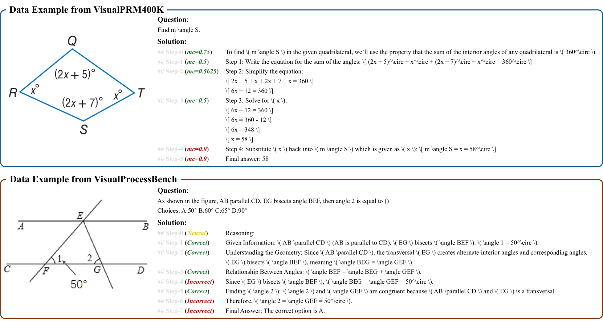
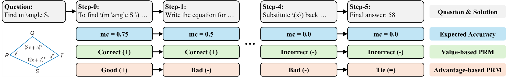
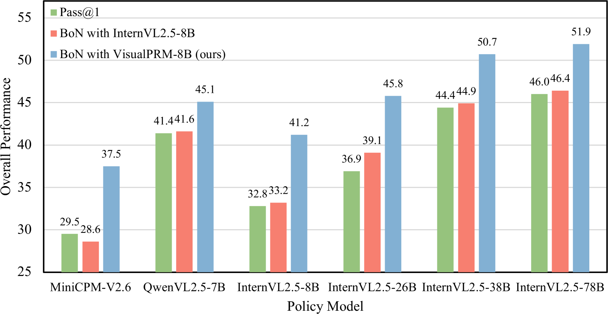

# VisualPRM

## 📌 核心贡献

> 提出首个多模态过程奖励模型（Process Reward Model），构建了包含 400K 样本、约 200 万步级标注的自动化数据集 VisualPRM400K，以及人工标注的步级评估基准 VisualProcessBench，在七个多模态推理基准上通过 Best-of-N 策略实现显著提升。

## 📖 摘要

Process Reward Models (PRMs), which provide step-level feedback on reasoning quality, have proven effective in enhancing the reasoning abilities of Large Language Models (LLMs). However, the development of PRMs for Multimodal Large Language Models (MLLMs) remains largely unexplored. In this paper, we introduce VisualPRM, an 8-billion-parameter multimodal Process Reward Model designed to improve reasoning capabilities across different model scales and families. We also construct VisualPRM400K, an automated multimodal process supervision dataset containing over 400K solutions with approximately 2 million step-level quality labels. Additionally, we propose VisualProcessBench, a benchmark with human-annotated step-wise correctness labels for evaluating the effectiveness of multimodal PRMs. Experimental results show that VisualPRM consistently enhances the reasoning performance of various MLLMs, achieving a 5.9-point improvement across seven multimodal reasoning benchmarks when applied to InternVL2.5-78B via Best-of-N evaluation. Furthermore, VisualPRM achieves performance comparable to the critic model GPT-4o on VisualProcessBench. Code, model weights, and datasets are publicly available.

## 🔍 关键信息

| 字段 | 内容 |
|------|------|
| 机构 | Shanghai AI Laboratory, Tsinghua University, Nanjing University 等 |
| 发表 | 2025-03-13 |
| 分类 | cs.CV, cs.CL |
| 链接 | [arXiv](https://arxiv.org/abs/2503.10291) |

## 📝 我的笔记

### 方法总览

### 动机与问题定义

Test-Time Scaling（TTS）策略（如 Best-of-N 评估）已被证明能有效提升 LLM 的推理能力，但在多模态场景中几乎未被探索。核心瓶颈在于：

1. **缺乏有效的评估模型**：现有开源 MLLM 难以作为 Best-of-N 中的质量评估器，无法有效区分优劣回答
2. **缺乏评估基准**：没有专门衡量多模态推理中步级正确性检测能力的 benchmark

Process Reward Model（PRM）相比 Outcome Reward Model（ORM）和 Self-Consistency，能提供更细粒度的步级反馈，是更优的推理轨迹选择方案。

### VisualPRM400K 数据集构建

基于 Monte Carlo 采样的自动标注流程：

- **数据来源**：MMPR v1.1 中的问题
- **解答生成**：使用 InternVL2.5 系列模型
- **核心公式**：对每个步骤 $s_i$，采样多个补全 $\tilde{s}_{>i}$，计算期望准确率：

$$mc_i = \frac{\text{num(correct completions)}}{\text{num(sampled completions)}}$$

- 每个问题采样 4 个解答，每个步骤最多 12 步（超出则合并），每步采样 16 次补全

**数据集统计**：

| 指标 | 数值 |
|------|------|
| 总样本数 | ~400K |
| 总步数 | ~200 万 |
| 平均回答长度 | 126.9 词 / 5.6 步 |
| 平均步长 | 22.6 词 |
| 错误步占比 | ~10% |

### PRM 建模方法

模型采用 8B 参数的多模态 PRM，将过程监督建模为多轮对话任务：

**Value-based PRM**：步骤质量由期望准确率 $mc_i$ 决定，$mc_i > 0$ 则为正确，输出离散化为 $\{+, -\}$

**Advantage-based PRM**：步骤质量由相对前一步的改进量 $mc_i - mc_{i-1}$ 决定，输出空间为 $\{+, =, -\}$

关键设计选择：
- 监督策略：对所有步骤进行监督（而非在第一个错误处停止）
- 推理时通过离散化 token 的生成概率加权求和计算步骤分数

训练超参：AdamW（$\beta_1=0.9, \beta_2=0.999$），学习率 1e-5，5% 线性 warmup + cosine decay，训练 1 epoch。

### VisualProcessBench 基准

人工标注的步级正确性评估基准，要求模型识别解答中的**所有**错误步骤（非仅第一个）。

| 指标 | 数值 |
|------|------|
| 总样本数 | 2,866 |
| 总标注步数 | 26,950 |
| 正确步 | 16,585 |
| 错误步 | 7,691 |
| 中性步 | 2,674 |
| 平均步数/解答 | 9.4 |

数据来源：MMMU (267), MathVision (712), MathVerse (1,026), DynaMath (570), WeMath (291)；由 GPT-4o、Claude-3.5-Sonnet、QvQ-72B、InternVL2.5-78B 生成解答；13 名标注者、39 人天完成。

### 关键结果

**Best-of-8 多模态推理提升**：

| 模型 | 整体提升 |
|------|---------|
| MiniCPM-V2.6-8B | +8.0 |
| Qwen2.5-VL-7B | +3.7 |
| InternVL2.5-8B | +8.4 |
| InternVL2.5-26B | +8.9 |
| InternVL2.5-38B | +6.3 |
| InternVL2.5-78B | +5.9 |

**VisualProcessBench 步级评估（Macro F1）**：

| 模型 | Overall F1 |
|------|-----------|
| Random Guessing | 50.0 |
| GPT-4o-Mini | 57.9 |
| GPT-4o | 60.3 |
| Gemini-2.0-Flash | 62.3 |
| VisualPRM (ours) | 62.0 |
| InternVL2.5-78B | 52.6 |

VisualPRM（8B）达到了与 GPT-4o 可比的步级评估能力，显著优于其他开源 MLLM。

**文本推理泛化（Best-of-8）**：

| 模型 | MATH-500 | GPQA-Diamond |
|------|----------|-------------|
| Qwen2.5-7B | +6.1 | +5.0 |
| Qwen2.5-72B | +2.1 | +6.6 |
| InternVL2.5-8B | +9.4 | +5.0 |
| InternVL2.5-78B | +7.4 | +3.5 |

### Ablation 分析

- **PRM vs ORM vs Self-Consistency**：随 N 增大，PRM 优势持续扩大；Best-of-128 时 PRM 领先 SC 3.1 分、ORM 4.3 分；ORM 在 N>64 后出现性能下降
- **Value-based vs Advantage-based**：Value-based PRM 优于 Advantage-based
- **分数聚合方式**：Average > Minimum > Maximum（Maximum 因初始步骤高分而表现差）
- **监督策略**：监督所有步骤略优于在第一个错误处停止
- **期望准确率阈值**：threshold=0.0 最优
- **生成温度**：0.7 最优，过低缺乏多样性，过高增加随机性

### 总结与思考

- 首个系统性探索多模态 PRM 的工作，从数据构建、模型训练到评估基准形成完整闭环
- VisualPRM400K 通过 Monte Carlo 采样自动化构建，成本可控且可扩展
- 8B 模型即可达到 GPT-4o 水平的步级评估能力，跨模型族和规模通用
- PRM 相比 ORM 的优势在 N 较大时更为明显，适合计算资源充足的测试时扩展场景
- 局限性：当前仅验证了 Best-of-N 场景，MCTS 等更复杂的搜索策略值得探索

## 🔗 相关论文

**基于/改进自：** [[PRM800K]]

**同方向：** [[R1-Reward]], [[UnifiedReward-Think]]
