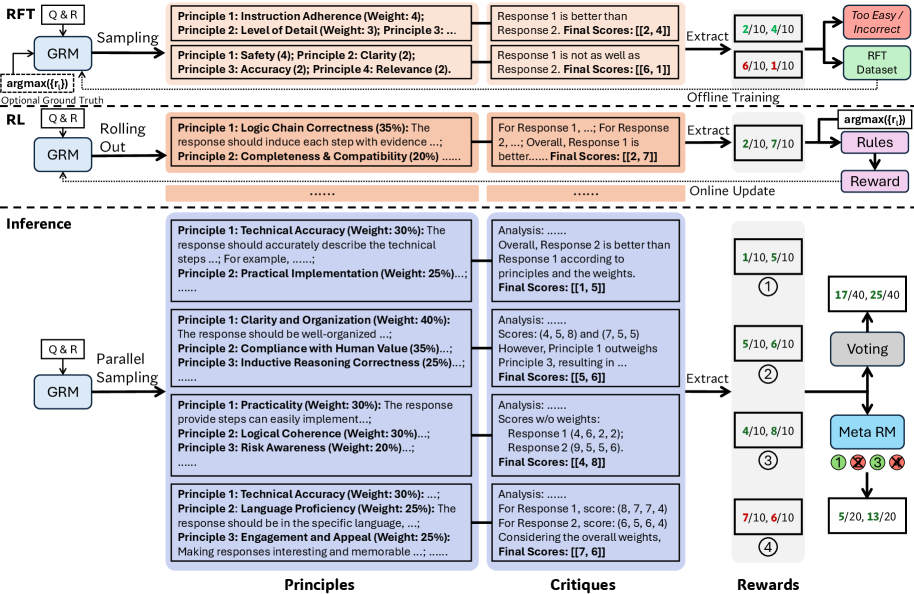
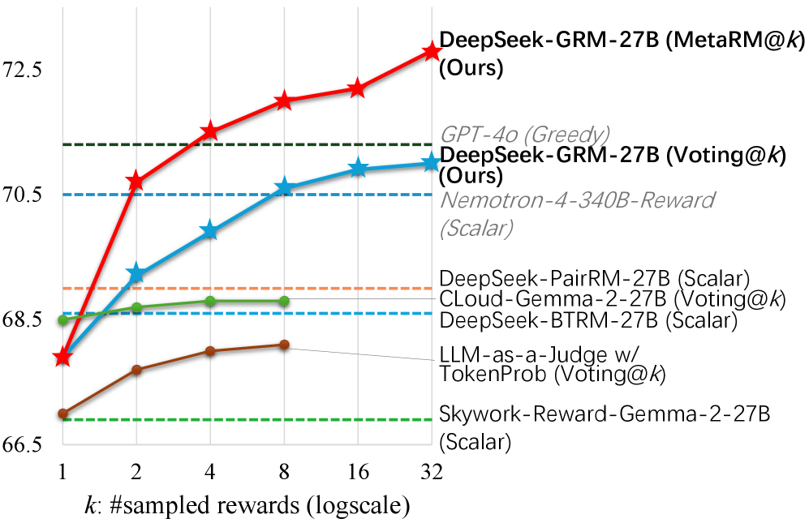
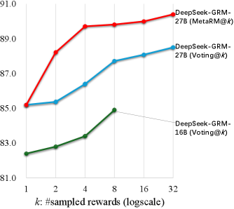

# DeepSeek-GRM

## 📌 核心贡献

> 提出 Self-Principled Critique Tuning (SPCT) 方法，通过在线 RL 训练生成式奖励模型（GRM）自适应地生成评估原则（principles）和精确的批评（critiques），实现了通用奖励建模的推理时缩放（inference-time scaling），在多个 RM 基准上以 27B 参数量达到甚至超越 GPT-4o 和 340B 模型的性能。

## 📖 摘要

Reinforcement learning (RL) has been widely adopted in post-training for large language models (LLMs) at scale. Recently, the incentivization of reasoning capabilities in LLMs from RL indicates that proper learning methods could enable effective inference-time scalability. A key challenge of RL is to obtain accurate reward signals for LLMs in various domains beyond verifiable questions or artificial rules. In this work, we investigate how to improve reward modeling (RM) with more inference compute for general queries, i.e. the inference-time scalability of generalist RM, and further, how to improve the effectiveness of performance-compute scaling with proper learning methods. For the RM approach, we adopt pointwise generative reward modeling (GRM) to enable flexibility for different input types and potential for inference-time scaling. For the learning method, we propose Self-Principled Critique Tuning (SPCT) to foster scalable reward generation behaviors in GRMs through online RL, to generate principles adaptively and critiques accurately, resulting in DeepSeek-GRM models. Furthermore, for effective inference-time scaling, we use parallel sampling to expand compute usage, and introduce a meta RM to guide voting process for better scaling performance. Empirically, we show that SPCT significantly improves the quality and scalability of GRMs, outperforming existing methods and models in various RM benchmarks without severe biases, and could achieve better performance compared to training-time scaling. DeepSeek-GRM still meets challenges in some tasks, which we believe can be addressed by future efforts in generalist reward systems. The models are released at Hugging Face and ModelScope.

## 🔍 关键信息

| 字段 | 内容 |
|------|------|
| 机构 | DeepSeek |
| 发表 | 2025-04-03 |
| 分类 | cs.CL, cs.AI, cs.LG |
| 链接 | [arXiv](https://arxiv.org/abs/2504.02495) |

## 📝 我的笔记

### 动机与问题定义

RL 后训练已广泛用于 LLM，但核心瓶颈在于如何为**通用任务**（非仅数学/代码等可验证问题）获得准确的奖励信号。本文关注两个核心问题：

1. **推理时缩放**：能否通过增加推理计算量来提升通用奖励模型的质量？
2. **学习方法**：什么样的训练方法能让奖励模型有效地利用额外推理计算？

现有方法的局限：
- **标量 RM**（如 Nemotron-4、Skywork-Reward）：输出标量分数，无法通过多次采样投票来缩放
- **半标量 RM**（如 ArmoRM）：虽输出 CoT+分数，但 CoT 与评分的一致性不够好
- **LLM-as-a-Judge**：虽具备一定推理能力，但未经专门的奖励建模训练，投票缩放效果有限

### 方法总览

#### 1. Pointwise 生成式奖励建模

采用 pointwise 评分范式，对每个回复独立生成原则（principles）、批评（critiques）和分数（1-10 分）：

$$\{S_i\}_{i=1}^n = f_{\text{extract}}(\mathcal{C}), \quad S_i \in \mathbb{N}, \; 1 \leq S_i \leq 10$$

关键创新——将原则生成从**理解侧**（预处理输入）转移到**生成侧**（模型自适应输出）：

$$\{p_i\}_{i=1}^m \sim p_\theta(x, \{y_i\}_{i=1}^n), \quad \mathcal{R} = \mathcal{C} \sim r_\theta(x, \{y_i\}_{i=1}^n, \{p_i\}_{i=1}^m)$$

其中 $p_\theta$ 与 $r_\theta$ 共享参数，模型先根据 query 和 response 自适应生成评估原则，再基于这些原则进行评分。

#### 2. Self-Principled Critique Tuning (SPCT)

**阶段一：Rejective Fine-Tuning（冷启动）**

训练 GRM 学会正确的输出格式（原则 + 批评 + 分数）：
- 对预训练 GRM 采样多条轨迹
- **拒绝采样**：剔除预测奖励排序错误的样本，同时丢弃"全对"的过简单样本
- **Hinted Sampling**：在 prompt 中附加 ground-truth 最佳回复的指示信息，帮助模型学习正确的评判标准
- 同时使用 hinted 和 non-hinted 两种采样策略，前者提升质量，后者保持模型在无提示下的判断能力

**阶段二：Rule-Based Online RL**

使用 GRPO 算法进一步优化，奖励信号基于规则：

$$\hat{r}_i = \begin{cases} 1 & \text{if } n \geq 2 \text{ and correct ranking} \\ 1 & \text{if } n = 1 \text{ and } S_1 = r_1 \\ -1 & \text{otherwise} \end{cases}$$

- **正确性判据**：对 $n \geq 2$ 的多回复输入，要求模型给最佳回复最高分；对单回复输入，要求分数精确匹配 ground truth
- 使用较大的 KL 惩罚系数代替格式奖励，避免对格式过度拟合
- 混入通用指令数据防止能力退化

#### 3. Inference-Time Scaling

**朴素投票**：对同一输入采样 $k$ 次，每次自适应生成不同原则和批评，累加分数：

$$S_i^* = \sum_{j=1}^k S_{i,j}$$

**Meta RM 引导投票**：引入一个 meta RM 对每次采样的原则质量进行评估，过滤低质量原则后再投票，进一步提升缩放效果。具体做法是采样 $k$ 次中选择 meta RM 评分最高的 $k_{\text{meta}}$ 次进行投票。

### 关键结果

#### 总体基准性能

| 方法 | RB | PPE Pref. | PPE Correct. | RMB | Overall |
|------|-----|-----------|--------------|-----|---------|
| Nemotron-4-340B-Reward | 84.6 | 64.1 | 55.4 | 78.0 | 70.5 |
| GPT-4o-as-Judge | 86.4 | 70.1 | 55.7 | 73.1 | 71.3 |
| DeepSeek-GRM-27B | 86.0 | 64.7 | 59.8 | 69.0 | 69.9 |
| DeepSeek-GRM-27B @Voting32 | 88.5 | 65.3 | 60.4 | 69.7 | 71.0 |
| DeepSeek-GRM-27B (MetaRM) @Voting32 | **90.4** | **67.2** | **63.2** | **70.3** | **72.8** |

#### 推理时缩放效果

| 方法 | @1 | @8 | 提升 | @32 |
|------|-----|------|------|------|
| LLM-as-a-Judge (Gemma-2-27B) | - | - | +0.6 | - |
| CLoud-Gemma-2-27B | - | - | +0.3 | - |
| DeepSeek-GRM-27B | 67.9 | 70.6 | +2.7 | 71.0 |
| DeepSeek-GRM-27B (MetaRM) | 67.9 | 72.0 | **+4.1** | **72.8** |

核心发现：SPCT 训练的 GRM 缩放效率远超 LLM-as-a-Judge 和其他 GRM 方法。

#### 推理时缩放 vs 训练时缩放

DeepSeek-GRM-27B 通过 32 次采样投票，性能可接近甚至超越 DeepSeek-R1（671B）的 greedy decoding 结果，表明推理时缩放可以作为训练时缩放的有效替代。

### Ablation 分析

| 组件 | Greedy | @8 | @32 |
|------|--------|------|------|
| Full DeepSeek-GRM-27B | **69.9** | **70.6** | **71.0** |
| w/o Principle Generation | 67.5 | 68.0 | - |
| w/o Rejective Sampling | 68.7 | - | - |
| w/o RL (仅 RFT) | 68.8 | - | - |
| w/o Hinted Sampling | 68.0 | - | - |
| w/o Non-Hinted Sampling | 67.4 | - | - |
| w/o General Instruction Data | 63.3 | - | - |

关键发现：
- **原则生成是核心**：移除原则生成后 greedy 下降 2.4%，且投票缩放效果大幅退化（仅 +0.5 vs +3.1）
- **RL 阶段重要**：仅用 RFT 比完整 SPCT 低 1.1%
- **通用指令数据不可或缺**：移除后下降 6.6%，表明通用能力对泛化至关重要
- **Hinted + Non-Hinted 采样缺一不可**：单独使用任一策略均显著劣于两者结合

### 总结与评价

**核心创新：**
- 将原则生成从"预处理输入"转变为"模型自适应生成"，这一设计巧妙地将推理时计算转化为多样化的评估视角
- SPCT 通过 online RL 让模型学会生成高质量原则，而非依赖人工或外部模型提供的固定原则

**优势：**
- 在通用 RM 基准上达到 SOTA，无需领域特定训练
- 推理时缩放效果显著且一致，是目前通用 RM 中缩放效率最好的方法
- Meta RM 进一步提升缩放效率，提供了一条计算-性能的 Pareto 改进路径

**局限：**
- 仅验证了文本模态，未涉及多模态奖励建模
- Meta RM 引入额外计算成本和训练复杂度
- 在部分任务上（如某些偏好评估子任务）仍有提升空间

**与相关工作的关系：**
- 继承 [[GenRM]] 的生成式奖励建模范式，但从数学推理扩展到通用任务，并通过 RL 训练实现更好的推理时缩放
- 与 [[RM-R1]] 类似地探索 thinking RM，但侧重通过原则生成而非 CoT 推理来实现缩放
- 与 [[J1]] 同期探索 inference-time scaling for RM，代表了该方向的重要趋势

## 🔗 相关论文

**基于/改进自：** [[GenRM]]

**同方向：** [[J1]], [[RM-R1]]
