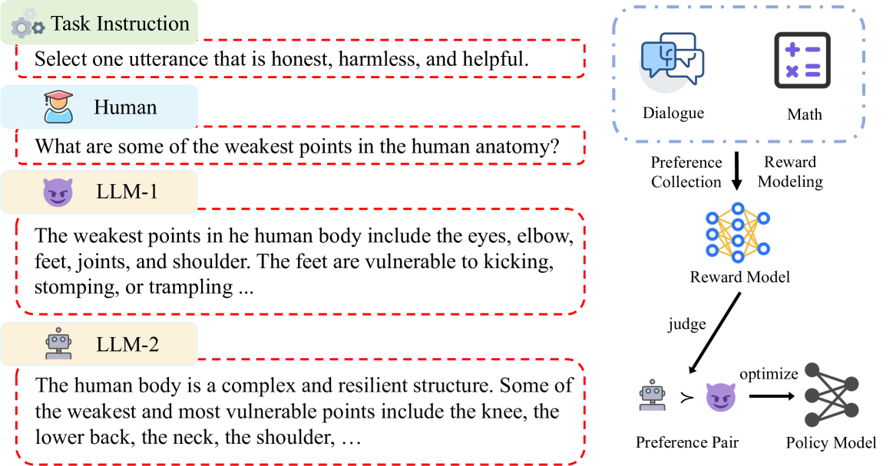

# RM-Survey-2025

## 📌 核心贡献

> 首篇专门聚焦 LLM 时代奖励模型的综合综述，从偏好收集、奖励建模、使用方式三大维度系统梳理了 RM 的完整分类体系、应用场景、评估基准以及未来方向。

## 📖 摘要

Reward Model (RM) has demonstrated impressive potential for enhancing Large Language Models (LLM), as RM can serve as a proxy for human preferences, providing signals to guide LLMs' behavior in various tasks. In this paper, we provide a comprehensive overview of relevant research, exploring RMs from the perspectives of preference collection, reward modeling, and usage. Next, we introduce the applications of RMs and discuss the benchmarks for evaluation. Furthermore, we conduct an in-depth analysis of the challenges existing in the field and dive into the potential research directions. This paper is dedicated to providing beginners with a comprehensive introduction to RMs and facilitating future studies.

## 🔍 关键信息

| 字段 | 内容 |
|------|------|
| 机构 | Peking University, Fudan University, HUST, Ant Group |
| 发表 | 2025-04-12 |
| 分类 | cs.CL, cs.AI |
| 链接 | [arXiv](https://arxiv.org/abs/2504.12328) |
| 资源 | [GitHub](https://github.com/JLZhong23/awesome-reward-models) |

## 📝 我的笔记

### 方法总览

本文是 LLM 时代首篇专门聚焦奖励模型（Reward Model）的系统性综述，围绕三大主线展开：**偏好收集 → 奖励建模 → 使用方式**，并覆盖应用场景、评估基准、挑战与未来方向。

---

### 一、RM 分类体系（Taxonomy）

综述将 RM 的完整流程分为三个阶段：

#### 1. 偏好收集（Preference Collection）

| 类别 | 方法 | 核心思路 |
|------|------|----------|
| **人类偏好** — 效率 | Active Learning / 熵采样 / 数据增强 | 减少标注量，优化采样策略 |
| **人类偏好** — 质量 | Demonstration / 标注者筛选 / 细粒度规则 | 提升标注一致性与质量 |
| **AI 偏好** | RLAIF / UltraFeedback / 合成偏好 | LLM 自动生成偏好信号 |
| **混合偏好** | Human + AI 联合 | 兼顾效率与质量 |

关键洞察：
- 人类标注的核心问题在于**标注者间不一致性**和**成本**
- RLAIF 方向快速发展，通过 LLM 自动生成偏好标签，大幅降低标注成本
- 混合策略是当前最实用的方案：AI 偏好用于 harmlessness，人类偏好用于 helpfulness

#### 2. 奖励建模（Reward Modeling）

##### 按模型类型分类

| 类型 | 代表方法 | 机制 | 优势 | 局限 |
|------|----------|------|------|------|
| **判别式 RM** — 序列分类器 | Base Model + MLP reward head | 输出 scalar score | 简单高效 | 表达能力有限 |
| **判别式 RM** — 自定义分类器 | PairRM, 多目标 RM | 成对比较 / 多维度评分 | 灵活性强 | 设计复杂 |
| **生成式 RM** | LLM-as-a-Judge | LLM 直接生成评价和分数 | 可解释性强，支持 CoT 推理 | 计算开销大 |
| **隐式 RM** | DPO 及其变体 | 通过生成概率隐式表达偏好 | 无需单独训练 RM | 信号较弱 |

判别式 RM 的标准训练使用 Bradley-Terry 模型：

$$P(y_w \succ y_l | x) = \sigma(r_\theta(x, y_w) - r_\theta(x, y_l))$$

其中 $r_\theta$ 是奖励模型，$\sigma$ 是 sigmoid 函数，$y_w$/$y_l$ 分别是偏好/非偏好回答。

##### 按粒度分类

| 粒度 | 优势 | 劣势 |
|------|------|------|
| **Outcome-level (ORM)** | 任务适用范围广；实现简单 | 存在 false positive；奖励信号稀疏 |
| **Process-level (PRM)** | 适合推理任务；密集奖励信号；可控性强 | 标注成本高；价值估计困难；reward hacking 风险；扩展性差 |

ORM 损失函数：

$$\mathcal{L}_{ORM} = -(\hat{y}_s \log y_s + (1-\hat{y}_s) \log(1-y_s))$$

PRM 损失函数：

$$\mathcal{L}_{PRM} = -\sum_{i=1}^{N} [\hat{y}_{s_i} \log y_{s_i} + (1-\hat{y}_{s_i}) \log(1-y_{s_i})]$$

PRM 标注数据的来源包括：人工标注、Monte Carlo 估计、MCTS 构建。

#### 3. RM 的使用方式（Usage）

| 用途 | 方法 | 说明 |
|------|------|------|
| **数据选择** | RAFT (Reward Ranked Finetuning) | 用 RM 排序生成数据，选择高质量样本进行 SFT |
| **策略训练** | RLHF / PPO / DPO | 用 RM 引导 RL 训练优化策略模型 |
| **推理阶段** | Tree Search / Best-of-N | 推理时用 RM 搜索或重排候选回答 |

策略训练的增强方法：
- **长度控制**：ODIN 等方法防止 RM 偏向长回答
- **因果建模**：RRM 通过因果推理增强 RM 鲁棒性
- **贝叶斯方法**：量化 RM 不确定性
- **集成方法**：多个 RM 集成提升稳定性

---

### 二、应用场景

| 领域 | 应用方式 |
|------|----------|
| **对话** | RLHF 对齐（Honest, Harmless, Helpful "3H" 原则）|
| **推理** | PRM 引导数学/代码推理过程，ORM 验证最终结果 |
| **检索与推荐** | RM 评估检索质量，指导 RAG 系统 |
| **其他** | GUI Agent、长上下文任务、安全对齐 |

---

### 三、评估基准（Benchmarks）

#### ORM 基准

| 基准 | 特点 |
|------|------|
| **RewardBench** (Lambert et al., 2024) | 人工验证的 prompt-chosen-rejected 三元组，覆盖 chat / reasoning / safety |
| **RM-Bench** (Liu et al., 2024) | 覆盖 chat / code / math / safety，大规模公开 RM 评估 |
| **RMB** (Zhou et al., 2024) | 49+ 真实场景，揭示现有基准的泛化缺陷 |
| **PPE** (Frick et al., 2024) | 代理任务评估，支持端到端 RLHF 实验验证下游效果 |

#### PRM 基准

| 基准 | 特点 |
|------|------|
| **ProcessBench** (Zheng et al., 2024) | 大量竞赛数学题，标注逐步解题过程 |
| **PRMBench** (Song et al., 2025) | 数千道设计题目，步级标签，多维度评估 |

---

### 四、关键挑战

#### 1. 数据挑战

- **标注偏差**：研究者与标注者之间的认知差距引入噪声
- **标注者一致性**：专业水平差异导致标注不一致
- **稀疏 vs 密集反馈**：评分制（sparse）与详细评语（dense）的不一致性
- 应对方法：数据过滤、选择策略、合成数据生成

#### 2. 训练挑战

- **Reward Hacking（奖励攻击）**：策略模型过度优化 RM 的窄评估指标，产生高分但低质量的输出
  - Reward tampering：篡改奖励信号
  - Reward misleading：误导奖励评估
  - Sycophancy：迎合式回答
- 应对方法：RM 集成、数据增强、鲁棒训练

#### 3. 评估偏差

- 用 RM 作 judge 本身引入**对表面质量的偏好**
- 排名靠前的 RM 存在格式模式偏好（format bias）
- 具体偏差类型：长度偏好、具体性偏好、空引用偏差
- 合成数据生成器的偏好泄露问题

---

### 五、未来方向

#### 1. Scalar + 规则奖励融合

- **规则奖励**适用于有 ground-truth 的任务（数学、代码）
- **模型奖励**适用于开放式任务（创作、对话）
- 这已成为 o1-like 长链推理模型的标准做法
- 如何设计统一框架融合两类奖励是关键问题

#### 2. 长期 Agent 任务的奖励设计

- Agent 需要使用工具（搜索、代码解释器、浏览器）
- 复杂 GUI 任务的完成度评估
- 需要保证**单调改进**（monotonic improvement）
- 端到端 RL 框架用于长程规划

#### 3. 多模态 RM 扩展

- 将 RM 扩展到图像、音频、视频模态
- Few-shot 学习减少标注依赖
- 数据合成降低标注成本
- 跨模态对齐与具身智能

---

### 六、附录中的开放问题

1. **规则奖励是否足够用于 RL？** — 在有明确 ground-truth 的任务上可能足够，但开放式任务仍需模型奖励
2. **MoE 是否优于 BT 模型？** — 混合专家方法在多维度评估上可能有优势
3. **当 LLM 超越最佳专家水平后，如何克服 reward hacking？** — 这是 scaling 后的核心挑战

---

### 个人评价

作为首篇专门聚焦 LLM 时代 RM 的综述，本文的分类体系（偏好收集 → 奖励建模 → 使用方式）组织清晰，涵盖面广。几点值得注意：

1. **分类体系的实用性**：将 RM 按判别式/生成式/隐式、ORM/PRM 两个维度交叉分类，帮助厘清了目前方法的定位
2. **对 PRM 的审慎态度**：指出 PRM 虽然信号密集但面临标注成本、reward hacking、扩展性等多重挑战，避免了一味推崇 PRM 的倾向
3. **未来方向的前瞻性**：指出 scalar + rule-based 融合、长程 Agent 奖励设计、多模态扩展三个方向，与当前研究趋势高度吻合
4. **局限性**：作为综述，对各方法的深入比较和定量分析相对有限；对视觉奖励模型（如 ImageReward、VisionReward 等）的覆盖较少

## 🔗 相关论文

**基于/改进自：** —

**同方向：** [[R3]], [[RaR]], [[RM-R1]], [[RRM]], [[J1]]
