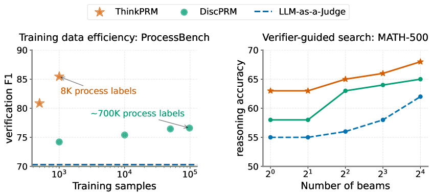
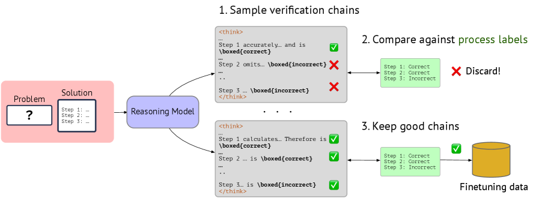
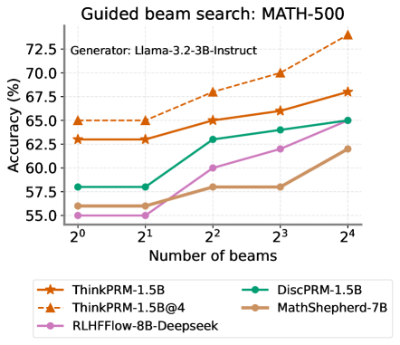

# ThinkPRM

## 📌 核心贡献

> 提出 ThinkPRM，一种生成式过程奖励模型，通过生成验证链式思维（verification CoT）来逐步验证推理步骤，仅需 PRM800K 中 1% 的过程标签（约 8K 标签）即可超越使用 100 倍数据训练的判别式 PRM，并在域外任务上展现出强大的泛化能力。

## 📖 摘要

Step-by-step verifiers -- also known as process reward models (PRMs) -- are a key ingredient for test-time scaling. PRMs require step-level supervision, making them expensive to train. This work aims to build data-efficient PRMs as verbalized step-wise reward models that verify every step in the solution by generating a verification chain-of-thought (CoT). We propose ThinkPRM, a long CoT verifier fine-tuned on orders of magnitude fewer process labels than those required by discriminative PRMs. Our approach capitalizes on the inherent reasoning abilities of long CoT models, and outperforms LLM-as-a-Judge and discriminative verifiers -- using only 1% of the process labels in PRM800K -- across several challenging benchmarks. Specifically, ThinkPRM beats the baselines on ProcessBench, MATH-500, and AIME '24 under best-of-N selection and reward-guided search. In an out-of-domain evaluation on a subset of GPQA-Diamond and LiveCodeBench, our PRM surpasses discriminative verifiers trained on the full PRM800K by 8% and 4.5%, respectively. Lastly, under the same token budget, ThinkPRM scales up verification compute more effectively compared to LLM-as-a-Judge, outperforming it by 7.2% on a subset of ProcessBench. Our work highlights the value of generative, long CoT PRMs that can scale test-time compute for verification while requiring minimal supervision for training.

## 🔍 关键信息

| 字段 | 内容 |
|------|------|
| 机构 | Google DeepMind, University of Michigan |
| 发表 | 2025-04-23 |
| 分类 | cs.LG, cs.AI, cs.CL |
| 链接 | [arXiv](https://arxiv.org/abs/2504.16828) |

## 📝 我的笔记

### 动机与问题定义

判别式 PRM 需要大规模逐步标注数据（PRM800K 包含 ~800K 步骤标签），标注成本极高。本文的核心问题是：**能否利用推理模型的内在能力，以极少的标注数据训练出更强的过程奖励模型？**

关键洞察：长链式思维（long CoT）推理模型本身具备逐步验证的能力，通过少量微调即可将这种能力定向激活为过程验证器。

### 方法

#### 整体框架

ThinkPRM 将开源推理模型（如 DeepSeek-R1-Distill、QwQ-32B）作为基座，通过轻量微调将其转化为生成式过程验证器。验证时，模型对解题步骤逐步生成验证 CoT，而非直接输出正确/错误的判别标签。

#### 数据收集与过滤

1. **采样合成验证 CoT**：用 QwQ-32B-Preview 对 PRM800K 中 1K 条链（共 ~8K 步骤标签）生成验证链式思维
2. **三重过滤**：
   - **格式过滤**：CoT 必须遵循预期格式，决策标签可用 `\boxed{}` 提取
   - **标签匹配过滤**：生成的步骤判断必须与 PRM800K 的金标签一致（process-based filtering，非仅看最终结果）
   - **长度约束**：限制 CoT 最大长度，避免过度思考（7K-8K token 处出现性能下降）

#### 训练配置

| 模型 | 训练方式 | 轮数 | 学习率 | 训练时间 |
|------|---------|------|--------|---------|
| R1-Distill-Qwen-1.5B/7B | 全参数训练 | 3 epochs | 6e-5 | 0.5h / 2h |
| QwQ-32B-Preview | LoRA (rank=32, alpha=16) | 5 epochs | 4e-4 | 4.5h |

#### 验证与评分

- **输入**：问题-解答对，解答包含逐步推理
- **输出**：模型生成验证 CoT 后给出 "Is the solution correct? \boxed{yes/no}"
- **评分公式**：

$$\text{score} = \frac{P(\text{yes})}{P(\text{yes}) + P(\text{no})}$$

#### 推理时计算扩展

- **并行扩展（@K）**：独立采样 K 条验证 CoT，聚合得分
- **顺序扩展**：通过触发词（"Let me double check"、"Let's verify again"）强制模型重新验证，在单条 CoT 内扩展计算

### 关键实验结果

#### ProcessBench 性能（F1 分数）

| 模型 | LLM-as-Judge | ThinkPRM | 无效输出比例变化 |
|------|-------------|----------|----------------|
| R1-Qwen-14B | 72.8 | **87.3** | 13.3% → 2.3% |
| R1-Qwen-1.5B | 5.0 | **76.3** | 51.4% → 1.4% |

#### 数据效率核心结论

ThinkPRM-14B 仅用 **8K 过程标签**（~1K 合成样本）即超越使用约 **100 倍数据**训练的判别式 PRM。

#### 域外泛化

| 任务 | ThinkPRM vs DiscPRM 提升 |
|------|------------------------|
| GPQA-Physics (N=32) | +8% |
| LiveCodeBench (N=32) | +4.5% |

值得注意的是，ThinkPRM 仅在数学数据上训练，却在科学 QA 和代码生成任务上展现出显著优势。

#### 计算效率

在相同 token 预算下，ThinkPRM 比 LLM-as-Judge 在 ProcessBench 子集上高 **7.2%**，验证计算扩展更有效。

### Ablation 分析

#### CoT 长度的影响

| 模型 | Long CoT (F1) | Short CoT (F1) |
|------|--------------|----------------|
| R1-Qwen-14B | 87.3 | 55.3 |
| R1-Qwen-1.5B | 87.3 | 64.8 |

长链式思维对验证质量至关重要，短 CoT 性能大幅下降。

#### 过滤策略

Process-based filtering（65K 条链）显著优于 outcome-based filtering（128K 条链），尽管使用更少样本，印证了步骤级监督的重要性。

#### 自动标签

使用 Math-Shepherd 的蒙特卡洛标签训练效果与人工标签可比，说明方法对标注方式具有鲁棒性。

### 局限性

1. **过度自信**：二元 token 概率聚集在极端值（0 或 1）附近
2. **错误传播**：早期验证错误会影响后续步骤的判断
3. **计算开销**：生成验证 CoT 的成本高于判别式 PRM

### 总结与评价

ThinkPRM 的核心贡献在于证明了**生成式验证范式的数据效率优势**：利用推理模型的内在能力，仅需极少标注即可构建强大的过程奖励模型。这与判别式 PRM 需要海量步骤标签形成鲜明对比。方法的优势不仅在于数据效率，还包括可解释性（生成的验证 CoT 可供检查）、测试时计算扩展能力和域外泛化能力。与同期工作 [[GenRM]] 和 [[RM-R1]] 共同验证了"让 RM 思考"这一方向的有效性。

## 🔗 相关论文

**基于/改进自：** [[PRM800K]]

**同方向：** [[Math-Shepherd]], [[GenRM]], [[RM-R1]]
