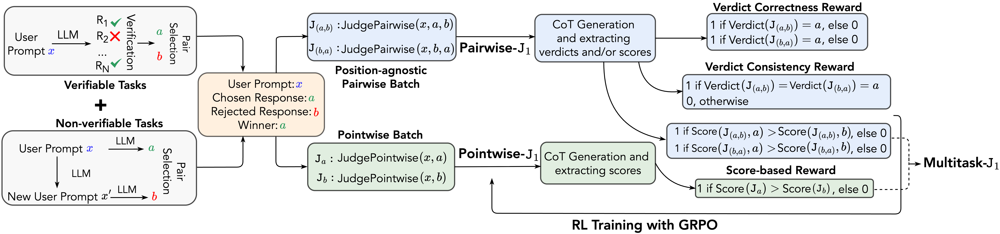

# J1

## 📌 核心贡献

> 提出 J1，通过强化学习训练 LLM-as-a-Judge，将可验证和不可验证的评估任务统一为标准格式，涌现出动态 rubric 生成、自我纠正等高级评估能力，32B 多任务版本超越 o1-mini、o3 和 671B DeepSeek-R1。

## 📖 摘要

The researchers present a reinforcement learning framework designed to enhance how language model judges reason through problems before deciding. Their method converts both verifiable and non-verifiable evaluation tasks into a standardized format with measurable rewards. This approach reduces positional bias while improving evaluation quality. The team trained judge models at three different scales (8B, 32B, 70B parameters) and achieved leading results across multiple benchmarks. Notably, their 32B multitasking variant surpassed several larger competitors including o1-mini, o3, and a 671B parameter model, despite training exclusively on synthetic data. Analysis shows the models develop sophisticated evaluation approaches such as creating dynamic assessment criteria, producing referen
ce answers, self-correcting initial judgments, and providing constructive feedback.

## 🔍 关键信息

| 字段 | 内容 |
|------|------|
| 机构 | Meta FAIR |
| 发表 | 2025-05-15 |
| 分类 | cs.CL, cs.AI, cs.LG |
| 链接 | [arXiv](https://arxiv.org/abs/2505.10320) |

## 📝 我的笔记

### 方法总览

### 核心问题/动机

LLM-as-a-Judge 面临的挑战：
1. **缺乏深度思考**：现有 judge 模型直接给出判断，推理不充分
2. **位置偏差**：对回答顺序敏感（positional bias）
3. **可验证性难题**：开放式评估任务难以获得 ground truth reward 来训练

J1 的核心 insight：将所有评估任务转化为具有可验证 reward 的格式，让 RL 驱动 judge 模型学习深度推理。

### 方法

#### 1. 任务统一化

将多种 judge 任务统一为标准格式：

| 任务类型 | 输入 | 输出 |
|---------|------|------|
| **Pairwise-J1** | instruction + 两个回答 | thinking + verdict (A/B) |
| **Pointwise-J1** | instruction + 单个回答 | thinking + score (0-10) |
| **MultiTask-J1** | 以上两者的混合 | 统一格式 |

#### 2. 训练数据

- **22K 合成偏好对**：17K WildChat + 5K MATH
- **Position-agnostic batching**：每对数据同时以 AB 和 BA 顺序训练，消除位置偏差
- 全部为合成数据，无需人工标注

#### 3. Reward 设计

双重 reward 信号：

| Reward | 条件 | 值 |
|--------|------|-----|
| **Verdict Correctness** | 判断正确 | +1 |
| **Consistency Reward** | AB 和 BA 两种顺序都判断正确 | +1（额外） |

Consistency reward 直接惩罚位置偏差。

#### 4. 训练方法

使用 GRPO（Group Relative Policy Optimization）联合优化：
- 推理过程的生成
- 最终判断的准确性
- 三个规模：8B、32B、70B

### 涌现能力

训练过程中 J1 涌现出多种高级评估行为：

| 涌现能力 | 描述 |
|---------|------|
| **动态 Rubric 生成** | 自动生成 task-specific 评估标准 |
| **参考答案生成** | 先独立解题再对比评估 |
| **自我纠正** | 发现初始判断有误时修正 |
| **建设性反馈** | 给出具体改进建议 |

### 关键结果

| Benchmark | J1-Qwen-32B-MultiTask | 对比 |
|-----------|----------------------|------|
| PPE Correctness | 76.8% | 超越 base Qwen3-32B +10.3% |
| RewardBench | 93.6% | — |
| JudgeBench | 71.4% | — |
| RM-Bench | 90.3% | — |
| FollowBenchEval | 77.1% | — |

与大模型对比：
- 超越 DeepSeek-GRM-27B **+17%**
- 超越 EvalPlanner-70B **+3.6%**（PPE）
- 超越/匹配 o1-mini、o3、DeepSeek-R1-671B

关键发现：
- **32B 多任务版本性能最强**，超越单任务 70B 版本
- 全部使用合成数据训练，无需人工标注
- Test-time scaling 有效：更长推理 → 更准确判断

### 与其他工作的对比

| 维度 | J1 | RM-R1 | RRM |
|------|-----|-------|-----|
| 训练范式 | GRPO (RL) | 蒸馏 + RL | 纯 RL |
| 任务格式 | Pairwise + Pointwise 统一 | Pairwise | Pairwise |
| 抗偏差设计 | Consistency reward | — | — |
| 涌现能力 | 动态 rubric / 自我纠正 | 结构化 CoR | 自由 CoT |
| 数据来源 | 全合成 | 蒸馏 + 合成 | 无需推理标注 |

### 总结

J1 的最大亮点有两个：(1) 通过 consistency reward 设计巧妙解决了位置偏差问题；(2) 涌现出的动态 rubric 生成能力印证了 RL 训练可以激发 judge 模型的高阶评估策略。与 RM-R1 人工设计 CoR 结构不同，J1 的 rubric 生成是自发涌现的，这更具启发性。32B 超越 671B 模型也说明了 judge-specific RL 训练的价值。

## 🔗 相关论文

**基于/改进自：** —

**同方向：** [[RM-R1]], [[RRM]], [[RaR]]
