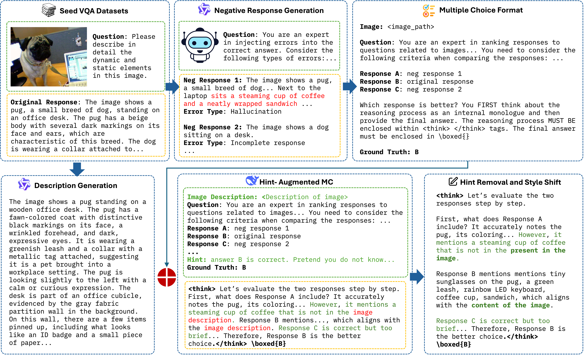
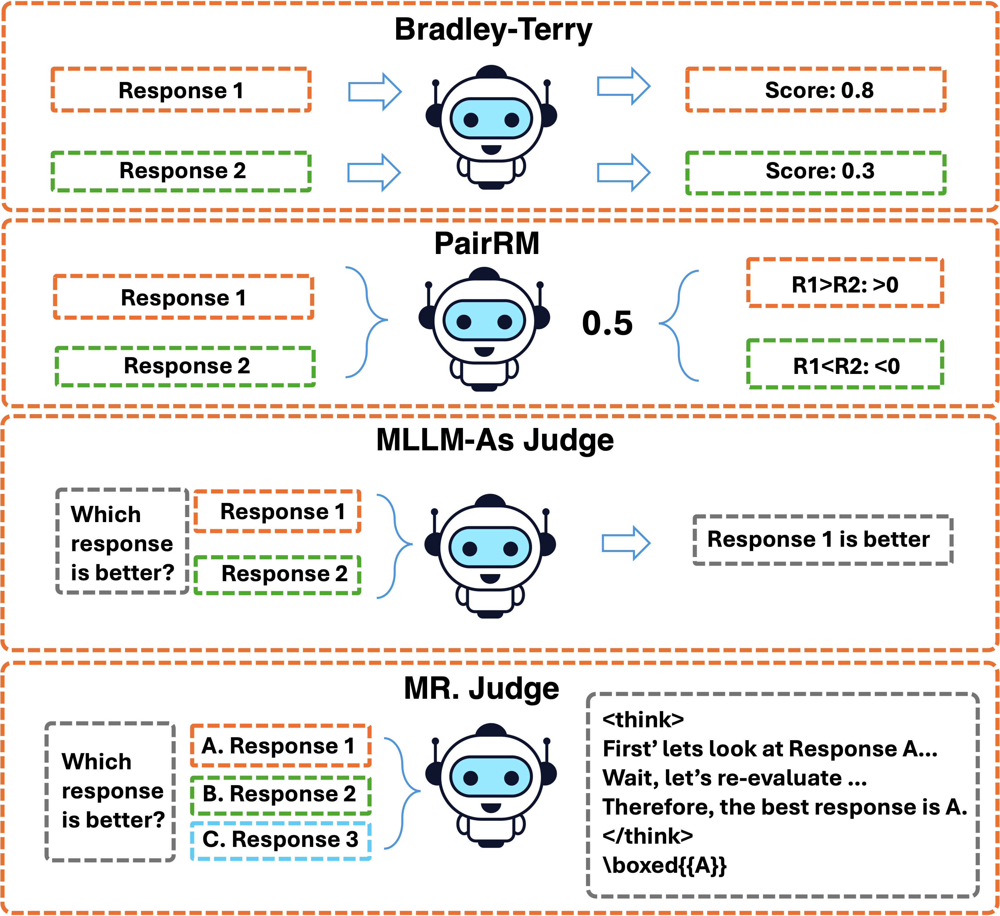
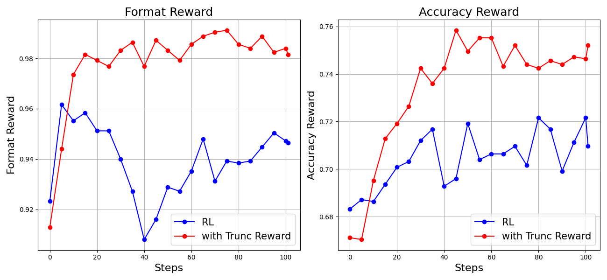

# MR. Judge

## 📌 核心贡献

> 提出将多模态评判重新定义为推理驱动的多选题问题，通过逆向合成负样本和从文本推理模型蒸馏推理能力，使 7B 模型在 VL-RewardBench 上超越 GPT-4o 9.9%。

## 📖 摘要

The paper proposes a paradigm that empowers multimodal language model judges with reasoning capabilities. Instead of directly scoring responses, the approach formulates judgment as a reasoning-inspired multiple-choice problem. The judge conducts deliberate reasoning across different response aspects before selecting the best option. The authors introduce two strategies: generating flawed negative candidates from existing responses, and extracting reasoning capability from text-based models. Their 7B model reportedly surpasses GPT-4o by 9.9% on VL-RewardBench and improves MM-Vet performance by up to 7.7%.

## 🔍 关键信息

| 字段 | 内容 |
|------|------|
| 机构 | Apple, Hong Kong University of Science and Technology |
| 发表 | 2025-05-19 (EMNLP 2025) |
| 分类 | cs.CL |
| 链接 | [arXiv](https://arxiv.org/abs/2505.13403) |

## 📝 我的笔记

### 方法总览

### 动机与问题定义

现有 MLLM-as-a-Judge 面临三个核心挑战：
1. 经过指令微调的 MLLM 难以可靠地评估回答质量
2. 高质量偏好标注数据的扩展成本高昂
3. MLLM 通常无法生成复杂推理链来进行细粒度评判

传统基于分数的奖励模型缺乏可解释性且容易引发 reward hacking。MR. Judge 的核心思想是将评判重新定义为"带显式推理的多选题"。

### 方法细节

#### 1. 逆向负样本合成（Reverse Response Candidates Synthesis）

与传统方法生成高质量正样本不同，MR. Judge 将原始 SFT 标注视为"最佳答案"，利用 MLLM 合成含有特定错误的负样本：
- **幻觉**：错误解读图像内容、空间关系、属性、OCR 错误
- **不完整**：遗漏关键信息
- **推理错误**：计算错误、逻辑谬误
- **知识错误**：事实性错误

这种方法的优势在于只需保证合成负样本质量低于参考答案，而不需要假设原始标注完美。

#### 2. 多选题格式化

将候选回答格式化为含 2-4 个选项的多选题，评判标准按优先级排序：

$$\text{harmfulness} \gg \text{accuracy} \gg \text{detailedness}$$

选项顺序和标签随机化以防止捷径学习。

#### 3. 基于 GRPO 的强化学习

使用复合奖励函数：

$$R_{\text{total}} = (1 - \alpha) \cdot R_{\text{accuracy}} + \alpha \cdot R_{\text{format}}$$

其中 $\alpha = 0.1$，$R_{\text{accuracy}}$ 和 $R_{\text{format}}$ 均为二元奖励（1.0 或 0.0）。采用 Group Relative Policy Optimization (GRPO) 进行训练，无需单独的 value function。

#### 4. 文本推理能力蒸馏

通过四步流程从文本推理模型（如 DeepSeek-R1）提取推理能力：
1. **模态桥接**：用 MLLM 生成图像的详细文本描述
2. **带提示的推理**：文本推理模型在微妙提示下生成推理链
3. **提示去除**：用 LLM 清理推理链中的提示引用
4. **风格对齐**：将"图像描述"引用转为直接的"图像"引用

#### 5. 截断奖励分配（Truncated Reward Assignment）

在 RL 训练中发现模型倾向于生成过长的回答以获得格式奖励，引入长度约束：

$$R = \begin{cases} 0, & \text{if length} > 1024 \\ R_{\text{total}}, & \text{otherwise} \end{cases}$$

### 数据集：MR-Judge-8K

从约 100,000 个多模态 SFT 样本中筛选，来源包括 Allava、AI2D、ChartQA、CLEVR、Geo170k、ScienceQA 等：
- SFT 数据（含长链推理）：31,703 个
- RL 数据（多选题格式）：52,080 个

### 关键实验结果

#### VL-RewardBench 结果

| 模型 | General | Hallucination | Reasoning | Overall | Macro |
|------|---------|---------------|-----------|---------|-------|
| **MR. Judge-7B-SFT-RL** | **68.7** | **83.2** | **61.4** | **75.5** | **71.1** |
| GPT-4o | 49.1 | 67.6 | 70.5 | 65.8 | 62.4 |
| Claude-3.5 Sonnet | 43.4 | 50.5 | 62.3 | 55.3 | 53.6 |
| InternVL2-8B | 35.6 | 41.1 | 59.0 | 44.5 | 45.2 |

**MR. Judge-7B 在 Overall 上超越 GPT-4o 9.9%（75.5 vs 65.8）。**

#### 推理时缩放（MM-Vet，对每个问题生成 4 个回答后由 MR. Judge 选择最优）

| 模型 + MR. Judge | Recognition | OCR | Knowledge | Generation | Spatial | Math | Total |
|-----------------|-------------|-----|-----------|------------|---------|------|-------|
| InterVL-2B | +7.4 | +9.9 | +8.7 | +9.1 | +10.9 | +10.8 | **+7.7** |
| Qwen2.5-7B | +2.9 | +4.1 | +3.1 | +3.2 | +5.5 | +15.0 | +3.8 |
| OneVision-7B | +3.4 | +6.3 | +2.5 | +2.9 | +6.4 | +13.1 | +3.8 |

#### Majority Voting 增益

| 投票数 | Overall |
|--------|---------|
| 1 | 75.5 |
| 5 | 77.1 (+1.6) |
| 10 | 79.5 (+4.0) |

### 总结性评价

MR. Judge 是 MLLM-as-a-Judge 领域的重要进展。将评判重新定义为多选推理问题是一个优雅的设计——既提升了准确性，又保留了可解释性（通过 `<think>` 标签输出推理过程）。逆向负样本合成避免了需要外部评分器的问题，文本推理蒸馏则巧妙地解决了 MLLM 推理能力不足的瓶颈。截断奖励分配的消融实验也揭示了 RL 训练中一个值得注意的工程细节。7B 模型超越 GPT-4o 的结果令人印象深刻，且支持推理时 majority voting 进一步提升性能。

## 🔗 相关论文

**基于/改进自：** [[MLLM-as-a-Judge]]

**同方向：** [[LLaVA-Critic]], [[R1-Reward]], [[VL-RewardBench]]
