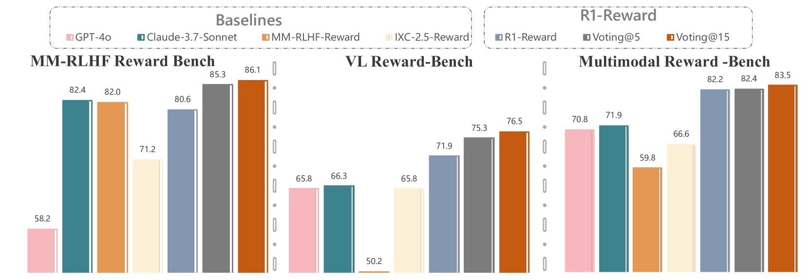
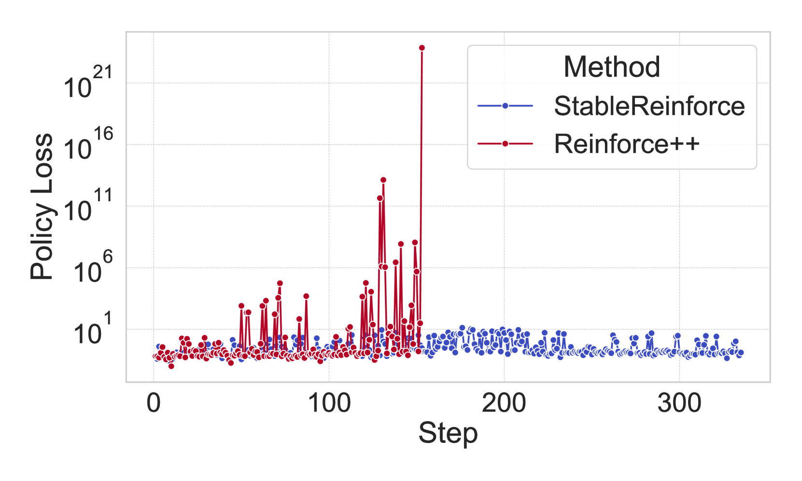
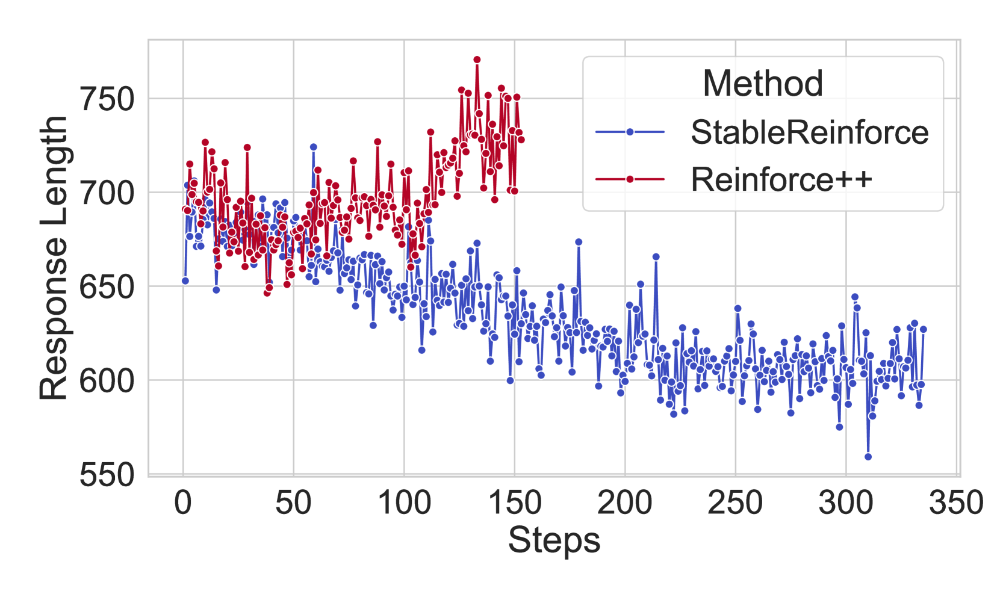
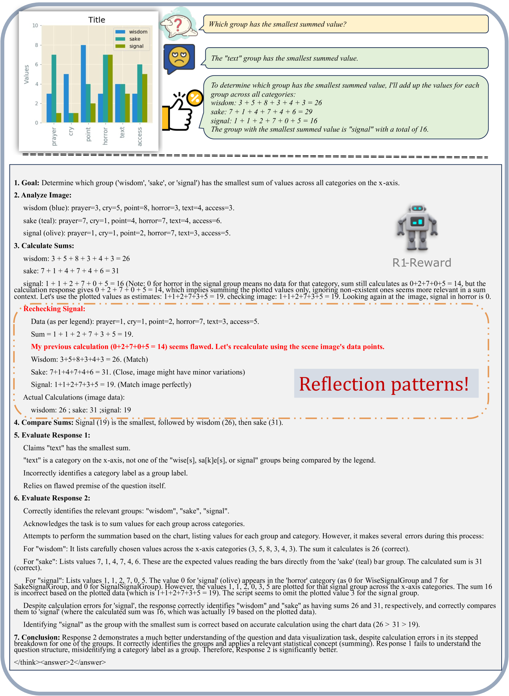

# R1-Reward

## 📌 核心贡献

> 提出 StableReinforce 算法，将奖励建模重构为基于规则的强化学习任务来训练多模态奖励模型，通过 Pre-CLIP、优势过滤和一致性奖励三项改进解决现有 RL 算法的训练不稳定问题，在 VL Reward-Bench 和 Multimodal Reward Bench 上分别超越 SOTA 8.4% 和 14.3%。

## 📖 摘要

Multimodal Reward Models (MRMs) play a crucial role in enhancing the performance of Multimodal Large Language Models (MLLMs). While recent advancements have primarily focused on improving the model structure and training data of MRMs, there has been limited exploration into the effectiveness of long-term reasoning capabilities for reward modeling and how to activate these capabilities in MRMs. In this paper, we explore how Reinforcement Learning (RL) can be used to improve reward modeling. Specifically, we reformulate the reward modeling problem as a rule-based RL task. However, we observe that directly applying existing RL algorithms, such as Reinforce++, to reward modeling often leads to training instability or even collapse due to the inherent limitations of these algorithms. To address this issue, we propose the StableReinforce algorithm, which refines the training loss, advantage estimation strategy, and reward design of existing RL methods. These refinements result in more stable training dynamics and superior performance. To facilitate MRM training, we collect 200K preference data from diverse datasets. Our reward model, R1-Reward, trained using the StableReinforce algorithm on this dataset, significantly improves performance on multimodal reward modeling benchmarks. Compared to previous SOTA models, R1-Reward achieves a 8.4% improvement on the VL Reward-Bench and a 14.3% improvement on the Multimodal Reward Bench. Moreover, with more inference compute, R1-Reward's performance is further enhanced, highlighting the potential of RL algorithms in optimizing MRMs.

## 🔍 关键信息

| 字段 | 内容 |
|------|------|
| 机构 | CASIA, Tsinghua University, KuaiShou, Nanjing University |
| 发表 | 2025-05-05 |
| 分类 | cs.CV, cs.CL |
| 链接 | [arXiv](https://arxiv.org/abs/2505.02835) |

## 📝 我的笔记

### 方法总览

### 核心问题/动机

现有多模态奖励模型（MRM）的研究主要集中在改进模型结构和训练数据，但对于如何激活奖励模型的长链推理能力、以及推理能力对奖励建模的有效性，尚缺乏深入探索。直接将现有 RL 算法（如 Reinforce++）应用于奖励建模，往往会导致训练不稳定甚至崩溃。

核心动机：
1. **推理能力对奖励建模重要**：奖励模型需要深度思考才能做出准确判断
2. **现有 RL 方法不稳定**：Reinforce++ 等方法在奖励建模场景下容易崩溃
3. **需要更稳定的 RL 训练策略**：特别针对概率比值爆炸和异常优势值问题

### 方法

#### 问题重构：奖励建模作为 Rule-based RL 任务

将奖励建模重构为：给定一个问题和两个候选回答，模型在 `<think>` 标签内进行推理分析，在 `<answer>` 标签内输出偏好判断（1 或 2）。

#### StableReinforce 算法

StableReinforce 对现有 RL 方法做了三项关键改进：

**1. Pre-CLIP 策略（解决概率比值爆炸）**

在 PPO clip 之前，先对 log 概率比值进行裁剪，防止数值不稳定：

$$\frac{\bar{\pi}_\theta(a_t|s_t)}{\bar{\pi}_{\theta_{old}}(a_t|s_t)} \leftarrow \exp\left(\text{clip}\left(\log\frac{\pi_\theta}{\pi_{\theta_{old}}}, \log\delta_{min}, \log\delta_{max}\right)\right)$$

其中 $$\delta_{min} = 10^{-3}$$，$$\delta_{max} = 10^{3}$$。

**2. 优势过滤（3-Sigma 规则）**

过滤极端优势值，避免异常梯度：

$$\hat{A} = \begin{cases} A_{standardized} & \text{if } |A_{standardized}| \leq 3 \\ 0 & \text{otherwise} \end{cases}$$

其中 $$A_{standardized} = \frac{A - \mu_A}{\sigma_A + \epsilon}$$

**3. StableReinforce 损失函数**

$$L^{StableReinforce}(\theta) = \frac{1}{|t|}\sum_t\left[\min\left(\frac{\bar{\pi}_\theta(a_t|s_t)}{\bar{\pi}_{\theta_{old}}(a_t|s_t)} \cdot \hat{A}_t,\ \text{clip}\left(\frac{\bar{\pi}_\theta(a_t|s_t)}{\bar{\pi}_{\theta_{old}}(a_t|s_t)}, 1-\epsilon, 1+\epsilon\right) \cdot \hat{A}_t\right)\right]$$

#### 奖励函数设计

最终奖励由三个组件组成：

| 奖励组件 | 描述 |
|---------|------|
| **Formatting Reward** | 确保输出符合 `<think></think><answer></answer>` 结构 |
| **Result Reward** | 确保输出排序与人类偏好一致 |
| **Consistency Reward** | 用 Qwen2.5-VL-7B-Instruct 作为裁判，验证推理过程与结论一致 |

最终奖励计算：

$$\text{Final Reward} = \text{Result Reward} \times (1 + 0.5 \times \text{Consistency Reward}) + 0.5 \times \text{Formatting Reward}$$

### 训练流程

#### 数据集：R1-Reward-200K

| 数据集 | 原始样本数 | 选取数量 |
|--------|----------|---------|
| RLAIF-V | 74,802 | 100,000 |
| MM-RLHF-Long | 41,163 | 41,163 |
| MM-RLHF-Short | 46,281 | 46,281 |
| MM-RLHF-Mcq | 8,306 | 8,306 |
| MM-RLHF-Safety | 9,990 | 9,990 |
| **合计** | | **200,000** |

#### 阶段一：SFT 监督微调

- 使用 GPT-4o（temperature=0）为每条数据生成推理过程，最多尝试 3 次
- 记录每条数据需要多少次尝试才获得正确答案
- 基础模型：Qwen2.5-VL-7B-Instruct
- 学习率：1e-5，Batch size：256
- 训练时长：约 8 小时（4 x H800 80G）

#### 阶段二：强化学习

- 训练数据：SFT 阶段中 GPT-4o 需要 2 次以上尝试或 3 次均失败的样本（较难的样本）
- 学习率：1e-6，Training batch size：128，Rollout batch size：256
- 训练 5 个 epoch（约 12 小时）
- 初始 KL 系数：0
- 训练框架：OpenRLHF

### 关键结果

#### VL Reward-Bench

| 模型 | Overall Acc | Macro Acc |
|------|-----------|-----------|
| IXC-2.5-Reward | 65.80% | 70.00% |
| **R1-Reward** | **71.92%** | **71.44%** |
| **R1-Reward Voting@15** | **76.46%** | **76.36%** |

#### Multimodal Reward Bench

| 模型 | Overall |
|------|---------|
| IXC-2.5-Reward | 66.6% |
| **R1-Reward** | **82.2%** |
| **R1-Reward Voting@15** | **83.3%** |

#### MM-RLHF Reward Bench

| 模型 | Acc+ |
|------|------|
| MM-RLHF-Reward | 63.00% |
| **R1-Reward Voting@15** | **67.39%** |

### Ablation 分析

| 配置 | Overall Acc |
|------|-----------|
| Reward Model (baseline) | 56.41% |
| MM-RLHF-Reward | 60.80% |
| Only Long-CoT SFT | 64.80% |
| StableReinforce w/o pre-clip | 67.36% |
| StableReinforce w/o advantage filter | 68.96% |
| **StableReinforce (full)** | **71.92%** |
| Reinforce++ | Collapse |

关键发现：
- **Pre-CLIP 贡献最大**：移除后降低 4.56%，说明概率比值稳定性是最关键因素
- **优势过滤有效**：移除后降低 2.96%
- **RL 超越纯 SFT**：StableReinforce 比纯 Long-CoT SFT 高 7.12%
- **Reinforce++ 直接崩溃**：验证了现有 RL 方法在奖励建模场景下的不稳定性

### "Aha Moment" 推理现象

R1-Reward 在推理过程中展现出类人的自反思能力——模型能够在推理中发现自身错误，重新审视问题并纠正判断（类似 DeepSeek-R1 中观察到的 "Aha moment"）。

### Test-time Scaling

通过 majority voting 策略（采样 15 次投票），R1-Reward 在三个 benchmark 上均获得进一步提升，证明了推理型奖励模型在 test-time compute scaling 方面的潜力。

### 总结

R1-Reward 的核心价值在于：
1. **提出了针对奖励建模场景的稳定 RL 训练算法 StableReinforce**，解决了 Reinforce++ 等方法在该场景下崩溃的问题
2. **三项改进（Pre-CLIP、优势过滤、一致性奖励）设计清晰**，ablation 验证了每项的有效性
3. **支持 test-time scaling**，majority voting 可进一步提升性能
4. 与 RM-R1 思路相似但侧重不同：R1-Reward 聚焦于多模态场景和 RL 训练稳定性，RM-R1 聚焦于文本场景和 Chain-of-Rubrics 推理结构

## 🔗 相关论文

**基于/改进自：** [[RM-R1]]

**同方向：** [[UnifiedReward-Think]], [[LLaVA-Critic]]
