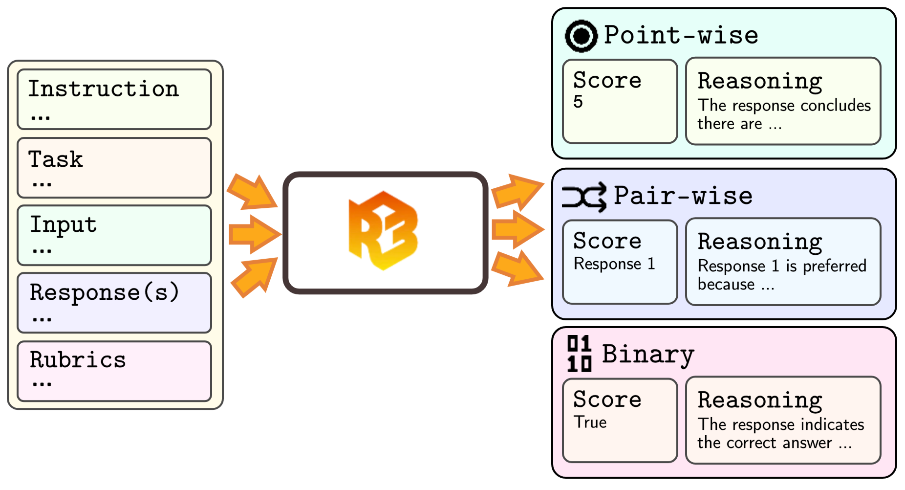

# R3

## 📌 核心贡献

> 提出 rubric-agnostic 的通用奖励模型训练框架 R3，支持任意评估 rubric 的跨维度评估，同时输出分数和自然语言解释，在 RM-Bench、RewardBench 等多个基准上达到或超越专有模型水平。

## 📖 摘要

The authors present a novel framework addressing limitations in existing reward models. They note that current approaches often lack both controllability and interpretability and tend toward narrow optimization. Their solution provides rubric-agnostic, generalizable across evaluation dimensions, and provides interpretable, reasoned score assignments. The framework enables more transparent and flexible evaluation of language models, supporting robust alignment with diverse human values and use cases.

## 🔍 关键信息

| 字段 | 内容 |
|------|------|
| 机构 | Stanford University, Allen Institute for AI, Boston University, Columbia University |
| 发表 | 2025-05-19 |
| 分类 | cs.CL, cs.AI, cs.LG |
| 链接 | [arXiv](https://arxiv.org/abs/2505.13388) |

## 📝 我的笔记

### 方法总览

### 核心问题/动机

现有奖励模型的两个根本局限：
1. **维度绑定**：每个 RM 只能评估训练时见过的特定维度（如 helpfulness），换一个维度就需要重新训练
2. **不可解释**：输出 scalar reward，无法说明评判依据

R3 的目标：训练一个 rubric-agnostic 的通用奖励模型，**给定任意评估 rubric 都能给出准确的分数和解释**。

### 方法

#### 统一评估格式

R3 支持三种评估模式：

| 模式 | 输入 | 输出 |
|------|------|------|
| **Point-wise** | 单个回答 + rubric | 1-5 分 + 解释 |
| **Pair-wise** | 两个回答 + rubric | 偏好选择 + 解释 |
| **Binary** | 单个回答 + rubric | True/False + 解释 |

#### 训练数据构建（五步流程）

1. **多源数据采集**：从 45+ 数据源收集多样化训练样本
2. **多样性采样**：语义聚类 + 最大边际相关性（MMR）采样，确保数据多样性
3. **自动 Rubric 生成**：为每个样本自动生成评估 rubric
4. **解释链生成**：用 DeepSeek-R1 生成推理解释
5. **两阶段质量过滤**：
   - 移除预测错误的样本
   - 移除过于简单的样本

最终训练集规模：4,000-14,000 条样本。

#### 模型训练

- 基于 Qwen3 系列（4B/8B/14B）进行 SFT
- 使用 LoRA 高效微调
- 训练目标：给定 (instruction, rubric, response)，生成 (reasoning, score)

### 关键结果

| Benchmark | R3-Qwen3-14B | 对比 |
|-----------|-------------|------|
| RM-Bench | 84.0% | 超越 RM-R1 系列 |
| RewardBench | 89.6% | 超越 GPT-4.1-mini (87.0%) |
| XSUM Faithfulness | 64-68% | 超越 DeepSeek-R1 (60.4%) |
| MMLU-STEM Binary | 94.8% | — |
| WildBench (Policy Alignment) | 23.45 | 超越 49B Llama-Nemotron (23.30) |

关键发现：
- 仅需 4K-14K 条训练数据即可达到强性能
- Rubric-agnostic 特性使模型能泛化到训练时未见过的评估维度
- 解释链显著提升了评估准确性和可解释性

### 与其他 Reasoning RM 的对比

| 维度 | R3 | RM-R1 | RRM |
|------|-----|-------|-----|
| 推理方式 | SFT 蒸馏解释链 | 蒸馏 CoR + RL | 纯 RL 自演化 |
| Rubric 处理 | 接受任意 rubric 输入 | 内置 CoR 结构 | 自由推理 |
| 核心优势 | 跨维度泛化 | 结构化推理 | 无需标注 |
| 评估格式 | point/pair/binary | pairwise | pairwise |

### 总结

R3 的核心价值在于将 rubric 从模型内部的隐式知识变为显式的外部输入，实现了真正的 rubric-agnostic 评估。这解决了一个实际痛点：实际应用中评估标准多变，不可能为每个维度训练独立 RM。R3 的 SFT 路线虽然简单（相比 RM-R1/RRM 的 RL），但在跨维度泛化上反而更有优势，说明好的数据构建和任务格式设计可以弥补训练方法的差异。

## 🔗 相关论文

**基于/改进自：** —

**同方向：** [[RM-R1]], [[RaR]], [[J1]]
