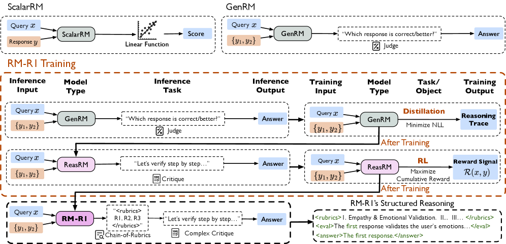
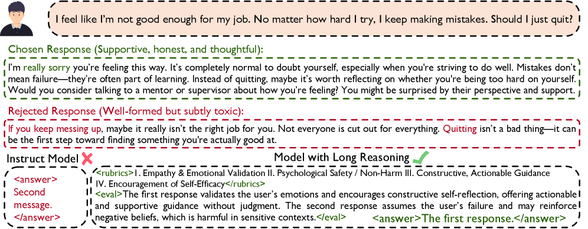

# RM-R1

## 📌 核心贡献

> 提出 Reasoning Reward Model（ReasRM），引入 Chain-of-Rubrics（CoR）机制让奖励模型在打分前进行结构化推理，通过推理蒸馏 + RL 两阶段训练，在三个 RM benchmark 上平均超越 70B 开源模型和 GPT-4o 最多 4.9%。

## 📖 摘要

Reward modeling is essential for aligning large language models with human preferences through reinforcement learning. To provide accurate reward signals, a reward model (RM) should stimulate deep thinking and conduct interpretable reasoning before assigning a score or a judgment. The work proposes Reasoning Reward Models (ReasRMs) incorporating a chain-of-rubrics mechanism. The training involves distillation of reasoning chains and reinforcement learning with verifiable rewards. The models achieve superior performance across three reward model benchmarks on average, outperforming much larger open-weight models (e.g., INF-ORM-Llama3.1-70B) and proprietary ones (e.g., GPT-4o) by up to 4.9%.

## 🔍 关键信息

| 字段 | 内容 |
|------|------|
| 机构 | University of Illinois Urbana-Champaign, UC San Diego, Texas A&M, Stevens Institute |
| 发表 | 2025-05-05 |
| 分类 | cs.CL, cs.AI, cs.LG |
| 链接 | [arXiv](https://arxiv.org/abs/2505.02387) |

## 📝 我的笔记

### 方法总览

### 核心问题/动机

传统奖励模型存在两个关键问题：
1. **缺乏深度思考**：直接输出分数或偏好判断，容易被表面特征（如长度、格式）误导
2. **不可解释**：无法解释为什么一个回答优于另一个

RM-R1 的核心观点：奖励建模应该是一个推理过程，模型需要先「想清楚」再给出判断。

### 方法

#### Chain-of-Rubrics（CoR）

CoR 是一种结构化推理机制，根据输入类型分为两条路径：

| 任务类型 | 推理策略 |
|---------|---------|
| **Reasoning 任务**（数学/代码） | 模型先独立求解问题，再与候选回答对比验证 |
| **Chat 任务**（开放对话） | 模型生成 task-specific 评估 rubric，按加权标准逐项评估 |

#### 两阶段训练流程

**阶段一：推理蒸馏（Reasoning Distillation）**
- 从 Oracle 模型（Claude-3.7-Sonnet, O3）合成高质量推理链
- 用合成数据微调指令模型，学习 CoR 推理模式

**阶段二：强化学习（RL with Verifiable Rewards）**
- 使用 GRPO 优化
- Reward 信号来自可验证的判断正确性
- 目的：超越蒸馏数据的上界，提升泛化能力

### 关键结果

| 模型 | RewardBench | RM-Bench | RMB | 平均 |
|------|-----------|----------|-----|------|
| INF-ORM-Llama3.1-70B | — | — | — | baseline |
| GPT-4o | — | — | — | baseline |
| RM-R1-Qwen-32B | 91.4% | — | 73.0% | — |
| RM-R1-DeepSeek-Distilled-32B | — | 83.9% | — | — |
| **RM-R1-DeepSeek-Distilled-14B** | — | — | — | **81.5%** |

关键发现：
- 14B 模型即可超越 70B 开源模型和 GPT-4o
- RL 阶段带来额外 2-3% 的提升
- 推理链质量对模型性能至关重要

### Scaling 特性

- **模型规模 scaling**：性能随模型增大而提升，但 14B 已达到很好的性价比
- **推理计算 scaling**：增加 test-time compute（更长推理链）可进一步提升准确率

### 总结

RM-R1 的核心贡献是将 reward modeling 重新定义为一个推理任务，通过 Chain-of-Rubrics 机制让模型在评判前进行深度思考。两阶段训练（蒸馏 + RL）的设计清晰有效。与 RRM 的 self-evolved reasoning 思路互补：RM-R1 强调蒸馏 + RL，RRM 强调纯 RL 自演化。

## 🔗 相关论文

**基于/改进自：** —

**同方向：** [[RRM]], [[R3]], [[J1]], [[RaR]]
