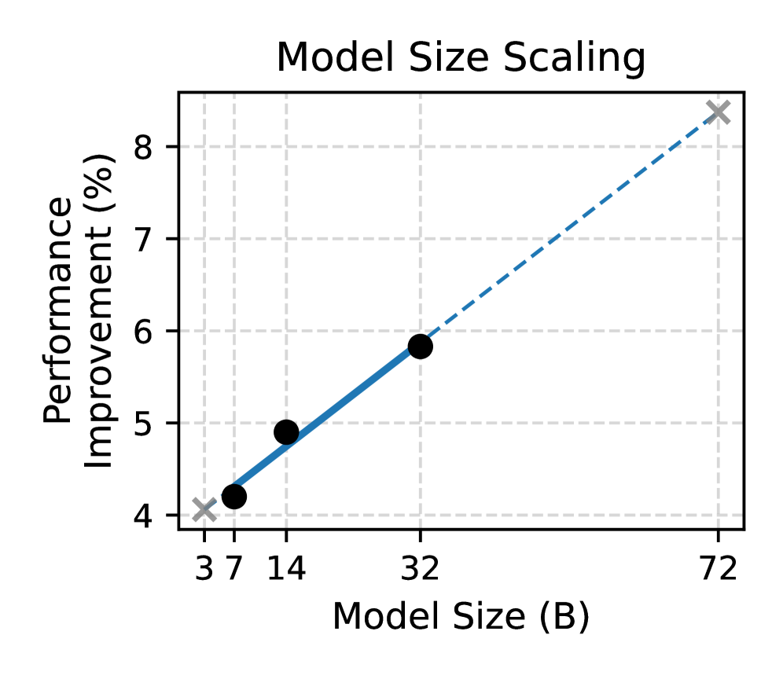
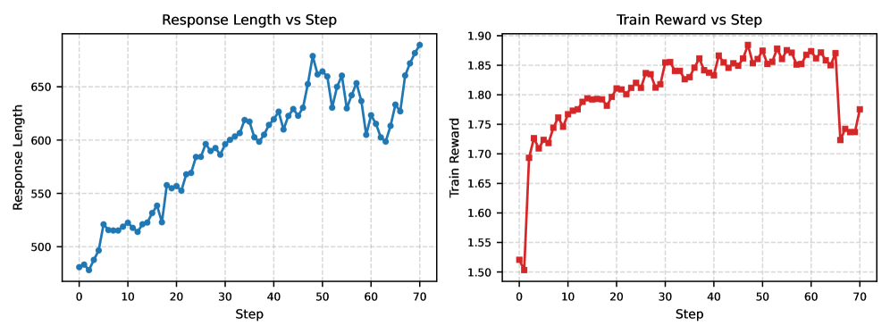
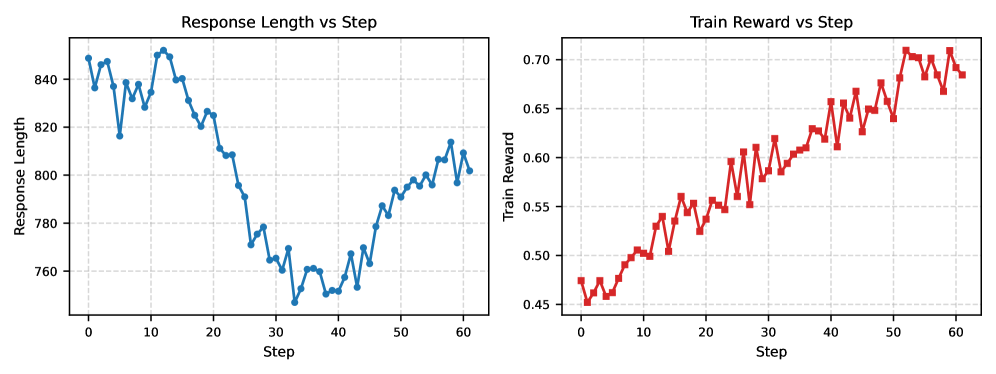

# RM-R1

## 📌 核心贡献

> 提出 Reasoning Reward Model（ReasRM），引入 Chain-of-Rubrics（CoR）机制让奖励模型在打分前进行结构化推理，通过推理蒸馏 + RL 两阶段训练，在三个 RM benchmark 上平均超越 70B 开源模型和 GPT-4o 最多 4.9%。

## 📖 摘要

Reward modeling is essential for aligning large language models with human preferences through reinforcement learning. To provide accurate reward signals, a reward model (RM) should stimulate deep thinking and conduct interpretable reasoning before assigning a score or a judgment. The work proposes Reasoning Reward Models (ReasRMs) incorporating a chain-of-rubrics mechanism. The training involves distillation of reasoning chains and reinforcement learning with verifiable rewards. The models achieve superior performance across three reward model benchmarks on average, outperforming much larger open-weight models (e.g., INF-ORM-Llama3.1-70B) and proprietary ones (e.g., GPT-4o) by up to 4.9%.

## 🔍 关键信息

| 字段 | 内容 |
|------|------|
| 机构 | University of Illinois Urbana-Champaign, UC San Diego, Texas A&M, Stevens Institute |
| 发表 | 2025-05-05 |
| 分类 | cs.CL, cs.AI, cs.LG |
| 链接 | [arXiv](https://arxiv.org/abs/2505.02387) |

## 📝 我的笔记

### 方法总览

### 核心问题/动机

传统奖励模型存在两个关键问题：
1. **缺乏深度思考**：Scalar-based RM 直接输出分数，容易被表面特征（如长度、格式）误导
2. **不可解释**：Generative RM 虽产生文本判断，但推理往往浮于表面，缺少深层逻辑

RM-R1 的核心观点：**奖励建模本质上是一个推理任务**——准确的偏好判断需要推断评估标准、权衡多方面因素、模拟结果影响，这些都需要深度推理。

### 形式化定义

给定偏好数据集 $D = \{(x^{(i)}, y_a^{(i)}, y_b^{(i)}, l^{(i)})\}_{i=1}^N$，其中 $x$ 为 prompt，$y_a, y_b$ 为两个候选回答，$l \in \{a, b\}$ 为偏好标签。

生成式奖励建模的目标：

$$r_\theta(j|x, y_a, y_b) = \prod_{t=1}^{T} r_\theta(j_t | x, y_a, y_b, j_{<t})$$

$$\max_{r_\theta} \mathbb{E}_{(x,y_a,y_b,l) \sim D, \hat{l} \sim r_\theta(j|x,y_a,y_b)} [\mathbb{1}(\hat{l} = l)]$$

其中 $j = (j_1, j_2, ..., j_T)$ 包含模型的推理链和预测偏好 $\hat{l}$。

### 方法

#### Chain-of-Rubrics（CoR）机制

CoR 是一种结构化推理机制，根据输入类型自动分为两条评估路径：

| 任务类型 | 推理策略 | 输出结构 |
|---------|---------|---------|
| **Reasoning 任务**（数学/代码/推理） | 模型先在 `<solution>` 中独立求解，再与候选回答对比验证 | `<solution>` → `<eval>` → `<answer>` |
| **Chat 任务**（开放对话/事实/安全） | 模型在 `<rubric>` 中生成 task-specific 加权评估标准，按标准逐项评估 | `<rubric>` → `<justify>` → `<eval>` → `<answer>` |

Chat 任务的 rubric 设计亮点：模型自动为不同领域的问题分配不同权重。例如医学问题中 Accuracy 权重为 40%（最高），而一般对话中 Relevance 可能更重要。

#### 两阶段训练流程

**阶段一：推理蒸馏（Reasoning Distillation）**

从训练数据 $D$ 中采样 $M$ 个样本构成 $D_{sub}$，用 Oracle 模型（Claude-3.7-Sonnet + O3）生成推理链：

$$D_{distill} = \{(x^{(i)}, r^{(i)} \oplus l^{(i)})\}_{i=1}^M$$

蒸馏损失：

$$\mathcal{L}_{distill}(\theta) = -\sum_{(x,y) \in D_{distill}} \sum_{t \in [|y|]} \log r_\theta(y_t | x, y_{<t})$$

具体流程：先用 Claude-3.7-Sonnet 生成推理链，对约 25% 判断错误的样本用 O3 重新生成对齐正确答案的推理链。最终从约 72K 训练数据中选取约 8.7K 样本用于蒸馏。

**阶段二：RL 训练（GRPO）**

策略优化目标：

$$\max_{r_\theta} \mathbb{E}_{(x,y_a,y_b,l) \sim D, \hat{l} \sim r_\theta(j|x,y_a,y_b)} [R(x,j)] - \beta D_{KL}(r_\theta \| r_{ref})$$

Reward 函数（简洁的可验证信号）：

$$R(x, j | y_a, y_b) = \begin{cases} 1 & \text{if } \hat{l} = l \\ -1 & \text{otherwise} \end{cases}$$

使用 GRPO（Group Relative Policy Optimization）算法，优势估计：

$$\hat{A}_i = \frac{r_i - \text{mean}(\{r_1, ..., r_G\})}{\text{std}(\{r_1, ..., r_G\})}$$

每个 prompt 采样 $G=7$ 个候选响应用于相对优势计算。

### 训练细节

**数据集构成（约 72K）：**

| 数据集 | 规模 | 内容 |
|--------|------|------|
| Skywork Reward Preference 80K（清洗后） | ~70K | chat, safety, math, code（移除了 magpie_ultra 中的虚假相关） |
| Code-Preference-Pairs | 8K | 细粒度代码偏好 |
| Math-DPO-10K | 10K | 逐步数学推理偏好 |

蒸馏数据仅用 8.7K（约训练数据的 12%），RLVR 使用全部 64K 用于强化学习阶段。

**关键超参数：**

| 参数 | 蒸馏阶段 | RL 阶段 |
|------|----------|---------|
| Batch size | 128 | 1024（mini-batch 128） |
| 学习率（7B/14B/32B） | 5e-6 / 3e-6 / 2e-6 | 1e-6 / 7e-7 / 5e-7（Instruct） |
| KL 系数 | — | 1e-3 |
| Clip ratio | — | 0.2 |
| 每 prompt 采样数 | — | 7 |
| Max input / response | — | 4096 / 8192 tokens |
| 硬件 | — | 7B: 8×H100, 14B: 16×H100, 32B: 32×H100 |

### 关键结果

**三大 Benchmark 平均性能（Table 1）：**

| 模型 | RewardBench | RM-Bench | RMB | 平均 |
|------|-------------|----------|-----|------|
| INF-ORM-Llama3.1-70B | 95.1 | 70.9 | 70.5 | 78.8 |
| Nemotron-4-340B | 92.0 | 69.5 | 69.9 | 77.1 |
| GPT-4o-0806 | 86.7 | 72.5 | 73.8 | 77.7 |
| RM-R1-DeepSeek-Distilled-Qwen-14B | 88.9 | 81.5 | 68.5 | 79.6 |
| **RM-R1-Qwen-Instruct-32B** | **91.4** | 79.1 | **73.0** | **81.2** |
| **RM-R1-DeepSeek-Distilled-Qwen-32B** | 90.9 | **83.9** | 69.8 | **81.5** |

关键发现：
- **14B 即可超越 70B 和 GPT-4o**：RM-R1-14B 平均 79.6%，已超过 INF-ORM-70B 的 78.8%
- **RM-Bench 上大幅领先**：DeepSeek-32B 在 RM-Bench 上达到 83.9%，比次优的 GPT-4o（72.5%）高 11.4%，尤其在 Math（91.8%）和 Code（74.1%）上远超所有对手
- **RMB 上 Instruct 模型更强**：Qwen-Instruct-32B 在 RMB 上达到 73.0%，超越 GPT-4o 的 73.8%（注：不同 benchmark 偏好不同风格的推理）

### Ablation 分析

**训练配方消融（Table 2，基于 Qwen-2.5-Instruct-32B）：**

| 配置 | Chat | Chat Hard | Safety | Reasoning | 平均 |
|------|------|-----------|--------|-----------|------|
| Instruct（原始） | 95.8 | 74.3 | 86.8 | 86.3 | 85.8 |
| + Cold Start RL | 92.5 | 81.5 | 89.7 | 94.4 | 89.5 |
| + Rubrics | 93.0 | 82.5 | 90.8 | 94.2 | 90.1 |
| + Rubrics + QC | 92.3 | 82.6 | 91.6 | 96.3 | 90.8 |
| **RM-R1（Full）** | **95.3** | **83.1** | **91.9** | **95.2** | **91.4** |

- Cold Start RL 提升明显（85.8 → 89.5），但 Chat 维度下降
- CoR rubrics 进一步提升 Chat Hard 和 Safety
- 蒸馏（Warm Start）恢复 Chat 性能并保持其他维度优势，总体达到 91.4

**推理 vs 非推理训练（Table 3，32B）：**

| 方法 | RewardBench | RM-Bench | RMB | 平均 |
|------|-------------|----------|-----|------|
| Instruct + SFT（全量数据） | 90.9 | 75.4 | 65.9 | 77.4 |
| Instruct + Distilled + SFT | 91.2 | 76.7 | 65.4 | 77.8 |
| **RM-R1（Distilled + RL）** | **91.4** | **79.1** | **73.0** | **81.2** |

结论：在同等数据下，推理式训练（蒸馏 + RL）比纯 SFT 高 3.4%（81.2 vs 77.8），差距主要来自 RMB（73.0 vs 65.4）。

### Scaling 特性

- **模型规模 scaling**：从 7B → 14B → 32B，相对改进近似线性增长。14B 已达到很好的性价比，但 32B 仍有明显收益
- **推理计算 scaling**：从 512 到 8192 tokens 的推理预算，性能单调递增。更长的推理链确实产生更好的判断

### 训练动态

- **Cold Start RL**（无蒸馏直接 RL）：响应长度持续增加，训练末期出现 reward 急剧下降，说明存在过拟合风险
- **Warm Start RL**（蒸馏后 RL）：模型初始即具备推理能力，先学习更精简的推理再逐步扩展，reward 曲线平稳上升
- 核心启示：**蒸馏不仅提供更好的起点，更重要的是为 RL 提供了稳定的训练基础**

### 定性分析

论文给出的医学问题案例很有说服力：
- **Cold Start 模型**：关注表面特征（回答数量、相关性），给出 "Relevance 40%, Comprehensiveness 30%, Clarity 30%" 的通用 rubric，选择了内容不准确但更长的回答
- **RM-R1 模型**：为医学问题生成针对性 rubric "Accuracy 40%, Comprehensiveness 30%, Clarity 20%, Helpfulness 10%"，并在 `<justify>` 中解释为什么医学场景准确性最重要，正确识别了回答 A 中的错误（如 "painful red/yellow skin lesions" 和 "vision loss" 并非镰刀细胞病典型症状）

### 总结

RM-R1 的核心贡献是将 reward modeling 重新定义为一个推理任务，通过 Chain-of-Rubrics 机制让模型在评判前进行深度结构化推理。两阶段训练（蒸馏 + RL）的设计清晰有效——蒸馏提供稳定的推理基础，RL 突破蒸馏数据的上限。

与同方向工作的比较：
- vs **[[RRM]]**：RM-R1 强调蒸馏 + RL，RRM 强调纯 RL 自演化推理
- vs **[[DeepSeek-GRM]]**：RM-R1 用 CoR 提供结构化推理框架，GRM 侧重 meta-reward 机制
- vs **[[PRIME]]**：PRIME 关注 process reward，RM-R1 关注 outcome-level 偏好判断的推理过程

数据效率值得注意：仅需 8.7K 蒸馏样本即可训出有效的推理 RM，远低于训练底层推理模型所需的 800K 数据量。

## 🔗 相关论文

**基于/改进自：** [[GenRM]]

**同方向：** [[RRM]], [[R3]], [[J1]], [[RaR]], [[DeepSeek-GRM]], [[PRIME]]
