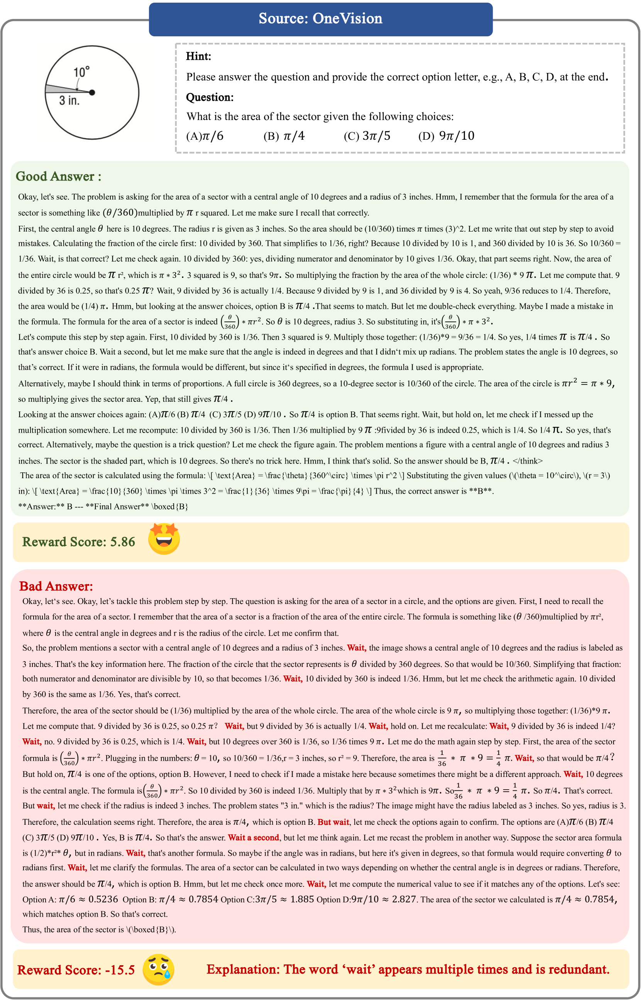

# Skywork-VL Reward

## 📌 核心贡献

> 将 Skywork-Reward 扩展到多模态领域，通过构建大规模多模态偏好数据集（~190K）和两阶段微调策略，在 VL-RewardBench 上以 7B 参数量取得 SOTA（73.1%），超越 Gemini-2.0-flash-exp 等闭源模型，同时在纯文本 RewardBench 上保持 90.1 的竞争力。

## 📖 摘要

We propose Skywork-VL Reward, a multimodal reward model that provides reward signals for both multimodal understanding and reasoning tasks. Our technical approach comprises two key components: First, we construct a large-scale multimodal preference dataset that covers a wide range of tasks and scenarios, with responses collected from both standard vision-language models (VLMs) and advanced VLM reasoners. Second, we design a reward model architecture based on Qwen2.5-VL-7B-Instruct, integrating a reward head and applying multi-stage fine-tuning using pairwise ranking loss on pairwise preference data. Experimental evaluations show that Skywork-VL Reward achieves state-of-the-art results on multimodal VL-RewardBench and exhibits competitive performance on the text-only RewardBench benchmark. Furthermore, preference data constructed based on our Skywork-VL Reward proves highly effective for training Mixed Preference Optimization (MPO), leading to significant improvements in multimodal reasoning capabilities. Our results underscore Skywork-VL Reward as a significant advancement toward general-purpose, reliable reward models for multimodal alignment. Our model has been publicly released to promote transparency and reproducibility.

## 🔍 关键信息

| 字段 | 内容 |
|------|------|
| 机构 | Skywork AI, Kunlun Inc. |
| 发表 | 2025-05-12 |
| 分类 | cs.CV |
| 链接 | [arXiv](https://arxiv.org/abs/2505.07263) |

## 📝 我的笔记

### 方法总览

### 核心问题/动机

现有奖励模型主要针对纯文本场景（如 Skywork-Reward），缺乏对多模态视觉-语言任务的支持。本文将 Skywork-Reward 的数据中心方法论扩展到多模态领域，核心挑战在于：(1) 高质量多模态偏好数据稀缺；(2) 推理类多模态任务（数学、科学图表等）需要专门的数据构建策略。

### 数据构建

#### 开源数据（~190K 总量的主体）

| 数据集 | 数量 | 特点 |
|--------|------|------|
| LLaVA-Critic-113k | 113K | GPT-4o 生成的多模态点对评分和成对排序 |
| Skywork-Reward-Preference-80K-v0.2 | 80K | 纯文本偏好对（Q&A + 创意写作） |
| RLAIF-V-Dataset | 83K | 多模态偏好对 |

#### 三阶段数据处理流水线

**Stage 1（过滤）**：跨源去重 + 语义相似度过滤 + 模糊判断过滤 → ~200K 高置信偏好对

**Stage 2（质量增强）**：低分 chosen 响应用 GPT-4o 重新生成；分数差异过小的对被增强 → 保留 150K

**Stage 3（推理数据）**：自建约 50K 推理偏好数据，涵盖数学（35.4%）、物理（24.6%）、化学（20.2%）、生物（14.7%）等领域，两种生成方式：
- 直接生成（47.4%）：使用 Skywork R1V 推理模型
- 两步生成（52.6%）：标准 VLM 描述 → Deepseek R1 推理

最终数据集 ~190K 偏好对，其中 ~70% 包含图像。

### 模型架构

基于 **Qwen2.5-VL-7B-Instruct**，修改如下：
- **视觉编码器（ViT）**：冻结
- **投影器 + 语言骨干**：可训练
- **奖励头**：将 causal LM head 替换为全连接层，输出最后隐藏状态对应的标量奖励分数

### 训练策略

**两阶段微调**：

| 阶段 | 数据 | 学习率 | 轮数 |
|------|------|--------|------|
| Stage 1 | 仅多模态偏好数据 | 1e-5 | 2 |
| Stage 2 | 多模态 + 文本混合数据 | 1e-6 | 2 |

优化器：AdamW

**损失函数**：标准 pairwise ranking loss（与 Skywork-Reward 一致）：

$$\mathcal{L}_{\text{RM}}(\theta) = -\log \sigma(r_\theta(x, y^+) - r_\theta(x, y^-))$$

其中 $\sigma$ 为 sigmoid 函数，$r_\theta$ 为奖励模型输出，$y^+$ / $y^-$ 分别为 chosen / rejected 响应。

### 关键结果

#### VL-RewardBench（Table 3）

| 模型 | Size | General | Hallucination | Reasoning | Overall | Macro Avg |
|------|------|---------|---------------|-----------|---------|-----------|
| GPT-4o | - | 49.1 | 67.6 | 70.5 | 65.8 | 62.4 |
| Gemini-2.0-flash-exp | - | 50.8 | 72.6 | 70.1 | 68.8 | 64.5 |
| IXC-2.5-Reward-7B | 7B | 80.3 | 65.3 | 60.4 | 66.3 | 68.6 |
| InternVL3-8B | 8B | 60.6 | 44.0 | 62.3 | 57.0 | 55.6 |
| InternVL3-78B | 78B | 67.8 | 52.5 | 64.5 | 63.3 | 61.6 |
| **Skywork-VL Reward** | **7B** | **66.0** | **80.0** | **61.0** | **73.1** | **69.0** |

**Skywork-VL Reward 以 7B 参数量取得 73.1% 的 Overall Accuracy，超越所有闭源模型和开源模型**，其中 Hallucination 维度高达 80.0%，领先所有对手。

#### RewardBench（Table 4，纯文本）

| 模型 | Chat | Chat Hard | Safety | Reasoning | Avg |
|------|------|-----------|--------|-----------|-----|
| Skywork-Reward-Llama3.1-8B-v0.2 | 94.7 | 88.4 | 92.7 | 96.7 | 93.1 |
| QRM-Llama3.1-8B-v2 | 96.4 | 86.8 | 92.6 | 96.8 | 93.1 |
| IXC-2.5-Reward-7B | 90.8 | 83.8 | 87.8 | 90.0 | 88.1 |
| **Skywork-VL Reward** | **90.0** | **87.5** | **91.1** | **91.8** | **90.1** |

在纯文本 RewardBench 上，Skywork-VL Reward（90.1）大幅超越其他多模态 RM（IXC-2.5-Reward 88.1），接近专用文本 RM（93.1），展示了良好的跨模态泛化能力。

#### MPO 下游应用（Table 5）

| 模型 | MathVista (%) |
|------|---------------|
| Qwen2.5-VL-7B（基线） | 69.2 |
| + InternVL3-8B 构建偏好 | 71.2 |
| + Skywork-VL Reward 构建偏好 | 71.8 |
| + Skywork-VL Reward for MPO | **73.5** |

使用 Skywork-VL Reward 构建的偏好数据进行 MPO 训练，在 MathVista 上获得 +4.3% 的绝对提升。

### 总结性评价

Skywork-VL Reward 是 Skywork-Reward 向多模态领域的自然延伸，延续了其数据中心的方法论。几个关键观察：

1. **数据构建是核心**：三阶段数据流水线（过滤 → 增强 → 推理补充）是其成功的关键，特别是自建的 50K 推理数据覆盖了 STEM 领域的薄弱环节
2. **两阶段训练有效**：先多模态后混合的策略避免了文本能力退化，同时保持了跨模态的泛化
3. **Hallucination 检测突出**：80.0% 的幻觉检测准确率远超其他模型，可能得益于高质量多模态偏好数据中对幻觉的充分覆盖
4. **MPO 应用价值明确**：作为 reward model 不仅能评估，还能通过 MPO 显著提升下游推理能力，形成闭环
5. **局限性**：仅 7B 参数，Reasoning 维度（61.0%）相比 GPT-4o（70.5%）仍有差距；论文缺少详细的 ablation 研究

## 🔗 相关论文

**基于/改进自：** [[Skywork-Reward]]

**同方向：** [[VL-RewardBench]], [[UnifiedReward]]
