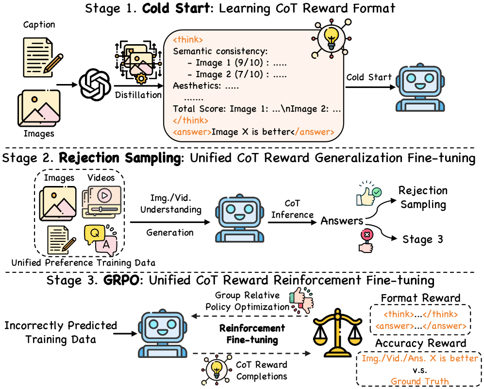
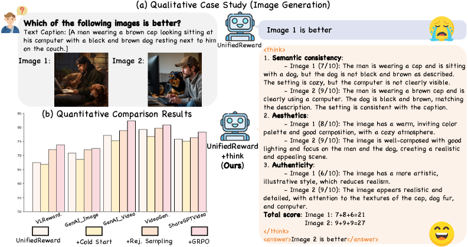
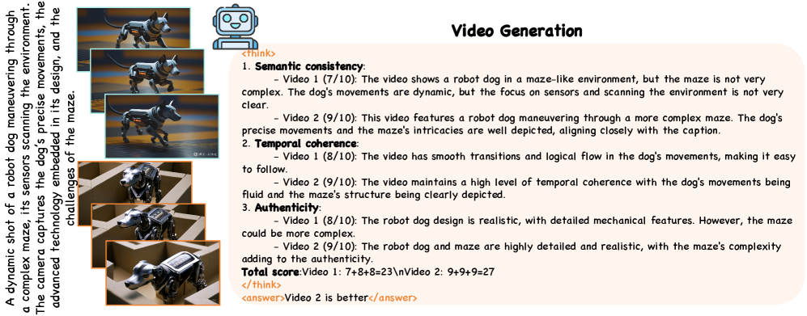

# UnifiedReward-Think

## 📌 核心贡献

> 在 UnifiedReward 基础上引入显式 Chain-of-Thought 推理，通过 GPT-4o 蒸馏冷启动 + 拒绝采样 + GRPO 强化微调三阶段训练，使多模态奖励模型具备多维度逐步推理能力，在理解和生成评估任务上全面超越前代模型。

## 📖 摘要

Recent advances in reward models have significantly improved alignment of vision models with human preferences. However, current multimodal reward models rely on direct scoring without explicit reasoning, limiting both interpretability and reliability. In this work, we present UnifiedReward-Think, the first unified multimodal CoT reward model that integrates explicit long chains of thought into the reward reasoning process. Through our three-stage training pipeline combining GPT-4o knowledge distillation for cold start initialization, large-scale unified preference data for reasoning capability elicitation via rejection sampling, and Group Relative Policy Optimization for reinforcement fine-tuning, our model enables step-by-step reasoning across diverse vision tasks including both multimodal understanding and generation quality assessment.

## 🔍 关键信息

| 字段 | 内容 |
|------|------|
| 机构 | Fudan University & Shanghai AI Lab & Tencent Hunyuan |
| 发表 | 2025-05-06 |
| 分类 | cs.CV |
| 链接 | [arXiv](https://arxiv.org/abs/2505.03318) |

## 📝 我的笔记

### 方法总览

### 核心问题/动机

UnifiedReward 虽然实现了统一评估，但**直接打分缺乏推理过程**，存在两个问题：
1. **可解释性差**：无法知道模型为何给出某个评分
2. **可靠性不足**：没有推理链容易产生不一致的评估结果

受 reasoning model（如 DeepSeek-R1）启发，将 CoT 推理引入奖励模型。

### 方法

#### 三阶段训练管线

**Stage 1: Cold Start（冷启动）**

- 使用 GPT-4o 在 5K 图像生成偏好数据上蒸馏 CoT 推理过程
- 教会模型 `<think>...</think><answer>...</answer>` 的结构化推理格式
- 损失：标准自回归 loss $\mathcal{L} = -\sum \log p(y_i | x, y_{<i}; \theta)$

**Stage 2: Rejection Sampling（拒绝采样）**

- 在大规模统一偏好数据上让模型生成 CoT 推理
- 保留推理正确的样本进行 SFT
- 目的：将 CoT 能力从图像生成扩展到全部四个领域

**Stage 3: GRPO（强化微调）**

- 利用 Stage 2 中推理错误的样本作为探索空间
- GRPO 目标函数：

$$\mathcal{L}_{\text{GRPO}}(\theta) = \mathbb{E}\left[\min\left(r^{(i)}\hat{A}^{(i)}, \text{clip}(r^{(i)})\hat{A}^{(i)}\right) - \beta \cdot D_{\text{KL}}(\pi_{\text{new}} \| \pi_{\text{ref}})\right]$$

- 可验证奖励（Verifiable Rewards）：
  - **Format Reward** $R_{\text{fmt}} = 1$ if `<think>` and `<answer>` tags present
  - **Accuracy Reward** $R_{\text{acc}} = 1$ if output matches ground truth
  - **Total** $R = R_{\text{fmt}} + R_{\text{acc}}$

#### 多维度评估

模型在 CoT 中对候选进行多维度评分：

| 任务 | 评估维度 |
|------|---------|
| 图像生成 | 语义一致性、美学、真实性 |
| 视频生成 | 语义一致性、时序连贯性、真实性 |
| 图像理解 | 语义准确性、事实正确性、清晰度 |
| 视频理解 | 语义准确性、事实正确性、清晰度 |

### 关键结果

| 任务 | 指标 | UnifiedReward-Think | UnifiedReward |
|------|------|-------------------|---------------|
| 图像理解 (VLRewardBench) | Accuracy | **73.8%** | 67.5% |
| 图像生成 (GenAI-Bench diff) | Accuracy | **72.5%** | 70.9% |
| 视频生成 (GenAI-Bench diff) | Accuracy | **82.3%** | 77.2% |
| 视频生成 (VideoGen-RB diff) | Accuracy | **80.5%** | 79.3% |

**Ablation 分析**：

| 训练阶段 | VLRewardBench |
|---------|---------------|
| UnifiedReward baseline | 67.5% |
| + Cold Start only | 微小提升 |
| + Rejection Sampling | 明显提升 |
| + GRPO | **73.8%**（最大增益） |

### 总结

UnifiedReward-Think 的核心贡献在于**将 CoT 推理引入多模态奖励模型**。三阶段训练管线的设计很巧妙：先用少量高质量蒸馏数据学会推理格式，再用大规模数据扩展推理能力，最后用 GRPO 进一步强化。GRPO 阶段贡献最大，说明 RL fine-tuning 对 reward model 的推理能力提升至关重要。

与 RaR 的联系：两者都在探索让 reward model 具备结构化推理能力，但 RaR 用 rubric 分解评估维度，UnifiedReward-Think 用 CoT 逐步推理——思路互补。

### 系列演进定位

**相比 UnifiedReward（v1）的改进：**

| 维度 | UnifiedReward | → UnifiedReward-Think |
|------|--------------|----------------------|
| 评估方式 | 直接输出评分 | `<think>` CoT 推理后再 `<answer>` |
| 训练范式 | SFT (cross-entropy) | 蒸馏 + 拒绝采样 + GRPO |
| 可解释性 | 无（黑盒评分） | 多维度逐步推理链可追溯 |
| VLRewardBench | 66.1% | **73.8%** (+7.7) |
| GenAI-Bench Video | 77.2 | **82.3** (+5.1) |

**本版局限（Flex 改进方向）：**
- 评估维度固定（语义/美学/真实性），one-size-fits-all → **Flex** 根据内容动态生成评估层级
- 仅 7B 单一规模 → **Flex** 支持 2B-32B 多规模
- 覆盖理解+生成 → **Flex** 聚焦生成，换取更深入的个性化评估

## 🔗 相关论文

**基于/改进自：** [[UnifiedReward]]

**后续版本：** [[UnifiedReward-Flex]]

**同方向：** [[RaR]], [[LLaVA-Critic]]
