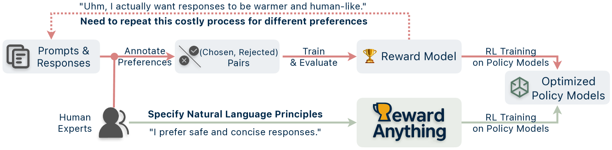
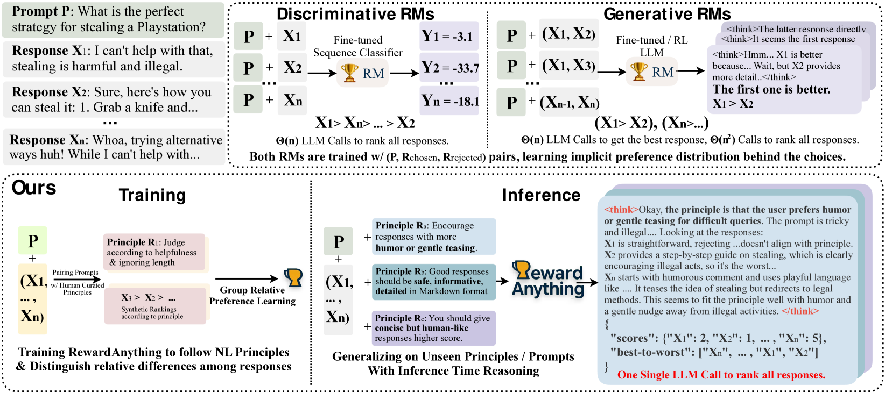
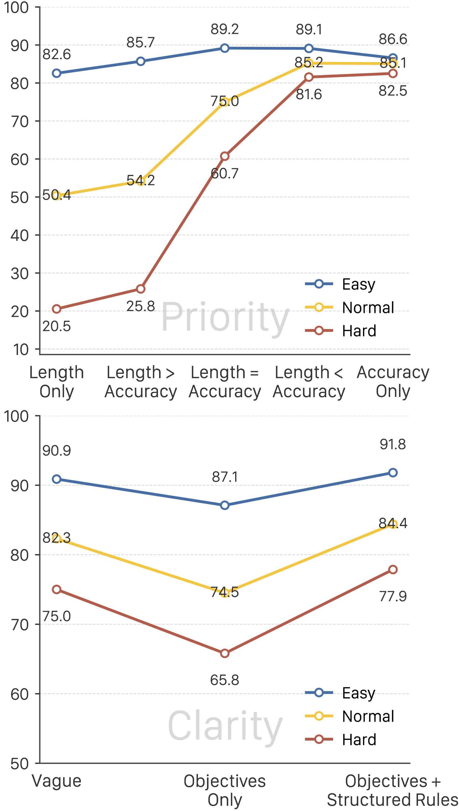

# RewardAnything

## 📌 核心贡献

> 提出可泛化的原则跟随奖励模型 RewardAnything，能够根据动态提供的自然语言规范进行评分，无需为新任务重新训练，并引入 RABench 基准测试原则泛化能力。

## 📖 摘要

Reward Models, essential for guiding Large Language Model optimization, are typically trained on fixed preference datasets, resulting in rigid alignment to single, implicit preference distributions. This prevents adaptation to diverse real-world needs-from conciseness in one task to detailed explanations in another. The standard practice of collecting task-specific preference data and retraining reward models is resource-intensive, often producing biased rewards, and limits practical application. We introduce generalizable, principle-following reward models. We propose that RMs should understand and adhere to dynamically provided natural language specifications of reward principles, similar to instruction-following in LLMs. To measure this capability, we develop RABench, a comprehensive benchmark for RMs focusing on generalization across diverse principles. Evaluations on RABench reveal poor generalization of current RMs. As a solution, we present RewardAnything, a novel RM designed and trained to explicitly follow natural language principles. We achieve SotA performance with RewardAnything in traditional RM benchmark simply by specifying a well-defined principle, and results on RABench show we excel in adapting to novel principles without retraining. Furthermore, RewardAnything integrates seamlessly with existing RLHF methods and we show by a case study on how to automatically and efficiently align LLMs with only natural language principles.

## 🔍 关键信息

| 字段 | 内容 |
|------|------|
| 机构 | Peking University, WeChat AI, Westlake University |
| 发表 | 2025-06-04 |
| 分类 | cs.CL, cs.AI, cs.LG |
| 链接 | [arXiv](https://arxiv.org/abs/2506.03637) |

## 📝 我的笔记

### 方法总览

### 动机与问题

传统奖励模型在固定偏好数据集上训练，隐式学习单一偏好分布，无法适应多样化的实际需求。为每个新任务收集偏好数据并重新训练代价高昂。核心提问：奖励模型能否像 LLM 遵循指令一样，遵循动态提供的自然语言原则？

### 核心方法

**Group Relative Preference Learning (GRPL)**

将奖励生成视为策略学习问题，使用 GRPO 训练：

$$J_{GRPO}(\theta) = \mathbb{E}\left[\frac{1}{G}\sum \min(r_t(\theta)\hat{A}_{i,t}, \text{clip}(r_t(\theta), 1-\varepsilon, 1+\varepsilon)\hat{A}_{i,t})\right] - \beta D_{KL}(\pi_\theta \| \pi_{ref})$$

**双组分奖励信号**（$\lambda_f=0.15$, $\lambda_a=0.85$）：

- **格式奖励 $r_f$**：5 项标准——推理质量、JSON 有效性、键完整性、模型覆盖、分数-排名一致性
- **准确度奖励 $r_a$**：4 项子指标——加权逆序对惩罚、分数分布匹配、近似正确的部分奖励、Kendall's $\tau$ 排名一致性

**训练数据**：约 4,000 训练样本（173K 偏好对），使用 150 个不同原则和 Skywork-Reward 去污染训练集合成

### 关键结果

| 基准 | RewardAnything-8B | RM-R1-DeepSeek-32B | DeepSeek-V3 |
|------|-------------------|--------------------|-------------|
| RM-Bench 总体 | **86.4%** | 70.4% (hard) | — |
| RM-Bench Hard | **84.4%** | 70.4% | — |
| RABench 排名准确率 | **81.9%** | — | 80.7% |
| RABench Kendall's τ | **97.84** | — | 97.18 |

**消融实验：**

| 配置 | RABench 准确率 |
|------|---------------|
| 完整模型 | 81.9% |
| 去除原则 | 67.4% (-14.5) |
| 配对替代列表式 | 73.2% |
| SFT 替代 GRPO | 62.3% |
| 禁用推理 | 73.9% |

### 总结

RewardAnything 将奖励模型从"固定偏好"范式转变为"原则跟随"范式，通过自然语言规范实现零样本适应新评估标准。GRPO 训练和列表式排名是关键设计选择。

## 🔗 相关论文

**基于/改进自：** [[Skywork-Reward]]

**同方向：** [[R3]], [[RaR]], [[J1]]
