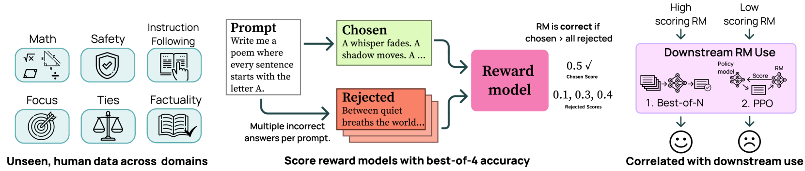

# RewardBench2

## 📌 核心贡献

> 提出 RewardBench 2，一个更具挑战性的奖励模型评估基准，采用 best-of-4 格式和六个评估维度（含三个全新维度），使领先模型得分比 RewardBench 1 下降约 20 分，并验证了基准分数与下游 best-of-N 采样和 RLHF 训练效果的相关性。

## 📖 摘要

Reward models are used throughout the post-training of language models to capture nuanced signals from preference data and provide a training target for optimization across instruction following, reasoning, safety, and more domains. RewardBench 2 introduces a more challenging evaluation achieving approximately 20-point lower performance than the original RewardBench while maintaining strong correlation with downstream tasks. The benchmark uses novel human prompts rather than existing ones, enabling more rigorous evaluation practices. The authors evaluate over 100 reward models and demonstrate how benchmark performance correlates with both best-of-N sampling and RLHF training effectiveness.

## 🔍 关键信息

| 字段 | 内容 |
|------|------|
| 机构 | Allen Institute for AI (AI2) |
| 发表 | 2025-06-02 |
| 分类 | cs.CL |
| 链接 | [arXiv](https://arxiv.org/abs/2506.01937) |

## 📝 我的笔记

### 方法总览

### 动机与问题定义

RewardBench 1 存在以下局限：
1. **难度不足**：领先模型已达 85%+ 准确率，区分度下降
2. **数据污染风险**：使用已有的公开 prompt，可能被训练数据覆盖
3. **评估格式简单**：二选一（pairwise）格式，随机基线为 50%
4. **维度有限**：缺少事实性、精确指令遵循、平局校准等关键维度

RewardBench 2 针对这些问题进行了全面升级。

### 基准构建

**数据规模**：1,876 个 prompt，覆盖 6 个评估维度。

**Prompt 来源**：约 70% 来自未公开的 WildChat 真实用户交互，约 30% 手动创建。经过 QuRater 数据标注、主题分类器、手动检查和去污染流程，从初始 3,000 条高质量 prompt 筛选至 1,876 条。

**评估格式**：Best-of-4（从 1 个正确 + 3 个错误中选出正确答案），随机基线从 50% 降至 25%，显著提升了区分度。

**Completion 来源**：由 20+ 个不同模型生成，加上部分人工编写的 completion。

### 六大评估维度

| 维度 | 数量 | Prompt 来源 | Completion 方法 | 过滤方法 |
|------|------|-------------|----------------|----------|
| Factuality（事实性） | 475 | 人类 | 自然生成 + 错误注入 | 多 LLM 交叉验证 |
| Precise IF（精确指令遵循） | 160 | 人类 | 自然生成 | 验证函数 |
| Math（数学） | 183 | 人类 | 自然生成 | 多数投票 + 人工验证 |
| Safety（安全性） | 450 | CoCoNot | 自然生成 + 错误注入 | LM 评判 + 规则 |
| Focus（聚焦度） | 495 | 人类 | System prompt 变体 | N/A |
| Ties（平局） | 102 | 手动创建 | System prompt 变体 | 人工验证 |

各维度的设计要点：
- **Factuality**：测试幻觉检测能力，使用自然错误和人工注入的错误，双 LLM 一致性过滤（约 30% 的样本被过滤）
- **Precise IF**：测试约束遵循能力（如"回答中不使用字母 u"），采用 IFEval-OOD 约束分类体系，用验证函数确保约束是否满足
- **Math**：覆盖初中到大学水平的数学，包括物理、几何、化学、微积分、组合数学
- **Safety**：基于 CoCoNot 框架的有害请求合规/拒绝测试，排除了主观争议类别
- **Focus**：测试高质量、切题回答的识别能力，采用 system prompt 变体方法生成偏题回答
- **Ties（新颖维度）**：测试多个正确答案场景下的校准能力（如"说出一种彩虹的颜色"），采用加权评分结合准确率和 margin 校准

### 与 RewardBench 1 的对比

RewardBench 2 比 v1 更难的原因：
1. 使用全新未见 prompt，避免数据污染
2. Best-of-4 格式取代二选一，随机基线从 50% 降至 25%
3. 新增三个高难度维度（Factuality、Precise IF、Ties）
4. 更严格的过滤流程剔除边界样本
5. 使用多样化模型生成 completion，防止对特定模型家族的过拟合

### 模型排名（Top 20）

| 排名 | 模型 | 平均 | Factuality | IF | Math | Safety | Focus | Ties |
|------|------|------|-----------|-----|------|--------|-------|------|
| 1 | Gemini 2.5 Flash* | 77.2 | 65.7 | 55.3 | 81.1 | 90.9 | 86.7 | 83.4 |
| 2 | QRM-Gemma-2-27B | 76.7 | 78.5 | 37.2 | 69.9 | 95.8 | 95.4 | 83.2 |
| 3 | INF-ORM-Llama3.1-70B | 76.5 | 74.1 | 41.9 | 69.9 | 96.4 | 90.3 | 86.2 |
| 4 | Claude Opus 4* | 76.5 | 82.7 | 41.9 | 74.9 | 89.5 | 86.2 | 83.7 |
| 5 | Llama-3.1-70B-Instruct-RM-RB2 | 76.1 | 81.3 | 41.9 | 69.9 | 88.4 | 86.5 | 88.3 |
| 6 | Skywork-Reward-Gemma-2-27B | 75.8 | 73.7 | 40.3 | 70.5 | 94.2 | 93.2 | 82.6 |
| 7 | Claude 3.7 Sonnet* | 75.4 | 73.3 | 54.4 | 75.0 | 90.3 | 92.1 | 67.2 |
| 8 | Skywork-Reward-Gemma-2-27B-v0.2 | 75.3 | 76.7 | 37.5 | 67.2 | 96.9 | 91.7 | 81.8 |
| 9 | URM-LLaMa-3.1-8B | 73.9 | 68.8 | 45.0 | 63.9 | 91.8 | 97.6 | 76.5 |
| 10 | Skywork-Reward-Llama-3.1-8B | 73.1 | 69.9 | 42.5 | 62.8 | 93.3 | 96.2 | 74.1 |
| 11 | Llama-3.1-8B-Instruct-RM-RB2 | 72.8 | 74.3 | 44.4 | 61.7 | 89.6 | 90.7 | 76.4 |
| 12 | LDL-Reward-Gemma-2-27B-v0.1 | 72.5 | 75.6 | 35.0 | 64.5 | 92.2 | 91.3 | 76.3 |
| 13 | GPT-4.1* | 72.3 | 82.9 | 39.7 | 65.2 | 87.3 | 73.4 | 85.4 |
| 14 | Llama-3.1-Tulu-3-70B-SFT-RM-RB2 | 72.2 | 80.8 | 36.9 | 67.8 | 86.9 | 77.8 | 83.1 |
| 15 | Skywork-Reward-Llama-3.1-8B-v0.2 | 71.7 | 69.7 | 40.6 | 60.1 | 94.2 | 94.1 | 71.7 |
| 16 | Claude Sonnet 4* | 71.2 | 76.1 | 35.9 | 70.5 | 89.1 | 76.0 | 79.4 |
| 17 | QRM-Llama3.1-8B-v2 | 70.7 | 66.5 | 40.6 | 61.2 | 94.7 | 89.1 | 72.3 |
| 18 | Tulu-3-8B-RL-RM-RB2 | 68.7 | 76.4 | 40.0 | 61.7 | 86.4 | 84.8 | 62.8 |
| 19 | Tulu-3-8B-DPO-RM-RB2 | 68.7 | 75.2 | 38.8 | 62.8 | 86.0 | 85.5 | 64.0 |
| 20 | Tulu-3-8B-SFT-RM-RB2 | 68.2 | 73.3 | 38.8 | 57.9 | 89.8 | 88.9 | 60.6 |

*标注为 LM-as-judge 模型

**关键发现**：
- 即使最强模型也仅 77.2%，最薄弱维度为 Precise IF（多数模型 < 45%）和 Math（< 70%）
- Safety 和 Focus 维度相对容易，顶级模型可达 95%+
- 专用 RM（如 QRM、Skywork）在 Safety/Focus 上优势明显，但 LM-as-judge（Gemini、Claude）在 IF 上表现更好

### 训练 Reward Model 的发现

**基座模型的影响**：

| 基座模型 | 平均 | Factuality | IF | Math | Safety | Focus | Ties |
|----------|------|-----------|-----|------|--------|-------|------|
| Llama 8B Base | 64.9 | 72.0 | 36.2 | 61.2 | 82.7 | 83.2 | 54.1 |
| Tulu 8B SFT | 68.2 | 73.3 | 38.8 | 57.9 | 89.8 | 88.9 | 60.6 |
| Tulu 8B DPO | 68.7 | 75.2 | 38.8 | 62.8 | 86.0 | 85.5 | 64.0 |
| Tulu 8B RL | 68.7 | 76.4 | 40.0 | 61.7 | 86.4 | 84.8 | 62.8 |
| Llama 8B Instruct | 72.8 | 74.3 | 44.4 | 61.7 | 89.6 | 90.7 | 76.4 |
| Qwen 7B Base | 68.2 | 69.9 | 36.2 | 68.3 | 83.1 | 80.8 | 71.1 |
| Qwen 7B Instruct | 73.3 | 74.7 | 44.4 | 71.6 | 79.8 | 81.4 | 87.6 |

- 使用 Instruct 模型作为基座比 Base 或 SFT 模型效果更好
- Qwen 在数学上有优势，Llama Instruct 在各维度更均衡
- 混合训练数据（Tulu + Skywork）优于单独使用任一数据集

**训练 epoch 的影响**：与此前"训练 1 epoch 最佳"的普遍认知不同，实验发现 18 个最佳配置中有 8 个在 2 epoch 时达到最优。

### 下游任务相关性

**Best-of-N 采样**：RB2 分数与下游 BoN 表现的 Pearson 相关系数达 0.87，其中 Factuality 维度信号最强。

**RLHF (PPO)**：相关性较弱，但有重要条件——基准分数仅对低分 RM 提供有效信号。对于分数 > 49.8 的模型，性能趋于饱和，"所有 decent-to-good 的奖励模型"在 RLHF 下游表现相近。

**关键 RLHF 发现**：
- "最佳奖励模型取决于训练设置"——off-policy 不匹配（RM 基座模型与 policy 模型不同）会导致下游性能大幅下降，即使基准分数很高
- RB2 的 Math 子集对下游数学（GSM8K、MATH）和编码（HumanEval+）任务提供特别强的预测信号

### 模型偏好偏差

奖励模型对其基座模型生成的 completion 存在"轻微偏好"，这解释了基准构建时需要使用多样化模型池的必要性。

### 总结性评价

RewardBench 2 是对 RewardBench 1 的全面升级，核心优势在于：
1. **难度提升显著**：best-of-4 + 新维度，领先模型从 90%+ 降至 ~77%
2. **实用性强**：与 BoN 下游表现高度相关（r=0.87），可作为 RM 选择的可靠指标
3. **训练指导价值**：系统性实验揭示了基座模型选择、训练数据混合、epoch 数等对 RM 质量的影响
4. **诚实的局限性**：承认 RLHF 场景下相关性饱和，最佳 RM 依赖具体训练设置

不足之处：
- 仅覆盖文本模态，未涉及多模态奖励模型
- Ties 维度样本量较少（102 条），统计显著性可能受限
- Precise IF 维度是所有模型的最大短板，但该维度的构建依赖验证函数，可能有覆盖面限制

## 🔗 相关论文

**基于/改进自：** [[RewardBench]]

**同方向：** [[MMRB2]]
